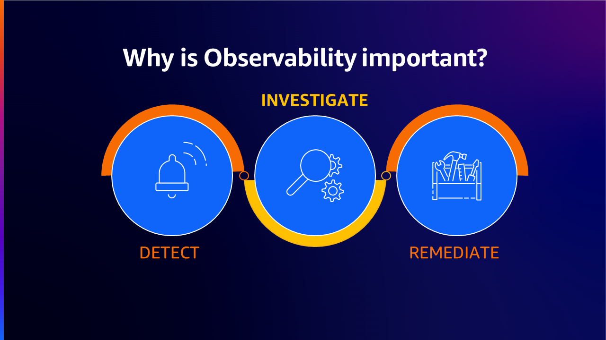
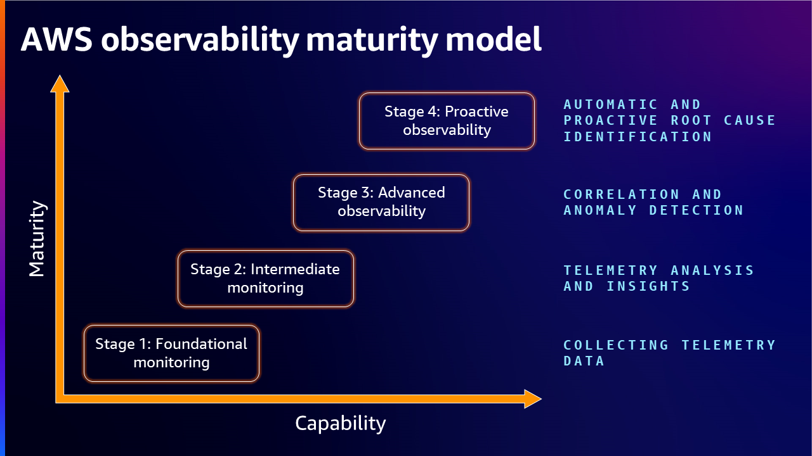

---
sidebar_label: ऑब्ज़र्वेबिलिटी मैच्योरिटी मॉडल
---

# AWS ऑब्ज़र्वेबिलिटी मैच्योरिटी मॉडल

## परिचय

अपने मूल में, ऑब्ज़र्वेबिलिटी किसी सिस्टम की बाहरी आउटपुट का एनालिसिस करके उसकी आंतरिक स्थिति को समझने और अंतर्दृष्टि प्राप्त करने की क्षमता है। यह अवधारणा पारंपरिक मॉनिटरिंग दृष्टिकोणों से विकसित हुई है जो पूर्वनिर्धारित मेट्रिक्स या इवेंट पर केंद्रित होती हैं, एक अधिक समग्र दृष्टिकोण की ओर जो किसी एनवायरनमेंट में विभिन्न कंपोनेंट्स द्वारा उत्पन्न डेटा के संग्रह, एनालिसिस और विज़ुअलाइज़ेशन को शामिल करती है। किसी सिस्टम को तब तक नियंत्रित या अनुकूलित नहीं किया जा सकता जब तक उसे observe नहीं किया जाता। एक प्रभावी ऑब्ज़र्वेबिलिटी नीति टीमों को समस्याओं की तेज़ी से पहचान और समाधान करने, संसाधन उपयोग को अनुकूलित करने और अपने सिस्टम के समग्र स्वास्थ्य में अंतर्दृष्टि प्राप्त करने की अनुमति देती है।

मॉनिटरिंग और ऑब्ज़र्वेबिलिटी के बीच अंतर यह है कि मॉनिटरिंग बताती है कि सिस्टम काम कर रहा है या नहीं, जबकि ऑब्ज़र्वेबिलिटी बताता है कि सिस्टम क्यों काम नहीं कर रहा। मॉनिटरिंग आमतौर पर एक प्रतिक्रियात्मक उपाय है जबकि ऑब्ज़र्वेबिलिटी का लक्ष्य सक्रिय तरीके से आपके Key Performance Indicators (KPIs) में सुधार करने में सक्षम होना है। निरंतर मॉनिटरिंग और ऑब्ज़र्वेबिलिटी चपलता बढ़ाती है, ग्राहक अनुभव में सुधार करती है और क्लाउड एनवायरनमेंट में जोखिम कम करती है।

## ऑब्ज़र्वेबिलिटी मैच्योरिटी मॉडल

ऑब्ज़र्वेबिलिटी मैच्योरिटी मॉडल उन ऑर्गनाइज़ेशन्स के लिए एक आवश्यक फ्रेमवर्क के रूप में कार्य करता है जो अपने वर्कलोड ऑब्ज़र्वेबिलिटी और प्रबंधन प्रक्रियाओं को अनुकूलित करना चाहते हैं। यह मॉडल व्यवसायों के लिए उनकी वर्तमान क्षमताओं का आकलन करने, सुधार के क्षेत्रों की पहचान करने और इष्टतम ऑब्ज़र्वेबिलिटी प्राप्त करने के लिए सही टूल्स और प्रक्रियाओं में रणनीतिक रूप से निवेश करने के लिए एक व्यापक रोडमैप प्रदान करता है।

## ऑब्ज़र्वेबिलिटी मैच्योरिटी मॉडल के चरण

जैसे-जैसे ऑर्गनाइज़ेशन अपने वर्कलोड का विस्तार करते हैं, ऑब्ज़र्वेबिलिटी मैच्योरिटी मॉडल के भी परिपक्व होने की उम्मीद है।

1. ऑब्ज़र्वेबिलिटी मैच्योरिटी मॉडल में पहले चरण में आमतौर पर ऑर्गनाइज़ेशन की वर्तमान स्थिति की बेसलाइन समझ स्थापित करना शामिल है। इसमें मौजूदा मॉनिटरिंग टूल्स और प्रक्रियाओं का आकलन करना, साथ ही दृश्यता या कार्यक्षमता में gaps की पहचान करना शामिल है।

2. अगले चरण में, ऑर्गनाइज़ेशन उन्नत ऑब्ज़र्वेबिलिटी नीतियों और सेवाओं को अपनाकर अधिक परिष्कृत दृष्टिकोण की ओर बढ़ते हैं।

3. जैसे-जैसे व्यवसाय तीसरे चरण से गुज़रते हैं, वे एनोमली डिटेक्शन और रूट कॉज़ एनालिसिस को स्वचालित करने के लिए कृत्रिम बुद्धिमत्ता और मशीन लर्निंग टेक्नोलॉजीज़ जैसी अतिरिक्त क्षमताओं का लाभ उठा सकते हैं।

4. अंतिम चरण में ऑब्ज़र्वेबिलिटी टूल्स द्वारा उत्पन्न डेटा की संपदा का लाभ उठाकर निरंतर सुधार को चलाना शामिल है।

### चरण 1: आधारभूत मॉनिटरिंग - टेलीमेट्री डेटा एकत्र करना

न्यूनतम के रूप में अपनाया गया और साइलो में काम करते हुए, बेसिक मॉनिटरिंग में एक ऑर्गनाइज़ेशन में सिस्टम या वर्कलोड की संपूर्णता की निगरानी के लिए आवश्यकताओं की एक अपरिभाषित नीति होती है।

ऑब्ज़र्वेबिलिटी मैच्योरिटी मॉडल में सुधार की दिशा में एक नींव बनाने के लिए, मेट्रिक्स, लॉग्स, ट्रेसेस के संग्रह के माध्यम से वर्कलोड को इंस्ट्रूमेंट करना और सही मॉनिटरिंग और ऑब्ज़र्वेबिलिटी टूल्स का उपयोग करके सार्थक अंतर्दृष्टि प्राप्त करना ग्राहकों को एनवायरनमेंट को नियंत्रित और अनुकूलित करने में मदद करता है।

### चरण 2: मध्यवर्ती मॉनिटरिंग - टेलीमेट्री एनालिसिस और अंतर्दृष्टि

इस चरण में, ग्राहक देखते हैं कि उनके ऑर्गनाइज़ेशन ऑन-प्रेमिस और क्लाउड जैसे विभिन्न एनवायरनमेंट्स से सिग्नल एकत्र करने के मामले में स्पष्ट हो रहे हैं।

हालांकि अधिकांश मामलों में मॉनिटरिंग अच्छी तरह से काम करती प्रतीत होती है, ऑर्गनाइज़ेशन समस्याओं को डिबग करने में अधिक समय बिताते हैं और परिणामस्वरूप समग्र Mean Time-To-Resolution (MTTR) सुसंगत नहीं है।

### चरण 3: उन्नत ऑब्ज़र्वेबिलिटी - Correlation और एनोमली डिटेक्शन

इस चरण में ऑर्गनाइज़ेशन बिना अधिक समय खर्च किए समस्याओं के मूल कारण को स्पष्ट रूप से समझ सकते हैं। जब कोई समस्या उत्पन्न होती है, तो अलर्ट संबंधित टीमों को पर्याप्त संदर्भगत जानकारी प्रदान करते हैं।

### चरण 4: सक्रिय ऑब्ज़र्वेबिलिटी - स्वचालित और सक्रिय Root Cause पहचान

यहां ऑब्ज़र्वेबिलिटी डेटा का उपयोग केवल किसी समस्या के "बाद" नहीं किया जाता, बल्कि वास्तविक समय में "पहले" किसी समस्या के होने से पहले डेटा का उपयोग किया जाता है।

एक समग्र तस्वीर प्रदान करने वाले ऑब्ज़र्वेबिलिटी पोर्टफोलियो का एक अवलोकन, डेटा संग्रह, डेटा प्रसंस्करण, डेटा अंतर्दृष्टि और एनालिसिस के लिए विभिन्न AWS नेटिव और ओपन-सोर्स समाधानों के साथ।

## ऑब्ज़र्वेबिलिटी के लिए AWS Well-Architected और Cloud Adoption Framework

ऑर्गनाइज़ेशन अपनी ऑब्ज़र्वेबिलिटी क्षमताओं को बढ़ाने और अपने क्लाउड एनवायरनमेंट की प्रभावी ढंग से निगरानी और समस्या निवारण करने के लिए [AWS Well-Architected](https://aws.amazon.com/architecture/well-architected/) और [Cloud Adoption Framework](https://docs.aws.amazon.com/whitepapers/latest/aws-caf-operations-perspective/observability.html) का लाभ उठा सकते हैं।

## मूल्यांकन

ऑब्ज़र्वेबिलिटी मैच्योरिटी मॉडल मूल्यांकन का उपयोग आपकी ऑब्ज़र्वेबिलिटी की वर्तमान स्थिति का आकलन करने और सुधार के क्षेत्रों की पहचान करने के लिए किया जा सकता है।

**लॉग्स**

1. आप लॉग्स कैसे एकत्र करते हैं?
2. आप लॉग्स का उपयोग कैसे करते हैं?
3. आप लॉग्स तक कैसे पहुंचते हैं?
4. सुरक्षा और नियामक अनुपालन के लिए आपकी लॉग retention नीति क्या है?
5. क्या आप आज कोई ML/AI क्षमता का उपयोग करते हैं?

**मेट्रिक्स**

6. आप किस प्रकार के मेट्रिक्स एकत्र करते हैं?
7. आप मेट्रिक्स का उपयोग कैसे करते हैं?
8. आप मेट्रिक्स तक कैसे पहुंचते हैं?

**ट्रेसेस**

9. आप ट्रेसेस कैसे एकत्र करते हैं?
10. आप ट्रेसेस का उपयोग कैसे करते हैं?

**डैशबोर्ड और अलर्टिंग**

11. आप alarms का उपयोग कैसे करते हैं?
12. आप डैशबोर्ड का उपयोग कैसे करते हैं?

**ऑर्गनाइज़ेशन**

13. क्या आपके पास एक enterprise ऑब्ज़र्वेबिलिटी नीति है?
14. आप SLOs का उपयोग कैसे करते हैं?

## ऑब्ज़र्वेबिलिटी नीति बनाना

एक बार जब ऑर्गनाइज़ेशन ने अपने ऑब्ज़र्वेबिलिटी चरण की पहचान कर ली, तो उन्हें वर्तमान प्रक्रियाओं और टूल्स को अनुकूलित करने की नीति बनाना शुरू करना चाहिए और परिपक्वता की दिशा में भी काम करना शुरू करना चाहिए।

सारांश में, एक ऑब्ज़र्वेबिलिटी नीति बनाने के लिए तीन मुख्य पहलुओं पर विचार करने की आवश्यकता है: 1) क्या एकत्र करने की आवश्यकता है 2) वे सभी सिस्टम और वर्कलोड क्या हैं जिनका observe किया जाना है और 3) समस्याएं होने पर कैसे प्रतिक्रिया करनी है और उन्हें ठीक करने के लिए क्या तंत्र होने चाहिए।

## निष्कर्ष

ऑब्ज़र्वेबिलिटी मैच्योरिटी मॉडल ऑर्गनाइज़ेशन्स के लिए उनकी वर्तमान स्थिति का आकलन करने और वर्कलोड और इंफ्रास्ट्रक्चर के व्यवहार को समझने, विश्लेषित करने और प्रतिक्रिया देने की उनकी क्षमता में सुधार करने के तरीके खोजने के लिए एक रोडमैप के रूप में कार्य करता है।

## सहायक संसाधन

- [Building an effective observability strategy](https://youtu.be/7PQv9eYCJW8?si=gsn0qPyIMhrxU6sy) - AWS re:Invent 2023
- [AWS Observability Best Practices](https://aws-observability.github.io/observability-best-practices/)
- [What is observability and Why does it matter?](https://aws.amazon.com/blogs/mt/what-is-observability-and-why-does-it-matter-part-1/)
- [How to develop an Observability strategy?](https://aws.amazon.com/blogs/mt/how-to-develop-an-observability-strategy/)
- [Guidance for Deep Application Observability on AWS](https://aws.amazon.com/solutions/guidance/deep-application-observability-on-aws/)
- [How Discovery increased operational efficiency with AWS observability](https://www.youtube.com/watch?v=zm30JNYmxlY) - AWS re:Invent 2022
- [Developing an observability strategy](https://www.youtube.com/watch?v=Ub3ATriFapQ) - AWS re:Invent 2022
- [Explore Cloud Native Observability with AWS](https://www.youtube.com/watch?v=UW7aT25Mbng) - AWS Virtual Workshop
- [Increase availability with AWS observability solutions](https://www.youtube.com/watch?v=_d_9xCfVBTM) - AWS re:Invent 2020
- [Observability best practices at Amazon](https://www.youtube.com/watch?v=zZPzXEBW4P8) - AWS re:Invent 2022
- [Observability: Best practices for modern applications](https://www.youtube.com/watch?v=YiegAlC_yyc) - AWS re:Invent 2022
- [Observability the open-source way](https://www.youtube.com/watch?v=2IJPpdp9xU0) - AWS re:Invent 2022
- [Elevate your Observability Strategy with AIOps](https://www.youtube.com/watch?v=L4b_eDSAwfE)
- [Let's Architect! Monitoring production systems at scale](https://aws.amazon.com/blogs/architecture/lets-architect-monitoring-production-systems-at-scale/)
- [Full-stack observability and application monitoring with AWS](https://www.youtube.com/watch?v=or7uFFyHIX0) - AWS Summit SF 2022
