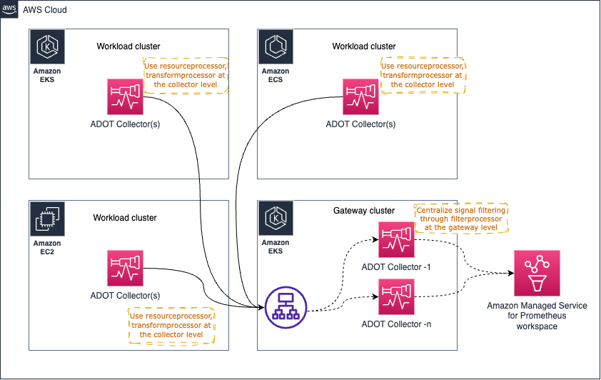

# AWS Distro for OpenTelemetry (ADOT) Collector का संचालन

[ADOT collector](https://aws-otel.github.io/) [CNCF](https://www.cncf.io/) द्वारा ओपन-सोर्स [OpenTelemetry Collector](https://opentelemetry.io/docs/collector/) का एक downstream डिस्ट्रीब्यूशन है।

ग्राहक ADOT Collector का उपयोग विभिन्न वातावरणों से मेट्रिक्स और ट्रेस जैसे सिग्नल एकत्र करने के लिए कर सकते हैं, जिसमें ऑन-प्रेम, AWS और अन्य क्लाउड प्रोवाइडर शामिल हैं।

वास्तविक दुनिया के वातावरण में और बड़े पैमाने पर ADOT Collector का संचालन करने के लिए, ऑपरेटरों को collector की स्वास्थ्य स्थिति की निगरानी करनी चाहिए और आवश्यकतानुसार स्केल करना चाहिए। इस गाइड में, आप उन कार्यों के बारे में जानेंगे जो प्रोडक्शन वातावरण में ADOT Collector को संचालित करने के लिए किए जा सकते हैं।

## डिप्लॉयमेंट आर्किटेक्चर

आपकी आवश्यकताओं के आधार पर, कुछ डिप्लॉयमेंट विकल्प हैं जिन पर आप विचार कर सकते हैं।

* No Collector
* Agent
* Gateway


:::tip
    अतिरिक्त जानकारी के लिए [OpenTelemetry डॉक्यूमेंटेशन](https://opentelemetry.io/docs/collector/deployment/)
    देखें।
:::

### No Collector
यह विकल्प मूल रूप से collector को समीकरण से पूरी तरह हटा देता है। यदि आप नहीं जानते, तो OTEL SDK से सीधे डेस्टिनेशन सर्विसेज को API कॉल करना और सिग्नल भेजना संभव है। इसे ऐसे समझें कि आप ADOT Collector जैसे out-of-process agent को spans भेजने के बजाय अपनी एप्लिकेशन प्रोसेस से सीधे AWS X-Ray के [PutTraceSegments](https://docs.aws.amazon.com/xray/latest/api/API_PutTraceSegments.html) API को कॉल कर रहे हैं।

हम आपको इस दृष्टिकोण के बारे में अधिक विवरण के लिए upstream डॉक्यूमेंटेशन में [इस सेक्शन](https://opentelemetry.io/docs/collector/deployment/no-collector/) को देखने के लिए प्रोत्साहित करते हैं क्योंकि इस दृष्टिकोण के लिए कोई AWS विशिष्ट पहलू नहीं है जो मार्गदर्शन को बदलता हो।


### Agent
इस दृष्टिकोण में, आप collector को वितरित तरीके से चलाएंगे और सिग्नल को डेस्टिनेशन में एकत्र करेंगे। `No Collector` विकल्प के विपरीत, यहां हम चिंताओं को अलग करते हैं और एप्लिकेशन को रिमोट API कॉल करने के लिए अपने संसाधनों का उपयोग करने से अलग करते हैं और इसके बजाय स्थानीय रूप से सुलभ agent से संवाद करते हैं।

अनिवार्य रूप से Amazon EKS वातावरण में **collector को Kubernetes sidecar के रूप में चलाते हुए** यह नीचे जैसा दिखेगा:


इस उपरोक्त आर्किटेक्चर में, आपके scrape कॉन्फ़िगरेशन को वास्तव में किसी भी service discovery मैकेनिज्म का उपयोग नहीं करना चाहिए क्योंकि आप `localhost` से टारगेट को scrape करेंगे क्योंकि collector एप्लिकेशन कंटेनर के साथ उसी pod में चल रहा है।

यही आर्किटेक्चर ट्रेस एकत्र करने के लिए भी लागू होता है। आपको बस [यहां दिखाए गए](https://aws-otel.github.io/docs/getting-started/x-ray#sample-collector-configuration-putting-it-together) अनुसार एक OTEL pipeline बनानी होगी

##### फायदे और नुकसान
* इस डिज़ाइन के पक्ष में एक तर्क यह है कि आपको Collector के काम करने के लिए असाधारण मात्रा में संसाधन (CPU, Memory) आवंटित करने की आवश्यकता नहीं है क्योंकि टारगेट localhost स्रोतों तक सीमित हैं।

* इस दृष्टिकोण का उपयोग करने का नुकसान यह हो सकता है कि, collector pod कॉन्फ़िगरेशन के लिए विभिन्न कॉन्फ़िगरेशन की संख्या सीधे क्लस्टर पर चल रही एप्लिकेशनों की संख्या के अनुपातिक है।
इसका मतलब है कि आपको Pod के लिए अपेक्षित वर्कलोड के आधार पर प्रत्येक Pod के लिए व्यक्तिगत रूप से CPU, Memory और अन्य संसाधन आवंटन प्रबंधित करना होगा। इसके साथ सावधान न रहने पर, आप Collector Pod के लिए अधिक या कम संसाधन आवंटित कर सकते हैं जिसके परिणामस्वरूप या तो कम प्रदर्शन होगा या CPU cycles और Memory लॉक हो जाएगी जो अन्यथा Node में अन्य Pods द्वारा उपयोग की जा सकती थी।

आप अपनी आवश्यकताओं के आधार पर Deployments, Daemonset, Statefulset आदि जैसे अन्य मॉडलों में भी collector को deploy कर सकते हैं।

#### Amazon EKS पर Daemonset के रूप में collector चलाना

आप collector को [Daemonset](https://kubernetes.io/docs/concepts/workloads/controllers/daemonset/) के रूप में चलाने का विकल्प चुन सकते हैं यदि आप EKS Nodes में collectors के लोड (मेट्रिक्स को scrape करना और Amazon Managed Service for Prometheus workspace में भेजना) को समान रूप से वितरित करना चाहते हैं।


सुनिश्चित करें कि आपके पास `keep` एक्शन है जो collector को केवल अपने ही host/Node से टारगेट scrape करने देता है।

संदर्भ के लिए नीचे नमूना देखें। अधिक ऐसे कॉन्फ़िगरेशन विवरण [यहां](https://aws-otel.github.io/docs/getting-started/adot-eks-add-on/config-advanced#daemonset-collector-configuration) पाएं।

```yaml
scrape_configs:
    - job_name: kubernetes-apiservers
    bearer_token_file: /var/run/secrets/kubernetes.io/serviceaccount/token
    kubernetes_sd_configs:
    - role: endpoints
    relabel_configs:
    - action: keep
        regex: $K8S_NODE_NAME
        source_labels: [__meta_kubernetes_endpoint_node_name]
    scheme: https
    tls_config:
        ca_file: /var/run/secrets/kubernetes.io/serviceaccount/ca.crt
        insecure_skip_verify: true
```

यही आर्किटेक्चर ट्रेस एकत्र करने के लिए भी उपयोग किया जा सकता है। इस मामले में, Collector द्वारा Prometheus मेट्रिक्स scrape करने के लिए endpoints तक पहुंचने के बजाय, ट्रेस spans एप्लिकेशन pods द्वारा Collector को भेजे जाएंगे।

##### फायदे और नुकसान
**लाभ**

* न्यूनतम स्केलिंग चिंताएं
* High-Availability कॉन्फ़िगर करना एक चुनौती है
* Collector की बहुत अधिक प्रतियां उपयोग में
* Logs सपोर्ट के लिए आसान हो सकता है

**नुकसान**

* संसाधन उपयोग के मामले में सबसे इष्टतम नहीं
* असंतुलित संसाधन आवंटन


#### Amazon EC2 पर collector चलाना
EC2 पर collector चलाने में कोई side car दृष्टिकोण नहीं है, इसलिए आप EC2 instance पर agent के रूप में collector चलाएंगे। आप इंस्टेंस में मेट्रिक्स scrape करने के लिए टारगेट खोजने हेतु नीचे दिए गए जैसा static scrape कॉन्फ़िगरेशन सेट कर सकते हैं।

नीचे दिया गया config localhost पर पोर्ट `9090` और `8081` पर endpoints को scrape करता है।

इस विषय पर गहन अनुभव प्राप्त करने के लिए हमारे [One Observability Workshop के EC2 केंद्रित मॉड्यूल](https://catalog.workshops.aws/observability/en-US/aws-managed-oss/ec2-monitoring) को देखें।

```yaml
global:
  scrape_interval: 15s # By default, scrape targets every 15 seconds.

scrape_configs:
- job_name: 'prometheus'
  static_configs:
  - targets: ['localhost:9090', 'localhost:8081']
```

#### Amazon EKS पर Deployment के रूप में collector चलाना

Collector को Deployment के रूप में चलाना विशेष रूप से तब उपयोगी है जब आप अपने collectors के लिए High Availability भी प्रदान करना चाहते हैं। टारगेट की संख्या, scrape करने के लिए उपलब्ध मेट्रिक्स आदि के आधार पर Collector के संसाधनों को समायोजित किया जाना चाहिए ताकि यह सुनिश्चित हो सके कि collector संसाधनों की कमी न हो और सिग्नल संग्रह में समस्याएं न हों।

[इस विषय पर अधिक यहां गाइड में पढ़ें।](https://aws-observability.github.io/observability-best-practices/guides/containers/oss/eks/best-practices-metrics-collection)

निम्नलिखित आर्किटेक्चर दिखाता है कि कैसे एक collector को मेट्रिक्स और ट्रेस एकत्र करने के लिए वर्कलोड nodes के बाहर एक अलग node में deploy किया जाता है।


मेट्रिक संग्रह के लिए High-Availability सेटअप करने हेतु, [हमारे डॉक्स पढ़ें जो विस्तृत निर्देश प्रदान करते हैं](https://docs.aws.amazon.com/prometheus/latest/userguide/Send-high-availability-prom-community.html)

#### मेट्रिक्स संग्रह के लिए Amazon ECS पर केंद्रीय task के रूप में collector चलाना

आप ECS क्लस्टर या क्लस्टरों में विभिन्न tasks से Prometheus मेट्रिक्स एकत्र करने के लिए [ECS Observer extension](https://github.com/open-telemetry/opentelemetry-collector-contrib/tree/main/extension/observer/ecsobserver) का उपयोग कर सकते हैं।


Extension के लिए नमूना collector कॉन्फ़िगरेशन:

```yaml
extensions:
  ecs_observer:
    refresh_interval: 60s # format is https://golang.org/pkg/time/#ParseDuration
    cluster_name: 'Cluster-1' # cluster name need manual config
    cluster_region: 'us-west-2' # region can be configured directly or use AWS_REGION env var
    result_file: '/etc/ecs_sd_targets.yaml' # the directory for file must already exists
    services:
      - name_pattern: '^retail-.*$'
    docker_labels:
      - port_label: 'ECS_PROMETHEUS_EXPORTER_PORT'
    task_definitions:
      - job_name: 'task_def_1'
        metrics_path: '/metrics'
        metrics_ports:
          - 9113
          - 9090
        arn_pattern: '.*:task-definition/nginx:[0-9]+'
```


##### फायदे और नुकसान
* इस मॉडल का एक लाभ यह है कि कम collectors और कॉन्फ़िगरेशन हैं जिन्हें स्वयं प्रबंधित करना होता है।
* जब क्लस्टर बड़ा हो और हजारों टारगेट scrape करने हों, तो आपको आर्किटेक्चर को सावधानीपूर्वक इस तरह डिज़ाइन करना होगा कि लोड collectors के बीच संतुलित हो। HA कारणों से समान collectors के near-clones चलाने को इसमें जोड़ना सावधानी से किया जाना चाहिए ताकि ऑपरेशनल समस्याओं से बचा जा सके।

### Gateway


## Collector स्वास्थ्य का प्रबंधन
OTEL Collector इसकी स्वास्थ्य और प्रदर्शन की निगरानी के लिए कई सिग्नल expose करता है। collector के स्वास्थ्य की बारीकी से निगरानी करना आवश्यक है ताकि सुधारात्मक कार्रवाई की जा सके, जैसे,

* Collector को क्षैतिज रूप से स्केल करना
* Collector के वांछित कार्य के लिए अतिरिक्त संसाधनों का प्रावधान करना


### Collector से स्वास्थ्य मेट्रिक्स एकत्र करना

OTEL Collector को `service` pipeline में `telemetry` सेक्शन जोड़कर Prometheus Exposition Format में मेट्रिक्स expose करने के लिए कॉन्फ़िगर किया जा सकता है। Collector अपने लॉग्स को stdout पर भी expose कर सकता है।

टेलीमेट्री कॉन्फ़िगरेशन पर अधिक विवरण [OpenTelemetry डॉक्यूमेंटेशन में यहां](https://opentelemetry.io/docs/collector/configuration/#service) पाए जा सकते हैं।

Collector के लिए नमूना टेलीमेट्री कॉन्फ़िगरेशन।

```yaml
service:
  telemetry:
    logs:
      level: debug
    metrics:
      level: detailed
      address: 0.0.0.0:8888
```
एक बार कॉन्फ़िगर होने के बाद, collector `http://localhost:8888/metrics` पर नीचे जैसे मेट्रिक्स export करना शुरू कर देगा।

```bash
# HELP otelcol_exporter_enqueue_failed_spans Number of spans failed to be added to the sending queue.
# TYPE otelcol_exporter_enqueue_failed_spans counter
otelcol_exporter_enqueue_failed_spans{exporter="awsxray",service_instance_id="523a2182-539d-47f6-ba3c-13867b60092a",service_name="aws-otel-collector",service_version="v0.25.0"} 0

# HELP otelcol_process_runtime_total_sys_memory_bytes Total bytes of memory obtained from the OS (see 'go doc runtime.MemStats.Sys')
# TYPE otelcol_process_runtime_total_sys_memory_bytes gauge
otelcol_process_runtime_total_sys_memory_bytes{service_instance_id="523a2182-539d-47f6-ba3c-13867b60092a",service_name="aws-otel-collector",service_version="v0.25.0"} 2.4462344e+07

# HELP otelcol_process_memory_rss Total physical memory (resident set size)
# TYPE otelcol_process_memory_rss gauge
otelcol_process_memory_rss{service_instance_id="523a2182-539d-47f6-ba3c-13867b60092a",service_name="aws-otel-collector",service_version="v0.25.0"} 6.5675264e+07

# HELP otelcol_exporter_enqueue_failed_metric_points Number of metric points failed to be added to the sending queue.
# TYPE otelcol_exporter_enqueue_failed_metric_points counter
otelcol_exporter_enqueue_failed_metric_points{exporter="awsxray",service_instance_id="d234b769-dc8a-4b20-8b2b-9c4f342466fe",service_name="aws-otel-collector",service_version="v0.25.0"} 0
otelcol_exporter_enqueue_failed_metric_points{exporter="logging",service_instance_id="d234b769-dc8a-4b20-8b2b-9c4f342466fe",service_name="aws-otel-collector",service_version="v0.25.0"} 0
```

उपरोक्त नमूना आउटपुट में, आप देख सकते हैं कि collector `otelcol_exporter_enqueue_failed_spans` नामक मेट्रिक expose कर रहा है जो उन spans की संख्या दिखाता है जो sending queue में जोड़ने में विफल रहे। यह मेट्रिक यह समझने के लिए देखने योग्य है कि क्या collector को कॉन्फ़िगर किए गए डेस्टिनेशन पर ट्रेस डेटा भेजने में समस्या हो रही है। इस मामले में, आप देख सकते हैं कि `exporter` लेबल `awsxray` मान के साथ उपयोग में ट्रेस डेस्टिनेशन को इंगित करता है।

अन्य मेट्रिक `otelcol_process_runtime_total_sys_memory_bytes` collector द्वारा उपयोग की जा रही मेमोरी की मात्रा को समझने का एक संकेतक है। यदि यह मेमोरी `otelcol_process_memory_rss` मेट्रिक के मान के बहुत करीब हो जाती है, तो यह एक संकेत है कि Collector प्रक्रिया के लिए आवंटित मेमोरी को समाप्त करने के करीब पहुंच रहा है और समस्याओं से बचने के लिए collector के लिए अधिक मेमोरी आवंटित करने जैसी कार्रवाई करने का समय हो सकता है।

इसी प्रकार, आप देख सकते हैं कि `otelcol_exporter_enqueue_failed_metric_points` नामक एक अन्य काउंटर मेट्रिक है जो रिमोट डेस्टिनेशन पर भेजने में विफल मेट्रिक्स की संख्या को इंगित करता है

#### Collector हेल्थ चेक
एक liveness probe है जो collector expose करता है ताकि आप जांच सकें कि collector लाइव है या नहीं। उस endpoint का उपयोग करके collector की उपलब्धता की समय-समय पर जांच करने की अनुशंसा की जाती है।

[`healthcheck`](https://github.com/open-telemetry/opentelemetry-collector-contrib/tree/main/extension/healthcheckextension) extension का उपयोग collector को endpoint expose कराने के लिए किया जा सकता है। नीचे नमूना कॉन्फ़िगरेशन देखें:

```yaml
extensions:
  health_check:
    endpoint: 0.0.0.0:13133
```

संपूर्ण कॉन्फ़िगरेशन विकल्पों के लिए, [यहां GitHub repo](https://github.com/open-telemetry/opentelemetry-collector-contrib/tree/main/extension/healthcheckextension) देखें।

```bash
❯ curl -v http://localhost:13133
*   Trying 127.0.0.1:13133...
* Connected to localhost (127.0.0.1) port 13133 (#0)
> GET / HTTP/1.1
> Host: localhost:13133
> User-Agent: curl/7.79.1
> Accept: */*
>
* Mark bundle as not supporting multiuse
< HTTP/1.1 200 OK
< Date: Fri, 24 Feb 2023 19:09:22 GMT
< Content-Length: 0
<
* Connection #0 to host localhost left intact
```

#### विनाशकारी विफलताओं को रोकने के लिए सीमाएं निर्धारित करना
यह देखते हुए कि किसी भी वातावरण में संसाधन (CPU, Memory) सीमित हैं, आपको अप्रत्याशित स्थितियों के कारण विफलताओं से बचने के लिए collector components पर सीमाएं निर्धारित करनी चाहिए।

यह विशेष रूप से तब महत्वपूर्ण है जब आप Prometheus मेट्रिक्स एकत्र करने के लिए ADOT Collector का संचालन कर रहे हों।
इस परिदृश्य पर विचार करें - आप DevOps टीम में हैं और Amazon EKS क्लस्टर में ADOT Collector को deploy और संचालित करने के लिए जिम्मेदार हैं। आपकी एप्लिकेशन टीमें दिन में किसी भी समय अपने एप्लिकेशन Pods को ड्रॉप कर सकती हैं, और वे उम्मीद करती हैं कि उनके pods से expose किए गए मेट्रिक्स Amazon Managed Service for Prometheus workspace में एकत्र किए जाएं।

अब यह सुनिश्चित करना आपकी जिम्मेदारी है कि यह pipeline बिना किसी बाधा के काम करे। उच्च स्तर पर इस समस्या को हल करने के दो तरीके हैं:

* इस आवश्यकता को समर्थन देने के लिए collector को अनंत रूप से स्केल करना (और यदि आवश्यक हो तो क्लस्टर में Nodes जोड़ना)
* मेट्रिक संग्रह पर सीमाएं निर्धारित करना और ऊपरी सीमा को एप्लिकेशन टीमों को विज्ञापित करना

दोनों दृष्टिकोणों के फायदे और नुकसान हैं। आप तर्क दे सकते हैं कि आप विकल्प 1 चुनना चाहते हैं, यदि आप लागत या इससे उत्पन्न होने वाले ओवरहेड पर विचार किए बिना अपनी लगातार बढ़ती व्यावसायिक आवश्यकताओं का समर्थन करने के लिए पूरी तरह प्रतिबद्ध हैं। हालांकि लगातार बढ़ती व्यावसायिक आवश्यकताओं का अनंत रूप से समर्थन करना `क्लाउड अनंत स्केलेबिलिटी के लिए है` दृष्टिकोण जैसा लग सकता है, यह बहुत अधिक परिचालन ओवरहेड ला सकता है और यदि निरंतर निर्बाध संचालन सुनिश्चित करने के लिए अनंत समय और लोगों के संसाधन नहीं दिए जाते हैं तो और भी विनाशकारी स्थितियों का कारण बन सकता है, जो अधिकांश मामलों में व्यावहारिक नहीं है।

एक अधिक व्यावहारिक और मितव्ययी दृष्टिकोण विकल्प 2 चुनना होगा, जहां आप किसी भी समय ऊपरी सीमाएं निर्धारित कर रहे हैं (और संभावित रूप से आवश्यकताओं के आधार पर धीरे-धीरे बढ़ा रहे हैं) ताकि परिचालन सीमा स्पष्ट हो।

यहां एक उदाहरण है कि आप ADOT Collector में Prometheus receiver का उपयोग करके यह कैसे कर सकते हैं।

Prometheus [scrape_config](https://prometheus.io/docs/prometheus/latest/configuration/configuration/#relabel_config) में, आप किसी भी विशेष scrape job के लिए कई सीमाएं निर्धारित कर सकते हैं। आप सीमा लगा सकते हैं:

* Scrape की कुल body size पर
* स्वीकार करने के लिए labels की संख्या सीमित करना (यदि यह सीमा पार हो जाती है तो scrape त्यागा जाएगा और आप इसे Collector लॉग्स में देख सकते हैं)
* Scrape करने के लिए टारगेट की संख्या सीमित करना
* ...और भी

आप सभी उपलब्ध विकल्प [Prometheus डॉक्यूमेंटेशन](https://prometheus.io/docs/prometheus/latest/configuration/configuration/#relabel_config) में देख सकते हैं।

##### Memory उपयोग को सीमित करना
Collector pipeline को [`memorylimiterprocessor`](https://github.com/open-telemetry/opentelemetry-collector/tree/main/processor/memorylimiterprocessor) का उपयोग करने के लिए कॉन्फ़िगर किया जा सकता है ताकि processor component द्वारा उपयोग की जाने वाली मेमोरी की मात्रा को सीमित किया जा सके। ग्राहकों को Collector से जटिल ऑपरेशन करवाने की इच्छा होती है जिनके लिए गहन Memory और CPU आवश्यकताएं होती हैं।

जबकि [`redactionprocessor,`](https://github.com/open-telemetry/opentelemetry-collector-contrib/tree/main/processor/redactionprocessor)[`filterprocessor,`](https://github.com/open-telemetry/opentelemetry-collector-contrib/tree/main/processor/filterprocessor)[`spanprocessor`](https://github.com/open-telemetry/opentelemetry-collector-contrib/tree/main/processor/spanprocessor) जैसे processors का उपयोग रोमांचक और बहुत उपयोगी है, आपको यह भी याद रखना चाहिए कि processors सामान्य रूप से डेटा ट्रांसफॉर्मेशन कार्यों से निपटते हैं और उन्हें कार्यों को पूरा करने के लिए डेटा को इन-मेमोरी रखने की आवश्यकता होती है। इससे एक विशिष्ट processor पूरे Collector को तोड़ सकता है और Collector के पास अपने स्वास्थ्य मेट्रिक्स expose करने के लिए पर्याप्त मेमोरी नहीं होती।

आप [`memorylimiterprocessor`](https://github.com/open-telemetry/opentelemetry-collector/tree/main/processor/memorylimiterprocessor) का उपयोग करके Collector द्वारा उपयोग की जा सकने वाली मेमोरी की मात्रा को सीमित करके इससे बच सकते हैं। इसके लिए अनुशंसा यह है कि Collector को स्वास्थ्य मेट्रिक्स expose करने और अन्य कार्य करने के लिए बफर मेमोरी प्रदान करें ताकि processors सभी आवंटित मेमोरी न ले लें।

उदाहरण के लिए, यदि आपके EKS Pod की मेमोरी सीमा `10Gi` है, तो `memorylimitprocessor` को `10Gi` से कम पर सेट करें, उदाहरण के लिए `9Gi` ताकि `1Gi` का बफर स्वास्थ्य मेट्रिक्स expose करने, receiver और exporter कार्यों जैसे अन्य ऑपरेशन करने के लिए उपयोग किया जा सके।

#### बैकप्रेशर प्रबंधन

कुछ आर्किटेक्चर पैटर्न (Gateway pattern) जैसे नीचे दिखाया गया कुछ परिचालन कार्यों को केंद्रीकृत करने के लिए उपयोग किया जा सकता है जैसे (लेकिन इन्हीं तक सीमित नहीं) अनुपालन आवश्यकताओं को बनाए रखने के लिए सिग्नल डेटा से संवेदनशील डेटा को फ़िल्टर करना।


हालांकि, Gateway Collector को बहुत अधिक ऐसे _processing_ कार्यों से अभिभूत करना संभव है जो समस्याएं पैदा कर सकते हैं। अनुशंसित दृष्टिकोण यह होगा कि process/memory गहन कार्यों को व्यक्तिगत collectors और gateway के बीच वितरित करें ताकि वर्कलोड साझा हो।

उदाहरण के लिए, आप resource attributes को process करने के लिए [`resourceprocessor`](https://github.com/open-telemetry/opentelemetry-collector-contrib/tree/main/processor/resourceprocessor) और सिग्नल डेटा को व्यक्तिगत Collectors के भीतर से जैसे ही सिग्नल संग्रह होता है transform करने के लिए [`transformprocessor`](https://github.com/open-telemetry/opentelemetry-collector-contrib/tree/main/processor/transformprocessor) का उपयोग कर सकते हैं।

फिर आप सिग्नल डेटा के कुछ हिस्सों को फ़िल्टर करने के लिए [`filterprocessor`](https://github.com/open-telemetry/opentelemetry-collector-contrib/tree/main/processor/filterprocessor) और क्रेडिट कार्ड नंबर आदि जैसी संवेदनशील जानकारी को redact करने के लिए [`redactionprocessor`](https://github.com/open-telemetry/opentelemetry-collector-contrib/tree/main/processor/redactionprocessor) का उपयोग कर सकते हैं।

उच्च-स्तरीय आर्किटेक्चर डायग्राम नीचे जैसा दिखेगा:


जैसा कि आपने पहले ही देखा होगा, Gateway Collector जल्द ही single point of failure बन सकता है। एक स्पष्ट विकल्प एक से अधिक Gateway Collector शुरू करना और नीचे दिखाए अनुसार [AWS Application Load Balancer (ALB)](https://aws.amazon.com/elasticloadbalancing/application-load-balancer/) जैसे load balancer के माध्यम से requests को proxy करना है।




##### Prometheus मेट्रिक संग्रह में out-of-order samples को संभालना

नीचे दिए गए आर्किटेक्चर में निम्नलिखित परिदृश्य पर विचार करें:


1. मान लें कि Amazon EKS Cluster में **ADOT Collector-1** से मेट्रिक्स Gateway cluster को भेजे जाते हैं, जो **Gateway ADOT Collector-1** को निर्देशित किए जा रहे हैं
1. एक क्षण में, उसी **ADOT Collector-1** (जो समान टारगेट एकत्र कर रहा है, इसलिए समान मेट्रिक samples के साथ काम हो रहा है) से मेट्रिक्स **Gateway ADOT Collector-2** को भेजे जा रहे हैं
1. अब यदि **Gateway ADOT Collector-2** पहले Amazon Managed Service for Prometheus workspace को मेट्रिक्स dispatch करता है और फिर **Gateway ADOT Collector-1** जिसमें समान मेट्रिक्स श्रृंखला के लिए पुराने samples हैं, तो आपको Amazon Managed Service for Prometheus से `out of order sample` त्रुटि प्राप्त होगी।

नीचे उदाहरण त्रुटि देखें:

```bash
Error message:
 2023-03-02T21:18:54.447Z        error   exporterhelper/queued_retry.go:394      Exporting failed. The error is not retryable. Dropping data.    {"kind": "exporter", "data_type": "metrics", "name": "prometheusremotewrite", "error": "Permanent error: Permanent error: remote write returned HTTP status 400 Bad Request; err = %!w(<nil>): user=820326043460_ws-5f42c3b6-3268-4737-b215-1371b55a9ef2: err: out of order sample. timestamp=2023-03-02T21:17:59.782Z, series={__name__=\"otelcol_exporter_send_failed_metric_points\", exporter=\"logging\", http_scheme=\"http\", instance=\"10.195.158.91:28888\", ", "dropped_items": 6474}
go.opentelemetry.io/collector/exporter/exporterhelper.(*retrySender).send
        go.opentelemetry.io/collector@v0.66.0/exporter/exporterhelper/queued_retry.go:394
go.opentelemetry.io/collector/exporter/exporterhelper.(*metricsSenderWithObservability).send
        go.opentelemetry.io/collector@v0.66.0/exporter/exporterhelper/metrics.go:135
go.opentelemetry.io/collector/exporter/exporterhelper.(*queuedRetrySender).start.func1
        go.opentelemetry.io/collector@v0.66.0/exporter/exporterhelper/queued_retry.go:205
go.opentelemetry.io/collector/exporter/exporterhelper/internal.(*boundedMemoryQueue).StartConsumers.func1
        go.opentelemetry.io/collector@v0.66.0/exporter/exporterhelper/internal/bounded_memory_queue.go:61
```

###### Out of order sample त्रुटि का समाधान

आप इस विशेष सेटअप में out of order sample त्रुटि को कुछ तरीकों से हल कर सकते हैं:

* IP address के आधार पर किसी विशेष स्रोत से requests को समान टारगेट पर निर्देशित करने के लिए sticky load balancer का उपयोग करें।

  अतिरिक्त विवरण के लिए [यहां लिंक](https://aws.amazon.com/premiumsupport/knowledge-center/elb-route-requests-with-source-ip-alb/) देखें।


* एक वैकल्पिक विकल्प के रूप में, आप Gateway Collectors में एक external label जोड़ सकते हैं ताकि मेट्रिक श्रृंखला को अलग किया जा सके और Amazon Managed Service for Prometheus इन मेट्रिक्स को व्यक्तिगत मेट्रिक श्रृंखला मानता है न कि समान।

:::warning
        इस समाधान का उपयोग करने से सेटअप में Gateway Collectors के अनुपात में मेट्रिक श्रृंखला गुणा हो सकती है। इसका मतलब है कि आप [`Active time series limits`](https://docs.aws.amazon.com/prometheus/latest/userguide/AMP_quotas.html) जैसी कुछ सीमाओं को पार कर सकते हैं
:::

* **यदि आप ADOT Collector को Daemonset के रूप में deploy कर रहे हैं**: सुनिश्चित करें कि आप `relabel_configs` का उपयोग कर रहे हैं ताकि केवल उसी node से samples रखे जाएं जहां प्रत्येक ADOT Collector pod चल रहा है। अधिक जानने के लिए नीचे दिए गए लिंक देखें।
    - [Amazon Managed Prometheus के लिए Advanced Collector Configuration](https://aws-otel.github.io/docs/getting-started/adot-eks-add-on/config-advanced) - *Click to View* सेक्शन को विस्तृत करें, और निम्नलिखित के समान entries देखें:
        ```yaml
            relabel_configs:
            - action: keep
              regex: $K8S_NODE_NAME
        ```
    - [ADOT Add-On Advanced Configuration](https://aws-otel.github.io/docs/getting-started/adot-eks-add-on/add-on-configuration) - EKS advanced configurations के लिए ADOT Add-On का उपयोग करके ADOT Collector deploy करना सीखें।
    - [ADOT Collector deployment strategies](https://aws-otel.github.io/docs/getting-started/adot-eks-add-on/installation#deploy-the-adot-collector) - बड़े पैमाने पर ADOT Collector deploy करने के विभिन्न विकल्पों और प्रत्येक दृष्टिकोण के लाभों के बारे में अधिक जानें।


#### Open Agent Management Protocol (OpAMP)

OpAMP एक client/server protocol है जो HTTP और WebSockets पर संचार का समर्थन करता है। OpAMP को OTel Collector में लागू किया गया है और इसलिए OTel Collector का उपयोग control plane के भाग के रूप में server के रूप में किया जा सकता है ताकि अन्य agents जो OpAMP का समर्थन करते हैं, जैसे OTel Collector स्वयं, को प्रबंधित किया जा सके। यहां "manage" भाग में collectors के लिए कॉन्फ़िगरेशन अपडेट करना, स्वास्थ्य की निगरानी करना या Collectors को अपग्रेड करना शामिल है।

इस protocol का विवरण [upstream OpenTelemetry वेबसाइट पर अच्छी तरह से प्रलेखित है।](https://opentelemetry.io/docs/collector/management/)

### क्षैतिज स्केलिंग
आपके वर्कलोड के आधार पर ADOT Collector को क्षैतिज रूप से स्केल करना आवश्यक हो सकता है। क्षैतिज स्केलिंग की आवश्यकता पूरी तरह से आपके उपयोग मामले, Collector कॉन्फ़िगरेशन और टेलीमेट्री throughput पर निर्भर करती है।

प्लेटफॉर्म विशिष्ट क्षैतिज स्केलिंग तकनीकें Collector पर उसी तरह लागू की जा सकती हैं जैसे किसी अन्य एप्लिकेशन पर, जबकि stateful, stateless, और scraper Collector components के प्रति सचेत रहते हुए।

अधिकांश collector components `stateless` होते हैं, अर्थात वे मेमोरी में state नहीं रखते, और यदि रखते हैं तो यह स्केलिंग उद्देश्यों के लिए प्रासंगिक नहीं है। Stateless Collectors के अतिरिक्त replicas को एक application load balancer के पीछे स्केल किया जा सकता है।

`Stateful` Collector components वे collector components हैं जो मेमोरी में जानकारी बनाए रखते हैं जो उस component के संचालन के लिए महत्वपूर्ण है।

ADOT Collector में stateful components के उदाहरणों में शामिल हैं लेकिन इन्हीं तक सीमित नहीं हैं:

* [Tail Sampling Processor](https://github.com/open-telemetry/opentelemetry-collector-contrib/tree/main/processor/tailsamplingprocessor) - सटीक sampling निर्णय लेने के लिए एक trace के सभी spans की आवश्यकता होती है। Advanced sampling scaling तकनीकें [ADOT developer portal पर प्रलेखित हैं](https://aws-otel.github.io/docs/getting-started/advanced-sampling)।
* [AWS EMF Exporter](https://github.com/open-telemetry/opentelemetry-collector-contrib/tree/main/exporter/awsemfexporter) - कुछ मेट्रिक प्रकारों पर cumulative से delta conversions करता है। इस conversion के लिए पिछले मेट्रिक मान को मेमोरी में संग्रहीत करने की आवश्यकता होती है।
* [Cumulative to Delta Processor](https://github.com/open-telemetry/opentelemetry-collector-contrib/tree/main/processor/cumulativetodeltaprocessor#cumulative-to-delta-processor) - cumulative से delta conversion के लिए पिछले मेट्रिक मान को मेमोरी में संग्रहीत करने की आवश्यकता होती है।

Collector components जो `scrapers` हैं, निष्क्रिय रूप से प्राप्त करने के बजाय सक्रिय रूप से टेलीमेट्री डेटा प्राप्त करते हैं। वर्तमान में, [Prometheus receiver](https://github.com/open-telemetry/opentelemetry-collector-contrib/tree/main/receiver/prometheusreceiver) ADOT Collector में एकमात्र scraper प्रकार का component है। एक collector कॉन्फ़िगरेशन को क्षैतिज रूप से स्केल करने के लिए जिसमें prometheus receiver है, scraping jobs को प्रति collector विभाजित करने की आवश्यकता होगी ताकि यह सुनिश्चित हो सके कि कोई भी दो Collectors समान endpoint को scrape न करें। ऐसा करने में विफलता Prometheus out of order sample त्रुटियों का कारण बन सकती है।

Collectors को स्केल करने की प्रक्रिया और तकनीकें [upstream OpenTelemetry वेबसाइट पर अधिक विस्तार से प्रलेखित हैं](https://opentelemetry.io/docs/collector/scaling/)।
