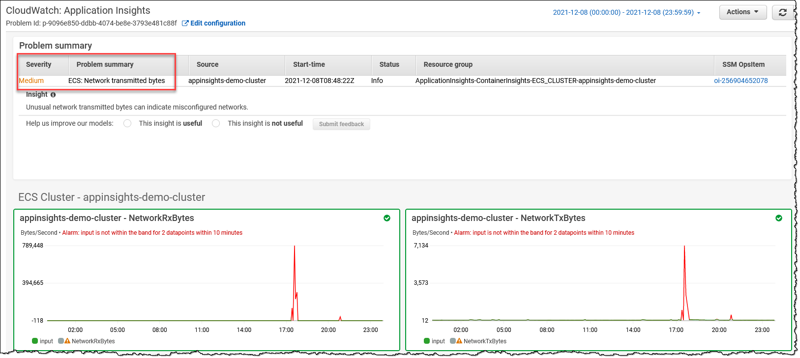

## 1.0 KPIs ("Golden Signals") को समझना
संगठन key performance indicators (KPIs) अर्थात 'Golden Signals' का उपयोग करते हैं जो व्यवसाय और संचालन के स्वास्थ्य या जोखिम में अंतर्दृष्टि प्रदान करते हैं। संगठन के विभिन्न भाग अपने संबंधित परिणामों के मापन के लिए अद्वितीय KPIs रखते हैं। उदाहरण के लिए, एक eCommerce एप्लिकेशन की प्रोडक्ट टीम कार्ट ऑर्डर को सफलतापूर्वक प्रोसेस करने की क्षमता को अपने KPI के रूप में ट्रैक करेगी। एक on-call ऑपरेशंस टीम अपने KPI को mean-time to detect (MTTD) के रूप में मापेगी। वित्तीय टीम के लिए बजट के अंतर्गत संसाधनों की लागत एक महत्वपूर्ण KPI है।

Service Level Indicators (SLIs), Service Level Objectives (SLOs), और Service Level Agreements (SLAs) सेवा विश्वसनीयता प्रबंधन के आवश्यक घटक हैं। यह गाइड SLIs, SLOs, और SLAs की गणना और निगरानी के लिए Amazon CloudWatch और इसकी सुविधाओं का उपयोग करने की सर्वोत्तम प्रथाओं को स्पष्ट और संक्षिप्त उदाहरणों के साथ रेखांकित करती है।

- **SLI (Service Level Indicator):** किसी सेवा के प्रदर्शन का एक मात्रात्मक माप।
- **SLO (Service Level Objective):** एक SLI के लिए लक्ष्य मान, जो वांछित प्रदर्शन स्तर का प्रतिनिधित्व करता है।
- **SLA (Service Level Agreement):** एक सेवा प्रदाता और उसके उपयोगकर्ताओं के बीच एक अनुबंध जो सेवा के अपेक्षित स्तर को निर्दिष्ट करता है।

सामान्य SLIs के उदाहरण:

- Availability: सेवा के चालू रहने का प्रतिशत समय
- Latency: एक request को पूरा करने में लगने वाला समय
- Error rate: विफल requests का प्रतिशत

## 2.0 ग्राहक और हितधारक आवश्यकताओं की खोज (नीचे सुझाए गए template का उपयोग करके)

1. शीर्ष प्रश्न से शुरू करें: "दिए गए वर्कलोड के लिए scope में business value या business problem क्या है (उदा. Payment portal, eCommerce order placement, User registration, Data reports, Support portal आदि)
2. Business value को श्रेणियों में विभाजित करें जैसे User-Experience (UX); Business-Experience (BX); Operational-Experience (OpsX); Security-Experience(SecX); Developer-Experience (DevX)
3. प्रत्येक श्रेणी के लिए core signals अर्थात "Golden Signals" derive करें; UX और BX के शीर्ष signals आमतौर पर business metrics का निर्माण करेंगे

| ID	| Initials	| Customer	| Business Needs	| Measurements	| Information Sources	| What does good look like?	| Alerts	| Dashboards	| Reports	|
| ---	| ---	| ---	| ---	| ---	| ---	| ---	| ---	| ---	| --- |		
|M1	|Example	|External End User	|User Experience	|Response time (Page latency)	|Logs / Traces	|< 5s for 99.9%	|No	|Yes	|No	|
|M2	|Example	|Business	|Availability	|Successful RPS (Requests per second)	|Health Check	|>85% in 5 min window	|Yes	|Yes	|Yes	|
|M3	|Example	|Security	|Compliance	|Critical non-compliant resources	|Config data	|\<10 under 15 days	|No	|Yes	|Yes	|
|M4	|Example	|Developers	|Agility	|Deployment time	|Deployment logs	|Always < 10 min	|Yes	|No	|Yes	|
|M5	|Example	|Operators	|Capacity	|Queue Depth	|App logs/metrics	|Always < 10	|Yes	|Yes	|Yes	|

### 2.1 Golden Signals

|Category	|Signal	|Notes	|References	|
|---	|---	|---	|---	|
|UX	|Performance (Latency)	|Template में M1 देखें	|Whitepaper: [Availability and Beyond (Measuring latency)](https://docs.aws.amazon.com/whitepapers/latest/availability-and-beyond-improving-resilience/measuring-availability.html#latency)	|
|BX	|Availability	|Template में M2 देखें	|Whitepaper: [Availability and Beyond (Measuring availability)](https://docs.aws.amazon.com/whitepapers/latest/availability-and-beyond-improving-resilience/measuring-availability.html)	|
|BX	|Business Continuity Plan (BCP)	|परिभाषित RTO/RPO के विरुद्ध Amazon Resilience Hub (ARH) resilience score	|Docs: [ARH user guide (Understanding resilience scores)](https://docs.aws.amazon.com/resilience-hub/latest/userguide/resil-score.html)	|
|SecX	|(Non)-Compliance	|Template में M3 देखें	|Docs: [AWS Control Tower user guide (Compliance status in the console)](https://docs.aws.amazon.com/controltower/latest/userguide/compliance-statuses.html)	|
|DevX	|Agility	|Template में M4 देखें	|Docs: [DevOps Monitoring Dashboard on AWS (DevOps metrics list)](https://docs.aws.amazon.com/solutions/latest/devops-monitoring-dashboard-on-aws/devops-metrics-list.html)	|
|OpsX	|Capacity (Quotas)	|Template में M5 देखें	|Docs: [Amazon CloudWatch user guide (Visualizing your service quotas and setting alarms)](https://docs.aws.amazon.com/AmazonCloudWatch/latest/monitoring/CloudWatch-Quotas-Visualize-Alarms.html)	|
|OpsX	|Budget Anomalies	|	|Docs:<br/> 1. [AWS Billing and Cost Management (AWS Cost Anomaly Detection)](https://docs.aws.amazon.com/cost-management/latest/userguide/getting-started-ad.html) <br/> 2. [AWS Budgets](https://aws.amazon.com/aws-cost-management/aws-budgets/)	|


## 3.0 Top Level Guidance 'TLG'


### 3.1 TLG सामान्य

1. व्यवसाय, आर्किटेक्चर और सुरक्षा टीमों के साथ काम करें ताकि व्यवसाय, अनुपालन और शासन आवश्यकताओं को परिष्कृत किया जा सके और सुनिश्चित किया जा सके कि वे व्यवसाय की आवश्यकताओं को सटीक रूप से दर्शाते हैं। इसमें [recovery-time और recovery-point targets स्थापित करना](https://aws.amazon.com/blogs/mt/establishing-rpo-and-rto-targets-for-cloud-applications/) (RTOs, RPOs) शामिल है। आवश्यकताओं को मापने के तरीके तैयार करें जैसे [availability मापना](https://docs.aws.amazon.com/whitepapers/latest/availability-and-beyond-improving-resilience/measuring-availability.html) और latency (उदा. Uptime 5 मिनट की window में faults का एक छोटा प्रतिशत अनुमति दे सकता है)।

2. विभिन्न व्यावसायिक कार्यात्मक परिणामों के अनुरूप purpose built schema के साथ एक प्रभावी [tagging strategy](https://docs.aws.amazon.com/whitepapers/latest/tagging-best-practices/defining-and-publishing-a-tagging-schema.html) बनाएं। इसमें विशेष रूप से [operational observability](https://docs.aws.amazon.com/whitepapers/latest/tagging-best-practices/operational-observability.html) और [incident management](https://docs.aws.amazon.com/whitepapers/latest/tagging-best-practices/incident-management.html) को कवर करना चाहिए।

3. जहां संभव हो अलार्म के लिए dynamic thresholds का लाभ उठाएं (विशेष रूप से उन मेट्रिक्स के लिए जिनके पास baseline KPIs नहीं हैं) [CloudWatch anomaly detection](https://docs.aws.amazon.com/AmazonCloudWatch/latest/monitoring/CloudWatch_Anomaly_Detection.html) का उपयोग करके जो baselines स्थापित करने के लिए machine learning algorithms प्रदान करता है। CW metrics (या prometheus metrics जैसे अन्य स्रोतों) प्रकाशित करने वाली AWS सेवाओं का उपयोग करते समय अलार्म कॉन्फ़िगर करने के लिए alarm noise कम करने हेतु [composite alarms](https://docs.aws.amazon.com/AmazonCloudWatch/latest/monitoring/Create_Composite_Alarm.html) बनाने पर विचार करें। उदाहरण: एक composite alarm जिसमें availability (successful requests द्वारा ट्रैक किया गया) और latency का business metric शामिल है, जब deployments के दौरान दोनों एक critical threshold से नीचे गिरते हैं तो यह deployment bug का निर्णायक संकेतक हो सकता है।

4. (नोट: AWS Business support या उच्चतर आवश्यक) AWS Personal Health Dashboard में आपके संसाधनों से संबंधित रुचि की घटनाओं को AWS Health service का उपयोग करके प्रकाशित करता है। एक central account (जैसे management account) से अपने AWS Organization में proactive और real-time अलर्ट एकत्र करने के लिए [AWS Health Aware (AHA)](https://aws.amazon.com/blogs/mt/aws-health-aware-customize-aws-health-alerts-for-organizational-and-personal-aws-accounts/) framework (जो AWS Health का उपयोग करता है) का लाभ उठाएं। ये अलर्ट Slack जैसे पसंदीदा communication platforms पर भेजे जा सकते हैं और ServiceNow और Jira जैसे ITSM tools के साथ integrate होते हैं।


5. Amazon CloudWatch [Application Insights](https://docs.aws.amazon.com/AmazonCloudWatch/latest/monitoring/cloudwatch-application-insights.html) का लाभ उठाएं ताकि संसाधनों के लिए सर्वोत्तम monitors सेटअप किए जा सकें और अपने applications के साथ समस्याओं के संकेतों के लिए लगातार डेटा का विश्लेषण किया जा सके। यह automated dashboards भी प्रदान करता है जो monitored applications के साथ संभावित समस्याएं दिखाते हैं ताकि एप्लिकेशन/इंफ्रास्ट्रक्चर समस्याओं को जल्दी isolate/troubleshoot किया जा सके। Containers से मेट्रिक्स और लॉग्स को aggregate करने के लिए [Container Insights](https://docs.aws.amazon.com/AmazonCloudWatch/latest/monitoring/ContainerInsights.html) का लाभ उठाएं और इसे CloudWatch Application Insights के साथ seamlessly integrate किया जा सकता है।


6. परिभाषित RTOs और RPOs के विरुद्ध applications का विश्लेषण करने के लिए [AWS Resilience Hub](https://aws.amazon.com/resilience-hub/) का लाभ उठाएं। [AWS Fault Injection Simulator](https://aws.amazon.com/fis/) जैसे tools का उपयोग करके controlled experiments द्वारा सत्यापित करें कि availability, latency और business continuity आवश्यकताएं पूरी हो रही हैं। AWS best practices का पालन करते हुए यह सुनिश्चित करने के लिए अतिरिक्त Well-Architected reviews और service specific deep-dives करें कि वर्कलोड व्यवसाय आवश्यकताओं को पूरा करने के लिए डिज़ाइन किए गए हैं।

7. अधिक विवरण के लिए [AWS Observability Best Practices](https://aws-observability.github.io/observability-best-practices/) मार्गदर्शन के अन्य अनुभागों, AWS Cloud Adoption Framework: [Operations Perspective](https://docs.aws.amazon.com/whitepapers/latest/aws-caf-operations-perspective/observability.html) whitepaper और AWS Well-Architected Framework Operational Excellence Pillar whitepaper '[Understanding workload health](https://docs.aws.amazon.com/wellarchitected/latest/operational-excellence-pillar/understanding-workload-health.html)' सामग्री देखें।
    

### 3.2 डोमेन द्वारा TLG (business metrics अर्थात UX, BX पर जोर)

CloudWatch (CW) जैसी सेवाओं का उपयोग करके नीचे उपयुक्त उदाहरण दिए गए हैं (Ref: AWS Services जो [CloudWatch metrics documentation](https://docs.aws.amazon.com/AmazonCloudWatch/latest/monitoring/aws-services-cloudwatch-metrics.html) प्रकाशित करती हैं)

#### 3.2.1 Canaries (अर्थात Synthetic transactions) और Real-User Monitoring (RUM)

* TLG: क्लाइंट/ग्राहक अनुभव को समझने के सबसे आसान और सबसे प्रभावी तरीकों में से एक Canaries (Synthetic transactions) के साथ ग्राहक ट्रैफ़िक simulate करना है जो नियमित रूप से आपकी सेवाओं की जांच करता है और मेट्रिक्स रिकॉर्ड करता है।

|AWS Service	|Feature	|Measurement	|Metric	|Example	|Notes	|
|---	|---	|---	|---	|---	|---	|
|CW	|Synthetics	|Availability	|**SuccessPercent**	|(Ex. SuccessPercent > 90 or CW Anomaly Detection for 1min Period)<br/>**[Metric Math where m1 is SuccessPercent if Canaries run each weekday 7a-8a (CloudWatchSynthetics): ** <br/>`IF(((DAY(m1)<6) AND (HOUR(m1)>7 AND HOUR(m1)<8)),m1)]`	|	|
|	|	|	|	|	|	|
|CW	|Synthetics	|Availability	|VisualMonitoringSuccessPercent	|(Ex. VisualMonitoringSuccessPercent > 90 for 5 min Period for UI screenshot comparisons)<br/>**[Metric Math where m1 is SuccessPercent if Canaries run each weekday 7a-8a (CloudWatchSynthetics): ** <br/>`IF(((DAY(m1)<6) AND (HOUR(m1)>7 AND HOUR(m1)<8)),m1)`	|यदि ग्राहक canary को पूर्वनिर्धारित UI screenshot से मिलान करने की अपेक्षा करता है	|
|	|	|	|	|	|	|
|CW	|RUM	|Response Time	|Apdex Score	|(Ex. Apdex score: <br/> NavigationFrustratedCount < 'N' expected value)	|	|
|	|	|	|	|	|	|


#### 3.2.2 API Frontend


|AWS Service	|Feature	|Measurement	|Metric	|Example	|Notes	|
|---	|---	|---	|---	|---	|---	|
|CloudFront	|	|Availability	|Total error rate	|(Ex. [Total error rate] < 10 or CW Anomaly Detection for 1min Period)	|Error rate के माप के रूप में Availability	|
|	|	|	|	|	|	|
|CloudFront	|(Requires turning on additional metrics)	|Performance	|Cache hit rate	|(Ex.Cache hit rate < 10 CW Anomaly Detection for 1min Period)	|	|
|	|	|	|	|	|	|
|Route53	|Health checks	|(Cross region) Availability	|HealthCheckPercentageHealthy	|(Ex. [Minimum of HealthCheckPercentageHealthy] > 90 or CW Anomaly Detection for 1min Period)	|	|
|	|	|	|	|	|	|
|Route53	|Health checks	|Latency	|TimeToFirstByte	|(Ex. [p99 TimeToFirstByte] < 100 ms or CW Anomaly Detection for 1min Period)	|	|
|	|	|	|	|	|	|
|API Gateway	|	|Availability	|Count	|(Ex. [(4XXError + 5XXError) / Count) * 100] < 10 or CW Anomaly Detection for 1min Period)	|"abandoned" requests के माप के रूप में Availability	|
|	|	|	|	|	|	|
|API Gateway	|	|Latency	|Latency (or IntegrationLatency i.e. backend latency)	|(Ex. p99 Latency < 1 sec or CW Anomaly Detection for 1min Period)	|p99 में p90 जैसे lower percentile से अधिक tolerance होगा। (p50 average के समान है)	|
|	|	|	|	|	|	|
|API Gateway	|	|Performance	|CacheHitCount (and Misses)	|(Ex. [CacheMissCount / (CacheHitCount + CacheMissCount)  * 100] < 10 or CW Anomaly Detection for 1min Period)	|Cache (Misses) के माप के रूप में Performance	|
|	|	|	|	|	|	|
|Application Load Balancer (ALB)	|	|Availability	|RejectedConnectionCount	|(Ex.[RejectedConnectionCount/(RejectedConnectionCount + RequestCount) * 100] < 10 CW Anomaly Detection for 1min Period)	|Max connections breach के कारण rejected requests के माप के रूप में Availability	|
|	|	|	|	|	|	|
|Application Load Balancer (ALB)	|	|Latency	|TargetResponseTime	|(Ex. p99 TargetResponseTime < 1 sec or CW Anomaly Detection for 1min Period)	|p99 में p90 जैसे lower percentile से अधिक tolerance होगा। (p50 average के समान है)	|
|	|	|	|	|	|	|


#### 3.2.3 Serverless

|AWS Service	|Feature	|Measurement	|Metric	|Example	|Notes	|
|---	|---	|---	|---	|---	|---	|
|S3	|Request metrics	|Availability	|AllRequests	|(Ex. [(4XXErrors + 5XXErrors) / AllRequests) * 100] < 10 or CW Anomaly Detection for 1min Period)	|"abandoned" requests के माप के रूप में Availability	|
|	|	|	|	|	|	|
|S3	|Request metrics	|(Overall) Latency	|TotalRequestLatency	|(Ex. [p99 TotalRequestLatency] < 100 ms or CW Anomaly Detection for 1min Period)	|	|
|	|	|	|	|	|	|
|DynamoDB (DDB)	|	|Availability	|ThrottledRequests	|(Ex. [ThrottledRequests] < 100 or CW Anomaly Detection for 1min Period)	|"throttled" requests के माप के रूप में Availability	|
|	|	|	|	|	|	|
|DynamoDB (DDB)	|	|Latency	|SuccessfulRequestLatency	|(Ex. [p99 SuccessfulRequestLatency] < 100 ms or CW Anomaly Detection for 1min Period)	|	|
|	|	|	|	|	|	|
|Step Functions	|	|Availability	|ExecutionsFailed	|(Ex. ExecutionsFailed = 0)<br/>**[ex. Metric Math where m1 is ExecutionsFailed (Step function Execution) UTC time: `IF(((DAY(m1)<6 OR ** ** DAY(m1)==7) AND (HOUR(m1)>21 AND HOUR(m1)<7)),m1)]`	|मान लें कि business flow जो weekdays के दौरान 9p-7a (start of day business operations) दैनिक संचालन के रूप में step functions को पूरा करने का अनुरोध करता है	|
|	|	|	|	|	|	|


#### 3.2.4 Compute और Containers

|AWS Service	|Feature	|Measurement	|Metric	|Example	|Notes	|
|---	|---	|---	|---	|---	|---	|
|EKS	|Prometheus metrics	|Availability	|APIServer Request Success Ratio	|(ex. Prometheus metric like  [APIServer Request Success Ratio](https://raw.githubusercontent.com/aws-samples/amazon-cloudwatch-container-insights/latest/k8s-deployment-manifest-templates/deployment-mode/service/cwagent-prometheus/sample_cloudwatch_dashboards/kubernetes_api_server/cw_dashboard_kubernetes_api_server.json))	|विवरण के लिए [EKS control plane metrics की निगरानी के लिए best practices](https://aws.github.io/aws-eks-best-practices/reliability/docs/controlplane/#monitor-control-plane-metrics) और [EKS observability](https://docs.aws.amazon.com/eks/latest/userguide/eks-observe.html) देखें।	|
|	|	|	|	|	|	|
|EKS	|Prometheus metrics	|Performance	|apiserver_request_duration_seconds, etcd_request_duration_seconds	|apiserver_request_duration_seconds, etcd_request_duration_seconds	|	|
|	|	|	|	|	|	|
|ECS	|	|Availability	|Service RUNNING task count	|Service RUNNING task count	|ECS CW metrics [documentation](https://docs.aws.amazon.com/AmazonECS/latest/developerguide/cloudwatch-metrics.html#cw_running_task_count) देखें	|
|	|	|	|	|	|	|
|ECS	|	|Performance	|TargetResponseTime	|(ex.  [p99 TargetResponseTime] < 100 ms or CW Anomaly Detection for 1min Period)	|ECS CW metrics [documentation](https://docs.aws.amazon.com/AmazonECS/latest/developerguide/cloudwatch-metrics.html#cw_running_task_count) देखें	|
|	|	|	|	|	|	|
|EC2 (.NET Core)	|CW Agent Performance Counters	|Availability	|(ex. [ASP.NET Application Errors Total/Sec](https://docs.aws.amazon.com/AmazonCloudWatch/latest/monitoring/appinsights-metrics-ec2.html#appinsights-metrics-ec2-built-in) < 'N')	|(ex. [ASP.NET Application Errors Total/Sec](https://docs.aws.amazon.com/AmazonCloudWatch/latest/monitoring/appinsights-metrics-ec2.html#appinsights-metrics-ec2-built-in) < 'N')	|EC2 CW Application Insights [documentation](https://docs.aws.amazon.com/AmazonCloudWatch/latest/monitoring/appinsights-metrics-ec2.html#appinsights-metrics-ec2-built-in) देखें	|
|	|	|	|	|	|	|


#### 3.2.5 Databases (RDS)

|AWS Service	|Feature	|Measurement	|Metric	|Example	|Notes	|
|---	|---	|---	|---	|---	|---	|
|RDS Aurora	|Performance Insights (PI)	|Availability	|Average active sessions	|(Ex. Average active sessions with CW Anomaly Detection for 1min Period)	|RDS Aurora CW PI [documentation](https://docs.aws.amazon.com/AmazonRDS/latest/AuroraUserGuide/USER_PerfInsights.Overview.ActiveSessions.html#USER_PerfInsights.Overview.ActiveSessions.AAS) देखें	|
|	|	|	|	|	|	|
|RDS Aurora	|	|Disaster Recovery (DR)	|AuroraGlobalDBRPOLag	|(Ex. AuroraGlobalDBRPOLag < 30000 ms for 1min Period)	|RDS Aurora CW [documentation](https://docs.aws.amazon.com/AmazonRDS/latest/AuroraUserGuide/Aurora.AuroraMonitoring.Metrics.html) देखें	|
|	|	|	|	|	|	|
|RDS Aurora	|	|Performance	|Commit Latency, Buffer Cache Hit Ratio, DDL Latency, DML Latency	|(Ex. Commit Latency with CW Anomaly Detection for 1min Period)	|RDS Aurora CW PI [documentation](https://docs.aws.amazon.com/AmazonRDS/latest/AuroraUserGuide/USER_PerfInsights.Overview.ActiveSessions.html#USER_PerfInsights.Overview.ActiveSessions.AAS) देखें	|
|	|	|	|	|	|	|
|RDS (MSSQL)	|PI	|Performance	|SQL Compilations	|(Ex. <br/>SQL Compilations > 'M' for 5 min Period)	|RDS CW PI [documentation](https://docs.aws.amazon.com/AmazonRDS/latest/UserGuide/USER_PerfInsights_Counters.html#USER_PerfInsights_Counters.SQLServer) देखें	|
|	|	|	|	|	|	|


## 4.0 SLIs, SLOs, और SLAs की गणना के लिए Amazon CloudWatch और Metric Math का उपयोग

### 4.1 Amazon CloudWatch और Metric Math

Amazon CloudWatch AWS संसाधनों के लिए monitoring और observability सेवाएं प्रदान करता है। Metric Math आपको CloudWatch metric data का उपयोग करके गणनाएं करने की अनुमति देता है, जो इसे SLIs, SLOs, और SLAs की गणना के लिए एक आदर्श tool बनाता है।

#### 4.1.1 Detailed Monitoring सक्षम करना

अपने AWS संसाधनों के लिए Detailed Monitoring सक्षम करें ताकि 1-मिनट data granularity प्राप्त हो, जो अधिक सटीक SLI गणनाओं की अनुमति देती है।

#### 4.1.2 Namespaces और Dimensions के साथ Metrics को व्यवस्थित करना

आसान विश्लेषण के लिए metrics को categorize और filter करने के लिए Namespaces और Dimensions का उपयोग करें। उदाहरण के लिए, किसी विशिष्ट सेवा से संबंधित metrics को group करने के लिए Namespaces का उपयोग करें, और उस सेवा के विभिन्न instances को अलग करने के लिए Dimensions का उपयोग करें।

### 4.2 Metric Math के साथ SLIs की गणना

#### 4.2.1 Availability

Availability की गणना करने के लिए, सफल requests की संख्या को कुल requests की संख्या से विभाजित करें:

```
availability = 100 * (successful_requests / total_requests)
```


**उदाहरण:**

मान लें कि आपके पास निम्नलिखित metrics वाला एक API Gateway है:
- `4XXError`: 4xx client errors की संख्या
- `5XXError`: 5xx server errors की संख्या
- `Count`: Requests की कुल संख्या

Availability की गणना करने के लिए Metric Math का उपयोग करें:

```
availability = 100 * ((Count - 4XXError - 5XXError) / Count)
```


#### 4.2.2 Latency

Average latency की गणना करने के लिए, CloudWatch द्वारा प्रदान की गई `SampleCount` और `Sum` statistics का उपयोग करें:

```
average_latency = Sum / SampleCount
```


**उदाहरण:**

मान लें कि आपके पास निम्नलिखित metric वाला एक Lambda function है:
- `Duration`: Function को execute करने में लगा समय

Average latency की गणना करने के लिए Metric Math का उपयोग करें:

```
average_latency = Duration.Sum / Duration.SampleCount
```


#### 4.2.3 Error Rate

Error rate की गणना करने के लिए, विफल requests की संख्या को कुल requests की संख्या से विभाजित करें:

```
error_rate = 100 * (failed_requests / total_requests)
```


**उदाहरण:**

पहले के API Gateway उदाहरण का उपयोग करते हुए:

```
error_rate = 100 * ((4XXError + 5XXError) / Count)
```


### 4.4 SLOs को परिभाषित और मॉनिटर करना

#### 4.4.1 यथार्थवादी लक्ष्य निर्धारित करना

User expectations और ऐतिहासिक performance data के आधार पर SLO targets परिभाषित करें। सेवा विश्वसनीयता और संसाधन उपयोग के बीच संतुलन सुनिश्चित करने के लिए प्राप्त करने योग्य targets निर्धारित करें।

#### 4.4.2 CloudWatch के साथ SLOs की निगरानी

अपने SLIs की निगरानी के लिए CloudWatch Alarms बनाएं और जब वे SLO targets के करीब पहुंचें या उन्हें breach करें तो आपको सूचित करें। इससे आप सक्रिय रूप से समस्याओं का समाधान कर सकते हैं और सेवा विश्वसनीयता बनाए रख सकते हैं।

#### 4.4.3 SLOs की समीक्षा और समायोजन

समय-समय पर अपने SLOs की समीक्षा करें ताकि यह सुनिश्चित हो सके कि जैसे-जैसे आपकी सेवा विकसित होती है वे प्रासंगिक बने रहें। यदि आवश्यक हो तो targets समायोजित करें और किसी भी परिवर्तन को हितधारकों तक संप्रेषित करें।

### 4.5 SLAs को परिभाषित और मापना

#### 4.5.1 यथार्थवादी लक्ष्य निर्धारित करना

ऐतिहासिक performance data और user expectations के आधार पर SLA targets परिभाषित करें। सेवा विश्वसनीयता और संसाधन उपयोग के बीच संतुलन सुनिश्चित करने के लिए प्राप्त करने योग्य targets निर्धारित करें।

#### 4.5.2 निगरानी और अलर्टिंग

SLIs की निगरानी के लिए CloudWatch Alarms सेटअप करें और जब वे SLA targets के करीब पहुंचें या उन्हें breach करें तो आपको सूचित करें। इससे आप सक्रिय रूप से समस्याओं का समाधान कर सकते हैं और सेवा विश्वसनीयता बनाए रख सकते हैं।

#### 4.5.3 SLAs की नियमित समीक्षा

समय-समय पर SLAs की समीक्षा करें ताकि यह सुनिश्चित हो सके कि जैसे-जैसे आपकी सेवा विकसित होती है वे प्रासंगिक बने रहें। यदि आवश्यक हो तो targets समायोजित करें और किसी भी परिवर्तन को हितधारकों तक संप्रेषित करें।

### 4.6 एक निर्धारित अवधि में SLA या SLO प्रदर्शन मापना

एक निर्धारित अवधि में, जैसे कि एक कैलेंडर माह में, SLA या SLO प्रदर्शन मापने के लिए, custom time ranges के साथ CloudWatch metric data का उपयोग करें।

**उदाहरण:**

मान लें कि आपके पास 99.9% availability के SLO target वाला एक API Gateway है। अप्रैल माह के लिए availability मापने के लिए, निम्नलिखित Metric Math अभिव्यक्ति का उपयोग करें:

```
availability = 100 * ((Count - 4XXError - 5XXError) / Count)
```


फिर, custom time range के साथ CloudWatch metric data query कॉन्फ़िगर करें:

- **Start Time:** `2023-04-01T00:00:00Z`
- **End Time:** `2023-04-30T23:59:59Z`
- **Period:** `2592000` (सेकंड में 30 दिन)

अंत में, माह की औसत availability की गणना करने के लिए `AVG` statistic का उपयोग करें। यदि औसत availability SLO target के बराबर या उससे अधिक है, तो आपने अपना objective पूरा कर लिया है।

## 5.0 सारांश

Key Performance Indicators (KPIs) अर्थात 'Golden Signals' को व्यवसाय और हितधारक आवश्यकताओं के अनुरूप होना चाहिए। Amazon CloudWatch और Metric Math का उपयोग करके SLIs, SLOs, और SLAs की गणना सेवा विश्वसनीयता के प्रबंधन के लिए महत्वपूर्ण है। अपने AWS संसाधनों के प्रदर्शन की प्रभावी रूप से निगरानी और रखरखाव के लिए इस गाइड में उल्लिखित सर्वोत्तम प्रथाओं का पालन करें। Detailed Monitoring सक्षम करना, Namespaces और Dimensions के साथ metrics व्यवस्थित करना, SLI गणनाओं के लिए Metric Math का उपयोग करना, यथार्थवादी SLO और SLA targets निर्धारित करना, और CloudWatch Alarms के साथ monitoring और alerting systems स्थापित करना याद रखें। इन सर्वोत्तम प्रथाओं को लागू करके, आप इष्टतम सेवा विश्वसनीयता, बेहतर संसाधन उपयोग और बेहतर ग्राहक संतुष्टि सुनिश्चित कर सकते हैं।
