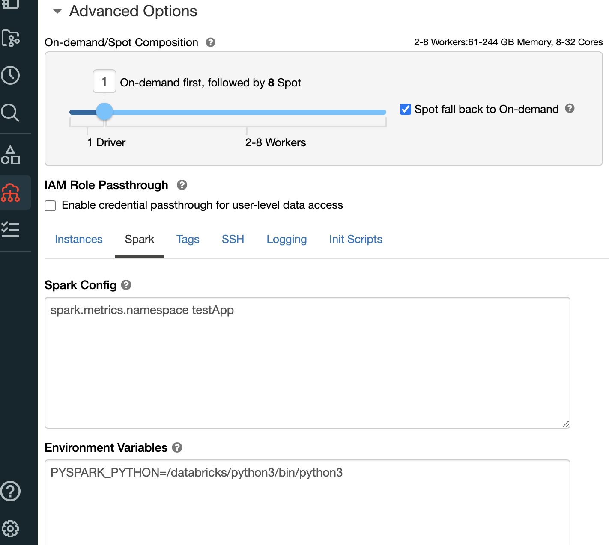

# AWS में Databricks मॉनिटरिंग और Observability सर्वोत्तम प्रथाएं

Databricks डेटा analytics और AI/ML वर्कलोड प्रबंधित करने के लिए एक प्लेटफॉर्म है। यह गाइड [AWS पर Databricks](https://aws.amazon.com/solutions/partners/databricks/) चलाने वाले ग्राहकों को observability के लिए AWS Native services या OpenSource Managed Services का उपयोग करके इन वर्कलोड की मॉनिटरिंग में सहायता करने का लक्ष्य रखती है।

## Databricks की मॉनिटरिंग क्यों करें

Databricks clusters प्रबंधित करने वाली Operation टीमों को वर्कलोड स्थिति, errors, performance bottlenecks ट्रैक करने के लिए एक integrated, customized डैशबोर्ड; अवांछित व्यवहार पर alerting, जैसे समय के साथ कुल resource usage, या errors का प्रतिशत; और root cause analysis के लिए centralized logging, साथ ही अतिरिक्त customized metrics निकालने से लाभ होता है।

## क्या मॉनिटर करें

Databricks अपने cluster instances में Apache Spark चलाता है, जिसमें metrics expose करने के लिए native सुविधाएं हैं। ये metrics drivers, workers, और cluster में execute हो रहे workloads के बारे में जानकारी देंगे।

Spark चलाने वाले instances में storage, CPU, memory, और networking के बारे में अतिरिक्त उपयोगी जानकारी होगी। यह समझना महत्वपूर्ण है कि कौन से बाहरी कारक Databricks cluster के प्रदर्शन को प्रभावित कर सकते हैं। कई instances वाले clusters के मामले में, bottlenecks और सामान्य स्वास्थ्य को समझना भी महत्वपूर्ण है।

## कैसे मॉनिटर करें

Collectors और उनकी dependencies इंस्टॉल करने के लिए, Databricks init scripts की आवश्यकता होगी। ये ऐसी scripts हैं जो Databricks cluster के प्रत्येक instance में boot time पर चलाई जाती हैं।

Databricks cluster permissions को instance profiles का उपयोग करके metrics और logs भेजने की अनुमति भी चाहिए।

अंत में, Databricks cluster Spark configuration में metrics namespace कॉन्फ़िगर करना एक सर्वोत्तम प्रथा है, `testApp` को cluster के उचित reference से बदलें।

*चित्र 1: metrics namespace Spark configuration का उदाहरण*

## DataBricks के लिए एक अच्छे Observability समाधान के प्रमुख भाग

**1) Metrics:** Metrics ऐसी संख्याएं हैं जो एक समय अवधि में मापी गई गतिविधि या किसी विशेष प्रक्रिया का वर्णन करती हैं। Databricks पर विभिन्न प्रकार के metrics यहां दिए गए हैं:

System resource-level metrics, जैसे CPU, memory, disk, और network।
Custom Metrics Source, StreamingQueryListener, और QueryExecutionListener का उपयोग करके Application Metrics,
MetricsSystem द्वारा expose किए गए Spark Metrics।

**2) Logs:** Logs हुई serial events का एक representation हैं, और वे उनके बारे में एक linear कहानी बताते हैं। Databricks पर विभिन्न प्रकार के logs यहां दिए गए हैं:

- Event logs
- Audit logs
- Driver logs: stdout, stderr, log4j custom logs (structured logging enable करें)
- Executor logs: stdout, stderr, log4j custom logs (structured logging enable करें)

**3) Traces:** Stack traces end-to-end visibility प्रदान करते हैं, और वे stages के माध्यम से पूरे flow को दिखाते हैं। यह तब उपयोगी है जब आपको debug करना हो यह पहचानने के लिए कि कौन से stages/codes errors/performance issues का कारण बनते हैं।

**4) Dashboards:** Dashboards किसी application/service के golden metrics का एक बेहतरीन summary view प्रदान करते हैं।

**5) Alerts:** Alerts engineers को उन स्थितियों के बारे में सूचित करते हैं जिन पर ध्यान देने की आवश्यकता है।

## AWS Native Observability विकल्प

Native solutions, जैसे Ganglia UI और Log Delivery, system metrics एकत्र करने और Apache Spark metrics query करने के लिए शानदार solutions हैं। हालांकि, कुछ क्षेत्रों में सुधार किया जा सकता है:

- Ganglia alerts का समर्थन नहीं करता।
- Ganglia logs से derived metrics (जैसे ERROR log growth rate) बनाने का समर्थन नहीं करता।
- आप data-correctness, data-freshness, या end-to-end latency से संबंधित SLO (Service Level Objectives) और SLI (Service Level Indicators) ट्रैक करने के लिए custom dashboards का उपयोग नहीं कर सकते, और फिर उन्हें ganglia के साथ visualize कर सकते हैं।

[Amazon CloudWatch](https://aws.amazon.com/cloudwatch/) AWS पर आपके Databricks clusters की मॉनिटरिंग और प्रबंधन के लिए एक महत्वपूर्ण tool है। यह cluster performance में मूल्यवान अंतर्दृष्टि प्रदान करता है और समस्याओं को जल्दी पहचानने और हल करने में मदद करता है। Databricks को CloudWatch के साथ integrate करना और structured logging enable करना इन क्षेत्रों में सुधार करने में मदद कर सकता है। CloudWatch Application Insights logs में निहित fields को स्वचालित रूप से discover करने में मदद कर सकता है, और CloudWatch Logs Insights तेज debugging और analysis के लिए एक purpose-built query language प्रदान करता है।

*चित्र 2: Databricks CloudWatch Architecture*

Databricks की मॉनिटरिंग के लिए CloudWatch का उपयोग करने के बारे में अधिक जानकारी के लिए देखें:
[How to Monitor Databricks with Amazon CloudWatch](https://aws.amazon.com/blogs/mt/how-to-monitor-databricks-with-amazon-cloudwatch/)

## Open-source software observability विकल्प

[Amazon Managed Service for Prometheus](https://aws.amazon.com/prometheus/) एक Prometheus-compatible monitoring managed, serverless service है, जो metrics store करने और इन metrics के ऊपर बनाए गए alerts प्रबंधित करने के लिए जिम्मेदार होगी। Prometheus एक लोकप्रिय open source monitoring technology है, जो Kubernetes के ठीक बाद Cloud Native Computing Foundation से संबंधित दूसरा project है।

[Amazon Managed Grafana](https://aws.amazon.com/grafana/) Grafana के लिए एक managed service है। Grafana time-series data visualization के लिए एक open source technology है, जो सामान्यतः observability के लिए उपयोग की जाती है। हम Amazon Managed Service for Prometheus, Amazon CloudWatch, और कई अन्य जैसे कई sources से डेटा visualize करने के लिए Grafana का उपयोग कर सकते हैं। इसका उपयोग Databricks metrics और alerts visualize करने के लिए किया जाएगा।

[AWS Distro for OpenTelemetry](https://aws-otel.github.io/) OpenTelemetry project का AWS-supported distribution है, जो traces और metrics एकत्र करने के लिए open source standards, libraries, और services प्रदान करता है। OpenTelemetry के माध्यम से, हम कई अलग-अलग observability data formats एकत्र कर सकते हैं, जैसे Prometheus या StatsD, इस डेटा को enrich कर सकते हैं, और इसे कई destinations पर भेज सकते हैं, जैसे CloudWatch या Amazon Managed Service for Prometheus।

### उपयोग के मामले

जबकि AWS Native services Databricks clusters प्रबंधित करने के लिए आवश्यक observability प्रदान करेंगी, कुछ परिदृश्य हैं जहां Open Source managed services का उपयोग सबसे अच्छा विकल्प है।

Prometheus और Grafana दोनों बहुत लोकप्रिय technologies हैं, और पहले से ही कई कंपनियों में उपयोग की जा रही हैं। Observability के लिए AWS Open Source services operation टीमों को इन services के infrastructure, scalability, और performance के प्रबंधन के भारी काम के बिना, Databricks workloads की मॉनिटरिंग के लिए उसी मौजूदा infrastructure, उसी query language, और मौजूदा dashboards और alerts का उपयोग करने की अनुमति देंगी।

ADOT उन टीमों के लिए सबसे अच्छा विकल्प है जिन्हें metrics और traces को विभिन्न destinations पर भेजने की आवश्यकता है, जैसे CloudWatch और Prometheus, या विभिन्न प्रकार के data sources के साथ काम करना है, जैसे OTLP और StatsD।

अंत में, Amazon Managed Grafana CloudWatch और Prometheus सहित कई अलग-अलग Data Sources का समर्थन करता है, और उन टीमों के लिए data correlate करने में मदद करता है जो एक से अधिक tool उपयोग करने का निर्णय लेती हैं, सभी मौजूदा और नए Databricks Clusters के लिए templates बनाने की अनुमति देता है, और एक शक्तिशाली API जो Infrastructure as Code के माध्यम से इसके provisioning और configuration की अनुमति देता है।

*चित्र 3: Databricks Open Source Observability Architecture*

AWS Managed Open Source Services for Observability का उपयोग करके Databricks cluster से metrics observe करने के लिए, आपको metrics और alerts दोनों visualize करने के लिए एक Amazon Managed Grafana workspace और Amazon Managed Grafana workspace में datasource के रूप में कॉन्फ़िगर किया गया एक Amazon Managed Service for Prometheus workspace चाहिए।

दो महत्वपूर्ण प्रकार के metrics हैं जिन्हें एकत्र करना आवश्यक है: Spark और node metrics।

Spark metrics जानकारी लाएंगे जैसे cluster में workers या executors की वर्तमान संख्या; shuffles, जो processing के दौरान nodes के बीच data exchange होने पर होते हैं; या spills, जब data RAM से disk और disk से RAM में जाता है। इन metrics को expose करने के लिए, Spark native Prometheus - version 3.0 से उपलब्ध - को Databricks management console के माध्यम से enable किया जाना चाहिए, और `init_script` के माध्यम से कॉन्फ़िगर किया जाना चाहिए।

Node metrics का track रखने के लिए, जैसे disk usage, CPU time, memory, storage performance, हम `node_exporter` का उपयोग करते हैं, जिसे बिना किसी अतिरिक्त configuration के उपयोग किया जा सकता है, लेकिन केवल महत्वपूर्ण metrics expose करना चाहिए।

प्रत्येक cluster node में एक ADOT Collector इंस्टॉल होना चाहिए, Spark और `node_exporter` दोनों द्वारा expose किए गए metrics को scrape करना, इन metrics को filter करना, `cluster_name` जैसा metadata inject करना, और इन metrics को Prometheus workspace में भेजना।

ADOT Collector और `node_exporter` दोनों को एक `init_script` के माध्यम से इंस्टॉल और कॉन्फ़िगर किया जाना चाहिए।

Databricks cluster को Prometheus workspace में metrics लिखने की permission वाले IAM Role के साथ कॉन्फ़िगर किया जाना चाहिए।

## सर्वोत्तम प्रथाएं

### मूल्यवान metrics को प्राथमिकता दें

Spark और node_exporter दोनों कई metrics और समान metrics के कई formats expose करते हैं। बिना यह filter किए कि मॉनिटरिंग और incident response के लिए कौन से metrics उपयोगी हैं, समस्याओं का पता लगाने का mean time बढ़ता है, samples store करने की लागत बढ़ती है, मूल्यवान जानकारी ढूंढना और समझना कठिन होगा। OpenTelemetry processors का उपयोग करके, मूल्यवान metrics को filter करना और केवल रखना संभव है, या ऐसे metrics को filter out करना जो मायने नहीं रखते; AMP में भेजने से पहले metrics को aggregate और calculate करना।

### Alerting fatigue से बचें

एक बार जब मूल्यवान metrics AMP में ingest हो रहे हों, तो alerts कॉन्फ़िगर करना आवश्यक है। हालांकि, हर resource usage burst पर alerting करने से alerting fatigue हो सकती है, यानी जब बहुत अधिक noise alerts की severity में विश्वास कम करेगा, और महत्वपूर्ण events का पता नहीं चलेगा। AMP alerting rules group feature का उपयोग ambiguity से बचने के लिए किया जाना चाहिए, यानी कई connected alerts separate notifications generate कर रहे हैं। साथ ही, alerts को उचित severity मिलनी चाहिए, और यह business priorities को reflect करना चाहिए।

### Amazon Managed Grafana dashboards का पुनः उपयोग करें

Amazon Managed Grafana, Grafana native templating feature का लाभ उठाता है, जो सभी मौजूदा और नए Databricks clusters के लिए dashboards बनाने की अनुमति देता है। यह प्रत्येक cluster के लिए manually visualizations बनाने और बनाए रखने की आवश्यकता को हटा देता है। इस feature का उपयोग करने के लिए, metrics में सही labels होना महत्वपूर्ण है ताकि इन metrics को प्रति cluster group किया जा सके। एक बार फिर, यह OpenTelemetry processors के साथ संभव है।

## संदर्भ और अधिक जानकारी

- [Create Amazon Managed Service for Prometheus workspace](https://docs.aws.amazon.com/prometheus/latest/userguide/AMP-onboard-create-workspace.html)
- [Create Amazon Managed Grafana workspace](https://docs.aws.amazon.com/grafana/latest/userguide/Amazon-Managed-Grafana-create-workspace.html)
- [Configure Amazon Managed Service for Prometheus datasource](https://docs.aws.amazon.com/grafana/latest/userguide/prometheus-data-source.html)
- [Databricks Init Scripts](https://docs.databricks.com/clusters/init-scripts.html)
