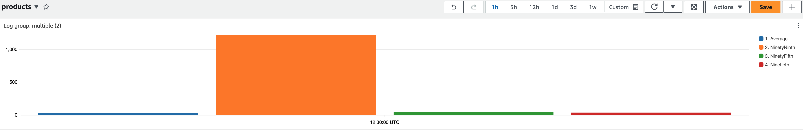

# AWS Lambda आधारित Serverless Observability

वितरित प्रणालियों और serverless computing की दुनिया में, Observability प्राप्त करना application की विश्वसनीयता और प्रदर्शन सुनिश्चित करने की कुंजी है। इसमें पारंपरिक monitoring से अधिक शामिल है। Amazon CloudWatch और AWS X-Ray जैसे AWS observability tools का लाभ उठाकर, आप अपने serverless applications में अंतर्दृष्टि प्राप्त कर सकते हैं, समस्याओं का निवारण कर सकते हैं, और application प्रदर्शन को अनुकूलित कर सकते हैं। इस गाइड में, हम आपके Lambda आधारित serverless application की Observability को लागू करने के लिए आवश्यक अवधारणाओं, tools और सर्वोत्तम अभ्यासों को सीखेंगे।

अपने infrastructure या application के लिए observability लागू करने से पहले पहला कदम अपने प्रमुख उद्देश्यों को निर्धारित करना है। यह बेहतर उपयोगकर्ता अनुभव, बढ़ी हुई डेवलपर उत्पादकता, service level objectives (SLOs) को पूरा करना, व्यावसायिक राजस्व बढ़ाना या आपके application प्रकार के आधार पर कोई अन्य विशिष्ट उद्देश्य हो सकता है। इसलिए, इन प्रमुख उद्देश्यों को स्पष्ट रूप से परिभाषित करें और स्थापित करें कि आप उन्हें कैसे मापेंगे। फिर वहां से backwards काम करके अपनी observability strategy डिज़ाइन करें। अधिक जानने के लिए "[जो महत्वपूर्ण है उसे मॉनिटर करें](https://aws-observability.github.io/observability-best-practices/guides/#monitor-what-matters)" देखें।

## Observability के स्तंभ

Observability के तीन मुख्य स्तंभ हैं:

* Logs: किसी application या system के भीतर हुई discrete events के timestamped records, जैसे कि failure, error, या state transformation
* Metrics: विभिन्न समय अंतराल पर मापा गया संख्यात्मक डेटा (time series data); SLIs (request rate, error rate, duration, CPU%, आदि)
* Traces: एक trace कई applications और systems (आमतौर पर microservices) में एकल उपयोगकर्ता की यात्रा का प्रतिनिधित्व करता है


 AWS आपके AWS Lambda application के लिए logging, monitoring metrics, और tracing से actionable insights प्राप्त करने के लिए Native और Open source दोनों tools प्रदान करता है।

## **Logs**

observability सर्वोत्तम अभ्यास गाइड के इस अनुभाग में, हम निम्नलिखित विषयों पर गहराई से जाएंगे:

* Unstructured बनाम structured logs
* CloudWatch Logs Insights
* Logging correlation Id
* Lambda Powertools का उपयोग करके कोड सैंपल
* CloudWatch Dashboards का उपयोग करके Log visualization
* CloudWatch Logs Retention


Logs आपके application के भीतर हुई discrete events हैं। इनमें failures, errors, execution path या कुछ और जैसी events शामिल हो सकती हैं। Logs को unstructured, semi-structured, या structured formats में रिकॉर्ड किया जा सकता है।

### **Unstructured बनाम structured logs**

हम अक्सर देखते हैं कि डेवलपर्स अपने application के भीतर `print` या `console.log` statements का उपयोग करके सरल log messages से शुरू करते हैं। इन्हें बड़े पैमाने पर programmatically parse और analyze करना कठिन है, विशेष रूप से AWS Lambda आधारित applications में जो विभिन्न log groups में कई lines of log messages generate कर सकते हैं। परिणामस्वरूप, इन logs को CloudWatch में consolidate करना चुनौतीपूर्ण हो जाता है और analyze करना कठिन। आपको logs में प्रासंगिक जानकारी खोजने के लिए text match या regular expressions करने होंगे। यहां unstructured logging का एक उदाहरण है:

```
[2023-07-19T19:59:07Z]  INFO  Request started
[2023-07-19T19:59:07Z]  INFO  AccessDenied: Could not access resource
[2023-07-19T19:59:08Z]  INFO  Request finished
```

जैसा कि आप देख सकते हैं, log messages में एक सुसंगत structure की कमी है, जिससे उनसे उपयोगी insights प्राप्त करना चुनौतीपूर्ण हो जाता है। साथ ही, इसमें contextual information जोड़ना कठिन है।

जबकि structured logging एक सुसंगत format में, अक्सर JSON में, जानकारी log करने का एक तरीका है जो logs को text के बजाय data के रूप में treat करने की अनुमति देता है, जिससे querying और filtering सरल हो जाती है। यह डेवलपर्स को logs को programmatically कुशलतापूर्वक store, retrieve, और analyze करने की क्षमता देता है। यह बेहतर debugging की सुविधा भी प्रदान करता है। Structured logging log levels के माध्यम से विभिन्न environments में logs की verbosity को modify करने का एक सरल तरीका प्रदान करता है। **Logging levels पर ध्यान दें।** बहुत अधिक logging करने से लागत बढ़ेगी और application throughput कम होगी। logging से पहले सुनिश्चित करें कि personal identifiable information redact हो। यहां structured logging का एक उदाहरण है:

```
{
   "correlationId": "9ac54d82-75e0-4f0d-ae3c-e84ca400b3bd",
   "requestId": "58d9c96e-ae9f-43db-a353-c48e7a70bfa8",
   "level": "INFO",
   "message": "AccessDenied",
   "function-name": "demo-observability-function",
   "cold-start": true
}
```


**`Structured और centralized logging को CloudWatch logs में prefer करें`** ताकि transactions, विभिन्न components में correlation identifiers, और आपके application से business outcomes के बारे में operational information emit की जा सके।

### **CloudWatch Logs Insights**
CloudWatch Logs Insights का उपयोग करें, जो JSON formatted logs में fields को स्वचालित रूप से discover कर सकता है। इसके अतिरिक्त, JSON logs को आपके application के लिए विशिष्ट custom metadata log करने के लिए extend किया जा सकता है जिसका उपयोग आपके logs को search, filter, और aggregate करने के लिए किया जा सकता है।


### **Logging correlation Id**

उदाहरण के लिए, API Gateway से आने वाले http request के लिए, correlation Id `requestContext.requestId` path पर सेट होता है, जिसे Lambda powertools का उपयोग करके downstream Lambda functions में आसानी से extract और log किया जा सकता है। वितरित प्रणालियों में अक्सर एक request को handle करने के लिए कई services और components एक साथ काम करते हैं। इसलिए, correlation Id को log करना और downstream systems को pass करना end-to-end tracing और debugging के लिए महत्वपूर्ण हो जाता है। एक correlation Id एक unique identifier है जो शुरुआत में ही एक request को assign किया जाता है। जैसे-जैसे request विभिन्न services से गुजरता है, correlation Id logs में शामिल किया जाता है, जिससे आप request के पूरे path को trace कर सकते हैं। आप या तो manually correlation Id को अपने AWS Lambda logs में insert कर सकते हैं या [AWS Lambda powertools](https://docs.powertools.aws.dev/lambda/python/latest/core/logger/#setting-a-correlation-id) जैसे tools का उपयोग करके API Gateway से correlation Id को आसानी से grab कर सकते हैं और अपने application logs के साथ log कर सकते हैं। उदाहरण के लिए, http request के लिए correlation Id एक request-id हो सकता है जिसे API Gateway पर initiate किया जा सकता है और फिर आपकी backend services जैसे Lambda functions को pass किया जा सकता है।

### **Lambda Powertools का उपयोग करके कोड सैंपल**
सर्वोत्तम अभ्यास के रूप में, request lifecycle में जितनी जल्दी हो सके correlation Id generate करें, अधिमानतः आपके serverless application के entry point पर, जैसे API Gateway या application load balancer। UUIDs, या request id या किसी अन्य unique attribute का उपयोग करें जिसका उपयोग वितरित systems में request को track करने के लिए किया जा सकता है। correlation id को प्रत्येक request के साथ custom header, body या metadata के हिस्से के रूप में pass करें। सुनिश्चित करें कि correlation Id आपकी downstream services में सभी log entries और traces में शामिल हो।

आप या तो manually correlation Id को अपने Lambda function logs के हिस्से के रूप में capture और include कर सकते हैं या [AWS Lambda Powertools](https://docs.powertools.aws.dev/lambda/python/latest/core/logger/#setting-a-correlation-id) जैसे tools का उपयोग कर सकते हैं। Lambda Powertools के साथ, आप supported upstream services के लिए predefined request [path mapping](https://github.com/aws-powertools/powertools-lambda-python/blob/08a0a7b68d2844d36c33ab8156640f4ea9632d0c/aws_lambda_powertools/logging/correlation_paths.py) से correlation Id को आसानी से grab कर सकते हैं और इसे अपने application logs के साथ स्वचालित रूप से जोड़ सकते हैं। साथ ही, सुनिश्चित करें कि correlation Id आपके सभी error messages में जोड़ा जाए ताकि failures के मामले में root cause को आसानी से debug और identify किया जा सके और इसे original request से जोड़ा जा सके।

आइए नीचे दिए गए serverless architecture के लिए correlation id के साथ structured logging को demonstrate करने के लिए code sample देखें और इसे CloudWatch में देखें:


```
// Initializing Logger
Logger log = LogManager.getLogger();

// Uses @Logger annotation from Lambda Powertools, which takes optional parameter correlationIdPath to extract correlation Id from the API Gateway header and inserts correlation_id to the Lambda function logs in a structured format.
@Logging(correlationIdPath = "/headers/path-to-correlation-id")
public APIGatewayProxyResponseEvent handleRequest(final APIGatewayProxyRequestEvent input, final Context context) {
  ...
  // The log statement below will also have additional correlation_id
  log.info("Success")
  ...
}
```

इस उदाहरण में, एक Java आधारित Lambda function API gateway request से आने वाले `correlation_id` को log करने के लिए Lambda Powertools library का उपयोग कर रहा है।

code sample के लिए सैंपल CloudWatch logs:

```
{
   "level": "INFO",
   "message": "Success",
   "function-name": "demo-observability-function",
   "cold-start": true,
   "lambda_request_id": "52fdfc07-2182-154f-163f-5f0f9a621d72",
   "correlation_id": "<correlation_id_value>"
}_
```

### **CloudWatch Dashboards का उपयोग करके Log visualization**

एक बार जब आप structured JSON format में data log करते हैं, तो [CloudWatch Logs Insights](https://docs.aws.amazon.com/AmazonCloudWatch/latest/logs/AnalyzingLogData.html) स्वचालित रूप से JSON output में values discover करता है और messages को fields के रूप में parse करता है। CloudWatch Logs insights कई log streams में search और filter करने के लिए purpose-built [SQL-like query](https://serverlessland.com/snippets?type=CloudWatch+Logs+Insights) language प्रदान करता है। आप glob और regular expressions pattern matching का उपयोग करके कई log groups पर queries perform कर सकते हैं। इसके अतिरिक्त, आप अपनी custom queries भी लिख सकते हैं और उन्हें save कर सकते हैं ताकि हर बार re-create किए बिना फिर से चलाया जा सके।


CloudWatch logs insights में, आप अपनी queries से एक या अधिक aggregation functions के साथ line charts, bar charts, और stacked area charts जैसी visualizations generate कर सकते हैं। फिर आप इन visualizations को CloudWatch Dashboards में आसानी से जोड़ सकते हैं। नीचे दिया गया सैंपल dashboard Lambda function के execution duration की percentile report दिखाता है। ऐसे dashboards आपको तुरंत insights देंगे कि application प्रदर्शन सुधारने के लिए आपको कहां focus करना चाहिए। Average latency देखने के लिए एक अच्छी metric है लेकिन **`आपको average latency के बजाय p99 के लिए optimize करने का लक्ष्य रखना चाहिए।`**


CloudWatch के अलावा अन्य स्थानों पर (platform, function और extensions) logs भेजने के लिए, आप Lambda Extensions के साथ [Lambda Telemetry API](https://docs.aws.amazon.com/lambda/latest/dg/telemetry-api.html) का उपयोग कर सकते हैं। कई [partner solutions](https://docs.aws.amazon.com/lambda/latest/dg/extensions-api-partners.html) Lambda layers प्रदान करते हैं जो Lambda Telemetry API का उपयोग करते हैं और उनके systems के साथ integration को आसान बनाते हैं।

CloudWatch logs insights का सर्वोत्तम उपयोग करने के लिए, सोचें कि structured logging के रूप में आपको अपने logs में कौन सा data ingest करना चाहिए, जो फिर आपके application के स्वास्थ्य की बेहतर monitoring में मदद करेगा।


### **CloudWatch Logs Retention**

डिफ़ॉल्ट रूप से आपके Lambda function में stdout पर लिखे गए सभी messages एक Amazon CloudWatch log stream में save होते हैं। Lambda function की execution role के पास CloudWatch log streams बनाने और streams में log events लिखने की permission होनी चाहिए। यह जानना महत्वपूर्ण है कि CloudWatch ingest किए गए data की मात्रा और उपयोग किए गए storage के अनुसार bill होता है। इसलिए, logging की मात्रा कम करने से आपको संबंधित लागत को minimize करने में मदद मिलेगी। **`डिफ़ॉल्ट रूप से CloudWatch logs अनिश्चित काल तक रखे जाते हैं और कभी expire नहीं होते। log-storage लागत कम करने के लिए log retention policy configure करने की अनुशंसा की जाती है`**, और इसे अपने सभी log groups में लागू करें। आप प्रति environment अलग-अलग retention policies चाह सकते हैं। Log retention को AWS console में manually configure किया जा सकता है लेकिन consistency और सर्वोत्तम अभ्यासों को सुनिश्चित करने के लिए, आपको इसे अपने Infrastructure as Code (IaC) deployments के हिस्से के रूप में configure करना चाहिए। नीचे एक सैंपल CloudFormation template है जो Lambda function के लिए Log Retention configure करने का प्रदर्शन करता है:

```
Resources:
  Function:
    Type: AWS::Serverless::Function
    Properties:
      CodeUri: .
      Runtime: python3.8
      Handler: main.handler
      Tracing: Active

  # Explicit log group that refers to the Lambda function
  LogGroup:
    Type: AWS::Logs::LogGroup
    Properties:
      LogGroupName: !Sub "/aws/lambda/${Function}"
      # Explicit retention time
      RetentionInDays: 7
```

इस उदाहरण में, हमने एक Lambda function और corresponding log group बनाया। **`RetentionInDays`** property **7 days पर सेट है**, जिसका मतलब है कि इस log group में logs 7 days तक retain किए जाएंगे जिसके बाद वे स्वचालित रूप से delete हो जाएंगे, इस प्रकार log storage cost को नियंत्रित करने में मदद करते हैं।


## **Metrics**

Observability सर्वोत्तम अभ्यास गाइड के इस अनुभाग में, हम निम्नलिखित विषयों पर गहराई से जाएंगे:

* Out-of-the-box metrics को monitor और alert करें
* Custom metrics publish करें
* अपने logs से auto generate metrics के लिए embedded-metrics का उपयोग करें
* System-level metrics monitor करने के लिए CloudWatch Lambda Insights का उपयोग करें
* CloudWatch Alarms बनाना

### **Out-of-the-box metrics को monitor और alert करें**

Metrics विभिन्न समय अंतराल (time series data) पर मापा गया संख्यात्मक डेटा है और service-level indicators (request rate, error rate, duration, CPU, आदि) हैं। AWS services आपके application के operational health को monitor करने में मदद करने के लिए कई out-of-the-box standard metrics प्रदान करती हैं। अपने application के लिए लागू key metrics स्थापित करें और उन्हें अपने application के प्रदर्शन को monitor करने के लिए उपयोग करें। key metrics के उदाहरणों में function errors, queue depth, failed state machine executions, और api response times शामिल हो सकते हैं।

out-of-the-box metrics के साथ एक चुनौती यह जानना है कि CloudWatch dashboard में उन्हें कैसे analyze करें। उदाहरण के लिए, Concurrency देखते समय, क्या मैं max, average, या percentile देखूं? और monitor करने के लिए सही statistics प्रत्येक metric के लिए अलग-अलग होती हैं।

सर्वोत्तम अभ्यासों के रूप में, Lambda function की `ConcurrentExecutions` metrics के लिए `Count` statistics देखें कि यह account और regional limit के करीब तो नहीं पहुंच रही या Lambda reserved concurrency limit के करीब यदि applicable हो।
`Duration` metric के लिए, जो दर्शाती है कि आपकी function को event process करने में कितना समय लगता है, `Average` या `Max` statistic देखें। अपनी API की latency मापने के लिए, API Gateway की `Latency` metrics के लिए `Percentile` statistics देखें। P50, P90, और P99 averages की तुलना में latency monitor करने के बहुत बेहतर तरीके हैं।

एक बार जब आप जान लें कि कौन सी metrics monitor करनी हैं, तो इन key metrics पर alerts configure करें ताकि जब आपके application के components unhealthy हों तो आपको engage किया जा सके। उदाहरण के लिए

* AWS Lambda के लिए, Duration, Errors, Throttling, और ConcurrentExecutions पर alert करें। stream-based invocations के लिए, IteratorAge पर alert करें। Asynchronous invocations के लिए, DeadLetterErrors पर alert करें।
* Amazon API Gateway के लिए, IntegrationLatency, Latency, 5XXError, 4XXError पर alert करें
* Amazon SQS के लिए, ApproximateAgeOfOldestMessage, ApproximateNumberOfMessageVisible पर alert करें
* AWS Step Functions के लिए, ExecutionThrottled, ExecutionsFailed, ExecutionsTimedOut पर alert करें

### **Custom metrics publish करें**

अपने application के लिए desired business और customer outcomes के आधार पर key performance indicators (KPIs) identify करें। application success और operational health determine करने के लिए KPIs evaluate करें। Key metrics application के type के आधार पर भिन्न हो सकती हैं, लेकिन उदाहरणों में site visited, orders placed, flights purchased, page load time, unique visitors आदि शामिल हैं।

AWS CloudWatch में custom metrics publish करने का एक तरीका CloudWatch metrics SDK के `putMetricData` API को call करना है। हालांकि, `putMetricData` API call synchronous है। यह आपकी Lambda function की duration बढ़ाएगा और यह संभावित रूप से आपके application में अन्य API calls को block कर सकता है, जिससे performance bottlenecks हो सकते हैं। साथ ही, आपकी Lambda function की लंबी execution duration higher cost में योगदान करेगी। इसके अतिरिक्त आपसे custom metrics की संख्या जो CloudWatch को भेजी जाती हैं और API calls (यानी PutMetricData API calls) की संख्या दोनों के लिए charge किया जाता है।

**`Custom metrics publish करने का एक अधिक कुशल और cost-effective तरीका है`** [CloudWatch Embedded Metrics Format](https://docs.aws.amazon.com/AmazonCloudWatch/latest/monitoring/CloudWatch_Embedded_Metric_Format.html) (EMF)। CloudWatch Embedded Metric format आपको custom metrics **`asynchronously`** CloudWatch logs में लिखे गए logs के रूप में generate करने की अनुमति देता है, जिससे कम लागत पर आपके application का बेहतर प्रदर्शन होता है। EMF के साथ, आप custom metrics को detailed log event data के साथ embed कर सकते हैं, और CloudWatch स्वचालित रूप से इन custom metrics को extract करता है ताकि आप out-of-the-box metrics की तरह उन्हें visualize और alarm सेट कर सकें। embedded metric format में logs भेजकर, आप [CloudWatch Logs Insights](https://docs.aws.amazon.com/AmazonCloudWatch/latest/logs/AnalyzingLogData.html) का उपयोग करके इसे query कर सकते हैं, और आप केवल query के लिए pay करते हैं, metrics की cost नहीं।

इसे achieve करने के लिए, आप [EMF specification](https://docs.aws.amazon.com/AmazonCloudWatch/latest/monitoring/CloudWatch_Embedded_Metric_Format_Specification.html) का उपयोग करके logs generate कर सकते हैं, और उन्हें `PutLogEvents` API का उपयोग करके CloudWatch को भेज सकते हैं। process को simplify करने के लिए, **EMF format में metrics के creation को support करने वाली दो client libraries** हैं।

* Low level client libraries ([aws-embedded-metrics](https://docs.aws.amazon.com/AmazonCloudWatch/latest/monitoring/CloudWatch_Embedded_Metric_Format_Libraries.html))
* Lambda Powertools [Metrics](https://docs.aws.amazon.com/powertools/java/latest/core/metrics/).


### **System-level metrics monitor करने के लिए [CloudWatch Lambda Insights](https://docs.aws.amazon.com/AmazonCloudWatch/latest/monitoring/Lambda-Insights.html) का उपयोग करें**

CloudWatch Lambda insights आपको system-level metrics प्रदान करता है, जिसमें CPU time, memory usage, disk utilization, और network performance शामिल हैं। Lambda Insights diagnostic information भी collect, aggregate, और summarize करता है, जैसे **`cold starts`** और Lambda worker shutdowns। Lambda Insights CloudWatch Lambda extension का लाभ उठाता है, जो Lambda layer के रूप में packaged है। सक्षम होने के बाद, यह system-level metrics collect करता है और उस Lambda function के प्रत्येक invocation के लिए embedded metrics format में CloudWatch Logs को एक single performance log event emit करता है।

:::note
    CloudWatch Lambda Insights डिफ़ॉल्ट रूप से enabled नहीं है और प्रत्येक Lambda function के लिए इसे चालू करना होगा।
:::

आप इसे AWS console या Infrastructure as Code (IaC) के माध्यम से enable कर सकते हैं। यहां AWS serverless application model (SAM) का उपयोग करके इसे enable करने का एक उदाहरण है। आप अपनी Lambda function में `LambdaInsightsExtension` extension Layer जोड़ते हैं, और managed IAM policy `CloudWatchLambdaInsightsExecutionRolePolicy` भी जोड़ते हैं, जो आपकी Lambda function को log stream बनाने और logs लिखने के लिए `PutLogEvents` API call करने की permissions देता है।

```
// Add LambdaInsightsExtension Layer to your function resource
Resources:
  MyFunction:
    Type: AWS::Serverless::Function
    Properties:
      Layers:
        - !Sub "arn:aws:lambda:${AWS::Region}:580247275435:layer:LambdaInsightsExtension:14"
        
// Add IAM policy to enable Lambda function to write logs to CloudWatch
Resources:
  MyFunction:
    Type: AWS::Serverless::Function
    Properties:
      Policies:
        - `CloudWatchLambdaInsightsExecutionRolePolicy`
```

फिर आप CloudWatch console में Lambda Insights के तहत इन system-level performance metrics को देख सकते हैं।


### **CloudWatch Alarms बनाना**
CloudWatch Alarms बनाना और metrics off होने पर आवश्यक actions लेना observability का एक महत्वपूर्ण हिस्सा है। Amazon [CloudWatch alarms](https://docs.aws.amazon.com/AmazonCloudWatch/latest/monitoring/AlarmThatSendsEmail.html) का उपयोग आपको alert करने या remediation actions को automate करने के लिए किया जाता है जब application और infrastructure metrics static या dynamically set thresholds से अधिक हो जाती हैं।

किसी metric के लिए alarm सेट करने के लिए, आप एक threshold value चुनते हैं जो actions का एक set trigger करती है। एक fixed threshold value को static threshold कहा जाता है। उदाहरण के लिए, आप Lambda function से `Throttles` metrics पर एक alarm configure कर सकते हैं जो activate हो यदि यह 5-min period में 10% समय से अधिक हो जाए। इसका संभावित मतलब हो सकता है कि Lambda function ने आपके account और region के लिए अपनी max concurrency तक पहुंच गया है।

serverless application में, SNS (Simple Notification Service) का उपयोग करके alert भेजना आम है। यह users को email, SMS, या अन्य channels के माध्यम से alerts प्राप्त करने में सक्षम बनाता है। इसके अतिरिक्त, आप SNS topic पर एक Lambda function subscribe कर सकते हैं, जिससे यह alarm को trigger करने वाली किसी भी issues को auto remediate कर सके।

उदाहरण के लिए, मान लें कि आपके पास एक Lambda function A है, जो एक SQS queue को poll कर रहा है और एक downstream service को call कर रहा है। यदि downstream service down है और respond नहीं कर रही, तो Lambda function SQS से poll करना जारी रखेगा और failures के साथ downstream service को call करने की कोशिश करेगा। जबकि आप इन errors को monitor कर सकते हैं और उपयुक्त team को notify करने के लिए SNS का उपयोग करके CloudWatch alarm generate कर सकते हैं, आप एक और Lambda function B (SNS subscription के माध्यम से) भी call कर सकते हैं, जो Lambda function A के लिए event-source-mapping को disable कर सकता है और इस प्रकार इसे SQS queue से poll करने से रोक सकता है, जब तक downstream service वापस up और running नहीं हो जाती।

जबकि individual metric पर alarm सेट करना अच्छा है, कभी-कभी आपके application के operational health और performance को बेहतर समझने के लिए कई metrics को monitor करना आवश्यक हो जाता है। ऐसी स्थिति में, आपको [metric math](https://docs.aws.amazon.com/AmazonCloudWatch/latest/monitoring/using-metric-math.html) expression का उपयोग करके कई metrics पर आधारित alarms सेट करने चाहिए।

उदाहरण के लिए, यदि आप AWS Lambda errors को monitor करना चाहते हैं लेकिन अपना alarm trigger किए बिना कम संख्या में errors की अनुमति देना चाहते हैं, तो आप percentage के रूप में error rate expression बना सकते हैं। यानी ErrorRate = errors / invocation * 100, फिर configured evaluation period के भीतर ErrorRate 20% से ऊपर जाने पर alert भेजने के लिए एक alarm बनाएं।


## **Tracing**

Observability सर्वोत्तम अभ्यास गाइड के इस अनुभाग में, हम निम्नलिखित विषयों पर गहराई से जाएंगे:

* Distributed tracing और AWS X-Ray का परिचय
* उचित sampling rule लागू करें
* अन्य services के साथ interaction trace करने के लिए X-Ray SDK का उपयोग करें
* X-Ray SDK का उपयोग करके integrated services को trace करने के लिए कोड सैंपल

### Distributed tracing और AWS X-Ray का परिचय

अधिकांश serverless applications कई microservices से बने होते हैं, प्रत्येक कई AWS services का उपयोग करता है। Serverless architectures की प्रकृति के कारण, distributed tracing होना महत्वपूर्ण है। प्रभावी performance monitoring और error tracking के लिए, source caller से सभी downstream services तक पूरे application flow में transaction को trace करना महत्वपूर्ण है। जबकि individual service के logs का उपयोग करके इसे achieve करना संभव है, AWS X-Ray जैसे tracing tool का उपयोग करना तेज और अधिक कुशल है। अधिक जानकारी के लिए [Instrumenting your application with AWS X-Ray](https://docs.aws.amazon.com/xray/latest/devguide/xray-instrumenting-your-app.html) देखें।

AWS X-Ray आपको requests को trace करने में सक्षम बनाता है जैसे-जैसे वे शामिल microservices से गुजरते हैं। X-Ray Service maps आपको विभिन्न integration points को समझने और अपने application के किसी भी performance degradation को identify करने में सक्षम बनाता है। आप बस कुछ clicks से जल्दी isolate कर सकते हैं कि आपके application का कौन सा component errors, throttling या latency issues दे रहा है। service graph के तहत, आप प्रत्येक microservice द्वारा लिए गए सटीक duration को pinpoint करने के लिए individual traces भी देख सकते हैं।


**`सर्वोत्तम अभ्यास के रूप में, downstream calls के लिए अपने code में custom subsegments बनाएं`** या किसी विशिष्ट functionality के लिए जिसे monitoring की आवश्यकता है। उदाहरण के लिए, आप एक external HTTP API को call या SQL database query को monitor करने के लिए एक subsegment बना सकते हैं।

उदाहरण के लिए, downstream services को calls करने वाली function के लिए custom subsegment बनाने के लिए, `captureAsyncFunc` function (node.js में) का उपयोग करें

```
var AWSXRay = require('aws-xray-sdk');

app.use(AWSXRay.express.openSegment('MyApp'));

app.get('/', function (req, res) {
  var host = 'api.example.com';

  // start of the subsegment
  AWSXRay.captureAsyncFunc('send', function(subsegment) {
    sendRequest(host, function() {
      console.log('rendering!');
      res.render('index');

      // end of the subsegment
      subsegment.close();
    });
  });
});
```

इस उदाहरण में, application `sendRequest` function को calls के लिए `send` नाम का एक custom subsegment बनाता है। `captureAsyncFunc` एक subsegment pass करता है जिसे आपको callback function के भीतर close करना होगा जब इसके द्वारा किए गए asynchronous calls complete हो जाएं।


### **उचित sampling rule लागू करें**

AWS X-Ray SDK डिफ़ॉल्ट रूप से सभी requests trace नहीं करता। यह high cost उठाए बिना requests का representative sample प्रदान करने के लिए एक conservative sampling rule लागू करता है। हालांकि, आप अपनी विशिष्ट आवश्यकताओं के आधार पर default sampling rule को [customize](https://docs.aws.amazon.com/xray/latest/devguide/xray-console-sampling.html#xray-console-config) कर सकते हैं या sampling को पूरी तरह disable कर सकते हैं और अपने सभी requests को trace करना शुरू कर सकते हैं।

यह ध्यान रखना महत्वपूर्ण है कि AWS X-Ray को audit या compliance tool के रूप में उपयोग करने का इरादा नहीं है। आपको **`विभिन्न प्रकार के application के लिए अलग-अलग sampling rate`** रखने पर विचार करना चाहिए। उदाहरण के लिए, high-volume read-only calls, जैसे background polling, या health checks को कम rate पर sample किया जा सकता है जबकि अभी भी उत्पन्न होने वाली संभावित issues को identify करने के लिए पर्याप्त data प्रदान करते हुए। आप **`प्रति environment अलग-अलग sampling rate`** भी चाह सकते हैं। उदाहरण के लिए, अपने development environment में, आप चाह सकते हैं कि किसी भी errors या performance issues को आसानी से troubleshoot करने के लिए आपके सभी requests trace हों, जबकि production environment के लिए आपके पास कम traces हो सकते हैं। **`आपको यह भी ध्यान रखना चाहिए कि extensive tracing increased cost में परिणाम दे सकता है`**। sampling rules के बारे में अधिक जानकारी के लिए, [_Configuring sampling rules in the X-Ray console_](https://docs.aws.amazon.com/xray/latest/devguide/xray-console-sampling.html) देखें।

### **अन्य AWS services के साथ interaction trace करने के लिए X-Ray SDK का उपयोग करें**

जबकि AWS Lambda और Amazon API Gateway जैसी services के लिए X-Ray tracing को बस कुछ clicks या आपके IaC tool पर कुछ lines के साथ आसानी से enable किया जा सकता है, अन्य services को अपने code instrument करने के लिए अतिरिक्त steps की आवश्यकता होती है। यहां [X-Ray के साथ integrated AWS Services की पूरी सूची](https://docs.aws.amazon.com/xray/latest/devguide/xray-services.html) है।

X-Ray के साथ integrated नहीं होने वाली services, जैसे DynamoDB, को calls instrument करने के लिए, आप AWS SDK calls को AWS X-Ray SDK से wrap करके traces capture कर सकते हैं। उदाहरण के लिए, node.js का उपयोग करते समय, आप सभी AWS SDK calls capture करने के लिए नीचे दिए गए code example का अनुसरण कर सकते हैं:

### **X-Ray SDK का उपयोग करके integrated services को trace करने के लिए कोड सैंपल**

```
//... FROM (old code)
const AWS = require('aws-sdk');

//... TO (new code)
const AWSXRay = require('aws-xray-sdk-core');
const AWS = AWSXRay.captureAWS(require('aws-sdk'));
...
```

:::note
    Individual clients instrument करने के लिए अपने AWS SDK client को `AWSXRay.captureAWSClient` में call में wrap करें। `captureAWS` और `captureAWSClient` दोनों एक साथ उपयोग न करें। इससे duplicate traces होंगे।
:::

## **अतिरिक्त संसाधन**

[CloudWatch Logs Insights](https://docs.aws.amazon.com/AmazonCloudWatch/latest/logs/AnalyzingLogData.html)

[CloudWatch Lambda Insights](https://docs.aws.amazon.com/AmazonCloudWatch/latest/monitoring/Lambda-Insights.html)

[Embedded Metrics Library](https://github.com/awslabs/aws-embedded-metrics-java)


## सारांश

AWS Lambda आधारित serverless application के लिए इस observability सर्वोत्तम अभ्यास गाइड में, हमने Amazon CloudWatch और AWS X-Ray जैसी Native AWS services का उपयोग करके logging, metrics और tracing जैसे महत्वपूर्ण पहलुओं पर प्रकाश डाला। हमने अपने application में observability सर्वोत्तम अभ्यासों को आसानी से जोड़ने के लिए AWS Lambda Powertools library के उपयोग की अनुशंसा की। इन सर्वोत्तम अभ्यासों को अपनाकर, आप अपने serverless application में मूल्यवान insights unlock कर सकते हैं, जिससे तेज error detection और performance optimization संभव हो।

आगे गहरी जानकारी के लिए, हम आपको AWS [One Observability Workshop](https://catalog.workshops.aws/observability/en-US) के AWS Native Observability module का अभ्यास करने की अत्यधिक अनुशंसा करते हैं।
