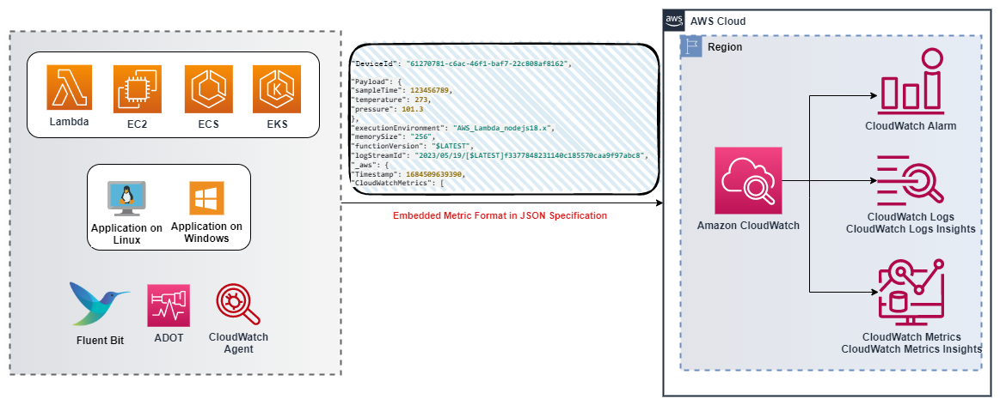

# CloudWatch Embedded Metric Format

## परिचय

CloudWatch Embedded Metric Format (EMF) ग्राहकों को complex high-cardinality application data को logs के रूप में Amazon CloudWatch में ingest करने और actionable metrics generate करने में सक्षम बनाता है। Embedded Metric Format के साथ ग्राहकों को अपने environments में insights प्राप्त करने के लिए complex architecture पर निर्भर होने या किसी third party tools का उपयोग करने की आवश्यकता नहीं होती। हालांकि इस feature का उपयोग सभी environments में किया जा सकता है, यह विशेष रूप से उन workloads में उपयोगी है जिनमें ephemeral resources हैं जैसे AWS Lambda functions या Amazon Elastic Container Service (Amazon ECS), Amazon Elastic Kubernetes Service (Amazon EKS), या EC2 पर Kubernetes में containers। Embedded Metric Format ग्राहकों को अलग code instrument या maintain किए बिना आसानी से custom metrics बनाने की सुविधा देता है, साथ ही log data पर powerful analytical capabilities प्रदान करता है।

## Embedded Metric Format (EMF) logs कैसे काम करते हैं

Amazon EC2, On-premise Servers, Amazon Elastic Container Service (Amazon ECS), Amazon Elastic Kubernetes Service (Amazon EKS), या EC2 पर Kubernetes में containers जैसे Compute environments CloudWatch Agent के माध्यम से Embedded Metric Format (EMF) logs generate और Amazon CloudWatch को भेज सकते हैं।

AWS Lambda ग्राहकों को किसी custom code, blocking network calls या किसी third party software पर निर्भर किए बिना आसानी से custom metrics generate करने की अनुमति देता है और Embedded Metric Format (EMF) logs को Amazon CloudWatch में ingest करता है।

ग्राहक [EMF specification](https://docs.aws.amazon.com/AmazonCloudWatch/latest/monitoring/CloudWatch_Embedded_Metric_Format_Specification.html) के अनुरूप structured logs publish करते समय special header declaration प्रदान करने की आवश्यकता के बिना detailed log event data के साथ custom metrics asynchronously embed कर सकते हैं। CloudWatch स्वचालित रूप से custom metrics extract करता है ताकि ग्राहक real-time incident detection के लिए visualize और alarm सेट कर सकें। extracted metrics से जुड़े detailed log events और high-cardinality context को operational events के root causes में deep insights प्रदान करने के लिए CloudWatch Logs Insights का उपयोग करके query किया जा सकता है।

[Fluent Bit](https://docs.fluentbit.io/manual/pipeline/outputs/cloudwatch) के लिए Amazon CloudWatch output plugin ग्राहकों को Amazon CloudWatch service में metrics और logs data ingest करने की अनुमति देता है जिसमें [Embedded Metric Format](https://github.com/aws/aws-for-fluent-bit) (EMF) के लिए support शामिल है।



## Embedded Metric Format (EMF) logs कब उपयोग करें

परंपरागत रूप से, monitoring को तीन श्रेणियों में संरचित किया गया है। पहली श्रेणी application का classic health check है। दूसरी श्रेणी 'metrics' है, जिसके माध्यम से ग्राहक counters, timers, और gauges जैसे models का उपयोग करके अपने application को instrument करते हैं। तीसरी श्रेणी 'logs' है, जो application की overall observability के लिए अमूल्य हैं। Logs ग्राहकों को उनके application के व्यवहार के बारे में निरंतर जानकारी प्रदान करते हैं। अब, ग्राहकों के पास Embedded Metric Format (EMF) logs के माध्यम से data granularity या richness में बलिदान किए बिना अपने application की instrumentation को unify और simplify करते हुए incredible analytical capabilities प्राप्त करके अपने application को observe करने के तरीके में काफी सुधार करने का एक तरीका है।

[Embedded Metric Format (EMF) logs](https://aws.amazon.com/blogs/mt/enhancing-workload-observability-using-amazon-cloudwatch-embedded-metric-format/) उन environments के लिए ideal है जो high cardinality application data generate करते हैं, जो metric dimensions बढ़ाए बिना EMF logs का हिस्सा हो सकते हैं। यह अभी भी ग्राहकों को CloudWatch Logs Insights और CloudWatch Metrics Insights के माध्यम से EMF logs query करके application data को slice और dice करने की अनुमति देता है बिना हर attribute को metric dimension के रूप में रखने की आवश्यकता के।

[लाखों Telco या IoT devices से telemetry data aggregate](https://aws.amazon.com/blogs/mt/how-bt-uses-amazon-cloudwatch-to-monitor-millions-of-devices/) करने वाले ग्राहकों को अपने devices के performance में insights और devices द्वारा report की जाने वाली unique telemetry में quickly deep dive करने की क्षमता चाहिए। उन्हें quality service प्रदान करने के लिए humongous data खोजे बिना समस्याओं का आसान और तेज troubleshoot भी करना होता है। Embedded Metric Format (EMF) logs का उपयोग करके ग्राहक metrics और logs को single entity में combine करके और cost efficiency और बेहतर performance के साथ troubleshooting में सुधार करके large scale observability accomplish कर सकते हैं।

## Embedded Metric Format (EMF) logs Generate करना

EMF logs generate करने के लिए निम्नलिखित methods का उपयोग किया जा सकता है

1. Open-sourced client libraries का उपयोग करके agent (जैसे [CloudWatch](https://docs.aws.amazon.com/AmazonCloudWatch/latest/monitoring/CloudWatch_Embedded_Metric_Format_Generation_CloudWatch_Agent.html) या Fluent-Bit या Firelens) के माध्यम से EMF logs generate और भेजें।

   - Open-sourced client libraries निम्नलिखित languages में उपलब्ध हैं जिनका उपयोग EMF logs बनाने के लिए किया जा सकता है
     - [Node.Js](https://github.com/awslabs/aws-embedded-metrics-node)
     - [Python](https://github.com/awslabs/aws-embedded-metrics-python)
     - [Java](https://github.com/awslabs/aws-embedded-metrics-java)
     - [C#](https://github.com/awslabs/aws-embedded-metrics-dotnet)
   - EMF logs AWS Distro for OpenTelemetry (ADOT) का उपयोग करके generate किए जा सकते हैं। ADOT Cloud Native Computing Foundation (CNCF) के हिस्से OpenTelemetry project का एक सुरक्षित, production-ready, AWS-supported distribution है। OpenTelemetry एक open-source initiative है जो application monitoring के लिए APIs, libraries, और agents प्रदान करता है distributed traces, logs और metrics collect करने के लिए और vendor-specific formats के बीच boundaries और restrictions हटाता है। इसके लिए दो components आवश्यक हैं, एक OpenTelemetry compliant data source और [CloudWatch EMF](https://aws-otel.github.io/docs/getting-started/cloudwatch-metrics#cloudwatch-emf-exporter-awsemf) logs के साथ उपयोग के लिए enabled [ADOT Collector](https://github.com/open-telemetry/opentelemetry-collector-contrib/tree/main/exporter/awsemfexporter)।

2. [JSON format में defined specification](https://docs.aws.amazon.com/AmazonCloudWatch/latest/monitoring/CloudWatch_Embedded_Metric_Format_Specification.html) के अनुरूप manually constructed logs, [CloudWatch agent](https://docs.aws.amazon.com/AmazonCloudWatch/latest/monitoring/CloudWatch_Embedded_Metric_Format_Generation_CloudWatch_Agent.html) या [PutLogEvents API](https://docs.aws.amazon.com/AmazonCloudWatch/latest/monitoring/CloudWatch_Embedded_Metric_Format_Generation_PutLogEvents.html) के माध्यम से CloudWatch को भेजे जा सकते हैं।

## CloudWatch console में Embedded Metric Format logs देखना

Embedded Metric Format (EMF) logs generate करने के बाद जो metrics extract करते हैं, ग्राहक [उन्हें CloudWatch console में](https://docs.aws.amazon.com/AmazonCloudWatch/latest/monitoring/CloudWatch_Embedded_Metric_Format_View.html) Metrics के तहत देख सकते हैं। Embedded metrics में logs generate करते समय specify किए गए dimensions होते हैं। Client libraries का उपयोग करके generate किए गए embedded metrics में ServiceType, ServiceName, LogGroup default dimensions के रूप में होते हैं।

- **ServiceName**: service का नाम override होता है, हालांकि जिन services के लिए name infer नहीं किया जा सकता (जैसे EC2 पर चलने वाला Java process) वहां Unknown का default value उपयोग होता है यदि explicitly set नहीं किया गया।
- **ServiceType**: service का type override होता है, हालांकि जिन services के लिए type infer नहीं किया जा सकता (जैसे EC2 पर चलने वाला Java process) वहां Unknown का default value उपयोग होता है यदि explicitly set नहीं किया गया।
- **LogGroupName**: ग्राहक optionally destination log group configure कर सकते हैं जहां metrics deliver किए जाएं, agent-based platforms के लिए। यह value library से agent को Embedded Metric payload में pass की जाती है। यदि LogGroup प्रदान नहीं किया गया, तो default value service name से derive होगी: -metrics
- **LogStreamName**: ग्राहक optionally destination log stream configure कर सकते हैं जहां metrics deliver किए जाएं, agent-based platforms के लिए। यह value library से agent को Embedded Metric payload में pass की जाएगी। यदि LogStreamName प्रदान नहीं किया गया, तो default value agent द्वारा derive की जाएगी (यह संभवतः hostname होगा)।
- **NameSpace**: CloudWatch namespace override करता है। यदि set नहीं किया गया, तो aws-embedded-metrics का default value उपयोग होता है।

CloudWatch Console logs में एक सैंपल EMF log नीचे दिखाया गया है

```json
2023-05-19T15:20:39.391Z 238196b6-c8da-4341-a4b7-0c322e0ef5bb INFO
{
    "LogGroup": "emfTestFunction",
    "ServiceName": "emfTestFunction",
    "ServiceType": "AWS::Lambda::Function",
    "Service": "Aggregator",
    "AccountId": "XXXXXXXXXXXX",
    "RequestId": "422b1569-16f6-4a03-b8f0-fe3fd9b100f8",
    "DeviceId": "61270781-c6ac-46f1-baf7-22c808af8162",
    "Payload": {
        "sampleTime": 123456789,
        "temperature": 273,
        "pressure": 101.3
    },
    "executionEnvironment": "AWS_Lambda_nodejs18.x",
    "memorySize": "256",
    "functionVersion": "$LATEST",
    "logStreamId": "2023/05/19/[$LATEST]f3377848231140c185570caa9f97abc8",
    "_aws": {
        "Timestamp": 1684509639390,
        "CloudWatchMetrics": [
            {
                "Dimensions": [
                    [
                        "LogGroup",
                        "ServiceName",
                        "ServiceType",
                        "Service"
                    ]
                ],
                "Metrics": [
                    {
                        "Name": "ProcessingLatency",
                        "Unit": "Milliseconds"
                    }
                ],
                "Namespace": "aws-embedded-metrics"
            }
        ]
    },
    "ProcessingLatency": 100
}
```

उसी EMF log के लिए, extracted metrics नीचे दिखाई गई हैं, जिन्हें **CloudWatch Metrics** में query किया जा सकता है।


ग्राहक operational events के root causes में deep insights प्राप्त करने के लिए **CloudWatch Logs Insights** का उपयोग करके extracted metrics से जुड़े detailed log events को query कर सकते हैं। EMF logs से metrics extract करने का एक फायदा यह है कि ग्राहक unique metric (metric name plus unique dimension set) और metric values द्वारा logs filter कर सकते हैं, ताकि aggregated metric value में योगदान देने वाली events पर context प्राप्त किया जा सके।

ऊपर चर्चित उसी EMF logs के लिए, ProcessingLatency metric और Service dimension के साथ impacted request id या device id प्राप्त करने के लिए एक example query CloudWatch Logs Insights में नीचे दिखाया गया है।

```json
filter ProcessingLatency < 200 and Service = "Aggregator"
| fields @requestId, @ingestionTime, @DeviceId
```


## EMF logs से बनाई गई metrics पर Alarms

[EMF द्वारा generate की गई metrics पर alarms](https://docs.aws.amazon.com/AmazonCloudWatch/latest/monitoring/CloudWatch_Embedded_Metric_Format_Alarms.html) बनाना किसी भी अन्य metrics पर alarms बनाने के समान pattern का पालन करता है। यहां ध्यान देने वाली मुख्य बात यह है कि EMF metric generation log publishing flow पर निर्भर करता है, क्योंकि CloudWatch Logs EMF logs को process करता है और metrics transform करता है। इसलिए logs को समय पर publish करना महत्वपूर्ण है ताकि metric datapoints उस समय अवधि के भीतर बनाए जाएं जिसमें alarms evaluate किए जाते हैं।

ऊपर चर्चित उसी EMF logs के लिए, ProcessingLatency metric को threshold के साथ datapoint के रूप में उपयोग करके एक example alarm बनाया गया है और नीचे दिखाया गया है।


## EMF Logs की नवीनतम विशेषताएं

ग्राहक [PutLogEvents API](https://docs.aws.amazon.com/AmazonCloudWatch/latest/monitoring/CloudWatch_Embedded_Metric_Format_Generation_PutLogEvents.html) का उपयोग करके CloudWatch Logs को EMF logs भेज सकते हैं और optionally HTTP header `x-amzn-logs-format: json/emf` शामिल कर सकते हैं ताकि CloudWatch Logs को instruct किया जा सके कि metrics extract किए जाने चाहिए, लेकिन यह अब आवश्यक नहीं है।

Amazon CloudWatch Embedded Metric Format (EMF) का उपयोग करके structured logs से 1 second granularity तक [high resolution metric extraction](https://aws.amazon.com/about-aws/whats-new/2023/02/amazon-cloudwatch-high-resolution-metric-extraction-structured-logs/) support करता है। ग्राहक EMF specification logs में 1 या 60 (default) value के साथ optional [StorageResolution](https://docs.aws.amazon.com/AmazonCloudWatch/latest/monitoring/cloudwatch_concepts.html#Resolution_definition) parameter प्रदान कर सकते हैं जो metric की desired resolution (seconds में) indicate करता है। ग्राहक EMF के माध्यम से standard resolution (60 seconds) और high resolution (1 second) दोनों metrics publish कर सकते हैं, जिससे उनके applications के health और performance में granular visibility मिलती है।

Amazon CloudWatch Embedded Metric Format (EMF) में [errors में enhanced visibility](https://aws.amazon.com/about-aws/whats-new/2023/01/amazon-cloudwatch-enhanced-error-visibility-embedded-metric-format-emf/) दो error metrics ([EMFValidationErrors और EMFParsingErrors](https://docs.aws.amazon.com/AmazonCloudWatch/latest/logs/CloudWatch-Logs-Monitoring-CloudWatch-Metrics.html)) के साथ प्रदान करता है। यह enhanced visibility ग्राहकों को EMF leverage करते समय errors को quickly identify और remediate करने में मदद करती है, जिससे instrumentation process simplify होती है।

modern applications को manage करने की बढ़ती complexity के साथ, ग्राहकों को custom metrics define और analyze करते समय अधिक flexibility की आवश्यकता है। इसलिए metric dimensions की maximum संख्या 10 से बढ़ाकर 30 कर दी गई है। ग्राहक [30 dimensions तक EMF logs का उपयोग करके](https://aws.amazon.com/about-aws/whats-new/2022/08/amazon-cloudwatch-metrics-increases-throughput/) custom metrics बना सकते हैं।

## अतिरिक्त संदर्भ:

- One Observability Workshop पर [Embedded Metric Format with an AWS Lambda function](https://catalog.workshops.aws/observability/en-US/aws-native/metrics/emf/clientlibrary) NodeJS Library का उपयोग करके सैंपल।
- Serverless Observability Workshop पर [Async metrics using Embedded Metrics Format](https://serverless-observability.workshop.aws/en/030_cloudwatch/async_metrics_emf.html) (EMF)
- [PutLogEvents API का उपयोग करके Java code sample](https://catalog.workshops.aws/observability/en-US/aws-native/metrics/emf/putlogevents) CloudWatch Logs को EMF logs भेजने के लिए
- Blog article: [Lowering costs and focusing on our customers with Amazon CloudWatch embedded custom metrics](https://aws.amazon.com/blogs/mt/lowering-costs-and-focusing-on-our-customers-with-amazon-cloudwatch-embedded-custom-metrics/)
