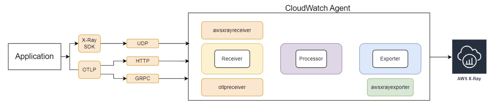

# AWS X-Ray के साथ EC2 ट्रेसिंग
<!--: Enhancing Observability for Applications Running on Instances-->

क्लाउड कंप्यूटिंग की दुनिया में, Amazon Elastic Compute Cloud (EC2) विभिन्न प्रकार के एप्लिकेशन चलाने के लिए एक अत्यधिक स्केलेबल और लचीला प्लेटफ़ॉर्म प्रदान करता है। हालांकि, जैसे-जैसे एप्लिकेशन अधिक वितरित और जटिल होते जाते हैं, इन एप्लिकेशन की विश्वसनीयता, प्रदर्शन और दक्षता सुनिश्चित करने के लिए observability महत्वपूर्ण हो जाती है।

AWS X-Ray EC2 instances पर चलने वाले एप्लिकेशन के लिए observability बढ़ाने वाली एक शक्तिशाली डिस्ट्रिब्यूटेड ट्रेसिंग सेवा प्रदान करके इस चुनौती का समाधान करता है। अपने EC2-होस्टेड एप्लिकेशन के साथ AWS X-Ray को एकीकृत करके, आप कई लाभ और क्षमताएं अनलॉक कर सकते हैं जो आपको अपने एप्लिकेशन के व्यवहार और प्रदर्शन में गहरी अंतर्दृष्टि प्राप्त करने में सक्षम बनाती हैं:

1. **एंड-टू-एंड दृश्यता**: AWS X-Ray EC2 instances और अन्य AWS सेवाओं पर चलने वाले आपके एप्लिकेशन के माध्यम से बहने वाले अनुरोधों को ट्रेस करता है, एक अनुरोध के पूर्ण जीवनचक्र का एंड-टू-एंड दृश्य प्रदान करता है। यह दृश्यता आपको विभिन्न घटकों के बीच इंटरैक्शन को समझने और संभावित बाधाओं या समस्याओं को अधिक प्रभावी ढंग से पहचानने में मदद करती है।

2. **प्रदर्शन विश्लेषण**: X-Ray आपके EC2-होस्टेड एप्लिकेशन के लिए विस्तृत प्रदर्शन मेट्रिक्स जैसे रिक्वेस्ट लेटेंसी, एरर रेट और रिसोर्स उपयोग एकत्र करता है। ये मेट्रिक्स आपको अपने एप्लिकेशन के प्रदर्शन का विश्लेषण करने, प्रदर्शन हॉटस्पॉट की पहचान करने और रिसोर्स आवंटन अनुकूलित करने की अनुमति देती हैं।

3. **डिस्ट्रिब्यूटेड ट्रेसिंग**: आधुनिक वितरित आर्किटेक्चर में, अनुरोध अक्सर कई सेवाओं और घटकों को पार करते हैं। AWS X-Ray इन वितरित ट्रेसेस का एकीकृत दृश्य प्रदान करता है, जिससे आप विभिन्न घटकों के बीच इंटरैक्शन को समझ सकते हैं और अपने पूरे एप्लिकेशन में प्रदर्शन डेटा को सहसंबद्ध कर सकते हैं।

4. **सर्विस मैप विज़ुअलाइज़ेशन**: X-Ray डायनामिक सर्विस मैप उत्पन्न करता है जो आपके एप्लिकेशन के घटकों और उनके इंटरैक्शन का दृश्य प्रतिनिधित्व प्रदान करता है। ये सर्विस मैप आपको अपने एप्लिकेशन आर्किटेक्चर की जटिलता को समझने और अनुकूलन या रीफैक्टरिंग के संभावित क्षेत्रों की पहचान करने में मदद करते हैं।

5. **AWS सेवाओं के साथ एकीकरण**: AWS X-Ray AWS Lambda, API Gateway, Amazon ECS, और Amazon EKS सहित AWS सेवाओं की विस्तृत श्रृंखला के साथ सहजता से एकीकृत होता है। यह एकीकरण आपको कई सेवाओं में अनुरोधों को ट्रेस करने और अन्य AWS सेवाओं से लॉग्स और मेट्रिक्स के साथ प्रदर्शन डेटा को सहसंबद्ध करने की अनुमति देता है।

6. **कस्टम इंस्ट्रूमेंटेशन**: जबकि AWS X-Ray कई AWS सेवाओं के लिए आउट-ऑफ-द-बॉक्स इंस्ट्रूमेंटेशन प्रदान करता है, आप AWS X-Ray SDKs का उपयोग करके अपने कस्टम एप्लिकेशन और सेवाओं को भी इंस्ट्रूमेंट कर सकते हैं। यह क्षमता आपको अपने EC2-होस्टेड एप्लिकेशन के भीतर अपने कस्टम कोड के प्रदर्शन को ट्रेस और विश्लेषण करने में सक्षम बनाती है, जो आपके एप्लिकेशन के व्यवहार का अधिक व्यापक दृश्य प्रदान करती है।

*चित्र 1: EC2 से चलने वाले एप्लिकेशन X-Ray को ट्रेसेस भेज रहे हैं*

अपने EC2-होस्टेड एप्लिकेशन की बढ़ी हुई observability के लिए AWS X-Ray का लाभ उठाने के लिए, आपको इन सामान्य चरणों का पालन करना होगा:

1. **कस्टम एप्लिकेशन इंस्ट्रूमेंट करें**: अपने EC2 instances पर चलने वाले एप्लिकेशन को इंस्ट्रूमेंट करने और X-Ray को ट्रेस डेटा उत्सर्जित करने के लिए AWS X-Ray SDKs का उपयोग करें।

2. **इंस्ट्रूमेंट किए गए एप्लिकेशन डिप्लॉय करें**: अपने इंस्ट्रूमेंट किए गए एप्लिकेशन को अपने EC2 instances पर डिप्लॉय करें।

3. **ट्रेस डेटा विश्लेषण करें**: ट्रेस डेटा का विश्लेषण करने, सर्विस मैप देखने, और अपने EC2-होस्टेड एप्लिकेशन के भीतर प्रदर्शन समस्याओं या बाधाओं की जांच करने के लिए AWS X-Ray कंसोल या APIs का उपयोग करें।

4. **अलर्ट और नोटिफिकेशन सेट करें**: अपने EC2-होस्टेड एप्लिकेशन में प्रदर्शन गिरावट या विसंगतियों के लिए अलर्ट प्राप्त करने के लिए X-Ray मेट्रिक्स के आधार पर CloudWatch अलार्म और नोटिफिकेशन कॉन्फ़िगर करें।

5. **अन्य Observability टूल्स के साथ एकीकृत करें**: अपने एप्लिकेशन के प्रदर्शन, लॉग्स और मेट्रिक्स का व्यापक दृश्य प्राप्त करने के लिए AWS X-Ray को अन्य observability टूल्स जैसे AWS CloudWatch Logs, Amazon CloudWatch Metrics, और AWS Distro for OpenTelemetry के साथ संयोजित करें।

जबकि AWS X-Ray EC2-होस्टेड एप्लिकेशन के लिए शक्तिशाली ट्रेसिंग क्षमताएं प्रदान करता है, ट्रेस डेटा वॉल्यूम और लागत प्रबंधन जैसी संभावित चुनौतियों पर विचार करना महत्वपूर्ण है। जैसे-जैसे आपके एप्लिकेशन स्केल होते हैं और अधिक ट्रेस डेटा उत्पन्न करते हैं, आपको लागत को प्रभावी ढंग से प्रबंधित करने के लिए सैंपलिंग रणनीतियों को लागू करने या ट्रेस डेटा रिटेंशन पॉलिसियों को समायोजित करने की आवश्यकता हो सकती है।

इसके अतिरिक्त, आपके ट्रेस डेटा के लिए उचित एक्सेस कंट्रोल और डेटा सुरक्षा सुनिश्चित करना महत्वपूर्ण है। AWS X-Ray ट्रेस डेटा के लिए रेस्ट और ट्रांज़िट में एन्क्रिप्शन प्रदान करता है, साथ ही आपके ट्रेस डेटा की गोपनीयता और अखंडता की रक्षा के लिए विस्तृत एक्सेस कंट्रोल तंत्र प्रदान करता है।

निष्कर्ष में, EC2 instances पर चलने वाले अपने एप्लिकेशन के साथ AWS X-Ray को एकीकृत करना क्लाउड-आधारित एप्लिकेशन के लिए observability बढ़ाने का एक शक्तिशाली दृष्टिकोण है। अनुरोधों को एंड-टू-एंड ट्रेस करके और विस्तृत प्रदर्शन मेट्रिक्स प्रदान करके, AWS X-Ray आपको अधिक प्रभावी ढंग से समस्याओं की पहचान और ट्रबलशूट करने, रिसोर्स उपयोग अनुकूलित करने, और अपने एप्लिकेशन के व्यवहार और प्रदर्शन में गहरी अंतर्दृष्टि प्राप्त करने में सशक्त बनाता है। AWS X-Ray और अन्य AWS observability सेवाओं के एकीकरण के साथ, आप क्लाउड में अत्यधिक अवलोकन योग्य, विश्वसनीय और उच्च-प्रदर्शन एप्लिकेशन बना और बनाए रख सकते हैं।
