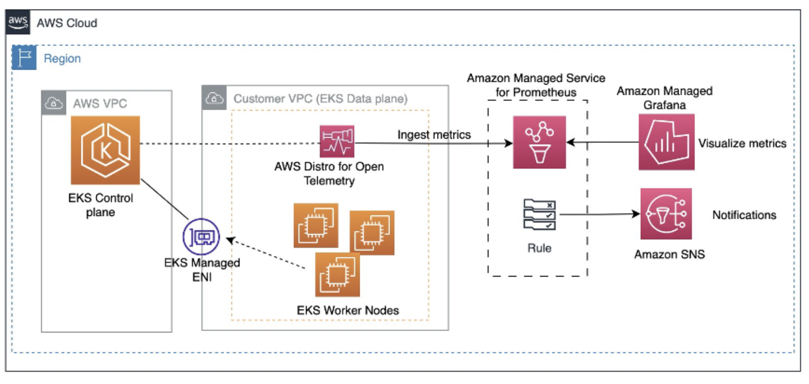

# EKS से Prometheus में मेट्रिक्स पुश करना

Amazon Elastic Kubernetes Service (EKS) पर कंटेनराइज़्ड वर्कलोड चलाते समय, आप अपने एप्लिकेशन और इंफ्रास्ट्रक्चर से मेट्रिक्स एकत्र और एनालिसिस करने के लिए AWS Managed Prometheus (AMP) का लाभ उठा सकते हैं। AMP एक पूर्ण रूप से प्रबंधित Prometheus-संगत मॉनिटरिंग समाधान प्रदान करके Prometheus-संगत मॉनिटरिंग के डिप्लॉयमेंट और प्रबंधन को सरल बनाता है।

अपने EKS कंटेनराइज़्ड वर्कलोड से AMP में मेट्रिक्स पुश करने के लिए, आप Managed Prometheus Collector कॉन्फ़िगरेशन का उपयोग कर सकते हैं। Managed Prometheus Collector AMP का एक घटक है जो आपके एप्लिकेशन और सेवाओं से मेट्रिक्स स्क्रैप करता है और उन्हें स्टोरेज और एनालिसिस के लिए AMP वर्कस्पेस में भेजता है।


*चित्र 1: EKS से AMP में मेट्रिक्स भेजना*

## Managed Prometheus Collector कॉन्फ़िगर करना

1. **AMP Workspace सक्षम करें**: सबसे पहले, सुनिश्चित करें कि आपके AWS अकाउंट में एक AMP वर्कस्पेस बनाया गया है। यदि आपने अभी तक AMP वर्कस्पेस सेट नहीं किया है, तो एक बनाने के लिए AWS डॉक्यूमेंटेशन का पालन करें।

2. **Managed Prometheus Collector कॉन्फ़िगर करें**: अपने AMP वर्कस्पेस के भीतर, "Managed Prometheus Collectors" अनुभाग पर जाएं और एक नया collector कॉन्फ़िगरेशन बनाएं।

3. **Scrape कॉन्फ़िगरेशन परिभाषित करें**: Collector कॉन्फ़िगरेशन में, उन targets को निर्दिष्ट करें जिनसे collector को मेट्रिक्स स्क्रैप करना चाहिए। EKS वर्कलोड के लिए, आप एक Kubernetes service discovery कॉन्फ़िगरेशन परिभाषित कर सकते हैं जो collector को आपके Kubernetes Pods और Services से गतिशील रूप से मेट्रिक्स खोजने और स्क्रैप करने की अनुमति देता है।

  Kubernetes service discovery कॉन्फ़िगरेशन का उदाहरण:

  ```yaml
  kubernetes_sd_configs:
    - role: pod
      namespaces:
        names:
          - namespace1
          - namespace2
```          
यह कॉन्फ़िगरेशन collector को namespace1 और namespace2 Kubernetes namespaces में चल रहे Pods से मेट्रिक्स स्क्रैप करने का निर्देश देता है।

4. **Prometheus Annotations कॉन्फ़िगर करें**: अपने कंटेनराइज़्ड वर्कलोड से मेट्रिक संग्रह सक्षम करने के लिए, आपको अपने Kubernetes Pods या Services को उचित Prometheus annotations के साथ एनोटेट करना होगा। ये annotations मेट्रिक्स endpoint और अन्य कॉन्फ़िगरेशन सेटिंग्स के बारे में जानकारी प्रदान करते हैं।
Prometheus annotations का उदाहरण:
```yaml
annotations:
  prometheus.io/scrape: "true"
  prometheus.io/port: "8080"
  prometheus.io/path: "/metrics"
```  
ये annotations इंगित करते हैं कि Prometheus collector को Pod या Service के port 8080 पर /metrics endpoint से मेट्रिक्स स्क्रैप करना चाहिए।

5. **इंस्ट्रूमेंटेशन के साथ वर्कलोड डिप्लॉय करें**: अपने कंटेनराइज़्ड वर्कलोड को EKS पर डिप्लॉय करें, यह सुनिश्चित करते हुए कि वे उचित मेट्रिक्स endpoints को एक्सपोज़ करते हैं और आवश्यक Prometheus annotations शामिल करते हैं। आप अपने EKS वर्कलोड को डिप्लॉय और प्रबंधित करने के लिए Minikube, Helm, या AWS Cloud Development Kit (CDK) जैसे टूल्स का उपयोग कर सकते हैं।

6. **मेट्रिक संग्रह सत्यापित करें**: एक बार Managed Prometheus Collector कॉन्फ़िगर हो जाने और आपके वर्कलोड डिप्लॉय हो जाने के बाद, आपको AMP वर्कस्पेस में एकत्रित मेट्रिक्स दिखाई देने चाहिए। आप अपने EKS वर्कलोड से मेट्रिक्स का अन्वेषण और विज़ुअलाइज़ेशन करने के लिए AMP query editor का उपयोग कर सकते हैं।

## अतिरिक्त विचार

- प्रमाणीकरण और प्राधिकरण: AMP आपके मॉनिटरिंग डेटा तक सुरक्षित पहुंच के लिए IAM roles और service accounts सहित विभिन्न प्रमाणीकरण और प्राधिकरण तंत्रों का समर्थन करता है।

- AWS ऑब्ज़र्वेबिलिटी सेवाओं के साथ एकीकरण: आप अपने AWS एनवायरनमेंट में व्यापक ऑब्ज़र्वेबिलिटी के लिए AMP को अन्य AWS ऑब्ज़र्वेबिलिटी सेवाओं जैसे AWS CloudWatch और AWS X-Ray के साथ एकीकृत कर सकते हैं।

AMP में Managed Prometheus Collector का लाभ उठाकर, आप अंतर्निहित Prometheus इंफ्रास्ट्रक्चर को प्रबंधित और स्केल करने की आवश्यकता के बिना अपने EKS कंटेनराइज़्ड वर्कलोड से कुशलतापूर्वक मेट्रिक्स एकत्र और एनालिसिस कर सकते हैं। AMP आपके EKS एप्लिकेशन और इंफ्रास्ट्रक्चर की मॉनिटरिंग के लिए एक पूर्ण रूप से प्रबंधित और स्केलेबल समाधान प्रदान करता है।
