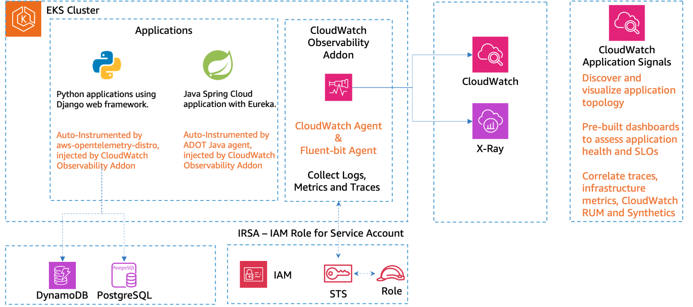

# Application Signals के साथ APM

आधुनिक एप्लिकेशन विकास की लगातार विकसित हो रही दुनिया में, एक सहज उपयोगकर्ता अनुभव प्रदान करने और व्यावसायिक निरंतरता बनाए रखने के लिए इष्टतम प्रदर्शन सुनिश्चित करना और सर्विस लेवल ऑब्जेक्टिव्स (SLOs) को पूरा करना महत्वपूर्ण है। Amazon CloudWatch Application Signals, एक OpenTelemetry (OTel) संगत एप्लिकेशन परफॉर्मेंस मॉनिटरिंग (APM) फीचर, AWS पर चलने वाले एप्लिकेशन की मॉनिटरिंग और ट्रबलशूटिंग के तरीके में क्रांति लाता है।

CloudWatch Application Signals मेट्रिक्स, ट्रेसेस, लॉग्स, रियल-यूज़र मॉनिटरिंग और सिंथेटिक मॉनिटरिंग सहित कई स्रोतों से टेलीमेट्री डेटा को सहजता से सहसंबद्ध करके एप्लिकेशन परफॉर्मेंस मॉनिटरिंग के लिए एक समग्र दृष्टिकोण अपनाता है। यह एकीकृत दृष्टिकोण संगठनों को अपने एप्लिकेशन के प्रदर्शन में व्यापक अंतर्दृष्टि प्राप्त करने, समस्याओं के मूल कारणों की पहचान करने और संभावित व्यवधानों को सक्रिय रूप से संबोधित करने में सक्षम बनाता है।

CloudWatch Application Signals के प्रमुख लाभों में से एक इसकी स्वचालित इंस्ट्रूमेंटेशन और ट्रैकिंग क्षमताएं हैं। बिना किसी मैनुअल प्रयास या कस्टम कोड की आवश्यकता के, Application Signals एक पूर्व-निर्मित, मानकीकृत डैशबोर्ड प्रदान करता है जो एप्लिकेशन प्रदर्शन के लिए सबसे महत्वपूर्ण मेट्रिक्स प्रदर्शित करता है - वॉल्यूम, उपलब्धता, लेटेंसी, फॉल्ट और एरर - AWS पर चलने वाले प्रत्येक एप्लिकेशन के लिए। यह सुव्यवस्थित दृष्टिकोण कस्टम डैशबोर्ड की आवश्यकता को समाप्त करता है, जिससे सर्विस ऑपरेटर अपने परिभाषित SLOs के विरुद्ध एप्लिकेशन स्वास्थ्य और प्रदर्शन का तुरंत आकलन कर सकते हैं।

*चित्र 1: Cloudwatch Application Signals मेट्रिक्स, लॉग्स और ट्रेसेस भेज रहा है*

CloudWatch Application Signals संगठनों को निम्नलिखित क्षमताओं से सशक्त बनाता है:

1. **व्यापक एप्लिकेशन परफॉर्मेंस मॉनिटरिंग**: Application Signals मेट्रिक्स, ट्रेसेस, लॉग्स, रियल-यूज़र मॉनिटरिंग और सिंथेटिक मॉनिटरिंग से अंतर्दृष्टि को मिलाकर एप्लिकेशन प्रदर्शन का एक एकीकृत दृश्य प्रदान करता है। यह समग्र दृष्टिकोण संगठनों को प्रदर्शन बाधाओं की पहचान करने, मूल कारणों का पता लगाने और इष्टतम एप्लिकेशन प्रदर्शन सुनिश्चित करने के लिए सक्रिय उपाय करने में सक्षम बनाता है।

2. **स्वचालित इंस्ट्रूमेंटेशन और ट्रैकिंग**: बिना किसी मैनुअल प्रयास या कस्टम कोड की आवश्यकता के, Application Signals स्वचालित रूप से परिभाषित SLOs के विरुद्ध एप्लिकेशन प्रदर्शन को इंस्ट्रूमेंट और ट्रैक करता है। यह सुव्यवस्थित दृष्टिकोण मैनुअल इंस्ट्रूमेंटेशन और कॉन्फ़िगरेशन से जुड़े ओवरहेड को कम करता है, जिससे संगठन एप्लिकेशन विकास और अनुकूलन पर ध्यान केंद्रित कर सकते हैं।

3. **मानकीकृत डैशबोर्ड और विज़ुअलाइज़ेशन**: Application Signals एक पूर्व-निर्मित, मानकीकृत डैशबोर्ड प्रदान करता है जो वॉल्यूम, उपलब्धता, लेटेंसी, फॉल्ट और एरर सहित एप्लिकेशन प्रदर्शन के लिए सबसे महत्वपूर्ण मेट्रिक्स प्रदर्शित करता है। यह मानकीकृत दृश्य सर्विस ऑपरेटर्स को एप्लिकेशन स्वास्थ्य और प्रदर्शन का तुरंत आकलन करने में सक्षम बनाता है, जो सूचित निर्णय लेने और सक्रिय समस्या समाधान की सुविधा प्रदान करता है।

4. **सहज सहसंबंध और ट्रबलशूटिंग**: कई स्रोतों से टेलीमेट्री डेटा को सहसंबद्ध करके, Application Signals ट्रबलशूटिंग प्रक्रिया को सरल बनाता है। सर्विस ऑपरेटर प्रदर्शन समस्याओं या विसंगतियों के मूल कारण की पहचान करने के लिए सहसंबद्ध ट्रेसेस, लॉग्स और मेट्रिक्स में सहजता से ड्रिल डाउन कर सकते हैं, जिससे मीन टाइम टू रिज़ॉल्यूशन (MTTR) कम होता है और एप्लिकेशन व्यवधान न्यूनतम होते हैं।

5. **Container Insights के साथ एकीकरण**: कंटेनराइज़्ड वातावरण में चलने वाले एप्लिकेशन के लिए, CloudWatch Application Signals Container Insights के साथ सहजता से एकीकृत होता है, जिससे संगठन इंफ्रास्ट्रक्चर-संबंधित समस्याओं की पहचान कर सकते हैं जो एप्लिकेशन प्रदर्शन को प्रभावित कर सकती हैं, जैसे कंटेनर pods पर मेमोरी की कमी या उच्च CPU उपयोग।

एप्लिकेशन परफॉर्मेंस मॉनिटरिंग के लिए CloudWatch Application Signals का लाभ उठाने के लिए, संगठन इन सामान्य चरणों का पालन कर सकते हैं:

1. **Application Signals सक्षम करें**: AWS Management Console, AWS Command Line Interface (CLI), या AWS SDKs का उपयोग करके प्रोग्रामेटिक रूप से AWS पर चलने वाले अपने एप्लिकेशन के लिए CloudWatch Application Signals सक्षम करें।

2. **सर्विस लेवल ऑब्जेक्टिव्स (SLOs) परिभाषित करें**: व्यावसायिक आवश्यकताओं और ग्राहक अपेक्षाओं के अनुरूप अपने एप्लिकेशन के लिए वांछित SLOs स्थापित और कॉन्फ़िगर करें, जैसे लक्ष्य उपलब्धता, अधिकतम लेटेंसी, या एरर थ्रेशोल्ड।

3. **प्रदर्शन मॉनिटर और विश्लेषण करें**: परिभाषित SLOs के विरुद्ध एप्लिकेशन प्रदर्शन की मॉनिटरिंग के लिए Application Signals द्वारा प्रदान किए गए पूर्व-निर्मित, मानकीकृत डैशबोर्ड का उपयोग करें। प्रदर्शन समस्याओं या विसंगतियों की पहचान करने के लिए मेट्रिक्स, ट्रेसेस, लॉग्स, रियल-यूज़र मॉनिटरिंग और सिंथेटिक मॉनिटरिंग डेटा का विश्लेषण करें।

4. **ट्रबलशूट करें और समस्याएं हल करें**: प्रदर्शन समस्याओं या मूल कारणों की त्वरित पहचान और समाधान सक्षम करने के लिए सहसंबद्ध ट्रेसेस, लॉग्स और मेट्रिक्स में ड्रिल डाउन करने हेतु Application Signals की सहज सहसंबंध क्षमताओं का लाभ उठाएं।

5. **Container Insights के साथ एकीकृत करें (यदि लागू हो)**: कंटेनराइज़्ड एप्लिकेशन के लिए, एप्लिकेशन प्रदर्शन को प्रभावित करने वाली इंफ्रास्ट्रक्चर-संबंधित समस्याओं की पहचान करने के लिए CloudWatch Application Signals को Container Insights के साथ एकीकृत करें।

जबकि CloudWatch Application Signals शक्तिशाली एप्लिकेशन परफॉर्मेंस मॉनिटरिंग क्षमताएं प्रदान करता है, डेटा वॉल्यूम और लागत प्रबंधन जैसी संभावित चुनौतियों पर विचार करना महत्वपूर्ण है। जैसे-जैसे एप्लिकेशन जटिलता और स्केल बढ़ता है, उत्पन्न टेलीमेट्री डेटा की मात्रा काफी बढ़ सकती है, जो संभावित रूप से प्रदर्शन को प्रभावित कर सकती है और अतिरिक्त लागत लगा सकती है। एक कुशल और लागत-प्रभावी मॉनिटरिंग समाधान सुनिश्चित करने के लिए डेटा सैंपलिंग रणनीतियों, रिटेंशन पॉलिसियों और लागत अनुकूलन तकनीकों को लागू करना आवश्यक हो सकता है।

इसके अतिरिक्त, आपके एप्लिकेशन परफॉर्मेंस डेटा के लिए उचित एक्सेस कंट्रोल और डेटा सुरक्षा सुनिश्चित करना महत्वपूर्ण है। CloudWatch Application Signals विस्तृत एक्सेस कंट्रोल के लिए AWS Identity and Access Management (IAM) का लाभ उठाता है, और आपके एप्लिकेशन परफॉर्मेंस डेटा की गोपनीयता और अखंडता की रक्षा करते हुए, रेस्ट और ट्रांज़िट में टेलीमेट्री डेटा पर डेटा एन्क्रिप्शन लागू किया जाता है।

निष्कर्ष में, CloudWatch Application Signals AWS पर चलने वाले एप्लिकेशन के लिए एप्लिकेशन परफॉर्मेंस मॉनिटरिंग में क्रांति लाता है। स्वचालित इंस्ट्रूमेंटेशन, मानकीकृत डैशबोर्ड, और टेलीमेट्री डेटा के सहज सहसंबंध प्रदान करके, Application Signals संगठनों को एप्लिकेशन प्रदर्शन की सक्रिय मॉनिटरिंग, SLO अनुपालन सुनिश्चित करने, और प्रदर्शन समस्याओं को तेज़ी से ट्रबलशूट और हल करने में सशक्त बनाता है। अपनी एकीकरण क्षमताओं और OpenTelemetry संगतता के साथ, CloudWatch Application Signals क्लाउड में एप्लिकेशन परफॉर्मेंस मॉनिटरिंग के लिए एक व्यापक और भविष्य-सुरक्षित समाधान प्रदान करता है।
