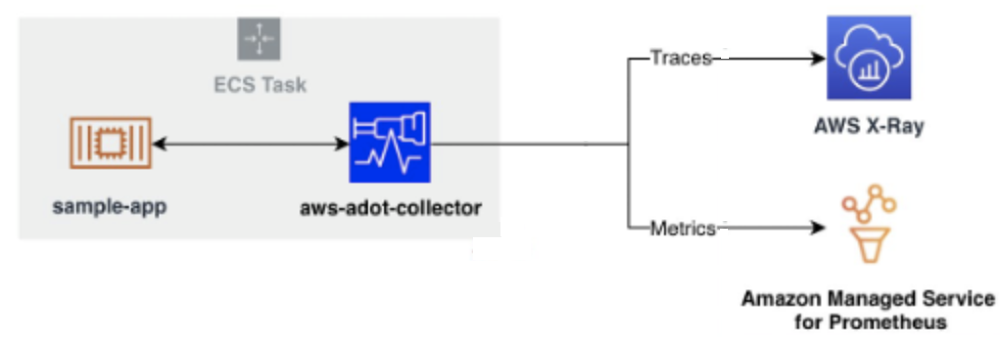

# ECS वर्कलोड की मॉनिटरिंग
<!--with ADOT, AWS X-Ray, and Amazon Managed Service for Prometheus-->

## परिचय

कंटेनराइज़्ड एप्लिकेशन की दुनिया में, विश्वसनीयता और प्रदर्शन बनाए रखने के लिए प्रभावी मॉनिटरिंग महत्वपूर्ण है। यह दस्तावेज़ Amazon Elastic Container Service (ECS) वर्कलोड के लिए एक उन्नत मॉनिटरिंग समाधान की रूपरेखा प्रस्तुत करता है, जो AWS Distro for OpenTelemetry (ADOT), AWS X-Ray, और Amazon Managed Service for Prometheus का लाभ उठाता है।

## आर्किटेक्चर अवलोकन

मॉनिटरिंग आर्किटेक्चर एक ECS task के चारों ओर केंद्रित है जो एप्लिकेशन और ADOT collector दोनों को होस्ट करता है। यह सेटअप सीधे एप्लिकेशन एनवायरनमेंट से व्यापक डेटा संग्रह को सक्षम बनाता है।

*चित्र 1: ECS से AMP और X-Ray में मेट्रिक्स भेजना*

## मुख्य घटक

### ECS Task
ECS task मूलभूत इकाई के रूप में कार्य करता है, जो एप्लिकेशन और मॉनिटरिंग घटकों को समाहित करता है।

### सैंपल एप्लिकेशन
ECS task के भीतर एक कंटेनराइज़्ड एप्लिकेशन चलता है, जो मॉनिटर किए जाने वाले वर्कलोड का प्रतिनिधित्व करता है।

### AWS Distro for OpenTelemetry (ADOT) Collector
एप्लिकेशन के साथ डिप्लॉय किया गया ADOT collector, टेलीमेट्री डेटा के लिए एक केंद्रीय एकीकरण बिंदु के रूप में कार्य करता है। यह एप्लिकेशन से मेट्रिक्स और ट्रेसेस दोनों एकत्र करता है।

### AWS X-Ray
X-Ray ADOT collector से ट्रेस डेटा प्राप्त करता है, जो अनुरोध प्रवाह और सेवा निर्भरताओं में विस्तृत अंतर्दृष्टि प्रदान करता है।

### Amazon Managed Service for Prometheus
यह सेवा ADOT collector द्वारा एकत्रित मेट्रिक्स को स्टोर और प्रबंधित करती है, जो मेट्रिक स्टोरेज और क्वेरी के लिए एक स्केलेबल समाधान प्रदान करती है।

## डेटा प्रवाह

1. सैंपल एप्लिकेशन अपने संचालन के दौरान टेलीमेट्री डेटा उत्पन्न करता है।
2. ADOT collector, उसी ECS task में चलता हुआ, एप्लिकेशन से इस डेटा को एकत्र करता है।
3. ट्रेस डेटा वितरित ट्रेसिंग एनालिसिस के लिए AWS X-Ray को अग्रेषित किया जाता है।
4. मेट्रिक्स स्टोरेज और बाद के एनालिसिस के लिए Amazon Managed Service for Prometheus को भेजी जाती हैं।

## लाभ

- **व्यापक मॉनिटरिंग**: मेट्रिक्स और ट्रेसेस दोनों को कैप्चर करता है, एप्लिकेशन प्रदर्शन का समग्र दृश्य प्रदान करता है।
- **स्केलेबिलिटी**: बड़ी मात्रा में टेलीमेट्री डेटा को संभालने के लिए प्रबंधित सेवाओं का लाभ उठाता है।
- **एकीकरण**: ECS और अन्य AWS सेवाओं के साथ सहजता से काम करता है।
- **कम परिचालन ओवरहेड**: प्रबंधित सेवाओं का उपयोग करता है, जिससे इंफ्रास्ट्रक्चर प्रबंधन की आवश्यकता कम होती है।

## कार्यान्वयन विचार

- X-Ray और Prometheus को डेटा ट्रांसमिशन की अनुमति देने के लिए ECS task के लिए उचित IAM roles और अनुमतियाँ कॉन्फ़िगर की जानी चाहिए।
- ECS task के भीतर रिसोर्स आवंटन में एप्लिकेशन और ADOT collector दोनों को शामिल किया जाना चाहिए।
- संपूर्ण ऑब्ज़र्वेबिलिटी समाधान के लिए मेट्रिक्स और ट्रेसेस के साथ लॉग संग्रह को लागू करने पर विचार करें।

## निष्कर्ष

यह आर्किटेक्चर ECS वर्कलोड के लिए एक मजबूत मॉनिटरिंग समाधान प्रदान करता है, जो OpenTelemetry की शक्ति को AWS प्रबंधित सेवाओं के साथ जोड़ता है। यह एप्लिकेशन प्रदर्शन और व्यवहार में गहरी अंतर्दृष्टि सक्षम करता है, जो कंटेनराइज़्ड एनवायरनमेंट के लिए तेज़ समस्या समाधान और सूचित निर्णय लेने की सुविधा प्रदान करता है।
