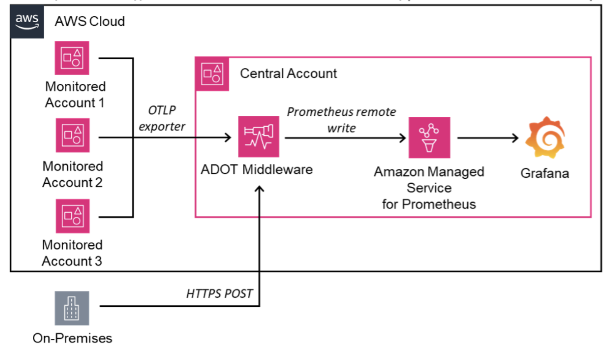

# AWS ओपन सोर्स सेवा के साथ क्रॉस अकाउंट मॉनिटरिंग

## परिचय

आधुनिक क्लाउड एनवायरनमेंट अक्सर कई अकाउंट में फैले होते हैं और ऑन-प्रिमाइसेस इंफ्रास्ट्रक्चर शामिल करते हैं, जो जटिल मॉनिटरिंग चुनौतियाँ पैदा करता है। इन चुनौतियों का समाधान करने के लिए, AWS सेवाओं और उद्योग-मानक टूल्स का उपयोग करके एक परिष्कृत मॉनिटरिंग आर्किटेक्चर लागू किया जा सकता है। यह आर्किटेक्चर विविध एनवायरनमेंट्स में व्यापक दृश्यता सक्षम करता है, जो कुशल प्रबंधन और त्वरित समस्या समाधान की सुविधा प्रदान करता है।

## मुख्य घटक

इस मॉनिटरिंग समाधान के केंद्र में AWS Distro for OpenTelemetry (ADOT) है, जो विभिन्न स्रोतों से मेट्रिक्स के लिए एक केंद्रीकृत संग्रह बिंदु के रूप में कार्य करता है। ADOT एक समर्पित केंद्रीय AWS अकाउंट में डिप्लॉय किया जाता है, जो मॉनिटरिंग इंफ्रास्ट्रक्चर का हब बनाता है। यह केंद्रीय डिप्लॉयमेंट सुव्यवस्थित डेटा एकीकरण और प्रोसेसिंग की अनुमति देता है।

Amazon Managed Service for Prometheus एक और महत्वपूर्ण घटक है, जो एकत्रित मेट्रिक्स को स्टोर करने के लिए एक स्केलेबल और प्रबंधित टाइम-सीरीज़ डेटाबेस प्रदान करता है। यह सेवा स्व-प्रबंधित Prometheus instances की आवश्यकता को समाप्त करती है, परिचालन ओवरहेड कम करती है और मेट्रिक डेटा की उच्च उपलब्धता सुनिश्चित करती है।

विज़ुअलाइज़ेशन और एनालिसिस के लिए, Grafana को आर्किटेक्चर में एकीकृत किया गया है। Grafana Amazon Managed Service for Prometheus से कनेक्ट होता है, शक्तिशाली क्वेरी क्षमताएं और अनुकूलन योग्य डैशबोर्ड प्रदान करता है। यह टीमों को अंतर्दृष्टिपूर्ण विज़ुअलाइज़ेशन बनाने और एकत्रित मेट्रिक्स के आधार पर अलर्टिंग सेट करने की अनुमति देता है।

*चित्र 1: AWS ओपन सोर्स सेवाओं के साथ मल्टी अकाउंट मॉनिटरिंग*

## डेटा संग्रह और प्रवाह

आर्किटेक्चर कई AWS अकाउंट से डेटा संग्रह का समर्थन करता है, जिन्हें मॉनिटर किए गए अकाउंट कहा जाता है। ये अकाउंट अपनी मेट्रिक्स को केंद्रीय ADOT इंस्टेंस में निर्यात करने के लिए OpenTelemetry Protocol (OTLP) का उपयोग करते हैं। यह मानकीकृत दृष्टिकोण डेटा प्रारूप में स्थिरता सुनिश्चित करता है और मॉनिटरिंग सेटअप में नए अकाउंट के आसान एकीकरण की सुविधा प्रदान करता है।

ऑन-प्रिमाइसेस इंफ्रास्ट्रक्चर भी इस मॉनिटरिंग समाधान में शामिल है। ये सिस्टम सुरक्षित HTTPS POST अनुरोधों का उपयोग करके अपना मेट्रिक्स डेटा केंद्रीय ADOT इंस्टेंस को भेजते हैं। यह विधि लीगेसी या गैर-क्लाउड सिस्टम को समग्र मॉनिटरिंग नीति में शामिल करने की अनुमति देती है, जो संपूर्ण IT एनवायरनमेंट का वास्तव में व्यापक दृश्य प्रदान करती है।

एक बार डेटा केंद्रीय ADOT इंस्टेंस तक पहुंच जाता है, इसे प्रोसेस किया जाता है और Prometheus remote write प्रोटोकॉल का उपयोग करके Amazon Managed Service for Prometheus को अग्रेषित किया जाता है। यह कदम सुनिश्चित करता है कि सभी एकत्रित मेट्रिक्स टाइम-सीरीज़ डेटा के लिए अनुकूलित प्रारूप में स्टोर किए जाते हैं, जो कुशल क्वेरी और एनालिसिस सक्षम करता है।

## लाभ और विचार

यह आर्किटेक्चर कई प्रमुख लाभ प्रदान करता है। यह विविध स्रोतों से मेट्रिक्स का केंद्रीकृत दृश्य प्रदान करता है, जो जटिल एनवायरनमेंट्स की समग्र मॉनिटरिंग सक्षम करता है। प्रबंधित सेवाओं का उपयोग टीमों पर परिचालन बोझ को कम करता है, जिससे वे इंफ्रास्ट्रक्चर रखरखाव के बजाय एनालिसिस पर ध्यान केंद्रित कर सकते हैं। इसके अतिरिक्त, आर्किटेक्चर अत्यधिक स्केलेबल है, जो मॉनिटर किए गए सिस्टम की संख्या और एकत्रित मेट्रिक्स की मात्रा दोनों में वृद्धि को समायोजित करने में सक्षम है।

हालांकि, इस आर्किटेक्चर को लागू करने के साथ कुछ विचार भी आते हैं। समाधान की केंद्रीकृत प्रकृति का अर्थ है कि केंद्रीय अकाउंट में मॉनिटरिंग इंफ्रास्ट्रक्चर महत्वपूर्ण हो जाता है, जिसके लिए उच्च उपलब्धता और आपदा पुनर्प्राप्ति के लिए सावधानीपूर्ण योजना की आवश्यकता होती है। अकाउंट के बीच डेटा ट्रांसफर और प्रबंधित सेवाओं के उपयोग से जुड़ी लागत प्रभाव भी हो सकते हैं, जिन्हें बजट निर्णयों में शामिल किया जाना चाहिए।

सुरक्षा एक और महत्वपूर्ण पहलू है जिस पर विचार करना चाहिए। सुरक्षित क्रॉस-अकाउंट मेट्रिक संग्रह की अनुमति देने के लिए उचित IAM roles और अनुमतियाँ सेट की जानी चाहिए। ऑन-प्रिमाइसेस सिस्टम के लिए, मॉनिटरिंग डेटा की अखंडता और गोपनीयता बनाए रखने के लिए सुरक्षित और प्रमाणित HTTPS कनेक्शन सुनिश्चित करना महत्वपूर्ण है।

## निष्कर्ष

यह उन्नत AWS क्लाउड मॉनिटरिंग आर्किटेक्चर जटिल, मल्टी-अकाउंट और हाइब्रिड इंफ्रास्ट्रक्चर एनवायरनमेंट वाले ऑर्गनाइज़ेशन्स के लिए एक मजबूत समाधान प्रदान करता है। AWS प्रबंधित सेवाओं और OpenTelemetry और Grafana जैसे उद्योग-मानक टूल्स का लाभ उठाकर, यह एक स्केलेबल और शक्तिशाली मॉनिटरिंग समाधान प्रदान करता है। जबकि इसे प्रभावी ढंग से लागू करने के लिए सावधानीपूर्ण योजना और प्रबंधन की आवश्यकता है, व्यापक दृश्यता और केंद्रीकृत मॉनिटरिंग के लाभ इसे आधुनिक क्लाउड-नेटिव और हाइब्रिड एनवायरनमेंट के लिए एक मूल्यवान दृष्टिकोण बनाते हैं।

इस आर्किटेक्चर का लचीलापन इसे विभिन्न ऑर्गनाइज़ेशनात्मक आवश्यकताओं के अनुकूल होने और मॉनिटरिंग आवश्यकताओं में बदलाव के साथ विकसित होने की अनुमति देता है। जैसे-जैसे क्लाउड एनवायरनमेंट जटिलता में बढ़ते रहते हैं, सभी इंफ्रास्ट्रक्चर घटकों में परिचालन उत्कृष्टता बनाए रखने और इष्टतम प्रदर्शन सुनिश्चित करने के लिए ऐसा केंद्रीकृत और व्यापक मॉनिटरिंग समाधान होना तेजी से महत्वपूर्ण हो जाता है।

