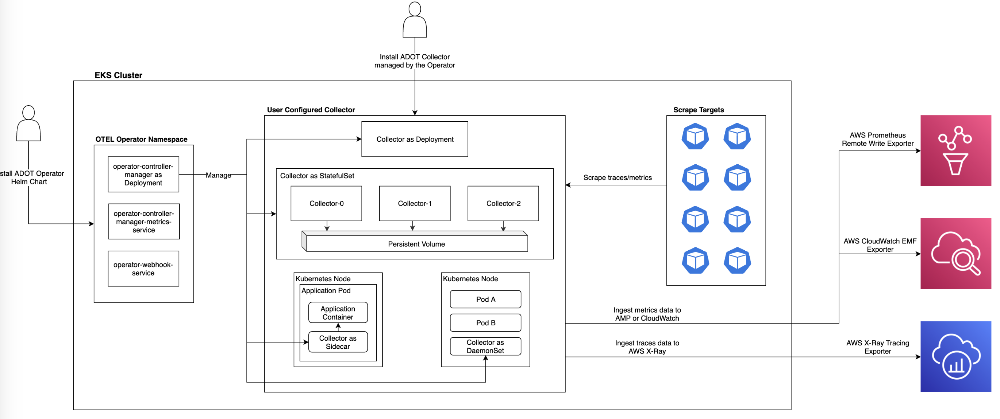

# ADOT Observability पाइपलाइन

Observability पाइपलाइन कई घटकों से बनी है जो विभिन्न स्रोतों से observability डेटा एकत्र, प्रबंधित और विश्लेषण करने के लिए एक साथ काम करते हैं।

## EKS क्लस्टर

EKS (Elastic Kubernetes Service) क्लस्टर observability पाइपलाइन के मुख्य घटकों को होस्ट करता है।

### ADOT Operator Helm Chart इंस्टॉल करें

ADOT (AWS Distro for OpenTelemetry) Operator एक Helm chart का उपयोग करके इंस्टॉल किया जाता है। यह observability पाइपलाइन घटकों के डिप्लॉयमेंट और कॉन्फ़िगरेशन का प्रबंधन करता है।

### यूज़र कॉन्फ़िगर्ड Collector

यूज़र-कॉन्फ़िगर्ड collector ऑपरेटर द्वारा प्रबंधित किया जाता है और निम्नलिखित घटकों से बना है:

- Collector as Deployment: Collector को Kubernetes deployment के रूप में डिप्लॉय किया जाता है, जो उच्च उपलब्धता और स्केलेबिलिटी सुनिश्चित करता है।
- Collector-0, Collector-1, Collector-2: आने वाले observability डेटा को संभालने के लिए कई collector instances डिप्लॉय किए जाते हैं। वे वर्कलोड वितरित करने और विश्वसनीय डेटा संग्रह सुनिश्चित करने के लिए एक साथ काम करते हैं।

*चित्र 1: OpenTelemetry पाइपलाइन*

### Persistent Volume

Persistent volume का उपयोग एकत्रित observability डेटा को स्टोर करने के लिए किया जाता है। यह डेटा टिकाऊपन सुनिश्चित करता है और दीर्घकालिक स्टोरेज और विश्लेषण की अनुमति देता है।

### Kubernetes Node

Kubernetes node एप्लिकेशन pods और sidecar के रूप में collector को होस्ट करता है।

- Application Container: एप्लिकेशन कंटेनर वास्तविक एप्लिकेशन कोड चलाता है और observability डेटा उत्पन्न करता है।
- Collector as Sidecar: Collector एप्लिकेशन कंटेनर के साथ sidecar कंटेनर के रूप में चलता है। यह एप्लिकेशन द्वारा उत्पन्न observability डेटा एकत्र करता है।

## Scrape Targets

Observability पाइपलाइन विभिन्न scrape targets से डेटा एकत्र करती है, जैसे:

- Scrape traces/metrics: पाइपलाइन एप्लिकेशन और इंफ्रास्ट्रक्चर घटकों से ट्रेसेस और मेट्रिक्स स्क्रैप करती है।

## AWS Prometheus Remote Write Exporter

AWS Prometheus Remote Write Exporter का उपयोग एकत्रित observability डेटा को AWS सेवाओं में निर्यात करने के लिए किया जाता है।

## AWS CloudWatch EMF Exporter

AWS CloudWatch EMF (Embedded Metric Format) Exporter का उपयोग मेट्रिक्स को AWS CloudWatch में निर्यात करने के लिए किया जाता है।

## AWS X-Ray Tracing Exporter

AWS X-Ray Tracing Exporter का उपयोग डिस्ट्रिब्यूटेड ट्रेसिंग और प्रदर्शन विश्लेषण के लिए ट्रेसिंग डेटा को AWS X-Ray में निर्यात करने के लिए किया जाता है।

Observability पाइपलाइन scrape targets से डेटा एकत्र करती है, collectors का उपयोग करके इसे प्रोसेस करती है, और आगे के विश्लेषण और विज़ुअलाइज़ेशन के लिए विभिन्न AWS सेवाओं में निर्यात करती है।

## ADOT के साथ मेट्रिक्स और अंतर्दृष्टि एकत्र करना

1. **इंस्ट्रूमेंटेशन**: OpenTelemetry के समान, ADOT आपके एप्लिकेशन और सेवाओं को इंस्ट्रूमेंट करने के लिए लाइब्रेरी और SDKs प्रदान करता है, जो मेट्रिक्स, ट्रेसेस और लॉग्स जैसे टेलीमेट्री डेटा कैप्चर करता है।

2. **मेट्रिक्स संग्रह**: ADOT AWS सेवा मेट्रिक्स सहित सिस्टम और एप्लिकेशन-स्तरीय मेट्रिक्स एकत्र और निर्यात करने का समर्थन करता है, जो रिसोर्स उपयोग और एप्लिकेशन प्रदर्शन में अंतर्दृष्टि प्रदान करता है।

3. **डिस्ट्रिब्यूटेड ट्रेसिंग**: ADOT AWS सेवाओं, कंटेनर्स और ऑन-प्रिमाइसेस वातावरण में डिस्ट्रिब्यूटेड ट्रेसिंग सक्षम करता है, जिससे आप अनुरोधों और संचालन को एंड-टू-एंड ट्रेस कर सकते हैं।

4. **लॉगिंग**: ADOT में स्ट्रक्चर्ड लॉगिंग के लिए समर्थन शामिल है, जो व्यापक observability के लिए लॉग डेटा को अन्य टेलीमेट्री सिग्नल्स के साथ सहसंबद्ध करता है।

5. **AWS सेवा एकीकरण**: ADOT AWS X-Ray, AWS CloudWatch, Amazon Managed Service for Prometheus, और AWS Distro for OpenTelemetry Operator जैसी AWS सेवाओं के साथ घनिष्ठ एकीकरण प्रदान करता है, जो AWS इकोसिस्टम के भीतर सहज टेलीमेट्री संग्रह और विश्लेषण सक्षम करता है।

6. **ऑटोमैटिक इंस्ट्रूमेंटेशन**: ADOT लोकप्रिय फ्रेमवर्क और लाइब्रेरी के लिए ऑटोमैटिक इंस्ट्रूमेंटेशन क्षमताएं प्रदान करता है, जो मौजूदा एप्लिकेशन को इंस्ट्रूमेंट करने की प्रक्रिया को सरल बनाता है।

7. **डेटा प्रोसेसिंग और विश्लेषण**: ADOT द्वारा एकत्रित टेलीमेट्री डेटा को AWS X-Ray, Amazon Managed Service for Prometheus, और AWS CloudWatch जैसी AWS observability सेवाओं में निर्यात किया जा सकता है, जो AWS-नेटिव विश्लेषण और विज़ुअलाइज़ेशन टूल्स का लाभ उठाता है।

## ADOT का उपयोग करने के लाभ

1. **AWS-नेटिव एकीकरण**: ADOT AWS सेवाओं और इंफ्रास्ट्रक्चर के साथ सहजता से एकीकृत होने के लिए डिज़ाइन किया गया है, जो AWS इकोसिस्टम के भीतर एक सुसंगत observability अनुभव प्रदान करता है।

2. **प्रदर्शन और स्केलेबिलिटी**: ADOT बड़े पैमाने के AWS वातावरण में कुशल टेलीमेट्री संग्रह और विश्लेषण सक्षम करते हुए प्रदर्शन और स्केलेबिलिटी के लिए अनुकूलित है।

3. **सुरक्षा और अनुपालन**: ADOT AWS सुरक्षा सर्वोत्तम प्रथाओं का पालन करता है और विभिन्न उद्योग मानकों के अनुपालन में है, जो सुरक्षित और अनुपालन observability प्रथाएं सुनिश्चित करता है।

4. **AWS सपोर्ट**: AWS-समर्थित वितरण के रूप में, ADOT AWS के व्यापक डॉक्यूमेंटेशन, सपोर्ट चैनल और OpenTelemetry प्रोजेक्ट के प्रति दीर्घकालिक प्रतिबद्धता से लाभान्वित होता है।

## OpenTelemetry और ADOT के बीच अंतर

जबकि ADOT और OpenTelemetry कई मुख्य क्षमताएं साझा करते हैं, कुछ प्रमुख अंतर हैं:

1. **AWS एकीकरण**: ADOT विशेष रूप से AWS वातावरण के लिए डिज़ाइन किया गया है और AWS सेवाओं के साथ घनिष्ठ एकीकरण प्रदान करता है, जबकि OpenTelemetry एक वेंडर-तटस्थ प्रोजेक्ट है।

2. **AWS अनुकूलन**: ADOT AWS वातावरण के भीतर प्रदर्शन, स्केलेबिलिटी और सुरक्षा के लिए अनुकूलित है, AWS-नेटिव सेवाओं और सर्वोत्तम प्रथाओं का लाभ उठाता है।

3. **AWS सपोर्ट**: ADOT आधिकारिक AWS सपोर्ट, डॉक्यूमेंटेशन और दीर्घकालिक प्रतिबद्धता से लाभान्वित होता है, जबकि OpenTelemetry सामुदायिक सपोर्ट पर निर्भर करता है।

4. **AWS-विशिष्ट सुविधाएं**: ADOT में AWS-विशिष्ट सुविधाएं और AWS सेवाओं के लिए ऑटोमैटिक इंस्ट्रूमेंटेशन शामिल है, जबकि OpenTelemetry सामान्य-उद्देश्य observability पर केंद्रित है।

5. **वेंडर तटस्थता**: OpenTelemetry एक वेंडर-तटस्थ प्रोजेक्ट है, जो विभिन्न observability प्लेटफ़ॉर्म के साथ एकीकरण की अनुमति देता है, जबकि ADOT मुख्य रूप से AWS observability सेवाओं पर केंद्रित है।

ADOT का लाभ उठाकर, संगठन AWS इकोसिस्टम के भीतर व्यापक observability प्राप्त कर सकते हैं, AWS-नेटिव एकीकरण, अनुकूलित प्रदर्शन और AWS सपोर्ट से लाभान्वित होते हुए, OpenTelemetry क्षमताओं और सामुदायिक योगदान का लाभ उठाने का लचीलापन बनाए रखते हैं।
