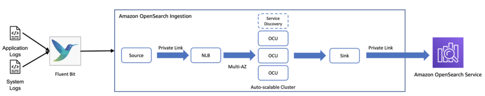

# AWS पर Opensearch लॉगिंग

## परिचय
Opensearch एक लोकप्रिय ओपन-सोर्स सर्च और एनालिटिक्स इंजन है जो लॉग एकीकरण, विश्लेषण और विज़ुअलाइज़ेशन सक्षम करता है। AWS कई कंप्यूट सेवाएं प्रदान करता है जैसे ECS (Elastic Container Service), EKS (Elastic Kubernetes Service) और EC2 (Elastic Compute Cloud) जिनका उपयोग लॉग उत्पन्न करने वाले एप्लिकेशन को डिप्लॉय और चलाने के लिए किया जा सकता है। इन कंप्यूट सेवाओं के साथ Opensearch को एकीकृत करने से एप्लिकेशन और इंफ्रास्ट्रक्चर की प्रभावी मॉनिटरिंग के लिए केंद्रीकृत लॉगिंग की अनुमति मिलती है।

*चित्र 1: Opensearch पाइपलाइन*

## आर्किटेक्चर अवलोकन
ECS, EKS और EC2 का उपयोग करके AWS पर Opensearch लॉगिंग का एक उच्च-स्तरीय आर्किटेक्चर यहाँ है:

1. ECS, EKS या EC2 पर चलने वाले एप्लिकेशन लॉग उत्पन्न करते हैं
2. एक लॉग एजेंट (जैसे Fluentd, Fluent Bit, Logstash आदि) कंप्यूट सेवाओं से लॉग एकत्र करता है
3. लॉग एजेंट लॉग्स को Amazon Opensearch Service, एक प्रबंधित Opensearch क्लस्टर, को भेजता है
4. Opensearch लॉग डेटा को इंडेक्स और स्टोर करता है
5. Opensearch के साथ एकीकृत Kibana का उपयोग लॉग डेटा को सर्च, विश्लेषण और विज़ुअलाइज़ करने के लिए किया जाता है

कुछ प्रमुख घटक:
- Amazon Opensearch Service: लॉग एकीकरण और एनालिटिक्स के लिए प्रबंधित Opensearch क्लस्टर
- कंप्यूट सेवाएं (ECS, EKS, EC2): जहाँ लॉग उत्पन्न करने वाले एप्लिकेशन डिप्लॉय हैं
- लॉग एजेंट: कंप्यूट से लॉग एकत्र करते हैं और Opensearch को भेजते हैं
- Opensearch Index: लॉग डेटा स्टोर करता है
- Kibana: लॉग डेटा का विज़ुअलाइज़ेशन और विश्लेषण

## फायदे
1. **केंद्रीकृत लॉगिंग**: सभी कंप्यूट सेवाओं से लॉग्स को Opensearch में एकीकृत करता है, लॉग विश्लेषण के लिए एकल दृश्य सक्षम करता है
2. **स्केलेबिलिटी**: Amazon Opensearch Service उच्च मात्रा के लॉग डेटा को इंजेस्ट और विश्लेषण करने के लिए स्केल करता है
3. **पूर्ण रूप से प्रबंधित**: Opensearch Service Opensearch के प्रबंधन के परिचालन ओवरहेड को समाप्त करता है
4. **रीयल-टाइम मॉनिटरिंग**: सक्रिय मॉनिटरिंग के लिए लगभग रीयल-टाइम में लॉग इंजेस्ट और विज़ुअलाइज़ करें
5. **समृद्ध एनालिटिक्स**: Kibana लॉग्स को सर्च, फ़िल्टर, विश्लेषण और विज़ुअलाइज़ करने के लिए शक्तिशाली टूल्स प्रदान करता है
6. **विस्तारणीयता**: विभिन्न लॉग एजेंट और AWS सेवाओं के साथ एकीकरण के लिए लचीला

## नुकसान
1. **लागत**: Opensearch में बड़े पैमाने पर लॉग एकीकरण से महत्वपूर्ण डेटा ट्रांसफर और स्टोरेज लागत लग सकती है
2. **जटिल सेटअप**: कंप्यूट सेवाओं से Opensearch तक लॉग स्ट्रीम करने का प्रारंभिक सेटअप शामिल हो सकता है
3. **सीखने की अवधि**: कुशल उपयोग के लिए Opensearch और Kibana के ज्ञान की आवश्यकता होती है
4. **बड़े पैमाने की सीमाएं**: बहुत बड़ी लॉग मात्रा के लिए, Opensearch स्केलेबिलिटी और प्रदर्शन चुनौतियों का सामना कर सकता है
5. **सुरक्षा ओवरहेड**: सुरक्षित लॉग ट्रांसमिशन और Opensearch तक पहुंच सुनिश्चित करने के लिए सावधानीपूर्ण कॉन्फ़िगरेशन की आवश्यकता होती है

## निष्कर्ष
ECS, EKS और EC2 जैसी AWS कंप्यूट सेवाओं के साथ Opensearch को एकीकृत करने से शक्तिशाली लॉग एकीकरण और एनालिटिक्स क्षमताएं सक्षम होती हैं। जबकि यह एक स्केलेबल, केंद्रीकृत और लगभग रीयल-टाइम लॉगिंग समाधान प्रदान करता है, लागत, सुरक्षा, स्केलेबिलिटी और प्रदर्शन को ध्यान में रखते हुए आर्किटेक्चर को सावधानीपूर्वक डिज़ाइन करना महत्वपूर्ण है। सही कार्यान्वयन के साथ, AWS पर Opensearch लॉगिंग एप्लिकेशन और इंफ्रास्ट्रक्चर में observability को काफी बढ़ा सकती है।
