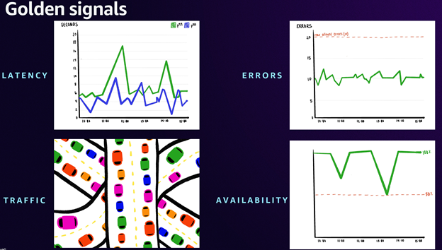

# लीडर्स और एक्ज़ीक्यूटिव

आज की डिजिटल-फर्स्ट अर्थव्यवस्था में, व्यावसायिक प्रदर्शन और तकनीकी संचालन के बीच की सीमा समाप्त हो गई है। IT लीडर्स कई मोर्चों पर बढ़ते दबाव का सामना कर रहे हैं: डिजिटल सेवाएं सीधे राजस्व धाराओं को प्रभावित कर रही हैं, विश्वसनीयता के लिए अभूतपूर्व ग्राहक अपेक्षाएं, तकनीकी लचीलेपन पर टिका प्रतिस्पर्धात्मक लाभ, और अधिक परिचालन पारदर्शिता की मांग करने वाली नियामक आवश्यकताएं। यह अभिसरण IT लीडर्स से प्रभावी Observability रणनीतियों के माध्यम से परिचालन उत्कृष्टता और मूर्त व्यावसायिक मूल्य सृजन दोनों प्रदर्शित करने की मांग करता है।

---

इन चुनौतियों को देखते हुए, संगठनों को Observability को तकनीकी ओवरहेड के रूप में देखने से हटकर इसे मात्रात्मक रिटर्न के साथ एक रणनीतिक निवेश के रूप में मानना चाहिए। IT लीडर्स को यह प्रदर्शित करने की आवश्यकता है कि उनकी Observability पहल सीधे व्यावसायिक मेट्रिक्स को कैसे प्रभावित करती है, ग्राहक संतुष्टि स्कोर से लेकर परिचालन लागत तक। ROI-ड्रिवन दृष्टिकोण यह सुनिश्चित करता है कि Observability टूल्स और प्रथाओं पर खर्च किया गया प्रत्येक रुपया इंसिडेंट रिस्पॉन्स समय, सिस्टम विश्वसनीयता और टीम उत्पादकता में मापने योग्य सुधार देता है, जो अंततः राजस्व धाराओं की रक्षा और वृद्धि करता है।

प्रबंधन का पुराना सिद्धांत यहां विशेष रूप से सत्य है: "यदि आप इसे माप नहीं सकते, तो आप इसे प्रबंधित नहीं कर सकते।" यही कारण है कि उद्योग के अग्रणी Observability को एक प्रथम-श्रेणी कार्यात्मक आवश्यकता के रूप में दोगुना कर रहे हैं। एक लीडर के रूप में, यदि आपका लक्ष्य मूल-कारण-विश्लेषण (RCA) को तेज करना और mean-time-to-restore (MTTR) को कम करना है, तो आपकी Observability रणनीति को आपके संगठन के मुख्य व्यावसायिक लक्ष्यों और प्राथमिकताओं के साथ कसकर जुड़ा होना चाहिए। यह सुनिश्चित करता है कि उत्पन्न अंतर्दृष्टि सीधे आपके संगठन के लिए प्रमुख प्रदर्शन संकेतकों (KPI) में सुधार का समर्थन करती है। और, यह बाजार में नवीनतम और सबसे बढ़िया AI Observability टूल में निवेश करने के बारे में नहीं है, यह सब इस बारे में है कि आप उन सिग्नलों को 'माप' सकें जो आपके संगठनात्मक लक्ष्यों के अनुरूप हों!

## एक प्रभावी Observability रणनीति बनाना

आप Observability को मूर्त व्यावसायिक परिणामों में कैसे बदलते हैं? उत्तर निम्नलिखित महत्वपूर्ण क्षेत्रों पर ध्यान केंद्रित करने में निहित है: ग्राहक अनुभव, एप्लिकेशन प्रदर्शन और विश्वसनीयता, और परिचालन दक्षता और लागत ऑप्टिमाइज़ेशन। Observability को मूर्त व्यावसायिक परिणामों में बदलने के लिए, आइए सबसे महत्वपूर्ण पहलू से शुरू करें: ग्राहक अनुभव।

#### ग्राहक अनुभव मापना

सबसे पहले, ग्राहक अनुभव मापने के लिए पारंपरिक सिस्टम मेट्रिक्स से आगे बढ़ना आवश्यक है। हम आपके प्राथमिक माप ढांचे के रूप में Service Level Objectives (SLOs) को लागू करने की अनुशंसा करते हैं। SLO केवल सिस्टम मेट्रिक्स के बजाय महत्वपूर्ण अंतिम-उपयोगकर्ता यात्राओं पर आधारित सेवा उपलब्धता के लिए सहमत लक्ष्य प्रदान करते हैं। यह ग्राहक-केंद्रित दृष्टिकोण सुनिश्चित करता है कि आपकी Observability रणनीति सीधे उस चीज के अनुरूप है जो सबसे अधिक महत्वपूर्ण है - अंतिम-उपयोगकर्ता अनुभव, जो सभी तकनीकी निर्णयों के लिए आपका उत्तर तारा होना चाहिए। अब, आइए उस शब्दावली से परिचित हों जो आपके ग्राहकों को दिए गए आश्वासन और ट्रैक करने योग्य मापों का प्रतिनिधित्व करती है जो आपको बताते हैं कि आपकी सेवाएं कितनी स्वस्थ हैं।

- SLI (Service Level Indicator) प्रदान की गई सेवा के स्तर के किसी पहलू का एक सावधानीपूर्वक परिभाषित मात्रात्मक माप है।
- SLO (Service Level Objective) एक समय अवधि में SLI द्वारा मापे गए सेवा स्तर के लिए एक लक्ष्य मान या मानों की सीमा है।
- SLA (Service Level Agreement) आपके ग्राहक के साथ एक समझौता है जो आपके द्वारा देने का वादा किए गए सेवा स्तर को रेखांकित करता है। एक SLA आवश्यकताओं को पूरा न करने पर कार्रवाई का विवरण भी देता है, जैसे अतिरिक्त सहायता या मूल्य छूट।

Amazon CloudWatch [Application Signals](https://docs.aws.amazon.com/AmazonCloudWatch/latest/monitoring/CloudWatch-Application-Monitoring-Sections.html) की शुरूआत के साथ अब आप AWS में मूल रूप से SLO बना और मॉनिटर कर सकते हैं। Application Signals CloudWatch में एक व्यापक एप्लिकेशन प्रदर्शन मॉनिटरिंग सॉल्यूशन प्रदान करता है जो आपको SLO को अपने APM अनुभव से जोड़ने में सक्षम बनाता है। आप CloudWatch में उपलब्ध किसी भी मेट्रिक का उपयोग करके SLO के साथ शुरुआत कर सकते हैं। यह आज CloudWatch में उपलब्ध मेट्रिक्स के साथ शुरुआत करना आसान बनाता है। अधिक जानकारी के लिए, ब्लॉग [Improve application reliability with effective SLOs](https://aws.amazon.com/blogs/mt/improve-application-reliability-with-effective-slos) देखें। जबकि ग्राहक संतुष्टि सर्वोपरि है, यह सीधे आपके एप्लिकेशन के प्रदर्शन और विश्वसनीयता से जुड़ी है। आइए जानें कि इन महत्वपूर्ण पहलुओं को कैसे मॉनिटर और सुधारा जाए।

#### एप्लिकेशन प्रदर्शन और विश्वसनीयता में सुधार
एप्लिकेशन विश्वसनीयता प्रभावी Observability का अगला स्तंभ बनाती है, जो आपके महत्वपूर्ण एप्लिकेशन के 'गोल्डन सिग्नल' की मॉनिटरिंग के माध्यम से प्राप्त होती है: Availability, Latency, Errors, और Traffic। ये मेट्रिक्स आपके एप्लिकेशन के स्वास्थ्य और प्रदर्शन का एक व्यापक दृश्य प्रदान करते हैं। SLO के साथ संयुक्त होने पर, वे परिचालन लागतों को ऑप्टिमाइज करते हुए उच्च विश्वसनीयता बनाए रखने के लिए एक शक्तिशाली ढांचा बनाते हैं।

[Amazon Route 53 health checks](https://docs.aws.amazon.com/Route53/latest/DeveloperGuide/dns-failover.html) और [CloudWatch Synthetics](https://docs.aws.amazon.com/AmazonCloudWatch/latest/monitoring/CloudWatch_Synthetics_Canaries.html) के साथ, आप अपने एप्लिकेशन और वर्कलोड के प्रदर्शन और रनटाइम पहलुओं को मॉनिटर और विश्लेषित कर सकते हैं। आप AWS CloudWatch Synthetics का उपयोग करके अपने ऑन-प्रिमाइसेस एप्लिकेशन की उपलब्धता और स्वास्थ्य की मॉनिटरिंग भी कर सकते हैं।

[Amazon CloudWatch network and internet monitoring](https://docs.aws.amazon.com/AmazonCloudWatch/latest/monitoring/CloudWatch-Network-Monitoring-Sections.html) क्षमताओं की सामूहिक शक्ति के साथ जो [Network Flow Monitor](https://docs.aws.amazon.com/AmazonCloudWatch/latest/monitoring/CloudWatch-NetworkFlowMonitor.html), [Internet Monitor](https://docs.aws.amazon.com/AmazonCloudWatch/latest/monitoring/CloudWatch-InternetMonitor.html) और [Network Synthetic Monitor](https://docs.aws.amazon.com/AmazonCloudWatch/latest/monitoring/what-is-network-monitor.html) द्वारा प्रदान की जाती हैं, आप AWS पर होस्ट किए गए अपने एप्लिकेशन के नेटवर्क और इंटरनेट प्रदर्शन और उपलब्धता में डेटा को विज़ुअलाइज़, अंतर्दृष्टि और परिचालन विजिबिलिटी प्राप्त कर सकते हैं।

[Amazon CloudWatch Container Insights](https://docs.aws.amazon.com/AmazonCloudWatch/latest/monitoring/ContainerInsights.html) के साथ, आप अपने कंटेनराइज्ड एप्लिकेशन और माइक्रोसर्विसेज से मेट्रिक्स और लॉग्स एकत्र, एकत्रित और सारांशित कर सकते हैं। Container Insights Amazon Elastic Container Service (Amazon ECS), Amazon Elastic Kubernetes Service (Amazon EKS), और Amazon EC2 पर Kubernetes प्लेटफॉर्म के लिए उपलब्ध है।

[Amazon CloudWatch Database Insights](https://docs.aws.amazon.com/AmazonCloudWatch/latest/monitoring/Database-Insights.html) के साथ, आप Amazon Aurora MySQL, Amazon Aurora PostgreSQL, Amazon RDS for SQL Server, RDS for MySQL, RDS for PostgreSQL, RDS for Oracle, और RDS for MariaDB डेटाबेस को स्केल पर मॉनिटर और समस्या निवारण कर सकते हैं।

[Amazon CloudWatch cross-account observability](https://docs.aws.amazon.com/AmazonCloudWatch/latest/monitoring/CloudWatch-Unified-Cross-Account.html) के साथ, आप एक Region के भीतर कई अकाउंट में फैले एप्लिकेशन को मॉनिटर और समस्या निवारण कर सकते हैं। आप अकाउंट सीमाओं के बिना किसी भी लिंक किए गए अकाउंट में मेट्रिक्स, लॉग्स, ट्रेस, Application Signals सेवाओं और service level objectives (SLOs), Application Insights एप्लिकेशन, और internet monitors को खोज, विज़ुअलाइज़ और विश्लेषित कर सकते हैं।

[Amazon Managed Grafana](https://docs.aws.amazon.com/grafana/latest/userguide/what-is-Amazon-Managed-Service-Grafana.html) के साथ, आप स्केल पर अपने ऑपरेशनल डेटा को विज़ुअलाइज़ और विश्लेषित कर सकते हैं। AWS डेटा सोर्स के साथ सहज इंटीग्रेशन और एकीकृत डैशबोर्ड के माध्यम से क्रॉस-टीम सहयोग को सक्षम करके, यह आपको कई सोर्स से Observability डेटा को समेकित करने की अनुमति देता है - जिसमें आपके एप्लिकेशन और इंफ्रास्ट्रक्चर से मेट्रिक्स, लॉग्स और ट्रेस शामिल हैं - कस्टमाइज़ेबल विज़ुअलाइज़ेशन में जो आपको ऑपरेशनल समस्याओं को तेजी से पहचानने और हल करने में मदद करते हैं।

मजबूत ग्राहक अनुभव और एप्लिकेशन प्रदर्शन मॉनिटरिंग स्थापित होने के बाद, अब हम अपनी रणनीति से जुड़ी लागतों को ऑप्टिमाइज करने पर ध्यान दे सकते हैं।

#### लागत ऑप्टिमाइज करना
प्रभावी Observability से लागत ऑप्टिमाइज़ेशन स्वाभाविक रूप से उभरता है। कई संगठन सब कुछ मॉनिटर करने के जाल में फंस जाते हैं - "कुछ छूट न जाए" (FOMO) सिंड्रोम - जिससे जटिल, रिसोर्स-गहन सिस्टम बनते हैं जो अंतर्दृष्टि से अधिक शोर उत्पन्न करते हैं। कुंजी उन KPI की पहचान करना है जो सीधे व्यावसायिक सेवा सफलता और बेहतर उपयोगकर्ता अनुभव से संबंधित हैं। सफलता रणनीतिक डेटा संग्रह में और, सबसे महत्वपूर्ण, Observability यात्रा में व्यावसायिक स्टेकहोल्डर्स को शामिल करने में निहित है। आपकी Observability रणनीति को प्रदर्शनीय रूप से Root Cause Analysis (RCA) को तेज करना, Mean Time to Restore (MTTR) को कम करना और अंततः परिचालन लागत को कम करना चाहिए - यह सब इन मुख्य मेट्रिक्स पर ध्यान केंद्रित रखते हुए जो वास्तव में आपके व्यवसाय को प्रभावित करते हैं।

[AWS Cost Explorer](https://aws.amazon.com/aws-cost-management/aws-cost-explorer/) में एक आसान-उपयोग इंटरफेस है जो आपको समय के साथ अपनी AWS लागतों और उपयोग को विज़ुअलाइज़, समझने और प्रबंधित करने देता है। Cost Explorer उसी डेटासेट का उपयोग करता है जो [AWS Cost and Usage Reports](https://docs.aws.amazon.com/cur/latest/userguide/what-is-cur.html) और विस्तृत बिलिंग रिपोर्ट उत्पन्न करने के लिए उपयोग किया जाता है। [Amazon CloudWatch billing alarm](https://docs.aws.amazon.com/AmazonCloudWatch/latest/monitoring/monitor_estimated_charges_with_cloudwatch.html) बनाकर, आप अपने अनुमानित AWS शुल्कों की मॉनिटरिंग कर सकते हैं। जब आप अपने AWS अकाउंट के लिए अनुमानित शुल्कों की मॉनिटरिंग सक्षम करते हैं, तो अनुमानित शुल्क दिन में कई बार CloudWatch को मेट्रिक डेटा के रूप में गणना और भेजे जाते हैं। अलार्म तब ट्रिगर होता है जब आपकी अकाउंट बिलिंग आपके द्वारा निर्दिष्ट थ्रेशहोल्ड से अधिक हो जाती है।

अब जबकि हमने एक प्रभावी Observability रणनीति के प्रमुख घटकों को रेखांकित कर लिया है, आइए उन मूर्त लाभों और व्यावसायिक प्रभाव की जांच करें जिनकी आप इसके कार्यान्वयन से उम्मीद कर सकते हैं।

### मात्रात्मक परिणाम और व्यावसायिक प्रभाव

एक अच्छी तरह से लागू Observability रणनीति संगठन में मात्रात्मक वित्तीय रिटर्न और गुणात्मक लाभ दोनों प्रदान करती है। आइए कुछ परिणामों को विभाजित करें जिनकी आप उम्मीद कर सकते हैं:

#### लागत बचत
रणनीतिक Observability दोहरे चैनलों के माध्यम से वित्तीय लाभ प्रदान करती है: प्रत्यक्ष लागत में कमी और राजस्व सुरक्षा। परिचालन सुधार, कम MTTR और निवारक उपायों के माध्यम से मापे गए, इंसिडेंट लागत और समाधान समय में कमी के माध्यम से गणना की गई तत्काल लागत बचत उत्पन्न करते हैं। ये बचत टीम दक्षता लाभ से बढ़ जाती है, जो कम श्रम घंटों के माध्यम से मात्रात्मक होती है। ग्राहक रिटेंशन में मामूली सुधार भी ग्राहक जीवनकाल मूल्य के लेंस से देखने पर पर्याप्त राजस्व सुरक्षा में बदल सकता है।

#### परिचालन दक्षता
रिसोर्स ऑप्टिमाइज़ेशन अक्सर इंफ्रास्ट्रक्चर खर्च में 40% से अधिक की लागत में कमी प्रदान करता है। नियमित कार्यों का स्वचालन मैन्युअल प्रयास को समाप्त करता है, जिसकी बचत बचाए गए मैन्युअल घंटों को श्रम लागत से गुणा करके गणना की जाती है। ये दक्षताएं समय के साथ संयोजित होती हैं, जो निरंतर लागत लाभ बनाती हैं।

#### सांस्कृतिक परिवर्तन और परिचालन उत्कृष्टता
Observability की वास्तविक शक्ति संस्कृति और संचालन दोनों को एक साथ बदलने की इसकी क्षमता में निहित है। जबकि स्वचालित अलर्ट कोरिलेशन और प्रासंगिक समस्या निवारण तत्काल दक्षता लाभ चलाते हैं, गहरा प्रभाव टीमों के काम करने और सहयोग करने के तरीके में मौलिक बदलाव से आता है। सेल्फ-सर्विस क्षमताएं स्वतंत्र समस्या-समाधान को सशक्त बनाती हैं, जबकि व्यापक विजिबिलिटी सक्रिय जोखिम प्रबंधन को सक्षम बनाती है। यह एक सद्गुण चक्र बनाता है जहां बढ़ी हुई ग्राहक संतुष्टि, बेहतर डेवलपर अनुभव और मजबूत सुरक्षा मुद्रा एक-दूसरे को सुदृढ़ करते हैं।

मात्रात्मक परिणामों को समझना आपके संगठन में Observability के भविष्य के लिए मंच तैयार करता है। आइए यह देखकर समाप्त करें कि यह रणनीति आपके संचालन को कैसे बदल सकती है और दीर्घकालिक सफलता कैसे चला सकती है।

### आगे का मार्ग
प्रभावी Observability की यात्रा केवल टूल्स लागू करने या डेटा एकत्र करने के बारे में नहीं है - यह इस बारे में है कि संगठन कैसे संचालित होते हैं, निर्णय लेते हैं और मूल्य प्रदान करते हैं, इसे बदलना। सार्थक मेट्रिक्स पर ध्यान केंद्रित करके, तकनीकी क्षमताओं को व्यावसायिक परिणामों के साथ संरेखित करके, और स्वचालन और सेल्फ-सर्विस क्षमताओं के माध्यम से टीमों को सशक्त बनाकर, संगठन Observability को एक रणनीतिक लाभ में बदल सकते हैं। जैसे-जैसे हम तेजी से डिजिटल दुनिया में आगे बढ़ रहे हैं, जो इस अनुशासन में महारत हासिल करते हैं, वे खुद को ग्राहक अपेक्षाओं को पूरा करने, नवाचार चलाने और सतत विकास प्राप्त करने के लिए बेहतर ढंग से सुसज्जित पाएंगे। भविष्य उन संगठनों का है जो न केवल डेटा एकत्र कर सकते हैं बल्कि इसे कार्रवाई योग्य अंतर्दृष्टि में बदल सकते हैं जो व्यावसायिक सफलता को चलाती है।
