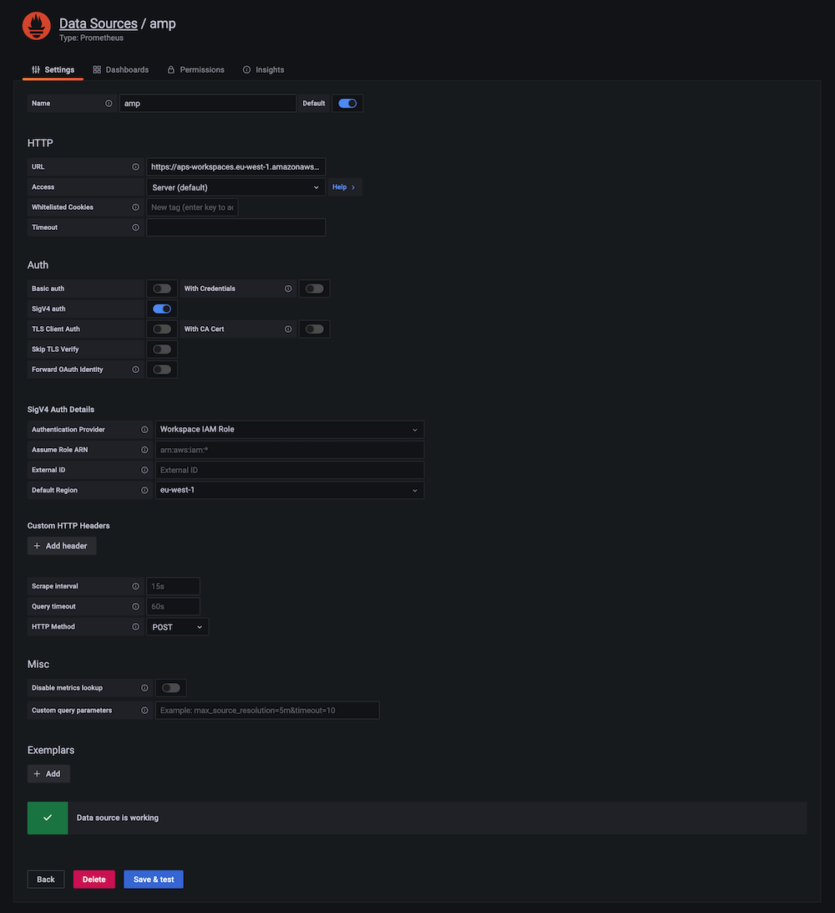

# Amazon Managed Grafana ऑटोमेशन के लिए Terraform का उपयोग

इस रेसिपी में हम आपको दिखाते हैं कि Amazon Managed Grafana को स्वचालित करने के लिए Terraform का उपयोग कैसे करें, उदाहरण के लिए कई वर्कस्पेस में सुसंगत रूप से डेटा स्रोत या डैशबोर्ड जोड़ने के लिए।

:::note
    इस गाइड को पूरा करने में लगभग 30 मिनट लगेंगे।
:::
## पूर्वापेक्षाएँ

* [AWS command line][aws-cli] आपके लोकल एनवायरनमेंट में स्थापित और [कॉन्फ़िगर][aws-cli-conf] होनी चाहिए।
* आपके लोकल एनवायरनमेंट में [Terraform][tf] कमांड लाइन स्थापित होनी चाहिए।
* आपके पास उपयोग के लिए Amazon Managed Service for Prometheus वर्कस्पेस तैयार होनी चाहिए।
* आपके पास उपयोग के लिए Amazon Managed Grafana वर्कस्पेस तैयार होनी चाहिए।

## Amazon Managed Grafana सेटअप

Terraform को Grafana के साथ [प्रमाणित][grafana-authn] करने के लिए, हम एक API Key का उपयोग करते हैं, जो एक प्रकार के पासवर्ड के रूप में कार्य करता है।

:::info
    API key एक [RFC 6750][rfc6750] HTTP Bearer हेडर है जिसमें 51 अक्षर लंबा अल्फ़ान्यूमेरिक मान होता है जो Grafana API के विरुद्ध प्रत्येक अनुरोध के साथ कॉलर को प्रमाणित करता है।
:::

इसलिए, Terraform मैनिफ़ेस्ट सेट करने से पहले, हमें पहले एक API key बनानी होगी। आप इसे Grafana UI के माध्यम से निम्नानुसार करते हैं।

सबसे पहले, बाईं ओर के मेनू में `Configuration` अनुभाग से `API keys` मेनू आइटम चुनें:


अब एक नई API key बनाएं, इसे अपने कार्य के लिए उपयुक्त नाम दें, इसे `Admin` रोल असाइन करें और अवधि समय को, उदाहरण के लिए, एक दिन पर सेट करें:


:::note
    API key सीमित समय के लिए वैध है, AMG में आप 30 दिनों तक के मान उपयोग कर सकते हैं।
:::
एक बार जब आप `Add` बटन दबाएंगे तो आपको एक पॉप-अप डायलॉग दिखाई देगा जिसमें API key होगी:


:::warning
    यह एकमात्र समय है जब आप API key देखेंगे, इसलिए इसे यहाँ से एक सुरक्षित स्थान पर संग्रहीत करें, हमें बाद में Terraform मैनिफ़ेस्ट में इसकी आवश्यकता होगी।
:::
इसके साथ हमने Terraform का उपयोग करके ऑटोमेशन के लिए Amazon Managed Grafana में आवश्यक सब कुछ सेट कर लिया है, तो आइए इस चरण पर आगे बढ़ें।

## Terraform के साथ ऑटोमेशन

### Terraform की तैयारी

Terraform को Grafana के साथ इंटरैक्ट करने में सक्षम बनाने के लिए, हम आधिकारिक [Grafana provider][tf-grafana-provider] संस्करण 1.13.3 या उससे ऊपर का उपयोग कर रहे हैं।

निम्नलिखित में, हम एक डेटा स्रोत के निर्माण को स्वचालित करना चाहते हैं, हमारे मामले में हम एक Prometheus [डेटा स्रोत][tf-ds] जोड़ना चाहते हैं, सटीक रूप से, एक AMP वर्कस्पेस।

सबसे पहले, निम्नलिखित सामग्री के साथ `main.tf` नाम की एक फ़ाइल बनाएं:

```
terraform {
  required_providers {
    grafana = {
      source  = "grafana/grafana"
      version = ">= 1.13.3"
    }
  }
}

provider "grafana" {
  url  = "INSERT YOUR GRAFANA WORKSPACE URL HERE"
  auth = "INSERT YOUR API KEY HERE"
}

resource "grafana_data_source" "prometheus" {
  type          = "prometheus"
  name          = "amp"
  is_default    = true
  url           = "INSERT YOUR AMP WORKSPACE URL HERE "
  json_data {
	http_method     = "POST"
	sigv4_auth      = true
	sigv4_auth_type = "workspace-iam-role"
	sigv4_region    = "eu-west-1"
  }
}
```
ऊपर की फ़ाइल में आपको अपने एनवायरनमेंट के अनुसार तीन मान डालने होंगे।

Grafana provider अनुभाग में:

* `url` ... Grafana वर्कस्पेस URL जो कुछ इस तरह दिखता है:
      `https://xxxxxxxx.grafana-workspace.eu-west-1.amazonaws.com`.
* `auth` ... पिछले चरण में आपके द्वारा बनाई गई API key.

Prometheus resource अनुभाग में, `url` डालें जो AMP वर्कस्पेस URL है `https://aps-workspaces.eu-west-1.amazonaws.com/workspaces/ws-xxxxxxxxx` के रूप में।

:::note
    यदि आप फ़ाइल में दिखाए गए रीजन से भिन्न रीजन में Amazon Managed Grafana का उपयोग कर रहे हैं, तो आपको ऊपर के अतिरिक्त, `sigv4_region` को भी अपने रीजन पर सेट करना होगा।
:::
तैयारी चरण को समाप्त करने के लिए, अब Terraform को इनिशियलाइज़ करें:

```
$ terraform init
Initializing the backend...

Initializing provider plugins...
- Finding grafana/grafana versions matching ">= 1.13.3"...
- Installing grafana/grafana v1.13.3...
- Installed grafana/grafana v1.13.3 (signed by a HashiCorp partner, key ID 570AA42029AE241A)

Partner and community providers are signed by their developers.
If you'd like to know more about provider signing, you can read about it here:
https://www.terraform.io/docs/cli/plugins/signing.html

Terraform has created a lock file .terraform.lock.hcl to record the provider
selections it made above. Include this file in your version control repository
so that Terraform can guarantee to make the same selections by default when
you run "terraform init" in the future.

Terraform has been successfully initialized!

You may now begin working with Terraform. Try running "terraform plan" to see
any changes that are required for your infrastructure. All Terraform commands
should now work.

If you ever set or change modules or backend configuration for Terraform,
rerun this command to reinitialize your working directory. If you forget, other
commands will detect it and remind you to do so if necessary.
```

इसके साथ, हम सब तैयार हैं और निम्नलिखित में बताए अनुसार डेटा स्रोत निर्माण को स्वचालित करने के लिए Terraform का उपयोग कर सकते हैं।

### Terraform का उपयोग

आमतौर पर, आप पहले Terraform की योजना देखेंगे, इस प्रकार:

```
$ terraform plan

Terraform used the selected providers to generate the following execution plan. 
Resource actions are indicated with the following symbols:
  + create

Terraform will perform the following actions:

  # grafana_data_source.prometheus will be created
  + resource "grafana_data_source" "prometheus" {
      + access_mode        = "proxy"
      + basic_auth_enabled = false
      + id                 = (known after apply)
      + is_default         = true
      + name               = "amp"
      + type               = "prometheus"
      + url                = "https://aps-workspaces.eu-west-1.amazonaws.com/workspaces/ws-xxxxxx/"

      + json_data {
          + http_method     = "POST"
          + sigv4_auth      = true
          + sigv4_auth_type = "workspace-iam-role"
          + sigv4_region    = "eu-west-1"
        }
    }

Plan: 1 to add, 0 to change, 0 to destroy.

───────────────────────────────────────────────────────────────────────────────────────────────────────────────────────────────────────────────────────────────────────────

Note: You didn't use the -out option to save this plan, so Terraform can't guarantee to take exactly these actions if you run "terraform apply" now.

```

यदि आप जो देख रहे हैं उससे संतुष्ट हैं, तो आप योजना लागू कर सकते हैं:

```
$ terraform apply

Terraform used the selected providers to generate the following execution plan. 
Resource actions are indicated with the following symbols:
  + create

Terraform will perform the following actions:

  # grafana_data_source.prometheus will be created
  + resource "grafana_data_source" "prometheus" {
      + access_mode        = "proxy"
      + basic_auth_enabled = false
      + id                 = (known after apply)
      + is_default         = true
      + name               = "amp"
      + type               = "prometheus"
      + url                = "https://aps-workspaces.eu-west-1.amazonaws.com/workspaces/ws-xxxxxxxxx/"

      + json_data {
          + http_method     = "POST"
          + sigv4_auth      = true
          + sigv4_auth_type = "workspace-iam-role"
          + sigv4_region    = "eu-west-1"
        }
    }

Plan: 1 to add, 0 to change, 0 to destroy.

Do you want to perform these actions?
  Terraform will perform the actions described above.
  Only 'yes' will be accepted to approve.

  Enter a value: yes

grafana_data_source.prometheus: Creating...
grafana_data_source.prometheus: Creation complete after 1s [id=10]

Apply complete! Resources: 1 added, 0 changed, 0 destroyed.

```

जब आप अब Grafana में डेटा स्रोत सूची पर जाएंगे तो आपको कुछ इस तरह दिखाई देना चाहिए:



यह सत्यापित करने के लिए कि आपका नव निर्मित डेटा स्रोत काम कर रहा है, आप नीचे नीले `Save & test` बटन पर क्लिक कर सकते हैं और परिणाम के रूप में आपको `Data source is working` पुष्टि संदेश दिखाई देना चाहिए।

आप Terraform का उपयोग अन्य चीजों को स्वचालित करने के लिए भी कर सकते हैं, उदाहरण के लिए, [Grafana provider][tf-grafana-provider] फ़ोल्डर और डैशबोर्ड प्रबंधन का समर्थन करता है।

मान लें कि आप अपने डैशबोर्ड को व्यवस्थित करने के लिए एक फ़ोल्डर बनाना चाहते हैं, उदाहरण के लिए:

```
resource "grafana_folder" "examplefolder" {
  title = "devops"
}
```

इसके अलावा, मान लें कि आपके पास `example-dashboard.json` नामक एक डैशबोर्ड है, और आप इसे ऊपर के फ़ोल्डर में बनाना चाहते हैं, तो आप निम्नलिखित स्निपेट का उपयोग करेंगे:

```
resource "grafana_dashboard" "exampledashboard" {
  folder = grafana_folder.examplefolder.id
  config_json = file("example-dashboard.json")
}
```

Terraform ऑटोमेशन के लिए एक शक्तिशाली टूल है और आप इसे यहाँ दिखाए अनुसार अपने Grafana संसाधनों का प्रबंधन करने के लिए उपयोग कर सकते हैं।

:::note
    ध्यान रखें, हालांकि, [Terraform में स्टेट][tf-state] डिफ़ॉल्ट रूप से लोकल रूप से प्रबंधित होती है। इसका मतलब है, यदि आप Terraform के साथ सहयोगात्मक रूप से काम करने की योजना बनाते हैं, तो आपको उपलब्ध विकल्पों में से एक को चुनना होगा जो आपको टीम भर में स्टेट साझा करने की अनुमति देता है।
:::
## सफाई

कंसोल से Amazon Managed Grafana वर्कस्पेस हटाएं।

[aws-cli]: https://docs.aws.amazon.com/cli/latest/userguide/cli-chap-install.html
[aws-cli-conf]: https://docs.aws.amazon.com/cli/latest/userguide/cli-chap-configure.html
[tf]: https://www.terraform.io/downloads.html
[grafana-authn]: https://grafana.com/docs/grafana/latest/http_api/auth/
[rfc6750]: https://datatracker.ietf.org/doc/html/rfc6750
[tf-grafana-provider]: https://registry.terraform.io/providers/grafana/grafana/latest/docs
[tf-ds]: https://registry.terraform.io/providers/grafana/grafana/latest/docs/resources/data_source
[tf-state]: https://www.terraform.io/docs/language/state/remote.html
