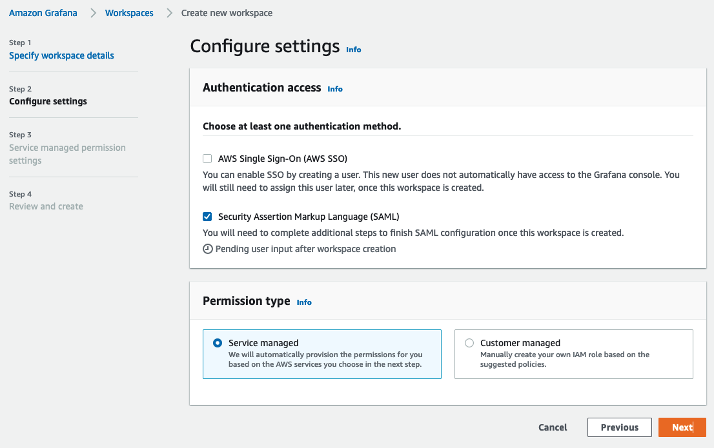
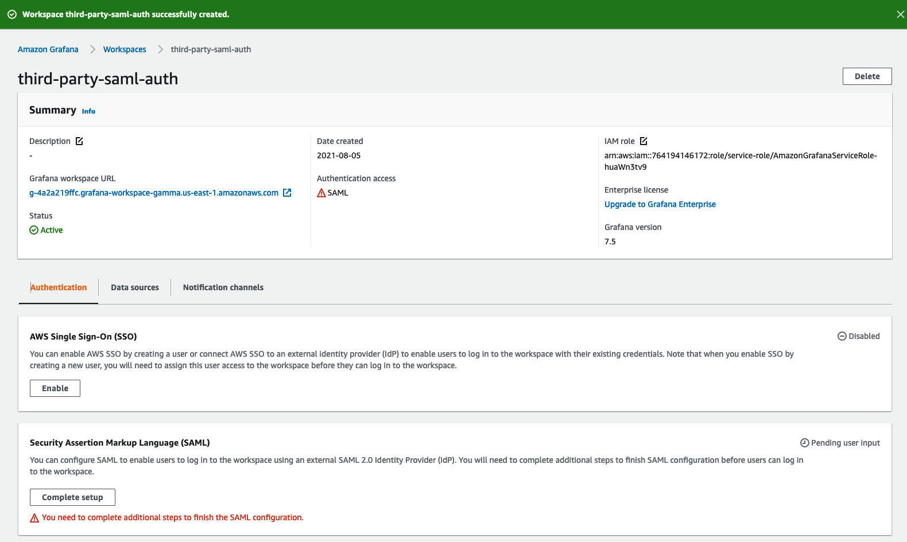
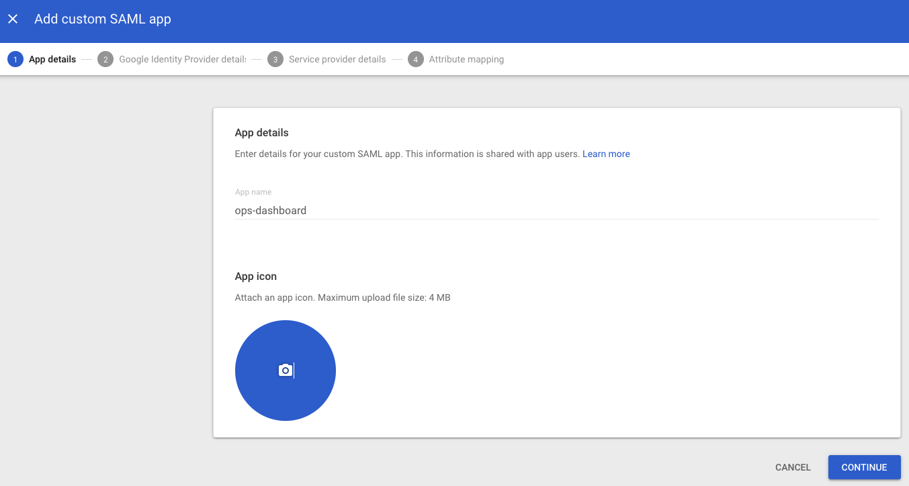
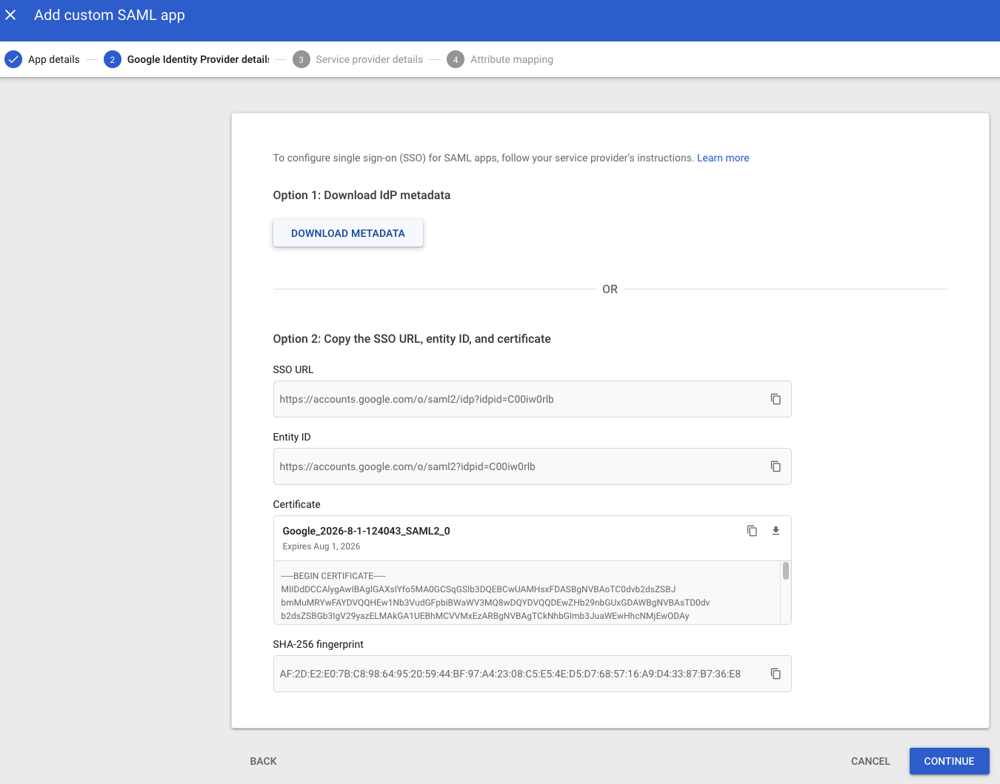
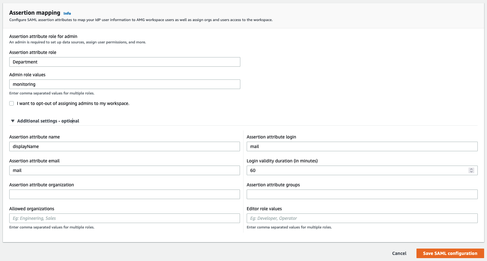

# SAML का उपयोग करके Amazon Managed Grafana के साथ Google Workspaces प्रमाणीकरण कॉन्फ़िगर करें

इस गाइड में, हम आपको बताएंगे कि SAML v2.0 प्रोटोकॉल का उपयोग करके Google Workspaces को Amazon Managed Grafana के लिए एक पहचान प्रदाता (IdP) के रूप में कैसे सेटअप करें।

इस गाइड का पालन करने के लिए आपको एक भुगतान [Google Workspaces][google-workspaces] खाते के साथ-साथ एक [Amazon Managed Grafana वर्कस्पेस][amg-ws] बनाना होगा।

### Amazon Managed Grafana वर्कस्पेस बनाएं

Amazon Managed Grafana कंसोल में लॉग इन करें और **Create workspace** पर क्लिक करें। निम्न स्क्रीन में, नीचे दिखाए अनुसार वर्कस्पेस का नाम प्रदान करें। फिर **Next** पर क्लिक करें:

**Configure settings** पेज में, **Security Assertion Markup Language (SAML)** विकल्प चुनें ताकि आप उपयोगकर्ताओं के लॉग इन के लिए SAML आधारित Identity Provider कॉन्फ़िगर कर सकें:

अपनी इच्छित डेटा स्रोत चुनें और **Next** पर क्लिक करें:

**Review and create** स्क्रीन में **Create workspace** बटन पर क्लिक करें:

इससे नीचे दिखाए अनुसार एक नई Amazon Managed Grafana वर्कस्पेस बनाई जाएगी:

### Google Workspaces कॉन्फ़िगर करें

Super Admin अनुमतियों के साथ Google Workspaces में लॉगिन करें और **Apps** अनुभाग के अंतर्गत **Web and mobile apps** पर जाएं। वहाँ, **Add App** पर क्लिक करें और **Add custom SAML app** चुनें। अब नीचे दिखाए अनुसार ऐप को एक नाम दें। **CONTINUE** पर क्लिक करें:

अगली स्क्रीन पर, SAML मेटाडेटा फ़ाइल डाउनलोड करने के लिए **DOWNLOAD METADATA** बटन पर क्लिक करें। **CONTINUE** पर क्लिक करें।

अगली स्क्रीन पर, आपको ACS URL, Entity ID और Start URL फ़ील्ड दिखाई देंगे। इन फ़ील्ड्स के मान आप Amazon Managed Grafana कंसोल से प्राप्त कर सकते हैं।

**Name ID format** फ़ील्ड में ड्रॉपडाउन से **EMAIL** चुनें और **Name ID** फ़ील्ड में **Basic Information > Primary email** चुनें।

**CONTINUE** पर क्लिक करें।

**Attribute mapping** स्क्रीन में, नीचे दिए गए स्क्रीनशॉट में दिखाए अनुसार **Google Directory attributes** और **App attributes** के बीच मैपिंग करें।

Google प्रमाणीकरण के माध्यम से लॉगिन करने वाले उपयोगकर्ताओं को **Amazon Managed Grafana** में **Admin** विशेषाधिकार प्राप्त करने के लिए, **Department** फ़ील्ड का मान ***monitoring*** के रूप में सेट करें। आप इसके लिए कोई भी फ़ील्ड और कोई भी मान चुन सकते हैं। Google Workspaces पक्ष में आप जो भी चुनें, सुनिश्चित करें कि Amazon Managed Grafana SAML सेटिंग्स में उसे प्रतिबिंबित करने के लिए मैपिंग करें।

### Amazon Managed Grafana में SAML मेटाडेटा अपलोड करें

अब Amazon Managed Grafana कंसोल में, **Upload or copy/paste** विकल्प पर क्लिक करें और पहले Google Workspaces से डाउनलोड की गई SAML मेटाडेटा फ़ाइल अपलोड करने के लिए **Choose file** बटन चुनें।

**Assertion mapping** अनुभाग में, **Assertion attribute role** फ़ील्ड में **Department** टाइप करें और **Admin role values** फ़ील्ड में **monitoring** टाइप करें। इससे **Department** के रूप में **monitoring** के साथ लॉगिन करने वाले उपयोगकर्ताओं को Grafana में **Admin** विशेषाधिकार मिलेंगे ताकि वे डैशबोर्ड और डेटा स्रोत बनाने जैसे व्यवस्थापक कार्य कर सकें।

नीचे स्क्रीनशॉट में दिखाए अनुसार **Additional settings - optional** अनुभाग के अंतर्गत मान सेट करें। **Save SAML configuration** पर क्लिक करें:

अब Amazon Managed Grafana Google Workspaces का उपयोग करके उपयोगकर्ताओं को प्रमाणित करने के लिए सेट है।

जब उपयोगकर्ता लॉगिन करते हैं, तो उन्हें इस प्रकार Google लॉगिन पेज पर रीडायरेक्ट किया जाएगा:

अपने क्रेडेंशियल दर्ज करने के बाद, वे नीचे स्क्रीनशॉट में दिखाए अनुसार Grafana में लॉग इन हो जाएंगे।

जैसा कि आप देख सकते हैं, उपयोगकर्ता Google Workspaces प्रमाणीकरण का उपयोग करके Grafana में सफलतापूर्वक लॉगिन करने में सक्षम था।

[google-workspaces]: https://workspace.google.com/
[amg-ws]: https://docs.aws.amazon.com/grafana/latest/userguide/getting-started-with-AMG.html#AMG-getting-started-workspace
