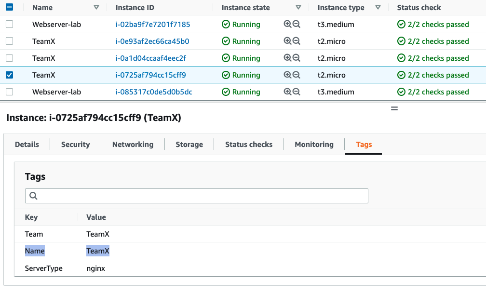

# रिसोर्स टैग्स द्वारा फ़िल्टर की गई मेट्रिक्स को एग्रीगेट और विज़ुअलाइज़ करने के लिए Amazon CloudWatch Metrics Explorer का उपयोग

इस रेसिपी में हम आपको दिखाते हैं कि रिसोर्स टैग्स और रिसोर्स प्रॉपर्टीज़ द्वारा मेट्रिक्स को फ़िल्टर, एग्रीगेट और विज़ुअलाइज़ करने के लिए Metrics Explorer का उपयोग कैसे करें - [टैग्स और प्रॉपर्टीज़ द्वारा रिसोर्स मॉनिटर करने के लिए Metrics Explorer का उपयोग करें][metrics-explorer]।

Metrics Explorer के साथ विज़ुअलाइज़ेशन बनाने के कई तरीके हैं; इस वॉकथ्रू में हम केवल AWS Console का लाभ उठाते हैं।

:::note
    इस गाइड को पूरा करने में लगभग 5 मिनट लगेंगे।
:::
## पूर्वापेक्षाएँ

* AWS खाते तक पहुँच
* AWS Console के माध्यम से Amazon CloudWatch Metrics Explorer तक पहुँच
* संबंधित रिसोर्स के लिए रिसोर्स टैग्स सेट

## Metrics Explorer टैग आधारित क्वेरीज़ और विज़ुअलाइज़ेशन

*  CloudWatch कंसोल खोलें

*  <b>Metrics</b> के अंतर्गत, <b>Explorer</b> मेनू पर क्लिक करें

<!--  -->

*  आप <b>Generic templates</b> या <b>Service based templates</b> सूची में से चुन सकते हैं; इस उदाहरण में हम <b>EC2 Instances by type</b> टेम्पलेट का उपयोग करते हैं

<!--  -->

*  जिन मेट्रिक्स को एक्सप्लोर करना चाहते हैं उन्हें चुनें; अनावश्यक को हटाएं, और अन्य मेट्रिक्स जोड़ें जो आप देखना चाहते हैं

<!--  -->

*  <b>From</b> के अंतर्गत, जिस रिसोर्स टैग या रिसोर्स प्रॉपर्टी की तलाश कर रहे हैं उसे चुनें; नीचे के उदाहरण में हम <b>Name: TeamX</b> टैग वाले विभिन्न EC2 इंस्टेंस के लिए CPU और Network संबंधित मेट्रिक्स की संख्या दिखाते हैं

<!--

// width="386" height="176" -->

*  कृपया ध्यान दें, आप <b>Aggregated by</b> के अंतर्गत एक एग्रीगेशन फंक्शन का उपयोग करके टाइम सीरीज़ को जोड़ सकते हैं; नीचे के उदाहरण में <b>TeamX</b> मेट्रिक्स <b>Availability Zone</b> द्वारा एग्रीगेट हैं

<!--  -->

वैकल्पिक रूप से, आप <b>TeamX</b> और <b>TeamY</b> को <b>Team</b> टैग द्वारा एग्रीगेट कर सकते हैं, या अपनी ज़रूरतों के अनुसार कोई अन्य कॉन्फ़िगरेशन चुन सकते हैं

<!--  -->

## डायनामिक विज़ुअलाइज़ेशन
आप <b>From</b>, <b>Aggregated by</b> और <b>Split by</b> विकल्पों का उपयोग करके परिणामी विज़ुअलाइज़ेशन को आसानी से कस्टमाइज़ कर सकते हैं। Metrics Explorer विज़ुअलाइज़ेशन डायनामिक हैं, इसलिए कोई भी नया टैग किया गया रिसोर्स स्वचालित रूप से Explorer विजेट में दिखाई देगा।

## संदर्भ

Metrics Explorer के बारे में अधिक जानकारी के लिए कृपया निम्नलिखित लेख देखें:
https://docs.aws.amazon.com/AmazonCloudWatch/latest/monitoring/CloudWatch-Metrics-Explorer.html

[metrics-explorer]: https://docs.aws.amazon.com/AmazonCloudWatch/latest/monitoring/CloudWatch-Metrics-Explorer.html
