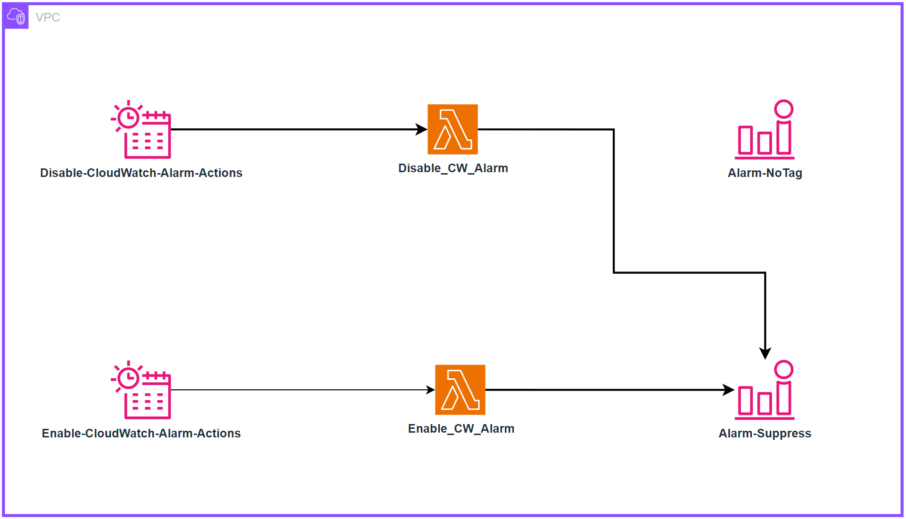

# Alarms

Alarm तब ट्रिगर होता है जब कोई प्रोब, मॉनिटर की स्थिति, या किसी threshold से ऊपर-नीचे वैल्यू बदलती है। एक सिंपल उदाहरण — वो alarm जो डिस्क फ़ुल होने या वेबसाइट डाउन होने पर ईमेल भेजता है। ज़्यादा एडवांस्ड alarms पूरी तरह प्रोग्रामेटिक होते हैं और ऑटो-स्केलिंग या पूरे सर्वर क्लस्टर बनाने जैसे कॉम्प्लेक्स इंटरैक्शन को ड्राइव करने के लिए इस्तेमाल होते हैं।

यूज़ केस चाहे जो हो, एक alarm किसी मेट्रिक की मौजूदा *स्थिति* बताता है। यह स्थिति सिस्टम के हिसाब से `OK`, `WARNING`, `ALERT`, या `NO DATA` हो सकती है।

Alarms एक टाइम पीरियड के लिए इस स्थिति को रिफ़्लेक्ट करते हैं और एक टाइमसीरीज़ के ऊपर बने होते हैं — यानी ये टाइमसीरीज़ *से* डिराइव्ड हैं। नीचे का ग्राफ़ दो alarms दिखाता है: एक वॉर्निंग threshold वाला, और दूसरा इस टाइमसीरीज़ की एवरेज वैल्यूज़ का। जैसा कि ट्रैफ़िक अमाउंट दिख रहा है, वॉर्निंग threshold alarm को तब breach स्थिति में होना चाहिए जब यह डिफ़ाइंड वैल्यू से नीचे गिरता है।


:::info
	Alarm का मकसद या तो कोई एक्शन (इंसानी या प्रोग्रामेटिक) ट्रिगर करना हो सकता है, या इंफ़ॉर्मेशनल (कि threshold breach हो गया) हो सकता है। Alarms किसी मेट्रिक की परफ़ॉर्मेंस में इनसाइट देते हैं।
:::
## एक्शनेबल चीज़ों पर अलर्ट करें

Alarm fatigue तब होता है जब लोगों को इतने ज़्यादा अलर्ट्स मिलते हैं कि वे इन्हें इग्नोर करना सीख जाते हैं। यह एक अच्छी तरह मॉनिटर किए गए सिस्टम का संकेत नहीं है! बल्कि यह एक एंटी-पैटर्न है।

:::info
	एक्शनेबल चीज़ों के लिए alarm बनाएँ, और हमेशा अपने [गोल्स](../guides/index.md#monitor-what-matters) से पीछे की ओर काम करें।
:::

उदाहरण के लिए, अगर आप एक ऐसी वेबसाइट चलाते हैं जिसके लिए फ़ास्ट रिस्पॉन्स टाइम ज़रूरी है, तो रिस्पॉन्स टाइम एक threshold से पार होने पर अलर्ट बनाएँ। और अगर आपने पहचाना है कि खराब परफ़ॉर्मेंस हाई CPU यूसेज से जुड़ी है, तो इस डेटा पॉइंट पर *प्रोएक्टिवली* अलर्ट करें इससे पहले कि यह प्रॉब्लम बन जाए। हालाँकि, अगर CPU यूसेज *आपके आउटकम को ख़तरे में नहीं डालता* तो हर जगह इस पर अलर्ट करने की ज़रूरत नहीं।

:::info
	अगर किसी alarm को आपको अलर्ट करने या कोई ऑटोमेटेड प्रोसेस ट्रिगर करने की ज़रूरत नहीं है, तो उसे अलर्ट करने का कोई मतलब नहीं। बेवजह के alarms से नोटिफ़िकेशन हटा दें।
:::

## "सब कुछ ठीक है" alarm से सावधान रहें

इसी तरह, एक कॉमन पैटर्न है "सब कुछ ठीक है" alarm — जब ऑपरेटर्स लगातार अलर्ट्स मिलने के इतने आदी हो जाते हैं कि सिर्फ़ तभी ध्यान देते हैं जब चीज़ें अचानक शांत हो जाएँ! यह ऑपरेट करने का बेहद ख़तरनाक तरीका है और ऑपरेशनल एक्सीलेंस के ख़िलाफ़ काम करता है।

:::warning
	"सब कुछ ठीक है" alarm को आम तौर पर एक इंसान को समझना पड़ता है! यह सेल्फ़-हीलिंग एप्लिकेशन जैसे पैटर्न को नामुमकिन बना देता है।[^1]
:::
## एग्रीगेशन से alarm fatigue से लड़ें

ऑब्ज़र्वेबिलिटी एक *इंसानी* समस्या है, तकनीकी नहीं। इसलिए, आपकी alarm नीति को ज़्यादा alarms बनाने के बजाय कम करने पर फ़ोकस करना चाहिए। जैसे-जैसे आप टेलीमेट्री कलेक्शन लागू करते हैं, एनवायरनमेंट से ज़्यादा अलर्ट्स आना स्वाभाविक है। लेकिन, सिर्फ़ [एक्शनेबल चीज़ों पर अलर्ट](#एक्शनेबल-चीज़ों-पर-अलर्ट-करें) करने में सावधानी बरतें। अगर अलर्ट की वजह एक्शनेबल नहीं है तो रिपोर्ट करने की ज़रूरत नहीं।

उदाहरण से समझते हैं: अगर आपके पास पाँच वेब सर्वर हैं जो बैकएंड के लिए एक डेटाबेस इस्तेमाल करते हैं, तो डेटाबेस डाउन होने पर वेब सर्वर्स को क्या होता है? कई लोगों को *कम से कम छह* अलर्ट्स मिलते हैं — वेब सर्वर्स से *पाँच* और डेटाबेस से *एक*!


लेकिन सिर्फ़ दो अलर्ट्स देना समझदारी है:

1. वेबसाइट डाउन है, और
1. डेटाबेस इसकी वजह है


:::info
	अपने अलर्ट्स को एग्रीगेट फ़ॉर्म में रिफ़ाइन करने से लोगों के लिए समझना आसान होता है, और फिर रनबुक और ऑटोमेशन बनाना भी आसान हो जाता है।
:::
## अपनी मौजूदा ITSM और सपोर्ट प्रोसेसेज़ इस्तेमाल करें

आपके मॉनिटरिंग और ऑब्ज़र्वेबिलिटी प्लेटफ़ॉर्म चाहे जो हों, उन्हें आपकी मौजूदा टूलचेन में इंटीग्रेट होना चाहिए।

:::info
	अपने अलर्ट्स से इन टूल्स में प्रोग्रामेटिक इंटीग्रेशन से ट्रबल टिकट और इश्यूज़ बनाएँ, इंसानी मेहनत हटाएँ और प्रोसेसेज़ को स्ट्रीमलाइन करें।
:::
इससे आप ज़रूरी ऑपरेशनल डेटा जैसे [DORA मेट्रिक्स](https://en.wikipedia.org/wiki/DevOps) हासिल कर सकते हैं।

## क्रॉन शेड्यूल पर Alarm एक्शन्स इनेबल करना

Alarms AWS रिसोर्सेज़ के लिए ज़रूरी मॉनिटरिंग क्षमताएँ देते हैं, जिससे टीमें मेट्रिक्स ट्रैक कर सकती हैं और threshold breach होने पर नोटिफ़िकेशन पा सकती हैं। यह मॉनिटरिंग ऑपरेशनल अवेयरनेस बनाए रखने के लिए ज़रूरी है, लेकिन एक कॉमन चुनौती तब आती है जब ऑर्गनाइज़ेशन्स शेड्यूल्ड रिसोर्स शटडाउन सहित कॉस्ट ऑप्टिमाइज़ेशन लागू करते हैं। इस केस में, प्रोडक्शन रिसोर्सेज़ वर्क आवर्स के बाहर (शाम 6 बजे से सुबह 6 बजे, सोमवार से शुक्रवार और वीकेंड) ऑटोमैटिकली बंद होने के लिए कॉन्फ़िगर होते हैं। लेकिन CloudWatch Alarms इन प्लान्ड डाउनटाइम पीरियड्स में भी मॉनिटर और नोटिफ़ाई करते रहते हैं — जिससे जानबूझकर ऑफ़लाइन रिसोर्सेज़ के लिए बेवजह अलर्ट्स आते हैं। EventBridge Schedules और Lambda functions इस्तेमाल करके एक सॉल्यूशन बनाया जा सकता है जो टैग के आधार पर alarms को प्रोग्रामेटिकली इनेबल/डिसेबल करता है — वर्क आवर्स में इफ़ेक्टिव मॉनिटरिंग और प्लान्ड डाउनटाइम में फ़ॉल्स अलर्ट्स ख़त्म।

### आर्किटेक्चर


### डिप्लॉयमेंट

रिपॉज़िटरी क्लोन करें:
```
git clone https://github.com/aws-observability/observability-best-practices.git
```

CloudFormation टेम्पलेट खोजें:
```
cd observability-best-practices/sandbox/cw-alarm-scheduler
```

उस डायरेक्टरी में 'cf.yaml' CloudFormation टेम्पलेट है।

CloudFormation कंसोल पर जाएँ और उस टेम्पलेट से एक स्टैक बनाएँ:

1. स्टैक डिटेल्स दें:
    1. स्टैक नाम दें:
        1. Stack name: $STACK-NAME
    2. पैरामीटर्स:
        1. DisableAlarmsCronSchedule: (alarm डिसेबल करने का टाइम डिफ़ाइन करने के लिए क्रॉन एक्सप्रेशन)
            1. Default cron(00 18 ? * 1-5 *)
        2. EnableAlarmsCronSchedule: (alarm इनेबल करने का टाइम डिफ़ाइन करने के लिए क्रॉन एक्सप्रेशन)
            1. Default cron(00 06 ? * 1-5 *)
        3. LambdaArchitecture: Lambda फ़ंक्शन आर्किटेक्चर चुनें (x86_64 या arm64)
            1. Default arm64
        4. ScheduleTimezone: ड्रॉपडाउन से टाइमज़ोन चुनें
            1. Default America/New_York
        5. SuppressTagKey: CloudWatch Alarms फ़िल्टर करने के लिए टैग की Key (जैसे, 'suppress' या 'snooze')
            1. Default "suppress"
        6. SuppressTagValue: CloudWatch Alarms फ़िल्टर करने के लिए टैग की Value (जैसे, 'true')
            1. Default "true"
    3. Next

इससे CloudFormation पैरामीटर्स में चुने गए key-value से टैग किए गए alarms आपके सेट किए क्रॉन शेड्यूल को फ़ॉलो करेंगे।

उदाहरण:

अगर आप SuppressTagKey में 'suppress' और SuppressTagValue में 'true' चुनते हैं, तो 'suppress':'true' टैग वाले सभी alarms DisableAlarmsCronSchedule और EnableAlarmsCronSchedule में सेट शेड्यूल फ़ॉलो करेंगे।

:::info
बिहेवियर:
जब alarms डिसेबल हैं:
* कोई अलर्ट या नोटिफ़िकेशन नहीं आएगी
* मेट्रिक कलेक्शन बिना रुकावट जारी रहता है

जब alarms फिर इनेबल होते हैं:
* नॉर्मल अलर्टिंग जल्दी ही फिर शुरू हो जाती है
:::

[^1]: इस पैटर्न के बारे में ज़्यादा जानकारी के लिए https://aws.amazon.com/blogs/apn/building-self-healing-infrastructure-as-code-with-dynatrace-aws-lambda-and-aws-service-catalog/ देखें।
