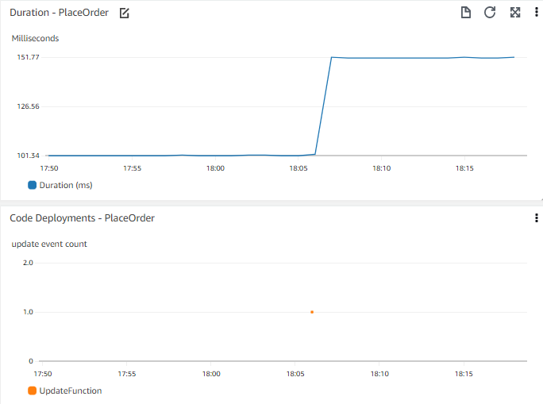

# Events

## इवेंट से हमारा मतलब क्या है?
आजकल कई आर्किटेक्चर इवेंट-ड्रिवन हैं। इवेंट-ड्रिवन आर्किटेक्चर में, इवेंट्स अलग-अलग सिस्टम से आने वाले सिग्नल हैं जिन्हें हम कैप्चर करते हैं और दूसरे सिस्टम को पास करते हैं। एक इवेंट आम तौर पर स्टेट में बदलाव या अपडेट होता है।

उदाहरण के लिए, एक ई-कॉमर्स सिस्टम में जब कोई आइटम कार्ट में ऐड होता है तब एक इवेंट हो सकता है। इस इवेंट को कैप्चर करके सिस्टम के शॉपिंग कार्ट पार्ट को पास किया जा सकता है ताकि आइटम डिटेल्स के साथ कार्ट में आइटम्स की संख्या और कॉस्ट अपडेट हो सके।

:::info
	कुछ कस्टमर्स के लिए इवेंट एक *माइलस्टोन* हो सकता है, जैसे खरीदारी पूरी होना। वर्कफ़्लो पूरा होने के उस पल को इवेंट मानने का तर्क है, लेकिन हमारे मकसद के लिए हम माइलस्टोन को अपने आप में इवेंट नहीं मानते।
:::
## इवेंट्स काम के क्यों हैं?
आपके ऑब्ज़र्वेबिलिटी सॉल्यूशन में इवेंट्स दो मुख्य तरीकों से काम आ सकते हैं। पहला — दूसरे डेटा के कॉन्टेक्स्ट में इवेंट्स विज़ुअलाइज़ करना। दूसरा — इवेंट्स के आधार पर एक्शन लेना।

:::info
	इवेंट्स का मकसद आपके वर्कलोड में हो रहे बदलावों और एक्शन्स के बारे में लोगों या मशीनों को काम की जानकारी देना है।
:::

## इवेंट्स विज़ुअलाइज़ करना
कई इवेंट सिग्नल ऐसे होते हैं जो सीधे आपके एप्लिकेशन से नहीं आते, लेकिन एप्लिकेशन परफ़ॉर्मेंस पर असर डाल सकते हैं या रूट कॉज़ में एक्स्ट्रा इनसाइट दे सकते हैं। डैशबोर्ड इवेंट्स विज़ुअलाइज़ करने का सबसे कॉमन तरीका है, हालाँकि कुछ एनालिटिक्स या बिज़नेस इंटेलिजेंस टूल्स भी इस काम आते हैं। ईमेल या इंस्टैंट मैसेजिंग ऐप्स भी आसानी से विज़ुअलाइज़ेशन दिखा सकते हैं।

आपके वेब फ़्रंट एंड पर ऑर्डर देने में लगने वाले टाइम जैसे एप्लिकेशन परफ़ॉर्मेंस का टाइमचार्ट सोचें। टाइमचार्ट दिखाता है कि कुछ दिन पहले रिस्पॉन्स टाइम में अचानक बदलाव आया। यह जानना काम का हो सकता है कि हाल में कोई डिप्लॉयमेंट हुई है या नहीं। हालिया डिप्लॉयमेंट का टाइमचार्ट उसी चार्ट के साथ या उस पर सुपरइम्पोज़ करके देखें?

:::tip
	सोचें कि कौन से इवेंट्स बड़ा कॉन्टेक्स्ट समझने में आपके काम आ सकते हैं। आपके लिए ज़रूरी इवेंट्स हो सकते हैं — कोड डिप्लॉयमेंट, इंफ्रास्ट्रक्चर चेंज इवेंट्स, नया डेटा ऐड करना (जैसे बिक्री के लिए नए आइटम पब्लिश करना, या बड़ी संख्या में नए यूज़र्स ऐड करना), या फ़ंक्शनैलिटी बदलना/जोड़ना (जैसे लोगों द्वारा कार्ट में आइटम ऐड करने का तरीका बदलना)।
:::

:::info
	दूसरे ज़रूरी मेट्रिक डेटा के साथ इवेंट्स विज़ुअलाइज़ करें ताकि आप [इवेंट्स कोरिलेट](./metrics.md#correlate-with-operational-metric-data) कर सकें।
:::

## इवेंट्स पर एक्शन लेना
ऑब्ज़र्वेबिलिटी की दुनिया में, ट्रिगर हुआ alarm एक कॉमन इवेंट है। इस इवेंट में alarm का आइडेंटिफ़ायर, alarm की स्टेट (जैसे `IN ALARM` या `OK`), और ट्रिगर करने वाली डिटेल्स होती हैं। कई बार यह alarm इवेंट डिटेक्ट होता है और एक ईमेल नोटिफ़िकेशन भेजी जाती है। यह alarm पर एक्शन का उदाहरण है।

Alarm नोटिफ़िकेशन ऑब्ज़र्वेबिलिटी में अहम है — इसी तरह हम सही लोगों को बताते हैं कि प्रॉब्लम है। लेकिन जब इवेंट्स पर एक्शन आपके ऑब्ज़र्वेबिलिटी सॉल्यूशन में मैच्योर हो जाता है, तो यह बिना इंसानी दख़ल के ऑटोमैटिकली प्रॉब्लम सॉल्व कर सकता है।

### लेकिन कौन सा एक्शन लें?
पहले यह समझे बिना कि कौन सा एक्शन डिटेक्ट हुई प्रॉब्लम को ठीक करेगा, हम एक्शन ऑटोमेट नहीं कर सकते। आपकी ऑब्ज़र्वेबिलिटी जर्नी की शुरुआत में यह अक्सर क्लियर नहीं होता। लेकिन जैसे-जैसे प्रॉब्लम सॉल्व करने का एक्सपीरियंस बढ़ता है, आप अपने alarms को उन एरियाज़ कैच करने के लिए ट्यून कर सकते हैं जहाँ एक पहचाना हुआ एक्शन है। आपकी alarm सर्विस में बिल्ट-इन एक्शन्स हो सकते हैं, या आपको alarm इवेंट खुद कैप्चर करके सॉल्यूशन स्क्रिप्ट करना पड़ सकता है।

:::info
	[हॉरिज़ॉन्टल पॉड ऑटोस्केलिंग](https://kubernetes.io/docs/tasks/run-application/horizontal-pod-autoscale/) जैसे ऑटो-स्केलिंग सिस्टम इसी सिद्धांत का इम्प्लीमेंटेशन हैं। Kubernetes बस इस ऑटोमेशन को आपके लिए एब्स्ट्रैक्ट कर देता है।
:::
Alarm फ़्रीक्वेंसी और रिज़ॉल्यूशन पर डेटा होने से आपको तय करने में मदद मिलेगी कि ऑटोमेशन पॉसिबल है या नहीं। सिम्पटम-बेस्ड ब्रॉड alarms प्रॉब्लम पकड़ने में अच्छे हैं, लेकिन ऑटो-रेमेडिएशन से जोड़ने के लिए ज़्यादा स्पेसिफ़िक क्राइटेरिया चाहिए।

ऐसा करते समय, अपने इंसिडेंट मैनेजमेंट/टिकटिंग/ITSM टूल के साथ इंटीग्रेशन पर ध्यान दें। कई ऑर्गनाइज़ेशन्स इंसिडेंट्स और उनके रिज़ॉल्यूशन तथा Mean Time to Resolve (MTTR) जैसी मेट्रिक्स ट्रैक करती हैं। अगर आप ऐसा करते हैं, तो अपने *ऑटोमेटेड* रिज़ॉल्यूशन्स को भी इसी तरह कैप्चर करें। इससे आप ऑटोमैटिकली सॉल्व होने वाली प्रॉब्लम्स का टाइप और प्रपोर्शन समझ सकते हैं, साथ ही अंडरलाइंग पैटर्न खोज सकते हैं।

:::tip
	सिर्फ़ इसलिए कि किसी को मैन्युअली प्रॉब्लम फ़िक्स नहीं करनी पड़ी, इसका मतलब यह नहीं कि आपको अंडरलाइंग कॉज़ की जाँच नहीं करनी चाहिए।
:::
उदाहरण — हर बार जब सर्वर अनरिस्पॉन्सिव हो तो रीस्टार्ट करना। रीस्टार्ट सिस्टम को चालू रखता है, लेकिन अनरिस्पॉन्सिवनेस की वजह क्या है? यह कितनी बार होता है, कोई पैटर्न है क्या (जैसे रिपोर्ट जेनरेशन, हाई यूज़र काउंट, या सिस्टम बैकअप से मैच करता हो) — यह तय करेगा कि आप रूट कॉज़ समझने और फ़िक्स करने में कितनी प्रायोरिटी लगाते हैं।

:::info
	अपने [की परफ़ॉर्मेंस इंडिकेटर्स](./metrics.md#know-your-key-performance-indicatorskpis-and-measure-them) से जुड़ा *हर* इवेंट मैसेज बस में भेजने पर विचार करें। ध्यान दें कि कुछ ऑब्ज़र्वेबिलिटी सॉल्यूशन्स बिना एक्सप्लिसिट कॉन्फ़िगरेशन के यह ट्रांसपैरेंटली करते हैं।
:::
## अपने ऑब्ज़र्वेबिलिटी प्लेटफ़ॉर्म में इवेंट्स लाना
जब आपने ज़रूरी इवेंट्स पहचान लिए, तो सोचना होगा कि इन्हें अपने ऑब्ज़र्वेबिलिटी प्लेटफ़ॉर्म में लाने का सबसे अच्छा तरीका क्या है।
आपके प्लेटफ़ॉर्म में इवेंट्स कैप्चर करने का कोई स्पेसिफ़िक तरीका हो सकता है, या आपको इन्हें लॉग्स या मेट्रिक डेटा के रूप में लाना पड़ सकता है।

:::note
	एक सिंपल तरीका है इवेंट्स को लॉग फ़ाइल में लिखना और उन्हें वैसे ही इनजेस्ट करना जैसे आप अपने बाकी लॉग इवेंट्स करते हैं।
:::

एक्सप्लोर करें कि आपका सिस्टम इन्हें कैसे विज़ुअलाइज़ करने देता है। क्या आप अपने एप्लिकेशन से जुड़े इवेंट्स पहचान सकते हैं? क्या आप डेटा को एक ही चार्ट पर जोड़ सकते हैं? भले ही कुछ स्पेसिफ़िक न हो, आपको कम से कम विज़ुअल कोरिलेशन के लिए अपने बाकी डेटा के साथ एक टाइमचार्ट बनाने में सक्षम होना चाहिए। टाइम ऐक्सिस को सेम रखें, और आसान तुलना के लिए इन्हें वर्टिकली स्टैक करें।

