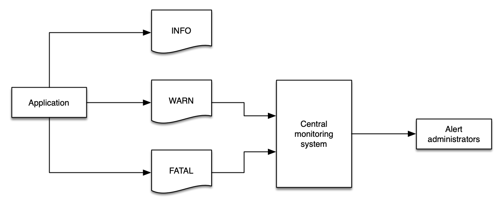

# Logs

Logs किसी एप्लिकेशन या उपकरण द्वारा भेजे गए संदेशों की एक श्रृंखला है, जो एक इवेंट या कभी-कभी उस एप्लिकेशन के स्वास्थ्य के बारे में एक या अधिक पंक्तियों के विवरण द्वारा दर्शाए जाते हैं। आम तौर पर, logs एक फ़ाइल में भेजे जाते हैं, हालाँकि कभी-कभी वे एक collector को भेजे जाते हैं जो विश्लेषण और एकत्रीकरण करता है। कई पूर्ण-विशेषता वाले log aggregator, framework और उत्पाद हैं जो किसी भी मात्रा में - मेगाबाइट प्रति दिन से लेकर टेराबाइट प्रति घंटे तक - log डेटा उत्पन्न, इनजेस्ट और प्रबंधित करने का कार्य करते हैं।

Logs एक समय में एक ही एप्लिकेशन द्वारा उत्सर्जित होते हैं और आम तौर पर उस *एक एप्लिकेशन* के दायरे से संबंधित होते हैं - हालाँकि डेवलपर्स logs को जितना चाहें उतना जटिल और सूक्ष्म बना सकते हैं। हमारे उद्देश्यों के लिए हम logs को [traces](./traces.md) से मौलिक रूप से भिन्न सिग्नल मानते हैं, जो एक से अधिक एप्लिकेशन या सेवा से इवेंट से बने होते हैं, और सेवाओं के बीच कनेक्शन के बारे में संदर्भ जैसे प्रतिक्रिया विलंबता, सेवा दोष, अनुरोध पैरामीटर आदि शामिल होते हैं।

Logs में डेटा एक अवधि में एकत्रित भी हो सकता है। उदाहरण के लिए, वे सांख्यिकीय हो सकते हैं (जैसे पिछले मिनट में सेवा किए गए अनुरोधों की संख्या)। वे संरचित, मुक्त-रूप, विस्तृत और किसी भी लिखित भाषा में हो सकते हैं।

लॉगिंग के प्राथमिक उपयोग मामले निम्नलिखित का वर्णन करना हैं:

* एक इवेंट, इसकी स्थिति और अवधि, तथा अन्य महत्वपूर्ण आँकड़े सहित
* उस इवेंट से संबंधित त्रुटियाँ या चेतावनियाँ (जैसे stack traces, timeouts)
* एप्लिकेशन लॉन्च, स्टार्ट-अप और शटडाउन संदेश

:::note
	Logs *अपरिवर्तनीय* होने के लिए अभिप्रेत हैं, और कई log प्रबंधन सिस्टम में log डेटा को संशोधित करने के प्रयासों से सुरक्षा और पता लगाने के तंत्र शामिल होते हैं।
:::
आपकी लॉगिंग आवश्यकताओं से अलग, ये हमारे द्वारा पहचानी गई सर्वोत्तम प्रथाएँ हैं।

## संरचित लॉगिंग सफलता की कुंजी है

कई सिस्टम अर्ध-संरचित प्रारूप में logs उत्सर्जित करते हैं। उदाहरण के लिए, एक Apache वेब सर्वर इस तरह logs लिख सकता है, प्रत्येक पंक्ति एक वेब अनुरोध से संबंधित है:

	192.168.2.20 - - [28/Jul/2006:10:27:10 -0300] "GET /cgi-bin/try/ HTTP/1.0" 200 3395
	127.0.0.1 - - [28/Jul/2006:10:22:04 -0300] "GET / HTTP/1.0" 200 2216

जबकि एक Java stack trace एक एकल इवेंट हो सकता है जो कई पंक्तियों में फैला है और कम संरचित है:

	Exception in thread "main" java.lang.NullPointerException
        at com.example.myproject.Book.getTitle(Book.java:16)
        at com.example.myproject.Author.getBookTitles(Author.java:25)
        at com.example.myproject.Bootstrap.main(Bootstrap.java:14)

और एक Python error log इवेंट इस तरह दिख सकता है:
```
	Traceback (most recent call last):
	  File "e.py", line 7, in <module>
	    raise TypeError("Again !?!")
	TypeError: Again !?!
```
इन तीन उदाहरणों में से, केवल पहला मनुष्यों *और* log एकत्रीकरण सिस्टम दोनों द्वारा आसानी से पार्स किया जा सकता है। संरचित logs का उपयोग करने से log डेटा को जल्दी और प्रभावी ढंग से प्रोसेस करना आसान हो जाता है, जो मनुष्यों और मशीनों दोनों को वह डेटा देता है जिसकी उन्हें तुरंत वह खोजने के लिए आवश्यकता है जो वे ढूंढ रहे हैं।

सबसे आम रूप से समझा जाने वाला log प्रारूप JSON है, जहाँ इवेंट का प्रत्येक घटक एक key/value pair के रूप में दर्शाया जाता है। JSON में, ऊपर का Python उदाहरण इस तरह फिर से लिखा जा सकता है:
```
	{
		"level", "ERROR"
		"file": "e.py",
		"line": 7,
		"error": "TypeError(\"Again !?!\")"
	}
```
संरचित logs का उपयोग आपके डेटा को एक log सिस्टम से दूसरे में ले जाने योग्य बनाता है, विकास को सरल बनाता है, और ऑपरेशनल निदान को तेज़ (कम त्रुटियों के साथ) बनाता है। इसके अलावा, JSON का उपयोग log संदेश के schema को वास्तविक डेटा के साथ एम्बेड करता है, जो परिष्कृत log विश्लेषण सिस्टम को स्वचालित रूप से आपके संदेशों को इंडेक्स करने में सक्षम बनाता है।

## Log level का उचित उपयोग करें

दो प्रकार के logs हैं: वे जिनका एक *level* होता है और वे जो इवेंट की श्रृंखला हैं। जिनमें level होता है, उनके लिए ये एक सफल लॉगिंग रणनीति का महत्वपूर्ण घटक हैं। Log level एक framework से दूसरे में थोड़े भिन्न होते हैं, लेकिन सामान्यतः वे इस संरचना का पालन करते हैं:

| Level | विवरण |
| ----- | ----------- |
| `DEBUG` | सूक्ष्म सूचनात्मक इवेंट जो एप्लिकेशन को डिबग करने में सबसे उपयोगी हैं। ये आम तौर पर डेवलपर्स के लिए मूल्यवान हैं और बहुत विस्तृत हैं। |
| `INFO` | सूचनात्मक संदेश जो एप्लिकेशन की प्रगति को मोटे स्तर पर दर्शाते हैं। |
| `WARN` | संभावित हानिकारक स्थितियाँ जो एप्लिकेशन के लिए जोखिम इंगित करती हैं। ये एप्लिकेशन में alarm ट्रिगर कर सकती हैं। |
| `ERROR` | त्रुटि इवेंट जो अभी भी एप्लिकेशन को चलने दे सकते हैं। ये ध्यान आवश्यक alarm ट्रिगर करने की संभावना रखते हैं। |
| `FATAL` | अत्यंत गंभीर त्रुटि इवेंट जो संभवतः एप्लिकेशन को बंद कर देंगे। |

:::info
	निहित रूप से जिन logs का कोई स्पष्ट level नहीं है उन्हें `INFO` माना जा सकता है, हालाँकि यह व्यवहार एप्लिकेशन के बीच भिन्न हो सकता है।
:::
प्रोग्रामिंग भाषा और framework के आधार पर `CRITICAL` और `NONE` भी सामान्य log level हैं। `ALL` और `NONE` भी सामान्य हैं, हालाँकि हर एप्लिकेशन स्टैक में नहीं पाए जाते।

Log level आपके monitoring और observability समाधान को आपके वातावरण के स्वास्थ्य के बारे में सूचित करने के लिए महत्वपूर्ण हैं, और log डेटा को एक तार्किक मान का उपयोग करके इस डेटा को आसानी से व्यक्त करना चाहिए।

:::tip
	`WARN` पर बहुत अधिक डेटा लॉग करना आपके monitoring सिस्टम को सीमित मूल्य के डेटा से भर देगा, और फिर आप संदेशों की विशाल मात्रा में महत्वपूर्ण डेटा खो सकते हैं।
:::


:::info
	एक मानकीकृत log level रणनीति का उपयोग करने से स्वचालन आसान हो जाता है, और डेवलपर्स को समस्याओं के मूल कारण तक जल्दी पहुँचने में मदद मिलती है।
:::

:::warning
	Log level के लिए मानक दृष्टिकोण के बिना, [अपने logs को फ़िल्टर करना](#स्रोत-के-निकट-logs-फ़िल्टर-करें) एक बड़ी चुनौती है।
:::
## स्रोत के निकट logs फ़िल्टर करें

जहाँ भी संभव हो, स्रोत के जितना संभव हो उतना निकट logs की मात्रा कम करें। इस सर्वोत्तम प्रथा का पालन करने के कई कारण हैं:

* Logs को इनजेस्ट करने में हमेशा समय, धन और संसाधन खर्च होते हैं।
* संवेदनशील डेटा (जैसे व्यक्तिगत रूप से पहचान योग्य डेटा) को डाउनस्ट्रीम सिस्टम से फ़िल्टर करने से डेटा लीकेज से जोखिम एक्सपोज़र कम होता है।
* डाउनस्ट्रीम सिस्टम में डेटा स्रोतों के समान ऑपरेशनल चिंताएँ नहीं हो सकतीं। उदाहरण के लिए, एक एप्लिकेशन से `INFO` logs एक monitoring और अलर्टिंग सिस्टम के लिए कोई रुचि का नहीं हो सकता जो `CRITICAL` या `FATAL` संदेशों पर नज़र रखता है।
* Log सिस्टम और नेटवर्क पर अनुचित तनाव और ट्रैफ़िक नहीं डाला जाना चाहिए।

:::info
	अपनी लागत कम रखने, डेटा एक्सपोज़र के जोखिम को कम करने, और प्रत्येक घटक को [महत्वपूर्ण चीज़ों](../guides/index.md#monitor-what-matters) पर केंद्रित करने के लिए अपने log को स्रोत के निकट फ़िल्टर करें।
:::

:::tip
	आपकी आर्किटेक्चर के आधार पर, आप अपने एप्लिकेशन *और* वातावरण में परिवर्तन एक ही ऑपरेशन में डिप्लॉय करने के लिए infrastructure as code (IaC) का उपयोग करना चाह सकते हैं। यह दृष्टिकोण आपको एप्लिकेशन के साथ अपने log फ़िल्टर पैटर्न भी डिप्लॉय करने की अनुमति देता है, जिससे उन्हें समान कठोरता और उपचार मिलता है।
:::
## दोहरे-इनजेशन एंटी-पैटर्न से बचें

एक सामान्य पैटर्न जिसका प्रशासक अनुसरण करते हैं वह है अपने सभी लॉगिंग डेटा को एक ही सिस्टम में कॉपी करना ताकि एक ही स्थान से सभी logs को क्वेरी किया जा सके। इसके कुछ मैन्युअल वर्कफ़्लो लाभ हैं, हालाँकि यह पैटर्न अतिरिक्त लागत, जटिलता, विफलता बिंदु और ऑपरेशनल ओवरहेड पेश करता है।


:::info
	जहाँ संभव हो, अपने वातावरण से log डेटा के पूर्ण प्रसार से बचने के लिए [log levels](#log-level-का-उचित-उपयोग-करें) और [log filtering](#स्रोत-के-निकट-logs-फ़िल्टर-करें) के संयोजन का उपयोग करें।
:::

:::info
	कुछ संगठनों या वर्कलोड को नियामक आवश्यकताओं को पूरा करने, एक सुरक्षित स्थान में logs संग्रहीत करने, गैर-अस्वीकरण प्रदान करने, या अन्य उद्देश्यों को प्राप्त करने के लिए [log shipping](https://en.wikipedia.org/wiki/Log_shipping) की आवश्यकता होती है। यह log डेटा को पुनः-इनजेस्ट करने का एक सामान्य उपयोग मामला है। ध्यान दें कि इन log archives में प्रवेश करने वाले अनावश्यक डेटा की मात्रा को कम करने के लिए [log levels](#log-level-का-उचित-उपयोग-करें) और [log filtering](#स्रोत-के-निकट-logs-फ़िल्टर-करें) का उचित अनुप्रयोग अभी भी उपयुक्त है।
:::
## अपने logs से metric डेटा एकत्र करें

आपके logs में [metrics](./metrics.md) हैं जो एकत्र होने की प्रतीक्षा कर रहे हैं! ISV समाधान या ऐसे एप्लिकेशन जो आपने स्वयं नहीं लिखे हैं, वे भी अपने logs में मूल्यवान डेटा उत्सर्जित करते हैं जिससे आप समग्र वर्कलोड स्वास्थ्य में सार्थक अंतर्दृष्टि प्राप्त कर सकते हैं। सामान्य उदाहरणों में शामिल हैं:

* डेटाबेस से धीमा क्वेरी समय
* वेब सर्वर से अपटाइम
* ट्रांज़ैक्शन प्रोसेसिंग समय
* समय के साथ `ERROR` या `WARNING` इवेंट की गणना
* अपग्रेड के लिए उपलब्ध पैकेजों की कच्ची गणना

:::tip
	यह डेटा एक स्थिर log फ़ाइल में बंद होने पर कम उपयोगी है। सर्वोत्तम प्रथा यह है कि प्रमुख metric डेटा की पहचान करें और फिर इसे अपने metric सिस्टम में प्रकाशित करें जहाँ इसे अन्य सिग्नल के साथ सहसंबंधित किया जा सके।
:::
## `stdout` पर लॉग करें

जहाँ संभव हो, एप्लिकेशन को फ़ाइल या सॉकेट जैसे निश्चित स्थान के बजाय `stdout` पर लॉग करना चाहिए। यह log agent को आपके observability समाधान के लिए समझ में आने वाले नियमों के आधार पर आपके log इवेंट को एकत्र और रूट करने में सक्षम बनाता है। सभी एप्लिकेशन के लिए संभव नहीं होते हुए भी, यह कंटेनराइज़्ड वर्कलोड के लिए सर्वोत्तम प्रथा है।

:::note
	जबकि एप्लिकेशन को अपनी लॉगिंग प्रथाओं में सामान्य और सरल होना चाहिए, लॉगिंग समाधानों से शिथिल रूप से युग्मित (loosely coupled) रहते हुए, log डेटा के प्रसारण के लिए अभी भी `stdout` से फ़ाइल में डेटा भेजने के लिए एक [log collector](../tools/logs/index.md) की आवश्यकता होती है। महत्वपूर्ण अवधारणा यह है कि आपके एप्लिकेशन और बिज़नेस लॉजिक को आपकी लॉगिंग इंफ्रास्ट्रक्चर पर निर्भर होने से बचाना है - दूसरे शब्दों में, आपको चिंताओं को अलग करने के लिए काम करना चाहिए।
:::

:::info
	अपने एप्लिकेशन को अपने log प्रबंधन से अलग करने से आप कोड परिवर्तन के बिना अपने समाधान को अनुकूलित और विकसित कर सकते हैं, जिससे आपके वातावरण में किए गए परिवर्तनों के संभावित blast radius को न्यूनतम किया जा सकता है।
:::
