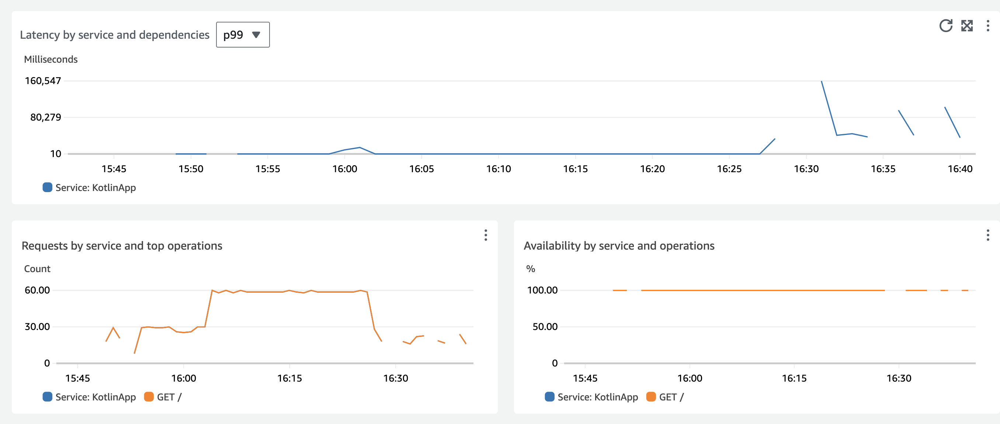

# Kotlin सेवाओं के लिए Application Signals

## परिचय

Kotlin वेब एप्लिकेशन के प्रदर्शन और स्वास्थ्य की निगरानी करना विभिन्न घटकों के बीच जटिल इंटरैक्शन के कारण चुनौतीपूर्ण हो सकता है। [Kotlin](https://kotlinlang.org/) वेब सेवाएँ आम तौर पर Java Archive (jar) फ़ाइलों में बनाई जाती हैं, जिन्हें Java चलाने वाले किसी भी प्लेटफ़ॉर्म पर डिप्लॉय किया जा सकता है। ये एप्लिकेशन अक्सर डिस्ट्रीब्यूटेड वातावरण में संचालित होते हैं, जिसमें डेटाबेस, बाहरी API और कैशिंग लेयर जैसे कई इंटरकनेक्टेड घटक शामिल होते हैं। यह जटिलता आपके Mean Time to Resolution (MTTR) को काफी बढ़ा सकती है।

इस गाइड में, हम Linux EC2 सर्वर पर चल रही Kotlin वेब सेवाओं को ऑटो-इंस्ट्रुमेंट करने का तरीका दिखाएँगे। [CloudWatch Application Signals](https://docs.aws.amazon.com/AmazonCloudWatch/latest/monitoring/CloudWatch-Application-Monitoring-Sections.html) को सक्षम करने से [AWS Distro for OpenTelemetry](https://aws-otel.github.io/docs/introduction) (ADOT) Java Auto-Instrumentation Agent का उपयोग करके बिना कोई कोड परिवर्तन किए आपके एप्लिकेशन से metrics और traces एकत्र किए जा सकते हैं। आप कॉल वॉल्यूम, उपलब्धता, विलंबता, दोष और त्रुटियों जैसे प्रमुख metrics का लाभ उठाकर अपने एप्लिकेशन सेवाओं की वर्तमान ऑपरेशनल स्थिति को जल्दी से देख और ट्राइएज कर सकते हैं, और सत्यापित कर सकते हैं कि वे दीर्घकालिक प्रदर्शन और व्यावसायिक लक्ष्यों को पूरा कर रही हैं या नहीं।

## पूर्वापेक्षाएँ

- CloudWatch Application Signals के साथ इंटरैक्ट करने के लिए उचित [IAM अनुमतियों](https://docs.aws.amazon.com/AmazonCloudWatch/latest/monitoring/Application_Signals_Permissions.html) वाला एक Linux EC2 इंस्टेंस। यह गाइड इसके लिए [Amazon Linux](https://aws.amazon.com/linux/amazon-linux-2023/) इंस्टेंस का उपयोग करती है, इसलिए यदि आप कुछ और उपयोग कर रहे हैं तो आपकी कमांड थोड़ी भिन्न हो सकती हैं।
- इंस्टेंस में [SSH](https://docs.aws.amazon.com/AWSEC2/latest/UserGuide/connect-linux-inst-ssh.html) करने की क्षमता।

## समाधान अवलोकन

उच्च स्तर पर, हम निम्नलिखित चरण करेंगे।

- CloudWatch Application Signals सक्षम करना।
- Fat jar में [ktor वेब सेवा](https://ktor.io/) डिप्लॉय करना।
- वेब सेवा से Application Signals प्राप्त करने के लिए कॉन्फ़िगर किया गया CloudWatch agent इंस्टॉल करना।
- [ADOT](https://aws-otel.github.io/docs/getting-started/java-sdk/auto-instr#introduction) Auto Instrumentation Agent डाउनलोड करना।
- सेवा को ऑटो-इंस्ट्रुमेंट करने के लिए java agent के साथ अपनी kotlin सेवा jar चलाना।
- टेलीमेट्री उत्पन्न करने के लिए कुछ टेस्ट चलाना।

### आर्किटेक्चर डायग्राम


### CloudWatch Application Signals सक्षम करें

अपने अकाउंट में चरण 1: [Application Signals सक्षम करें](https://docs.aws.amazon.com/AmazonCloudWatch/latest/monitoring/CloudWatch-Application-Signals-Enable-EC2.html#CloudWatch-Application-Signals-EC2-Grant) के निर्देशों का पालन करें।

### Ktor वेब सेवा डिप्लॉय करें
[Ktor](https://ktor.io/) वेब सेवाएँ बनाने के लिए एक लोकप्रिय Kotlin framework है। यह आपको असिंक्रोनस सर्वर-साइड एप्लिकेशन के साथ जल्दी शुरू करने की अनुमति देता है।

कार्य निर्देशिका बनाएँ
```
mkdir kotlin-signals && cd kotlin-signals
```

Ktor उदाहरण रिपॉज़िटरी क्लोन करें
```
git clone https://github.com/ktorio/ktor-samples.git && cd ktor-samples/structured-logging
```

एप्लिकेशन बिल्ड करें
```
./gradlew build && cd build/libs
```

एप्लिकेशन चलने का परीक्षण करें
```
java -jar structured-logging-all.jar
```

यह मानते हुए कि सेवा सही तरीके से बिल्ड और चली, अब हम इसे `ctrl + c` से बंद कर सकते हैं

### CloudWatch Agent कॉन्फ़िगर करें
Amazon Linux इंस्टेंस में डिफ़ॉल्ट रूप से CloudWatch agent इंस्टॉल होता है। यदि आपके इंस्टेंस में नहीं है, तो आपको इसे [इंस्टॉल](https://docs.aws.amazon.com/AmazonCloudWatch/latest/monitoring/install-CloudWatch-Agent-on-EC2-Instance.html) करना होगा।

इंस्टॉल होने के बाद, अब हम कॉन्फ़िगरेशन फ़ाइल बना सकते हैं।
```
sudo nano /opt/aws/amazon-cloudwatch-agent/bin/app-signals-config.json
```

निम्नलिखित कॉन्फ़िगरेशन को फ़ाइल में कॉपी और पेस्ट करें
```
{
    "traces": {
        "traces_collected": {
            "app_signals": {}
        }
    },
    "logs": {
        "metrics_collected": {
            "app_signals": {}
        }
    }
}
```

फ़ाइल सेव करें और फिर हमारे द्वारा बनाए गए config के साथ CloudWatch agent शुरू करें
```
sudo /opt/aws/amazon-cloudwatch-agent/bin/amazon-cloudwatch-agent-ctl -a fetch-config -m ec2 -s -c file:/opt/aws/amazon-cloudwatch-agent/bin/app-signals-config.json
```

### ADOT Auto Instrumentation Agent डाउनलोड करें

उस डायरेक्टरी में नेविगेट करें जिसमें आपकी jar फ़ाइल है, हम इस डेमो के लिए agent को यहाँ रखेंगे। वास्तविक परिदृश्य में यह संभवतः अपने फ़ोल्डर में होगा।

```
cd kotlin-signals/ktor-samples/structured-logging/build/libs
```

Auto Instrumentation Agent डाउनलोड करें
```
wget https://github.com/aws-observability/aws-otel-java-instrumentation/releases/latest/download/aws-opentelemetry-agent.jar
```

### ADOT agent के साथ अपनी Ktor सेवा चलाएँ
```
OTEL_RESOURCE_ATTRIBUTES=service.name=KotlinApp,service.namespace=MyKotlinService,aws.hostedin.environment=EC2 \
OTEL_AWS_APPLICATION_SIGNALS_ENABLED=true \
OTEL_AWS_APPLICATION_SIGNALS_EXPORTER_ENDPOINT=http://localhost:4316/v1/metrics \
OTEL_EXPORTER_OTLP_PROTOCOL=http/protobuf \
OTEL_EXPORTER_OTLP_TRACES_ENDPOINT=http://localhost:4316/v1/traces \
OTEL_METRICS_EXPORTER=none \
OTEL_LOGS_EXPORT=none \
java -javaagent:aws-opentelemetry-agent.jar -jar structured-logging-all.jar
```

### टेलीमेट्री बनाने के लिए सेवा पर ट्रैफ़िक उत्पन्न करें
```
for i in {1..1800}; do curl http://localhost:8080 && sleep 2; done
```

## अपनी टेलीमेट्री की समीक्षा करें

अब आप CloudWatch के 'Services' सेक्शन में Kotlin सेवा को दिखाई देते हुए देख सकते हैं


आप 'Service Map' में भी हमारी सेवा देख सकते हैं


इंस्ट्रुमेंटेशन Latency जैसे मूल्यवान metrics प्रदान करता है:



### अगले चरण

यहाँ से आपके अगले चरण [Application Signals अनुभव](https://docs.aws.amazon.com/AmazonCloudWatch/latest/monitoring/CloudWatch-Application-Monitoring-Sections.html) का और अन्वेषण करना होगा जिसमें आपकी सेवा के लिए [SLOs](https://docs.aws.amazon.com/AmazonCloudWatch/latest/monitoring/CloudWatch-ServiceLevelObjectives.html) बनाना शामिल है। एक और अच्छा अगला कदम Ktor में अधिक kotlin microservices बनाना होगा ताकि आप एक अधिक जटिल बैकएंड तैयार कर सकें। डिस्ट्रीब्यूटेड, जटिल वातावरण वे हैं जहाँ Application Signals जैसे टूल में सबसे अधिक लाभ दिखता है।

### सफ़ाई

अपना EC2 इंस्टेंस टर्मिनेट करें और `/aws/appsignals/generic` log group हटाएँ।
