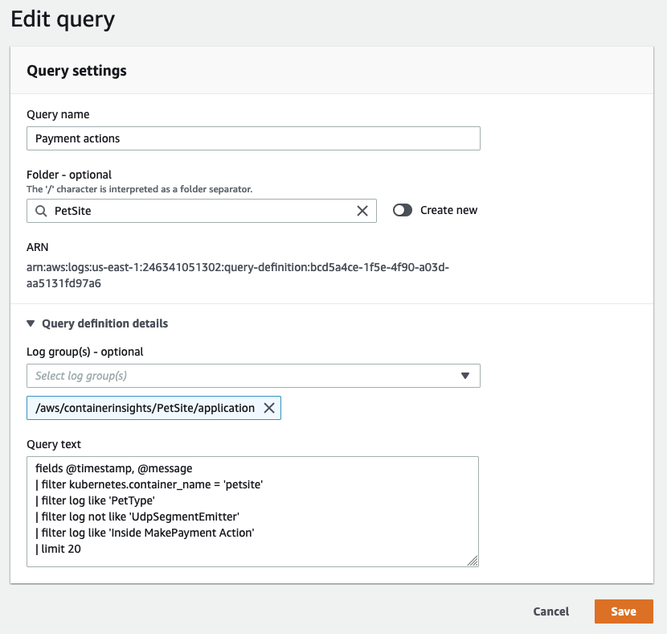
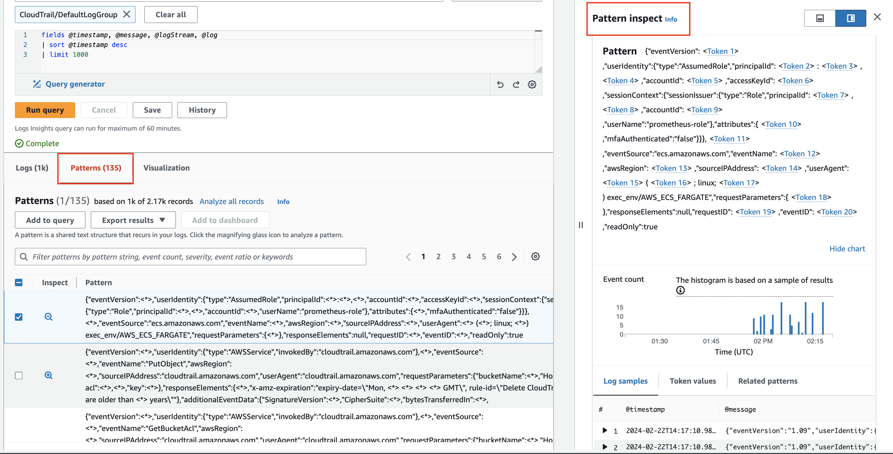

# लॉगिंग

लॉगिंग टूल का चयन डेटा ट्रांसमिशन, फ़िल्टरिंग, रिटेंशन, कैप्चर, और आपका डेटा उत्पन्न करने वाले एप्लिकेशन के साथ एकीकरण की आपकी आवश्यकताओं से जुड़ा है। Observability के लिए Amazon Web Services का उपयोग करते समय (चाहे आप ऑन-प्रिमाइसेस या किसी अन्य क्लाउड वातावरण में होस्ट करें), आप विश्लेषण के लिए लॉगिंग डेटा उत्सर्जित करने के लिए [CloudWatch agent](https://docs.aws.amazon.com/AmazonCloudWatch/latest/monitoring/Install-CloudWatch-Agent.html) या [Fluentd](https://www.fluentd.org/) जैसे अन्य टूल का लाभ उठा सकते हैं।

यहां हम लॉगिंग के लिए CloudWatch agent को लागू करने और AWS कंसोल या API के भीतर CloudWatch Logs के उपयोग के सर्वोत्तम अभ्यासों पर विस्तार करेंगे।

:::info
	CloudWatch agent का उपयोग CloudWatch को [मेट्रिक डेटा](../../signals/metrics) की डिलीवरी के लिए भी किया जा सकता है। कार्यान्वयन विवरण के लिए [मेट्रिक्स](../metrics) पेज देखें। इसका उपयोग OpenTelemetry या X-Ray क्लाइंट SDK से [ट्रेस](../../signals/traces.md) एकत्र करने और उन्हें [AWS X-Ray](../xray.md) को भेजने के लिए भी किया जा सकता है।
:::
## CloudWatch agent के साथ लॉग्स एकत्र करना

### फॉरवर्डिंग

observability के लिए [क्लाउड-फर्स्ट दृष्टिकोण](../../faq/general.md#what-is-a-cloud-first-approach) अपनाते समय, एक नियम के रूप में, यदि आपको लॉग प्राप्त करने के लिए किसी मशीन में लॉग इन करना पड़ता है, तो यह एक एंटी-पैटर्न है। आपके वर्कलोड को अपने लॉगिंग डेटा को लगभग रियल टाइम में एक लॉग विश्लेषण सिस्टम में अपनी सीमाओं के बाहर उत्सर्जित करना चाहिए, और उस ट्रांसमिशन और मूल इवेंट के बीच की विलंबता एक संभावित point-in-time जानकारी हानि का प्रतिनिधित्व करती है यदि आपके वर्कलोड पर कोई आपदा आती है।

एक आर्किटेक्ट के रूप में आपको यह निर्धारित करना होगा कि लॉगिंग डेटा के लिए आपका स्वीकार्य नुकसान क्या है और CloudWatch agent के [`force_flush_interval`](https://docs.aws.amazon.com/AmazonCloudWatch/latest/monitoring/CloudWatch-Agent-Configuration-File-Details.html#CloudWatch-Agent-Configuration-File-Logssection) को इसके अनुसार समायोजित करना होगा।

`force_flush_interval` agent को एक नियमित अंतराल पर डेटा प्लेन में लॉगिंग डेटा भेजने का निर्देश देता है, जब तक कि बफर साइज तक नहीं पहुंच जाता, उस स्थिति में यह सभी बफर किए गए लॉग तुरंत भेज देगा।

:::tip
	एज डिवाइस की आवश्यकताएं कम-विलंबता, इन-AWS वर्कलोड से बहुत भिन्न हो सकती हैं, और उन्हें बहुत लंबी `force_flush_interval` सेटिंग की आवश्यकता हो सकती है। उदाहरण के लिए, कम-बैंडविड्थ इंटरनेट कनेक्शन पर एक IoT डिवाइस को केवल हर 15 मिनट में लॉग फ्लश करने की आवश्यकता हो सकती है।
:::
:::info
	कंटेनराइज्ड या स्टेटलेस वर्कलोड लॉग फ्लश आवश्यकताओं के प्रति विशेष रूप से संवेदनशील हो सकते हैं। एक स्टेटलेस Kubernetes एप्लिकेशन या EC2 फ्लीट पर विचार करें जिसे किसी भी समय स्केल-इन किया जा सकता है। जब ये रिसोर्स अचानक समाप्त हो जाते हैं तो लॉग का नुकसान हो सकता है, भविष्य में उनसे लॉग निकालने का कोई तरीका नहीं बचता। मानक `force_flush_interval` आमतौर पर इन परिदृश्यों के लिए उपयुक्त है, लेकिन आवश्यकता होने पर इसे कम किया जा सकता है।
:::
### लॉग ग्रुप

CloudWatch Logs के भीतर, एक एप्लिकेशन पर तार्किक रूप से लागू होने वाले लॉग के प्रत्येक संग्रह को एक एकल [लॉग ग्रुप](https://docs.aws.amazon.com/AmazonCloudWatch/latest/logs/CloudWatchLogsConcepts.html) में वितरित किया जाना चाहिए। उस लॉग ग्रुप के भीतर आप चाहते हैं कि उन स्रोत सिस्टम के बीच *समानता* हो जो इसमें लॉग स्ट्रीम बनाते हैं।

LAMP स्टैक पर विचार करें: Apache, MySQL, आपके PHP एप्लिकेशन, और होस्टिंग Linux ऑपरेटिंग सिस्टम के लॉग प्रत्येक एक अलग लॉग ग्रुप से संबंधित होंगे।

यह ग्रुपिंग महत्वपूर्ण है क्योंकि यह आपको ग्रुप को समान रिटेंशन अवधि, एन्क्रिप्शन की, मेट्रिक फ़िल्टर, सब्सक्रिप्शन फ़िल्टर, और Contributor Insights नियमों के साथ व्यवहार करने की अनुमति देता है।

:::info
	एक लॉग ग्रुप में लॉग स्ट्रीम की संख्या पर कोई सीमा नहीं है, और आप एक एकल CloudWatch Logs Insights क्वेरी में अपने एप्लिकेशन के लिए लॉग के पूरे सेट को खोज सकते हैं। Kubernetes सर्विस में प्रत्येक पॉड के लिए, या आपके फ्लीट में प्रत्येक EC2 इंस्टेंस के लिए एक अलग लॉग स्ट्रीम होना एक मानक पैटर्न है।
:::
:::info
	एक लॉग ग्रुप के लिए डिफ़ॉल्ट रिटेंशन अवधि *अनिश्चित* है। सर्वोत्तम अभ्यास लॉग ग्रुप बनाते समय रिटेंशन अवधि सेट करना है।

	हालांकि आप इसे किसी भी समय CloudWatch कंसोल में सेट कर सकते हैं, सर्वोत्तम अभ्यास यह है कि इसे infrastructure as code (CloudFormation, Cloud Development Kit, आदि) का उपयोग करके लॉग ग्रुप निर्माण के साथ-साथ या CloudWatch agent कॉन्फ़िगरेशन के अंदर `retention_in_days` सेटिंग का उपयोग करके करें।

	दोनों दृष्टिकोण आपको सक्रिय रूप से लॉग रिटेंशन अवधि सेट करने देते हैं, और आपके प्रोजेक्ट की डेटा रिटेंशन आवश्यकताओं के अनुरूप।
:::

:::info
	लॉग ग्रुप डेटा CloudWatch Logs में हमेशा एन्क्रिप्टेड होता है। डिफ़ॉल्ट रूप से, CloudWatch Logs रेस्ट पर लॉग डेटा के लिए `server-side` एन्क्रिप्शन का उपयोग करता है। एक विकल्प के रूप में, आप इस एन्क्रिप्शन के लिए AWS Key Management Service का उपयोग कर सकते हैं। [AWS KMS का उपयोग करके एन्क्रिप्शन](https://docs.aws.amazon.com/AmazonCloudWatch/latest/logs/encrypt-log-data-kms.html) लॉग ग्रुप स्तर पर सक्षम है, एक KMS की को लॉग ग्रुप के साथ जोड़कर, या तो जब आप लॉग ग्रुप बनाते हैं या उसके अस्तित्व में आने के बाद। इसे infrastructure as code (CloudFormation, Cloud Development Kit, आदि) का उपयोग करके कॉन्फ़िगर किया जा सकता है।

	CloudWatch Logs के लिए की प्रबंधित करने के लिए AWS Key Management Service का उपयोग करने के लिए अतिरिक्त कॉन्फ़िगरेशन और आपके उपयोगकर्ताओं के लिए की को अनुमति देने की आवश्यकता होती है।[^1]
:::
### लॉग फॉर्मेटिंग

CloudWatch Logs में स्वचालित रूप से लॉग फ़ील्ड खोजने और इन्जेशन पर JSON डेटा को इंडेक्स करने की क्षमता है। यह सुविधा एड हॉक क्वेरी और फ़िल्टरिंग को सुगम बनाती है, लॉग डेटा की उपयोगिता बढ़ाती है। हालांकि, यह ध्यान रखना महत्वपूर्ण है कि स्वचालित इंडेक्सिंग केवल स्ट्रक्चर्ड डेटा पर लागू होती है। अनस्ट्रक्चर्ड लॉगिंग डेटा स्वचालित रूप से इंडेक्स नहीं किया जाएगा लेकिन फिर भी CloudWatch Logs में वितरित किया जा सकता है।

अनस्ट्रक्चर्ड लॉग को अभी भी `parse` कमांड के साथ रेगुलर एक्सप्रेशन का उपयोग करके खोजा या क्वेरी किया जा सकता है।

:::info
	CloudWatch Logs का उपयोग करते समय लॉग फॉर्मेट के लिए दो सर्वोत्तम अभ्यास:

	1. [Log4j](https://logging.apache.org/log4j/2.x/), [`python-json-logger`](https://pypi.org/project/python-json-logger/), या आपके फ्रेमवर्क के नेटिव JSON एमिटर जैसे स्ट्रक्चर्ड लॉग फॉर्मेटर का उपयोग करें।
	2. अपने लॉग डेस्टिनेशन पर प्रति इवेंट एक सिंगल लाइन लॉगिंग भेजें।

	ध्यान दें कि JSON लॉगिंग की मल्टीपल लाइन भेजते समय, प्रत्येक लाइन को एक एकल इवेंट के रूप में व्याख्या किया जाएगा।
:::
### `stdout` को हैंडल करना

जैसा कि हमारे [लॉग सिग्नल](../../signals/logs#log-to-stdout) पेज पर चर्चा की गई है, सर्वोत्तम अभ्यास लॉगिंग सिस्टम को उनके जनरेटिंग एप्लिकेशन से डिकपल करना है। हालांकि `stdout` से एक फ़ाइल में डेटा भेजना कई (यदि अधिकांश नहीं) प्लेटफार्मों के लिए एक सामान्य पैटर्न है। Kubernetes या [Amazon Elastic Container Service](https://aws.amazon.com/ecs/) जैसे कंटेनर ऑर्केस्ट्रेशन सिस्टम `stdout` से एक लॉग फ़ाइल में इस डिलीवरी को स्वचालित रूप से प्रबंधित करते हैं, जिससे एक कलेक्टर से प्रत्येक लॉग का संग्रह संभव होता है। CloudWatch agent फिर इस फ़ाइल को रियल टाइम में पढ़ता है और आपकी ओर से डेटा को एक लॉग ग्रुप में फॉरवर्ड करता है।

:::info
	जितना संभव हो `stdout` पर सरलीकृत एप्लिकेशन लॉगिंग के पैटर्न का उपयोग करें, एक agent द्वारा संग्रह के साथ।
:::
### लॉग फ़िल्टर करना

अपने लॉग को फ़िल्टर करने के कई कारण हैं जैसे व्यक्तिगत डेटा के स्थायी संग्रहण को रोकना, या केवल किसी विशेष लॉग स्तर का डेटा कैप्चर करना। किसी भी स्थिति में, सर्वोत्तम अभ्यास यह है कि इस फ़िल्टरिंग को मूल सिस्टम के जितना संभव हो उतना करीब करें। CloudWatch के मामले में, इसका मतलब है विश्लेषण के लिए CloudWatch Logs में डेटा वितरित होने *से पहले*। CloudWatch agent आपके लिए यह फ़िल्टरिंग कर सकता है।

:::info
	[`filters`](https://docs.aws.amazon.com/AmazonCloudWatch/latest/monitoring/CloudWatch-Agent-Configuration-File-Details.html#CloudWatch-Agent-Configuration-File-Logssection) सुविधा का उपयोग करके उन लॉग स्तरों को `include` करें जो आप चाहते हैं और उन पैटर्न को `exclude` करें जो ज्ञात रूप से अवांछनीय हैं, जैसे क्रेडिट कार्ड नंबर, फोन नंबर, आदि।
:::
:::tip
	कुछ प्रकार के ज्ञात डेटा को फ़िल्टर करना जो संभावित रूप से आपके लॉग में लीक हो सकता है, समय लेने वाला और त्रुटि प्रवण हो सकता है। हालांकि, विशिष्ट प्रकार के ज्ञात अवांछनीय डेटा (जैसे क्रेडिट कार्ड नंबर, सोशल सिक्योरिटी नंबर) को संभालने वाले वर्कलोड के लिए, इन रिकॉर्ड के लिए एक फ़िल्टर होने से भविष्य में एक संभावित हानिकारक अनुपालन समस्या को रोका जा सकता है। उदाहरण के लिए, सोशल सिक्योरिटी नंबर वाले सभी रिकॉर्ड को ड्रॉप करना इस कॉन्फ़िगरेशन जितना सरल हो सकता है:

	```
	"filters": [
      {
        "type": "exclude",
        "expression": "\b(?!000|666|9\d{2})([0-8]\d{2}|7([0-6]\d))([-]?|\s{1})(?!00)\d\d\2(?!0000)\d{4}\b"
      }
    ]
    ```
:::

### मल्टी-लाइन लॉगिंग

सभी लॉगिंग के लिए सर्वोत्तम अभ्यास [स्ट्रक्चर्ड लॉगिंग](../../signals/logs#structured-logging-is-key-to-success) का उपयोग करना है जिसमें प्रत्येक अलग लॉग इवेंट के लिए एक सिंगल लाइन उत्सर्जित होती है। हालांकि, कई लेगेसी और ISV-समर्थित एप्लिकेशन हैं जिनमें यह विकल्प नहीं है। इन वर्कलोड के लिए, CloudWatch Logs प्रत्येक लाइन को एक अद्वितीय इवेंट के रूप में व्याख्या करेगा जब तक कि उन्हें मल्टी-लाइन-अवेयर प्रोटोकॉल का उपयोग करके उत्सर्जित नहीं किया जाता। CloudWatch agent [`multi_line_start_pattern`](https://docs.aws.amazon.com/AmazonCloudWatch/latest/monitoring/CloudWatch-Agent-Configuration-File-Details.html#CloudWatch-Agent-Configuration-File-Logssection) डायरेक्टिव के साथ यह कर सकता है।

:::info
	CloudWatch Logs में मल्टी-लाइन लॉगिंग को इन्जेस्ट करने के बोझ को कम करने के लिए `multi_line_start_pattern` डायरेक्टिव का उपयोग करें।
:::
### लॉगिंग क्लास कॉन्फ़िगर करना

CloudWatch Logs लॉग ग्रुप की दो [क्लास](https://docs.aws.amazon.com/AmazonCloudWatch/latest/logs/CloudWatch_Logs_Log_Classes.html) प्रदान करता है:

- CloudWatch Logs Standard लॉग क्लास उन लॉग के लिए एक पूर्ण-सुविधा विकल्प है जिन्हें रियल-टाइम मॉनिटरिंग की आवश्यकता है या जिन लॉग को आप बार-बार एक्सेस करते हैं।

- CloudWatch Logs Infrequent Access लॉग क्लास एक नई लॉग क्लास है जिसका उपयोग आप अपने लॉग को लागत-प्रभावी ढंग से समेकित करने के लिए कर सकते हैं। यह लॉग क्लास कम इन्जेशन मूल्य प्रति GB के साथ प्रबंधित इन्जेशन, स्टोरेज, क्रॉस-अकाउंट लॉग एनालिटिक्स, और एन्क्रिप्शन सहित CloudWatch Logs क्षमताओं का एक सबसेट प्रदान करती है। Infrequent Access लॉग क्लास एड-हॉक क्वेरी और कभी-कभार एक्सेस किए जाने वाले लॉग पर आफ्टर-द-फैक्ट फोरेंसिक विश्लेषण के लिए आदर्श है।

:::info
	नए लॉग ग्रुप के लिए कौन सी लॉग ग्रुप क्लास उपयोग करनी है, यह निर्दिष्ट करने के लिए `log_group_class` डायरेक्टिव का उपयोग करें। मान्य मान **STANDARD** और **INFREQUENT_ACCESS** हैं। यदि आप इस फ़ील्ड को छोड़ देते हैं, तो agent द्वारा **STANDARD** का डिफ़ॉल्ट उपयोग किया जाता है।
:::

#### उचित क्लास निर्धारण के लिए मौजूदा लॉग का ऑडिट करना

CloudWatch Logs Infrequent Access टियर लॉग क्लास CloudWatch लॉगिंग क्षमताओं के एक सबसेट का उपयोग करती है। यह अनुशंसा की जाती है कि मौजूदा लॉग ग्रुप का ऑडिट करें ताकि जांचा जा सके कि क्या कोई Standard लॉग ग्रुप Infrequent Access लॉग ग्रुप के रूप में पुनः बनाया जा सकता है। ऐसा करने का एक अच्छा तरीका [log-ia-checker](https://github.com/aws-observability/log-ia-checker) CLI टूल चलाना है। यह टूल किसी दिए गए रीजन में सभी लॉग ग्रुप का विश्लेषण करेगा और Infrequent Access में ट्रांज़िशन किए जा सकने वाले लॉग का आउटपुट प्रदान करेगा।

## CloudWatch Logs के साथ सर्च करें

### क्वेरी स्कोपिंग के साथ लागत प्रबंधित करें

CloudWatch Logs में डेटा वितरित होने के बाद, आप आवश्यकतानुसार इसमें सर्च कर सकते हैं। ध्यान रखें कि CloudWatch Logs स्कैन किए गए डेटा के प्रति गीगाबाइट चार्ज करता है। आपके क्वेरी स्कोप को नियंत्रित रखने की रणनीतियां हैं, जिसके परिणामस्वरूप कम डेटा स्कैन होगा।

:::info
	अपने लॉग सर्च करते समय सुनिश्चित करें कि आपकी समय और तिथि सीमा उपयुक्त है। CloudWatch Logs आपको स्कैन के लिए रिलेटिव या एब्सोल्यूट टाइम रेंज सेट करने की अनुमति देता है। *यदि आप केवल पिछले दिन की एंट्री ढूंढ रहे हैं, तो आज के लॉग के स्कैन शामिल करने की कोई आवश्यकता नहीं है!*
:::

:::info
	आप एक ही क्वेरी में कई लॉग ग्रुप सर्च कर सकते हैं, लेकिन ऐसा करने से अधिक डेटा स्कैन होगा। जब आपने लक्षित करने के लिए आवश्यक लॉग ग्रुप की पहचान कर ली है, तो अपने क्वेरी स्कोप को मैच करने के लिए कम करें।
:::

:::tip
	आप CloudWatch कंसोल से सीधे देख सकते हैं कि प्रत्येक क्वेरी वास्तव में कितना डेटा स्कैन करती है। यह दृष्टिकोण आपको ऐसी क्वेरी बनाने में मदद कर सकता है जो कुशल हों।

	
:::

### सफल क्वेरी दूसरों के साथ साझा करें

हालांकि [CloudWatch Logs क्वेरी सिंटैक्स](https://docs.aws.amazon.com/AmazonCloudWatch/latest/logs/CWL_QuerySyntax.html) जटिल नहीं है, कुछ क्वेरी को स्क्रैच से लिखना अभी भी समय लेने वाला हो सकता है। अच्छी तरह से लिखी गई क्वेरी को उसी AWS अकाउंट के भीतर अन्य उपयोगकर्ताओं के साथ साझा करना एप्लिकेशन लॉग की जांच को सुव्यवस्थित कर सकता है। यह सीधे [AWS Management Console](https://docs.aws.amazon.com/AmazonCloudWatch/latest/logs/CWL_Insights-Saving-Queries.html) से या प्रोग्रामेटिक रूप से [CloudFormation](https://docs.aws.amazon.com/AWSCloudFormation/latest/UserGuide/aws-resource-logs-querydefinition.html) या [AWS CDK](https://docs.aws.amazon.com/cdk/api/v2/docs/aws-cdk-lib.aws_logs.CfnQueryDefinition.html) का उपयोग करके प्राप्त किया जा सकता है। ऐसा करने से उन अन्य लोगों के लिए आवश्यक रीवर्क की मात्रा कम हो जाती है जिन्हें लॉग डेटा का विश्लेषण करने की आवश्यकता है।

:::info
	अक्सर दोहराई जाने वाली क्वेरी को CloudWatch Logs में सेव करें ताकि वे आपके उपयोगकर्ताओं के लिए पूर्व-पॉपुलेटेड हो सकें।

	
:::

### पैटर्न विश्लेषण

CloudWatch Logs Insights जब आप अपने लॉग क्वेरी करते हैं तो पैटर्न खोजने के लिए मशीन लर्निंग एल्गोरिदम का उपयोग करता है। एक पैटर्न एक साझा टेक्स्ट संरचना है जो आपके लॉग फ़ील्ड में बार-बार आती है। पैटर्न बड़े लॉग सेट का विश्लेषण करने के लिए उपयोगी हैं क्योंकि बड़ी संख्या में लॉग इवेंट को अक्सर कुछ पैटर्न में संपीड़ित किया जा सकता है।[^2]

:::info
	अपने लॉग डेटा को स्वचालित रूप से पैटर्न में क्लस्टर करने के लिए pattern का उपयोग करें।

	
:::

### पिछली समय सीमाओं के साथ तुलना (diff)

CloudWatch Logs Insights समय के साथ लॉग इवेंट परिवर्तनों की तुलना करने में सक्षम बनाता है, एरर डिटेक्शन और ट्रेंड पहचान में सहायता करता है। तुलना क्वेरी पैटर्न प्रकट करती हैं, त्वरित ट्रेंड विश्लेषण को सुगम बनाती हैं, गहन जांच के लिए सैंपल रॉ लॉग इवेंट की जांच करने की क्षमता के साथ। क्वेरी का विश्लेषण दो समय अवधियों के विरुद्ध किया जाता है: चयनित अवधि और समान लंबाई की तुलना अवधि।[^3]

:::info
	`diff` कमांड का उपयोग करके समय के साथ अपने लॉग इवेंट में परिवर्तनों की तुलना करें।

	
:::

[^1]: CloudWatch Logs लॉग ग्रुप एन्क्रिप्शन के एक्सेस विशेषाधिकारों के साथ एक व्यावहारिक उदाहरण के लिए [How to search through your AWS Systems Manager Session Manager console logs – Part 1](https://aws.amazon.com/blogs/mt/how-to-search-through-your-aws-systems-manager-session-manager-console-logs-part-1/) देखें।

[^2]: अधिक विस्तृत जानकारी के लिए [CloudWatch Logs Insights Pattern Analysis](https://docs.aws.amazon.com/AmazonCloudWatch/latest/logs/CWL_AnalyzeLogData_Patterns.html) देखें।

[^3]: अधिक जानकारी के लिए [CloudWatch Logs Insights Compare(diff) with previous ranges](https://docs.aws.amazon.com/AmazonCloudWatch/latest/logs/CWL_AnalyzeLogData_Compare.html) देखें।
