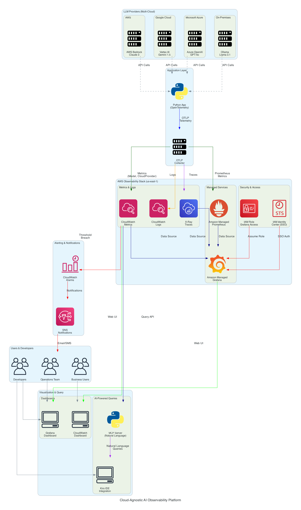

# クラウド非依存の AI オブザーバビリティプラットフォーム - アーキテクチャ

## 概要

このドキュメントでは、AWS マネージドサービス上に構築されたクラウドに依存しない AI オブザーバビリティプラットフォームのアーキテクチャについて説明します。このプラットフォームは、複数のクラウドプロバイダーにわたる大規模言語モデル (LLM) ワークロードに対して、統合されたモニタリング、コスト最適化、および運用インサイトを提供します。

## アーキテクチャ図



## アーキテクチャコンポーネント

### 1. LLM プロバイダーレイヤー (マルチクラウド)

このプラットフォームは、複数のプロバイダーにわたる LLM 呼び出しの監視をサポートしています。

:::info モデルの柔軟性
以下に示すモデルは、このデモで使用されているものです。このプラットフォームは AI ゲートウェイとして [LiteLLM](https://docs.litellm.ai/) を使用しているため、LiteLLM がサポートする任意の LLM に置き換えることができます。設定を更新するだけで `gateway/litellm-config.yaml` お好みのモデルと組み合わせて使用できます。オブザーバビリティパイプラインは、選択したモデルに関係なく同じように機能します。
:::

#### AWS Bedrock
- **モデル**: Claude 3 Haiku、Claude 3 Sonnet
- **統合**: AWS SDK (boto3)
- **メトリクス**: トークン使用量、レイテンシー、リクエスト数
- **ディメンション**: `CloudProvider=aws`

#### Google Vertex AI
- **モデル**: Gemini 1.5 Pro、Gemini 1.5 Flash
- **統合**: シミュレーション（本番環境では Google Cloud SDK を使用）
- **メトリクス**: トークン使用量、レイテンシー、リクエスト数
- **ディメンション**: `CloudProvider=gcp`

#### Azure OpenAI
- **モデル**: GPT-4o、GPT-4o Mini
- **統合**: シミュレーション（本番環境では Azure SDK を使用）
- **メトリクス**: トークン使用量、レイテンシー、リクエスト数
- **ディメンション**: `CloudProvider=azure`

#### オンプレミス (Ollama)
- **モデル**: Llama 3.1 70B、Mistral 7B
- **統合**: シミュレーション（本番環境では Ollama API を使用）
- **メトリクス**: トークン使用量、レイテンシー、リクエスト数
- **ディメンション**: `CloudProvider=on-prem`

### 2. アプリケーションレイヤー

#### Python アプリケーション
- **フレームワーク**: インストルメンテーション用 OpenTelemetry SDK
- **言語**: Python 3.8+
- **責務**:
  - プロバイダー間で LLM API を呼び出す
  - テレメトリ（メトリクス、トレース、ログ）を収集する
  - OpenTelemetry Collector にデータを送信する

#### OpenTelemetry Collector
- **プロトコル**: OTLP (OpenTelemetry Protocol)
- **フォーマット**: クラウドに依存しない、ベンダーニュートラル
- **責務**:
  - アプリケーションからテレメトリを受信する
  - データを変換・エンリッチする
  - AWS サービスにエクスポートする

### 3. AWS オブザーバビリティスタック

#### Amazon CloudWatch
- **サービスタイプ**: マネージドメトリクスとモニタリング
- **リージョン**: us-east-1
- **名前空間**: `AIObservability`
- **メトリクス**:
  - `InputTokens` - プロンプトのトークン数
  - `OutputTokens` - 補完のトークン数
  - `Latency` - レスポンス時間（ミリ秒）
- **ディメンション**:
  - `Model` - LLM モデル識別子
  - `CloudProvider` - プロバイダー (aws, gcp, azure, on-prem)
- **保持期間**: 15 か月 (デフォルト)
- **コスト**: メトリクスあたり月額 $0.30 (最初の 10,000 メトリクスは無料)

#### AWS X-Ray
- **サービスタイプ**: 分散トレーシング
- **リージョン**: us-east-1
- **責任範囲**:
  - サービス間のリクエストフローを追跡する
  - パフォーマンスのボトルネックを特定する
  - サービスの依存関係を可視化する
- **トレース形式**: X-Ray セグメントドキュメント
- **保持期間**: 30 日間
- **コスト**: 記録された 100 万トレースあたり $5.00

#### CloudWatch Logs
- **サービスタイプ**: ログの集約と分析
- **リージョン**: us-east-1
- **ロググループ**: `/ai-observability-demo`
- **フォーマット**: JSON 構造化ログ
- **機能**:
  - クエリ用 CloudWatch Logs Insights
  - ログ保持ポリシー
  - アラート用メトリクスフィルター
- **保持期間**: 7 日間 (設定可能)
- **コスト**: 取り込み 1 GB あたり $0.50

#### Amazon Managed Prometheus (AMP)
- **サービスタイプ**: マネージド Prometheus 互換モニタリング
- **リージョン**: us-east-1
- **ワークスペース ID**: `<your-amp-workspace-id>`
- **ユースケース**: 時系列メトリクスストレージ
- **クエリ言語**: PromQL
- **保持期間**: 150 日
- **コスト**: 取り込み 100 万サンプルあたり $0.10

#### Amazon Managed Grafana (AMG)
- **サービスタイプ**: 可視化のための Managed Grafana
- **リージョン**: us-east-1
- **ワークスペース ID**: `<your-amg-workspace-id>`
- **認証**: IAM Identity Center (SSO)
- **データソース**:
  - Amazon CloudWatch
  - AWS X-Ray
  - Amazon Managed Prometheus
- **機能**:
  - テンプレート変数を使用した動的ダッシュボード
  - マルチクラウドフィルタリング
  - 自動更新（30 秒）
- **コスト**: アクティブユーザー 1 人あたり月額 $9.00

### 4. セキュリティとアクセス制御

#### IAM ロール (Grafana アクセス)
- **ロール名**: `ai-observability-grafana-role`
- **目的**: Grafana が AWS サービスをクエリできるようにする
- **マネージドポリシー**:
  - `CloudWatchReadOnlyAccess`
  - `AWSXRayReadOnlyAccess`
  - `AmazonPrometheusQueryAccess`
- **信頼ポリシー**: Grafana ワークスペースがロールを引き受けることを許可します
- **最小権限の原則**: 読み取り専用アクセスのみ

#### IAM Identity Center (SSO)
- **リージョン**: us-east-2 (Ohio)
- **目的**: Grafana ユーザーのシングルサインオン
- **ユーザー**: `<your-email>` (ADMIN ロール)
- **統合**: SAML 2.0 認証
- **メリット**:
  - 一元化されたユーザー管理
  - MFA サポート
  - 監査ログ

### 5. 可視化とクエリレイヤー

#### Grafana ダッシュボード
- **タイプ**: テンプレート変数を使用した動的ダッシュボード
- **ファイル**: `grafana/dashboards/ai-observability-dynamic.json`
- **機能**:
  - クラウドプロバイダーのドロップダウン（自動検出: aws、gcp、azure、on-prem）
  - モデルのドロップダウン（すべてのモデルを自動検出）
  - 複数選択フィルター
  - リアルタイムメトリクス（30 秒ごとに更新）
- **パネル**:
  - モデル別入力トークン数（時系列）
  - モデル別出力トークン数（時系列）
  - モデル別レイテンシー（時系列）
  - 総リクエスト数（統計）
  - 平均レイテンシー（統計）

#### CloudWatch ダッシュボード
- **名前**: `AI-Observability-Demo`
- **タイプ**: ネイティブ CloudWatch ダッシュボード
- **ウィジェット**:
  - 入力/出力トークンメトリクス
  - レイテンシー統計
  - リクエスト数
- **ディメンション**: モデルおよび CloudProvider
- **アクセス**: AWS Console

#### MCP Server (自然言語クエリ)
- **テクノロジー**: Model Context Protocol
- **言語**: Python 3.8+
- **統合**: Kiro IDE
- **ツール**:
  - `get_token_usage` - トークン消費量をクエリする
  - `get_model_latency` - レイテンシ統計をクエリする
  - `get_request_count` - リクエスト量をクエリする
  - `get_cost_estimate` - コストを見積もる
  - `compare_models` - 並列比較
- **クエリ例**:
  - 「どのモデルが最もトークンを消費していますか？」
  - 「Claude Haiku の平均レイテンシはどのくらいですか？」
  - 「過去 1 時間の LLM コストを見積もってください」

#### Kiro IDE 統合
- **目的**: 開発者中心のオブザーバビリティ
- **機能**:
  - IDE 内での自然言語クエリ
  - ダッシュボードへのコンテキスト切り替えなし
  - 開発中のリアルタイムメトリクス
- **設定**: `kiro-mcp-config.json`

### 6. アラートと通知

#### CloudWatch アラーム
- **目的**: プロアクティブなモニタリングとアラート
- **アラームタイプ**:
  - コストしきい値の超過
  - レイテンシー SLA 違反
  - エラーレートの増加
  - トークン使用量の異常
- **アクション**: SNS 通知のトリガー

#### Amazon SNS
- **目的**: マルチチャネル通知
- **チャネル**:
  - Email
  - SMS
  - Slack (webhook 経由)
  - PagerDuty 統合
- **サブスクライバー**: オペレーションチーム

## データフロー

### 1. LLM 呼び出しフロー

```
User Request → Application → LLM Provider API
                    ↓
            OpenTelemetry SDK
                    ↓
         (Collect Telemetry)
                    ↓
            OTLP Collector
```

### 2. テレメトリエクスポートフロー

```
OTLP Collector → CloudWatch (Metrics)
              → X-Ray (Traces)
              → CloudWatch Logs (Logs)
              → Prometheus (Time Series)
```

### 3. 可視化フロー

```
CloudWatch/X-Ray/Prometheus → Grafana → Users
                           → CloudWatch Dashboard → Users
```

### 4. クエリフロー (MCP)

```
Developer → Kiro IDE → MCP Server → CloudWatch API → Response
```

### 5. アラートフロー

```
CloudWatch Metrics → Alarm Threshold → SNS → Operations Team
```

## 主要な設計上の決定事項

### 1. クラウドに依存しないアプローチ

**決定**: OpenTelemetry をインストルメンテーション標準として使用する

**根拠**:
- ベンダー中立のオープンソース標準
- あらゆる LLM プロバイダーと連携可能
- プロバイダーの変更に対して将来性がある
- クラウドプラットフォーム間で移植可能

**トレードオフ**:
- 追加の抽象化レイヤー
- OTLP コレクターのセットアップが必要
- OpenTelemetry の学習コスト

### 2. AWS マネージドサービス

**決定**: セルフホスト型の代わりに Amazon Managed Grafana と Prometheus を使用する

**根拠**:
- インフラ管理のオーバーヘッドなし
- 組み込みの高可用性とスケーラビリティ
- 自動パッチ適用とアップデート
- AWS ネイティブのセキュリティ統合
- 従量課金制の料金モデル

**トレードオフ**:
- 自己ホスト型よりもコストが高い（大規模な場合）
- カスタマイズの柔軟性が低い
- AWS リージョンへの依存性

### 3. ディメンションメトリクス

**決定**: メトリクス名のプレフィックスの代わりに CloudWatch ディメンション (Model, CloudProvider) を使用する

**根拠**:
- 柔軟なクエリと集計
- 効率的なストレージ（メトリクスの爆発的増加なし）
- Grafana での動的フィルタリングをサポート
- 新しいディメンションを簡単に追加可能

**トレードオフ**:
- CloudWatch のディメンション制限 (メトリクスあたり 30 個)
- 慎重なディメンション設計が必要
- クエリの複雑さが増加する

### 4. SSO のための IAM Identity Center

**決定**: Grafana ネイティブ認証の代わりに IAM Identity Center を使用する

**根拠**:
- 一元化されたユーザー管理
- すぐに使える MFA サポート
- コンプライアンスのための監査ログ
- 企業 ID プロバイダーとの統合

**トレードオフ**:
- AWS サービスの追加依存関係
- セットアップの複雑さ
- リージョンの制約 (us-east-2)

### 5. 自然言語クエリのための MCP

**決定**: 既存のクエリツールを使用する代わりに、カスタム MCP サーバーを構築する

**根拠**:
- 開発者中心のエクスペリエンス
- コンテキストの切り替えを削減
- 自然言語インターフェース
- IDE 統合

**トレードオフ**:
- 保守が必要なカスタムコード
- サポートされている IDE に限定
- MCP プロトコルの知識が必要

## スケーラビリティに関する考慮事項

### メトリクスのボリューム

**現在のスケール**:
- 呼び出しごとに 3 つのメトリクス (InputTokens、OutputTokens、Latency)
- メトリクスごとに 2 つのディメンション (Model、CloudProvider)
- デモでは 1 分あたり約 10 回の呼び出し

**本番スケールの見積もり**:
- 1 秒あたり 1,000 回の呼び出し
- 1 分あたり 180,000 個のメトリクスデータポイント
- 1 日あたり 2 億 5,900 万個のデータポイント

**CloudWatch の制限**：
- リージョンごとにアカウントあたり 1 秒間に 1,000 トランザクション (TPS)
- API ごとに 150 TPS (PutMetricData)
- 解決策：バッチ処理を使用する（リクエストあたり最大 1,000 メトリクス）

### コスト最適化

**戦略**:
1. **メトリクスの集約**: CloudWatch に送信する前にメトリクスを事前集約する
2. **サンプリング**: 大量のワークロードに対してトレースをサンプリングする（例：リクエストの 10%）
3. **保持ポリシー**: 重要度の低いログのログ保持期間を短縮する
4. **予約容量**: 予測可能なワークロードには Savings Plans を使用する

**推定月額コスト** (1日あたり100万回の呼び出し):
- CloudWatch Metrics: 約 $90
- CloudWatch Logs: 約 $15
- X-Ray: 約 $150
- Amazon Managed Grafana: ユーザーあたり $9
- Amazon Managed Prometheus: 約 $30
- **合計**: 約 $300/月 + ユーザーあたり $9

### 高可用性

**組み込み HA**:
- CloudWatch: デフォルトでマルチ AZ
- X-Ray: デフォルトでマルチ AZ
- Amazon Managed Grafana: マルチ AZ デプロイ
- Amazon Managed Prometheus: マルチ AZ デプロイ

**アプリケーション HA**:
- 複数の AZ にアプリケーションをデプロイする
- 分散のために Application Load Balancer を使用する
- 指数バックオフを使用したリトライロジックを実装する

## セキュリティのベストプラクティス

### 1. 最小権限アクセス

- Grafana ロールは AWS サービスへの読み取り専用アクセス権を持っています
- CloudWatch、X-Ray、または Prometheus への書き込み権限はありません
- 異なるユーザーグループに対して個別のロールを使用します

### 2. 暗号化

- **保存時**: CloudWatch Logs は AWS KMS で暗号化
- **転送時**: すべての API 呼び出しに TLS 1.2 以上を使用
- **Grafana**: 有効な SSL 証明書を使用した HTTPS のみ

### 3. ネットワークセキュリティ

- AWS マネージド VPC 内の Grafana ワークスペース
- バックエンドサービスへのパブリックインターネットアクセスなし
- AWS サービスアクセス用の VPC エンドポイント（オプション）

### 4. 監査ログ

- CloudTrail はすべての API コールをログに記録します
- Grafana のアクセスログは CloudWatch に記録されます
- IAM Identity Center の監査ログ

### 5. シークレット管理

- IAM ロールによる AWS 認証情報（ハードコードされたキーなし）
- AWS Secrets Manager での LLM API キー
- 自動キーローテーションポリシー

## モニタリングシステムのモニタリング

### メタモニタリング

**プラットフォームヘルスの CloudWatch Metrics**:
- Grafana ワークスペースのステータス
- Prometheus ワークスペースのステータス
- API コール成功率
- クエリレイテンシ

**アラーム**:
- Grafana ワークスペースが利用不可
- CloudWatch API スロットリング
- X-Ray トレースの取り込み失敗

## ディザスタリカバリ

### バックアップ戦略

**CloudWatch**:
- メトリクス: 15 か月間保持されます（バックアップ不要）
- ログ: 長期保存のために S3 にエクスポートします
- ダッシュボード: Git でバージョン管理されます

**Grafana**:
- ダッシュボード: JSON としてエクスポートし、Git に保存
- データソース: コードとしての設定 (Terraform)
- ユーザー: IAM Identity Center 経由で管理

**Recovery Time Objective (RTO)**: 1 時間
**Recovery Point Objective (RPO)**: 5 分

### ディザスタリカバリプラン

1. **インフラストラクチャ**: Terraform を使用して再デプロイします
2. **ダッシュボード**: Git リポジトリからインポートします
3. **データ**: CloudWatch データは保持されます（対応不要）
4. **ユーザー**: IAM Identity Center を使用して再割り当てします

## 今後の機能強化

### 短期 (1〜3 か月)

1. **異常検出**: 異常なパターンに対する ML を活用したアラート
2. **コスト予測**: トレンドに基づく月次コストの予測
3. **SLO トラッキング**: サービスレベル目標のモニタリング
4. **マルチリージョン**: AWS リージョン全体のメトリクスの集約

### 中期 (3〜6 か月)

1. **高度な分析**: BigQuery/Athena 統合
2. **カスタムダッシュボード**: チーム固有のビュー
3. **統合テスト**: 自動化されたオブザーバビリティテスト
4. **API Gateway**: 外部統合のための RESTful API

### 長期 (6〜12 か月)

1. **AI を活用したインサイト**: 自動化された根本原因分析
2. **予測スケーリング**: 予測に基づいてクォータを自動調整
3. **コスト最適化エンジン**: 自動化されたモデル選択
4. **コンプライアンス自動化**: 自動化された監査レポート

## 参考資料

### AWS サービスのドキュメント
- [Amazon CloudWatch](https://docs.aws.amazon.com/cloudwatch/)
- [AWS X-Ray](https://docs.aws.amazon.com/xray/)
- [Amazon Managed Grafana](https://docs.aws.amazon.com/grafana/)
- [Amazon Managed Prometheus](https://docs.aws.amazon.com/prometheus/)
- [IAM Identity Center](https://docs.aws.amazon.com/singlesignon/)

### 標準とプロトコル
- [OpenTelemetry](https://opentelemetry.io/docs/)
- [OTLP 仕様](https://opentelemetry.io/docs/specs/otlp/)
- [Model Context Protocol](https://modelcontextprotocol.io/)

### 関連パターン
- [AWS Well-Architected Framework](https://aws.amazon.com/architecture/well-architected/)
- [オブザーバビリティのベストプラクティス](https://aws.amazon.com/blogs/mt/observability-best-practices/)
- [マルチクラウドアーキテクチャパターン](https://aws.amazon.com/blogs/architecture/)

---

**ドキュメントバージョン**: 1.0
**最終更新日**: 2026年2月
**管理者**: AWS Solutions Architecture Team
