# CloudWatch クロスアカウントオブザーバビリティ

単一の AWS リージョン内の複数の AWS アカウントにデプロイされたアプリケーションの監視は困難な場合があります。[Amazon CloudWatch のクロスアカウントオブザーバビリティ](https://aws.amazon.com/blogs/aws/new-amazon-cloudwatch-cross-account-observability/)[^1]は、[**AWS リージョン**](https://docs.aws.amazon.com/AmazonCloudWatch/latest/monitoring/CloudWatch-Unified-Cross-Account.html)[^2]内の複数のアカウントにまたがるアプリケーションのシームレスな監視とトラブルシューティングを可能にすることで、このプロセスを簡素化します。このチュートリアルでは、2 つの AWS アカウント間でクロスアカウントオブザーバビリティを設定する方法について、スクリーンショット付きのステップバイステップガイドを提供します。さらに、より広範なスケーラビリティのために AWS Organizations を通じてデプロイを実現することも可能です。

## 用語

Amazon CloudWatch を使用した効果的なクロスアカウントオブザーバビリティを実現するには、以下の主要な用語を理解する必要があります。

| **Term** | **Description** |
|------|-------------|
| **Monitoring Account** | A central AWS account that can view and interact with observability data generated from multiple source accounts |
| **Source Account** | An individual AWS account that generates observability data for the resources that reside in it |
| **Sink** | A resource in a monitoring account that serves as an attachment point for source accounts to link and share their observability data. Each account can have one **Sink** per [AWS Region](https://docs.aws.amazon.com/AmazonCloudWatch/latest/monitoring/CloudWatch-Unified-Cross-Account.html)[^2] |
| **Observability Link** | A resource that represents the connection established between a source account and a monitoring account, facilitating the sharing of observability data. Links are managed by the source account. |

Amazon CloudWatch でクロスアカウントオブザーバビリティを正常に設定および管理するには、これらの定義を理解してください。
## 考慮すべき事項
1. アカウント制限: 最大 100,000 のソースアカウントを単一のモニタリングアカウントにリンクでき、最大規模のエンタープライズセットアップにも対応できます。
2. クロスリージョン: クロスリージョン機能はこの機能に自動的に組み込まれています。異なるリージョンのメトリクスを単一のアカウントで同じグラフまたは同じダッシュボードに表示するために、追加の手順を実行する必要はありません。
3. データ保持: すべてのデータ保持はソースアカウントレベルで処理されます。モニタリングアカウントはデータを保存または複製しません。モニタリングアカウントは、ソースアカウントのデータへの読み取り専用アクセス権を持ちます。実際のデータ転送や同期は行われません。
4. コストへの影響: 驚くべきことに、クロスアカウント Observability に関連する追加コストはありません。データはソースアカウントに残り、モニタリングアカウントによって読み取られるだけなので、追加のデータ転送やストレージの料金は発生しません。
5. クロスアカウント Observability を使用してソースアカウント (X) からモニタリングアカウント (Y) にトレースを共有する場合、トレースは複製されてモニタリングアカウント (Y) に保存されます。このプロセスでは、ソースアカウント (X) に追加コストは発生せず、元の請求に影響を与えることなく、アカウント間でモニタリング機能を拡張できます。
6. CloudWatch サービスクォータによると、各ダッシュボードには最大 500 個のウィジェットを配置できます。1 つのウィジェットには最大 500 個のメトリクスを含めることができ、1 つのダッシュボードにはすべてのウィジェット全体で最大 2500 個のメトリクスを含めることができます。これらのクォータには、グラフに表示されていない場合でも、メトリクス演算関数で使用するために取得されたすべてのメトリクスが含まれます。これらのクォータはハードクォータであり、変更できません。
7. Amazon CloudWatch Logs Insights では、個別に指定する場合、クエリごとに最大 50 個のロググループをクエリできます。この制限は固定されており、増やすことはできません。ただし、名前プレフィックスに基づいてロググループを選択したり、「すべてのロググループ」をクエリすることを選択したりするなど、ロググループ条件を使用する場合は、単一のクエリに最大 10,000 個のロググループを含めることができ、複数のグループにわたるより広範なログ分析が可能になります。
8. CloudWatch クロスアカウント Observability でログとメトリクスを操作する場合、すべての名前空間からのメトリクスをモニタリングアカウントと共有するか、名前空間のサブセットにフィルタリングするかを選択できます。
9. クロスアカウントシナリオでアラームを操作する際の考慮事項:
   1. CloudWatch Metrics Insights は、数百のメトリクスを複数のアカウントからクエリする必要があるクロスアカウント Observability シナリオなど、メトリクスを大規模にクエリするために使用できる強力な高性能 SQL クエリエンジンです。
    2. アラームを設定する場合、単一の時系列を返すクエリである必要があります。これは SELECT 式で実現できますが、使用できる統計は SUM、MIN、MAX、COUNT、AVG のみです。
    3. また、「group by」句を使用して、特定のディメンション値ごとにメトリクスをリアルタイムで個別の時系列にグループ化することができます。また、「order by」機能を使用して「Top N」タイプのクエリを作成することもできます。
    4. 自然言語を使用してクエリを作成することができます。これを行うには、探しているデータについて質問したり説明したりします。この AI 支援機能は、プロンプトに基づいてクエリを生成し、クエリの動作について行ごとの説明を提供します。
    5. SEARCH 式に基づいてアラームを作成することはできません。これは、検索式が複数の時系列を返すためであり、数式に基づくアラームは 1 つの時系列のみを監視できるためです。また、SEARCH 関数を含む数式 (「MAX」など) に対してアラームを設定することもできません。このシナリオは CloudWatch Custom Data Sources で実現できます。
    6. クロスリージョン機能はアラームではサポートされていないため、あるリージョンで別のリージョンのメトリクスを監視するアラームを作成することはできません。

10. データ保護ポリシー: ソースアカウントでデータ保護ポリシーが有効になっている場合、明示的なアクセス許可が付与されない限り、モニタリングアカウントはデータにアクセスできません。


## AWS コンソールを使用したステップバイステップチュートリアル

### 前提条件

1. このチュートリアルを完了するには、3 つの AWS アカウントが必要です。1 つのモニタリングアカウントと 2 つのソースアカウントです。

2. ユーザーまたはロールは、モニタリングアカウントとソースアカウント間のクロスアカウントリンクを作成するために、[AWS CloudWatch クロスアカウントセットアップガイド](https://docs.aws.amazon.com/AmazonCloudWatch/latest/monitoring/CloudWatch-Unified-Cross-Account-Setup.html#CloudWatch-Unified-Cross-Account-Setup-permissions)[^3]に記載されている最低限の権限を持っている必要があります。

<div style={{ textAlign: 'center' }}>
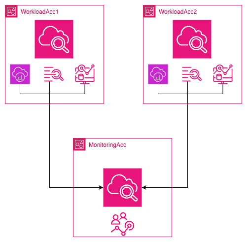
</div>

### ステップ 1: モニタリングアカウントをセットアップする

#### モニタリングアカウント

モニタリングアカウントを設定するには、次の手順に従います。

1. CloudWatch コンソールを [https://console.aws.amazon.com/cloudwatch](https://console.aws.amazon.com/cloudwatch) で開き、クロスアカウントモニタリングアカウントを設定する AWS リージョンを選択します。このデモでは、ヨーロッパ (フランクフルト) リージョン (eu-central-1) を使用します。
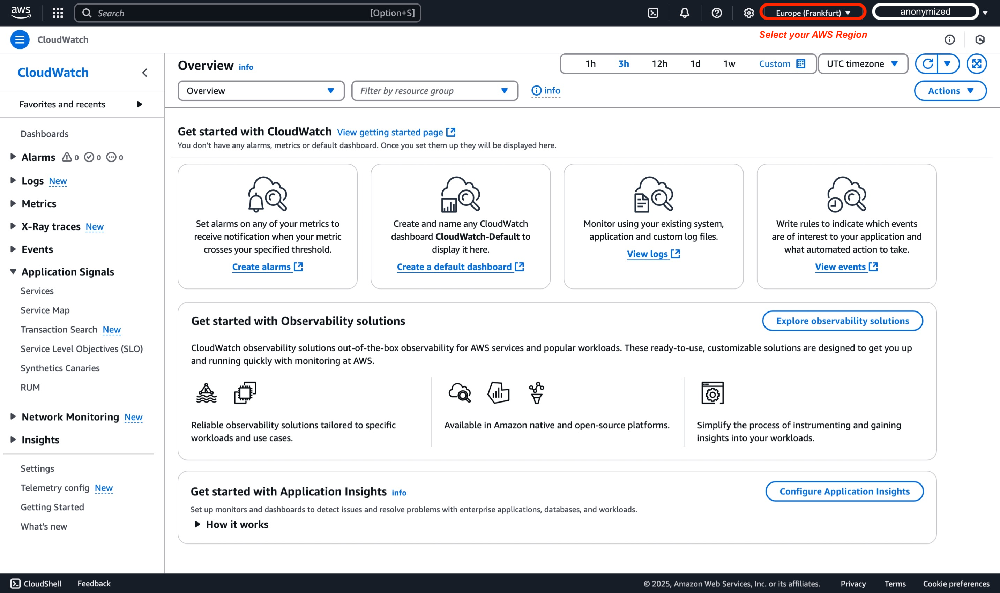

2. ナビゲーションペインで、**Settings** を選択します。  
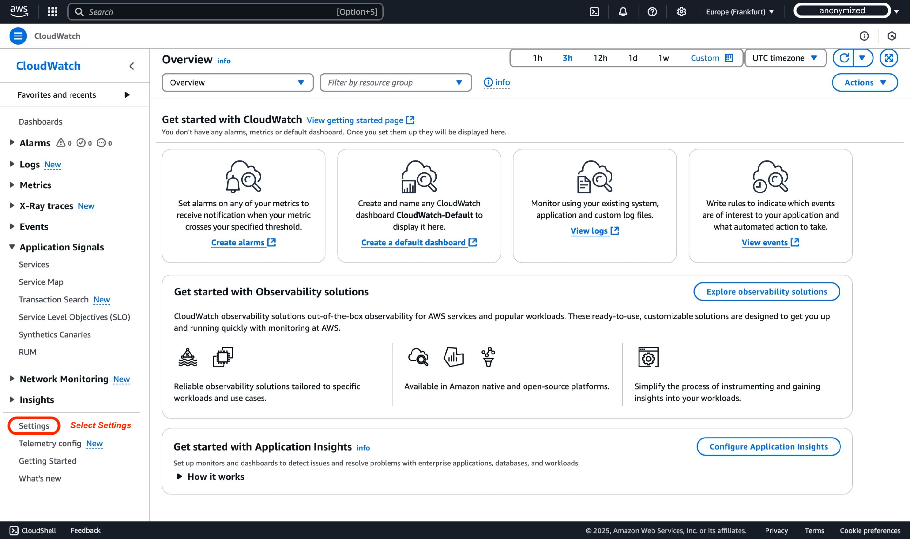

3. このデモの範囲では、デフォルトのアカウントグローバル設定を使用し、**モニタリングアカウント設定**のセクション内で **Configure** を選択します。
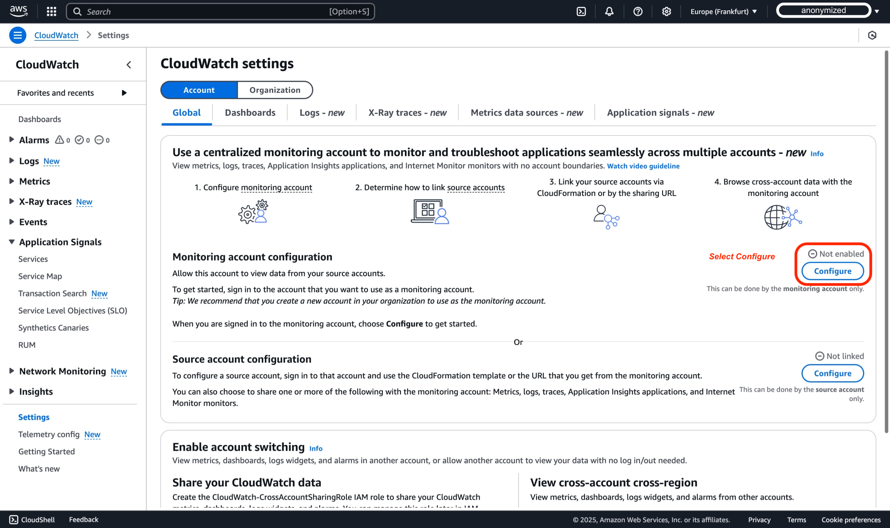

4. モニタリングアカウントと共有するデータのタイプを選択した後、「List source accounts」ボックスにソースアカウント ID を貼り付けます。このデモでは、WorkloadAcc1 と WorkloadAcc2 の ID を使用します。Metrics、Logs、Traces が選択されています。フィルタリングが可能なのは Metrics と Logs のみで、その他はすべて常に完全に共有されます。ServiceLens と X-Ray の場合は、メトリクス、ログ、トレースを有効にする必要があります。Application Insights の場合は、Application Insights アプリケーションも有効にします。Internet Monitor の場合は、メトリクス、ログ、Internet Monitor – Monitors を有効にします。
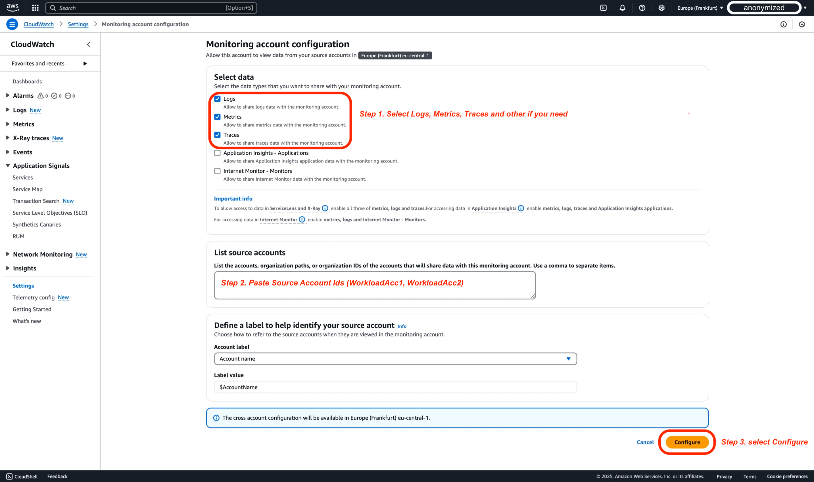

:::info
CloudWatch Cross-Account Observability でテレメトリタイプを設定する際は、それらの依存関係を理解することが重要です。Metrics、Logs、Traces は個別に設定できますが、他の CloudWatch 機能には特定の要件があります。ServiceLens と X-Ray 機能には、Metrics、Logs、Traces の 3 つすべてが必要です。より高度なモニタリングの場合、Application Insights には Metrics、Logs、Traces、および Application Insights アプリケーションを有効にする必要があります。同様に、Internet Monitor には Metrics、Logs、および Internet Monitor - Monitors を有効にする必要があります。次の表は、これらの依存関係の詳細を示しています。
:::
    | Telemetry Type | Description | Dependencies for CloudWatch Cross-Account Observability |
    |----------------|-------------|-----------------------------------------------------|
    | Metrics in Amazon CloudWatch | Share all metric namespaces or filter to a subset | None |
    | Log Groups in Amazon CloudWatch Logs | Share all log groups or filter to a subset | None |
    | ServiceLens and X-Ray | Share all traces (no filtering available) | Requires enabling Metrics, Logs, and Traces for ServiceLens and X-Ray |
    | Applications in Amazon CloudWatch Application Insights | Share all applications (no filtering available) | Requires enabling Metrics, Logs, Traces, and Application Insights applications |
    | Monitors in CloudWatch Internet Monitor | Share all monitors (no filtering available) | Requires enabling Metrics, Logs, and Internet Monitor - Monitors |

5. モニタリングアカウントの AWS コンソールで、次の図が表示され、モニタリングアカウントが正常に設定されたことを確認できます。
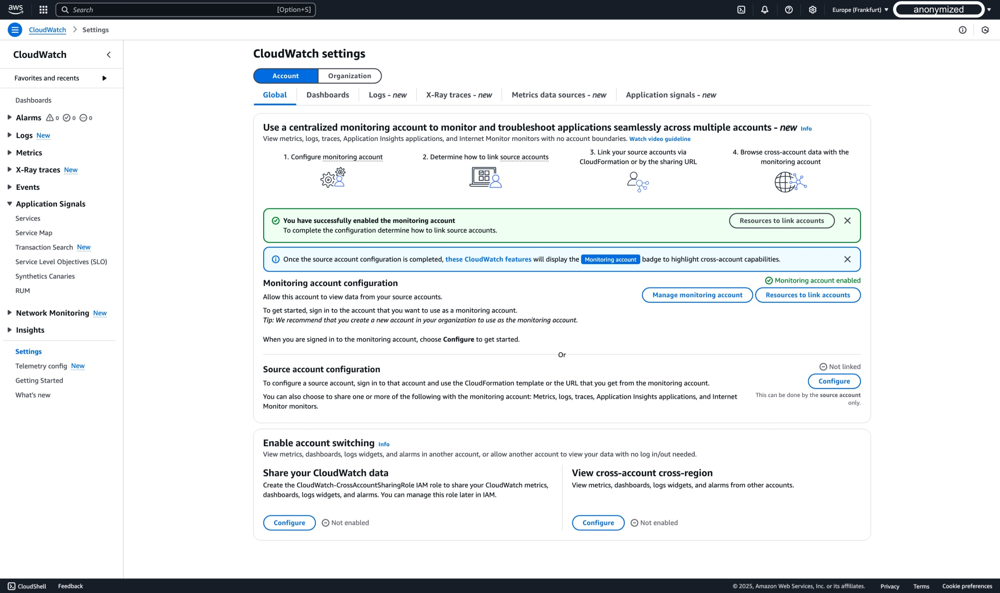

:::tip
	モニタリングアカウントの設定が正常に完了したら、ソースアカウントをリンクする必要があります。ソースアカウントをリンクする主な方法は 2 つあります。AWS Organizations を使用する方法と、個別のアカウントをリンクする方法です。ステップ 2 では、個別のアカウントを設定するプロセスを説明します。ただし、ソースアカウントにログインして変更を加える前に、モニタリングアカウント sink ARN など、設定したばかりのモニタリングアカウントから情報を収集する必要があります。
:::

6. 以前にモニタリングアカウントで停止した AWS コンソールで、**Resources to link accounts** を選択します。
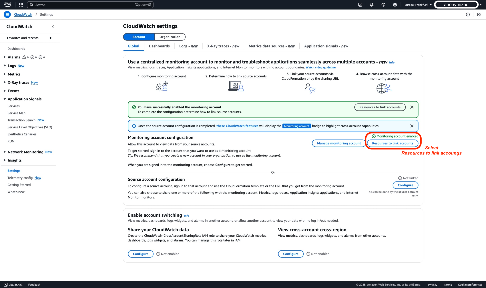

7. AWS コンソールで、「Configuration details」セクションを展開します。ここで、コピーして保存する必要がある Monitoring アカウントのシンク ARN を確認できます。この情報は、ステップ 2 でソースアカウントをリンクする際に必要になります。
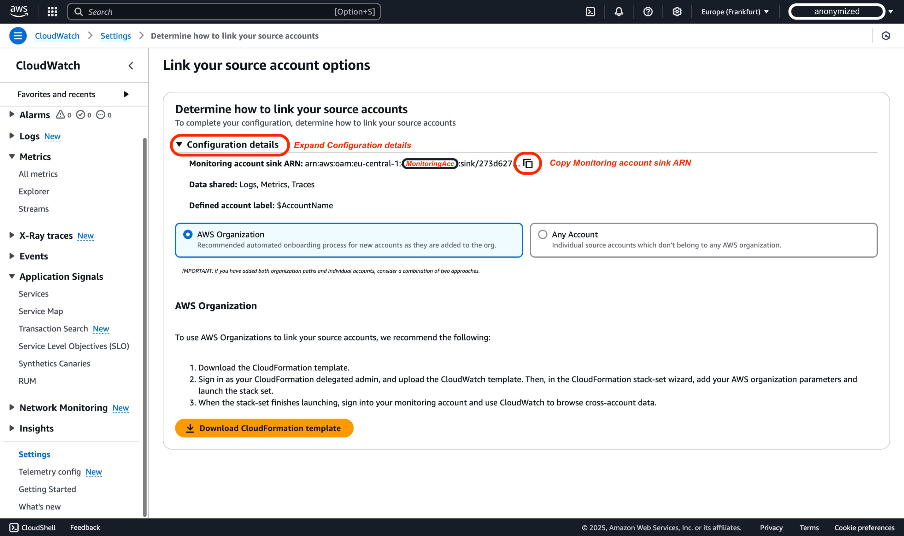

#### まとめ

前の手順では、モニタリングアカウントシンクをソースアカウントとリンクするように設定しました。ソースアカウントは、スタンドアロンであるか、組織の一部であるかを問いません。基本的に、上記の手順では、モニタリングアカウントシンクに設定ポリシーを作成し、ソースアカウントが統合できるようにしました。AWS コンソールの設定を通じて生成されたサンプルポリシーは、以下のとおりです。

```
{
    "Version": "2012-10-17",
    "Statement": [
        {
            "Effect": "Allow",
            "Principal": {
                "AWS": [
                    "${WorkloadAcc1}", // Workload Account
                    "${WorkloadAcc2}"  // Workload Account
                ]
            },
            "Action": [
                "oam:CreateLink",
                "oam:UpdateLink"
            ],
            "Resource": "*",
            "Condition": {
                "ForAllValues:StringEquals": {
                    "oam:ResourceTypes": [
                        "AWS::Logs::LogGroup",
                        "AWS::CloudWatch::Metric",
                        "AWS::XRay::Trace"
                    ]
                }
            }
        }
    ]
}
```

AWS Organizations を使用して設定する場合、Monitoring アカウントシンクに適用される設定ポリシーは、PrincipalOrgID 条件に基づいてリンクを作成または更新するために AWS 組織内のすべての AWS アカウントを信頼するため、それ以上の変更は必要ありません。このようなサンプルポリシーは以下にあります。

```
{
    "Version": "2012-10-17",
    "Statement": [
        {
            "Effect": "Allow",
            "Principal": "*",
            "Action": ["oam:CreateLink", "oam:UpdateLink"],
            "Resource": "*",
            "Condition": {
                "ForAllValues:StringEquals": {
                    "oam:ResourceTypes": [
                        "AWS::Logs::LogGroup",
                        "AWS::CloudWatch::Metric",
                        "AWS::XRay::Trace",
                        "AWS::ApplicationInsights::Application",
                        "AWS::InternetMonitor::Monitor"
                    ]
                },
                "ForAnyValue:StringEquals": {
                    "aws:PrincipalOrgID": "${OrganizationId}" // AWS Organization as Condition
                }
            }
        }
    ]
}
```


### ステップ 2: ソースアカウントをリンクする

#### 個別アカウントのリンク

ステップ 1 でモニタリングアカウントを設定した後、個別の AWS ソースアカウントを設定します。このアプローチは、組織外のアカウントを操作する場合や、特定のスタンドアロンアカウントのモニタリングを確立する必要がある場合に特に便利です。AWS Organizations は複数のアカウントを管理するためのスケーラブルなソリューションを提供しますが、個別のアカウント設定により、よりきめ細かい制御と柔軟性が得られます。

ソースアカウントの設定を進める前に、ステップ 1 で取得したモニタリングアカウントのシンク ARN をコピーしていることを確認してください。接続を確立するために必要になります。

個々のソースアカウントをリンクするには、次の手順に従います。

1. CloudWatch コンソールを [https://console.aws.amazon.com/cloudwatch](https://console.aws.amazon.com/cloudwatch) で開き、クロスアカウントモニタリングアカウントを設定する AWS リージョンを選択します。このデモでは、ヨーロッパ (フランクフルト) リージョン (eu-central-1) を使用します。
 

2. ナビゲーションペインで、**Settings** を選択します。  


3. このデモの範囲では、アカウントのグローバル設定のデフォルト設定のままにし、**ソースアカウント設定**セクション内の **Configure** を選択します。
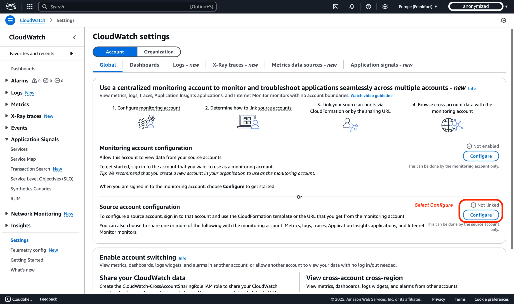

4. AWS コンソールで、データタイプとして Logs、Metrics、Traces を選択します。デフォルトではすべてが共有されますが、モニタリングアカウントと共有したい Logs と Metrics をフィルタリングすることで、より詳細に選択することもできます。リンクする前に必要な次のステップは、モニタリングアカウントを設定したときに以前コピーしたモニタリングアカウントのシンク ARN を入力することです。
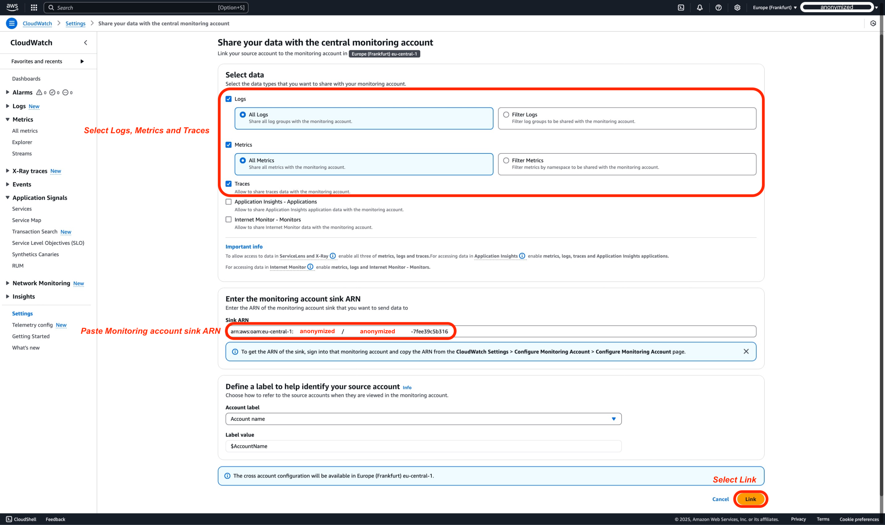

5. ソースアカウントの設定を完了する前の最後のステップは、ソースアカウントからのデータがモニタリングアカウントと共有されることを確認することです。ポップアップボックスに「Confirm」と入力して、このアクションを確認します。
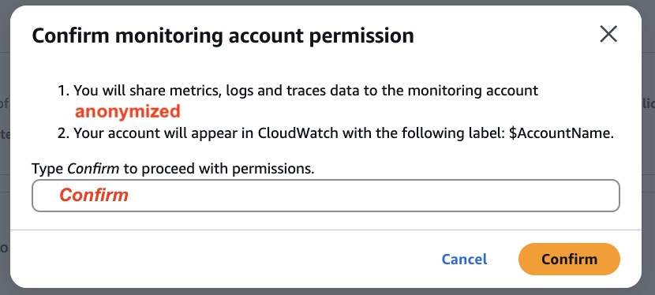

6. AWS コンソールの「ソースアカウント設定」セクションで、アカウントが「リンク済み」であることを示す緑色のステータスが表示されます。
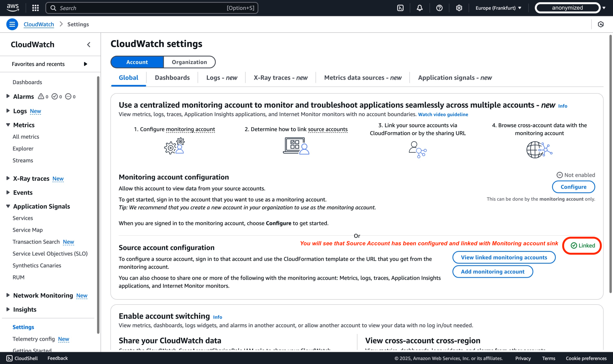

:::tip
    WorkloadAcc2 についてもステップ 2 を繰り返します。これにより、両方のワークロードアカウントからの Observability テレメトリが監視アカウントと共有されます。
:::

### ステップ 3: 設定を検証する

:::tip
    モニタリングアカウントにログインしていることを確認してください。
:::

1. CloudWatch コンソールを [https://console.aws.amazon.com/cloudwatch](https://console.aws.amazon.com/cloudwatch) で開き、ステップ 1 でクロスアカウントモニタリングを設定した AWS リージョンを選択します。このデモでは、ヨーロッパ (フランクフルト) リージョン (eu-central-1) を使用します。
 

2. ナビゲーションペインで、**Settings** を選択します。  


3. **モニタリングアカウント設定**のセクション内で **モニタリングアカウントの管理**を選択します。
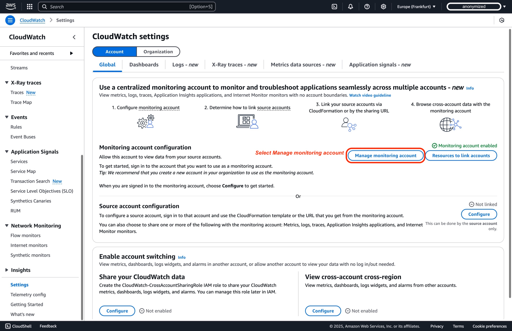 

4. Monitoring account configurations ページ内の Linked source accounts ペインに、**Source accounts** としてリンクされた 2 つのワークロードアカウントが表示されます。  
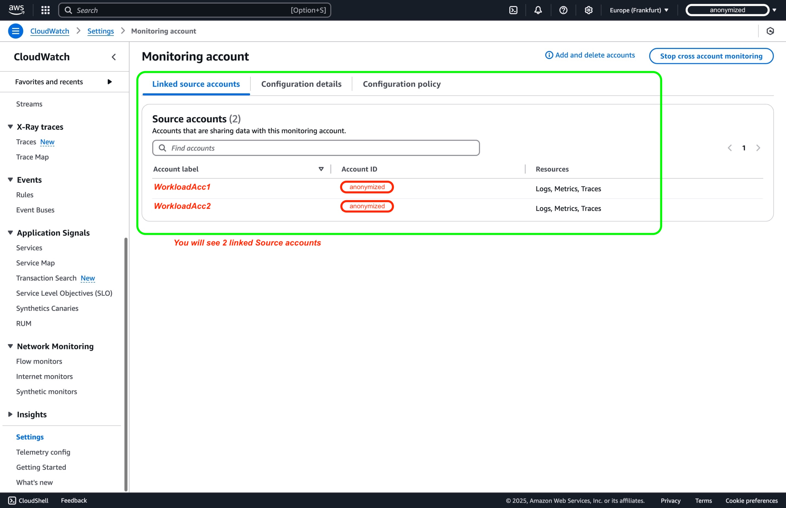

#### 代替方法: AWS Organizations 統合

AWS CloudWatch のクロスアカウントオブザーバビリティにより、リージョン内の複数の AWS アカウントにまたがるアプリケーションの一元的な監視とトラブルシューティングが可能になります。AWS Organizations と統合することで、セットアップを効率化し、すべてのアカウント全体で設定を自動化できます。このアプローチにより、組織内の多数のアカウントにわたる監視を効率的に処理できます。

##### 前提条件

- AWS Organizations が有効化されており、メンバーアカウントが適切に含まれていること[^4]。
- 子アカウントに AWS CloudFormation StackSets をデプロイする権限[^5]があり、リンクを作成するために十分な CloudFormation アクションが許可された IAM ロールが含まれていること[^3]。
- 組織内（または特定の OU）のソースアカウントが observability リンクを作成および更新できるように設定されたモニタリングアカウント[^6]。

AWS CloudFormation StackSets は、すべてのメンバーアカウントにおける必要なサービスにリンクされたロールとオブザーバビリティ設定のデプロイを自動化します。自動デプロイを有効にすると、新しく作成された AWS アカウントは必要なオブザーバビリティ設定を自動的に継承し、AWS 環境全体で統一された監視プラクティスを維持しながら管理オーバーヘッドを削減します。

IAM アクセス許可、サンプル StackSet テンプレート、モニタリングポリシーを含む段階的な実装ガイドについては、AWS 公式ドキュメント[^7]を参照してください。

## ビデオチュートリアル

クロスアカウントオブザーバビリティのセットアップの詳細なウォークスルーについては、AWS 公式 YouTube ガイド「Enable Cross-Account Observability in Amazon CloudWatch | Amazon Web Services」もご覧いただけます。このチュートリアルでは、一元化されたモニタリングアカウントの設定方法、複数のソースアカウントのリンク方法、および CloudWatch コンソール内で共有されたオブザーバビリティデータを探索する方法を視覚的に説明しています。

<!-- blank line -->
<figure class="video_container">
  <iframe width="560" height="315" src="https://www.youtube.com/embed/lUaDO9dqISc?si=mPewnqzWBqBZKmyg" title="YouTube video player" frameborder="0" allow="accelerometer; autoplay; clipboard-write; encrypted-media; gyroscope; picture-in-picture; web-share" referrerpolicy="strict-origin-when-cross-origin" allowfullscreen></iframe>
</figure>
<!-- blank line -->

## クロスアカウントテレメトリデータのクエリ

:::tip
    モニタリングアカウントにログインしていることを確認してください。
:::

:::info
    [Observability One Workshop](https://catalog.workshops.aws/observability/en-US/architecture)[^8] の Pet Adoption アプリケーションを再利用しています。このデモでは、クロスアカウントオブザーバビリティを説明するために、両方のワークロードアカウントにデプロイされています。
:::

### メトリクス

複数のアカウントのメトリクスを一元的な場所で監視するには、次の手順を実行します。

1. モニタリングアカウントの CloudWatch コンソールで、左側のナビゲーションペインの「すべてのメトリクス」に移動すると、リンクされたすべてのソースアカウントからのメトリクスを表示できるようになります。
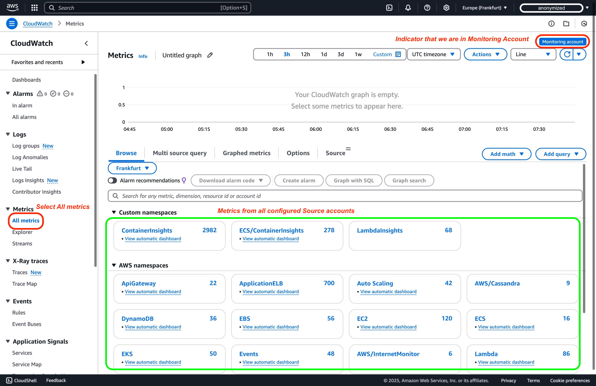

2. アカウント ID フィルターを使用できます `:aws.AccountId=` 特定のアカウントメトリクスをフィルタリングするか、Namespaces とディメンションを選択して詳細を確認できます。このデモの範囲では、[View Metrics in Observability One Workshop](https://catalog.workshops.aws/observability/en-US/aws-native/metrics/viewmetrics)[^8] のガイドに従いましょう。ここでは、ContainerInsights 名前空間を選択し、ClusterName、Namespace、PodName のディメンションを選択します。次に、メトリクス名 pod_cpu_utilization でフィルタリングします。ご覧のとおり、グラフ化できる両方のワークロードアカウントからのメトリクスが表示されます。
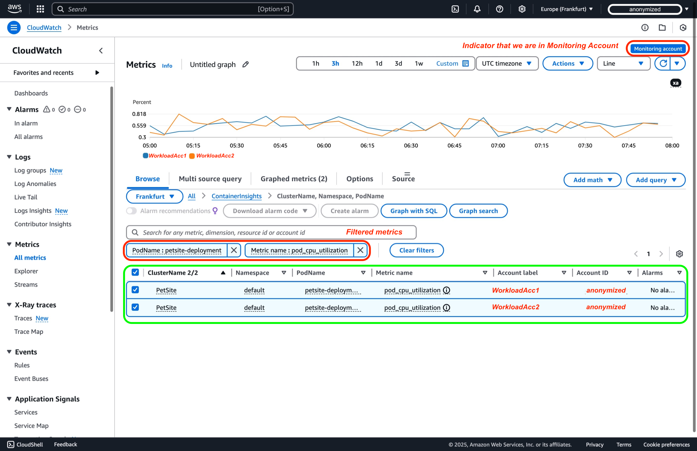

#### アラーム

[Amazon CloudWatch クロスアカウントアラーム](https://aws.amazon.com/about-aws/whats-new/2021/08/announcing-amazon-cloudwatch-cross-account-alarms/)[^9]を使用すると、中央のモニタリングアカウントから複数の AWS アカウントにわたるメトリクスを監視できます。単一のメトリクスまたは数式の出力を監視するメトリクスアラームと、複数のアラーム(他の複合アラームを含む)の状態を評価する複合アラームを作成できます。たとえば、すべての本番アカウントで CPU 使用率が 80% を超えたときにトリガーされるアラームを設定できます。トリガーされると、アラームは Amazon SNS 通知の送信や AWS Lambda 関数の呼び出しなどのアクションを実行でき、タイムリーなアラートを受信してプロアクティブに対応できるようになります。モニタリングアカウントでアラーム作成を一元化することで、アラート処理を効率化し、ワークロードの統合された運用ビューを取得できます。

[メトリクス](#メトリクス)の前のステップから続けて、「Graphed metrics」を選択してから「Create Alarm」を選択することで、特定のメトリクスのアラームを作成できます。
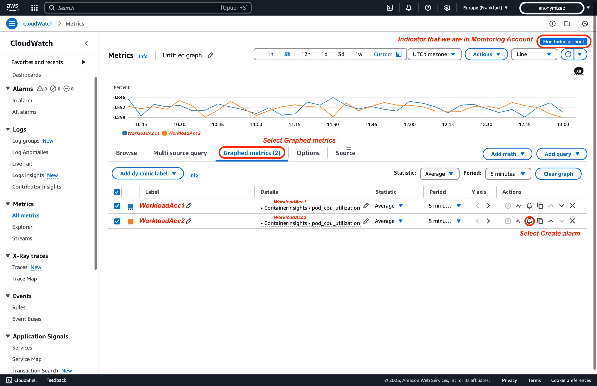

### ログ

Logs Insights を使用して単一のインターフェイスで複数のアカウントからログをクエリおよび分析したり、ログをライブテールしたりできます。複数のアカウントにわたって Logs Insights を使用してログをクエリする方法は次のとおりです。

1. CloudWatch コンソールで、「Logs Insights」に移動し、ログ グループ セレクターを使用して異なるアカウントからログ グループを選択します
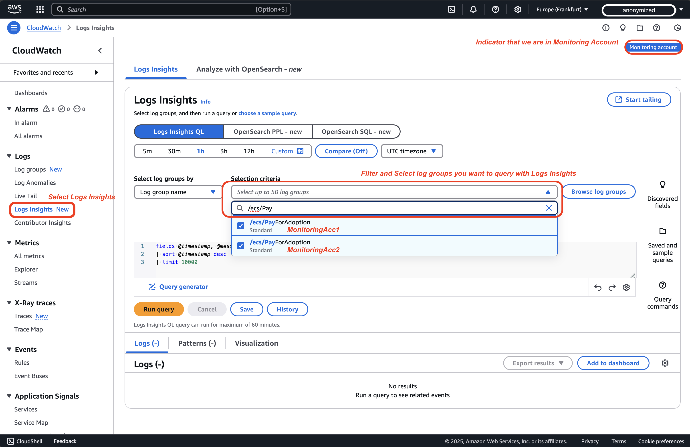

2. 次のステップは、CloudWatch Logs Insights クエリを記述することです。このデモの範囲では、[One Observability Workshop](https://catalog.workshops.aws/observability/en-US/aws-native/logs/logsinsights/fields#step-4:-aggregate-on-our-chosen-fields)[^8] の AWS ネイティブ Observability サブセクション Logs insight からクエリを取得し、わずかに変更します。過去 1 時間に何種類のペットが引き取られたか、およびワークロードアカウントごとにどれだけ引き取られたかを確認します。
    
    ```
    filter @message like /POST/ and @message like /completeadoption/
    | parse @message "* * * *:* *" as method, request, protocol, ip, port, status
    | parse request "*?petId=*&petType=*" as requestURL, id, type
    | parse @log "*:*" as accountId, logGroupName // Modified to parse accountId from @log information
    | stats count() by type,accountId // Modified to group by previously parsed accountId
    ```
    
    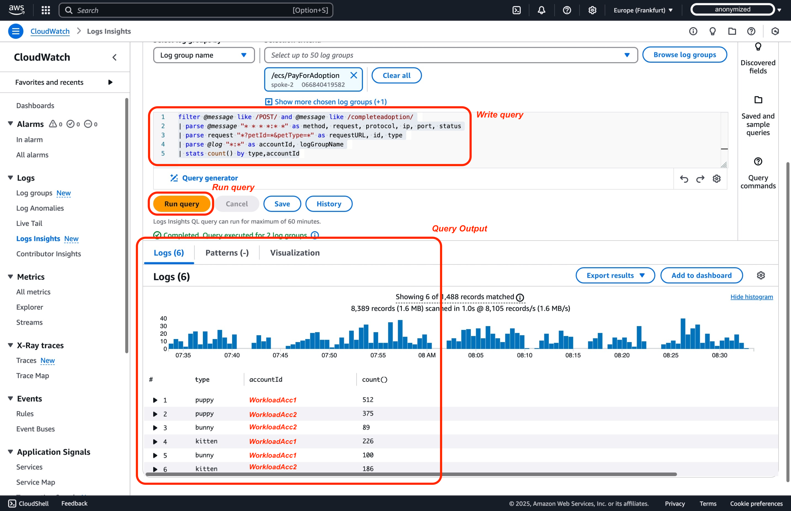

複数のアカウントにわたって Live Tail ログを表示する方法は次のとおりです。

1. CloudWatch コンソールで、**Live Tail** に移動し、フィルターペインで、ロググループセレクターを使用して異なるアカウントから**ロググループを選択**し、開始を選択します。
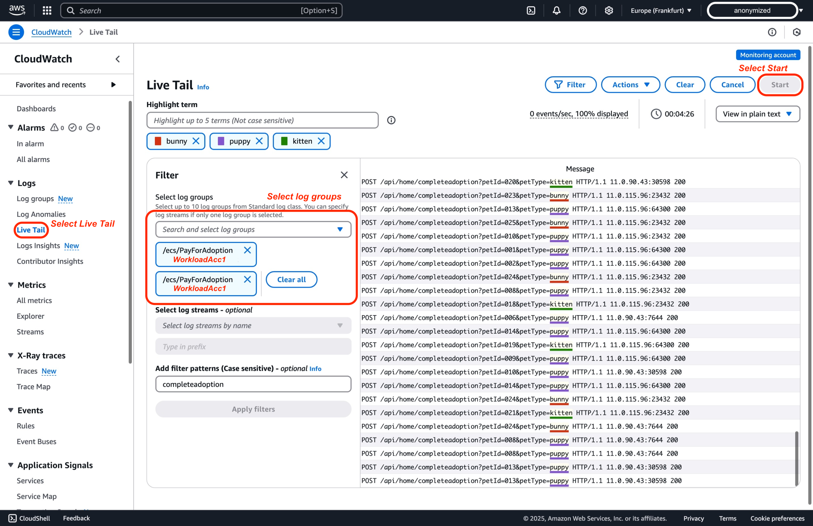

### トレース

1. モニタリングアカウントの CloudWatch コンソールで、ナビゲーションペインの X-Ray トレースの下にある Trace map を選択します。トレースマップには、リンクされたすべてのソースアカウントのデータが表示されます。必要に応じて、Accounts のフィルターを使用してください。  
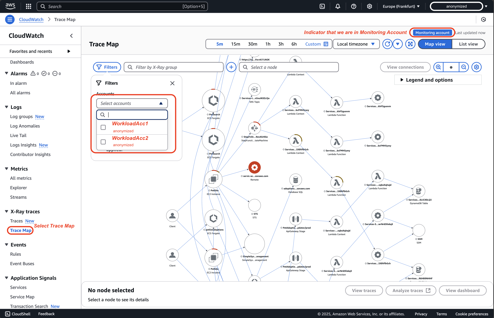

2. トレースマップでは、各ノードがどの AWS アカウントに属しているかが示されます。特定のスパンをより詳細に分析するには、View traces を選択します。  
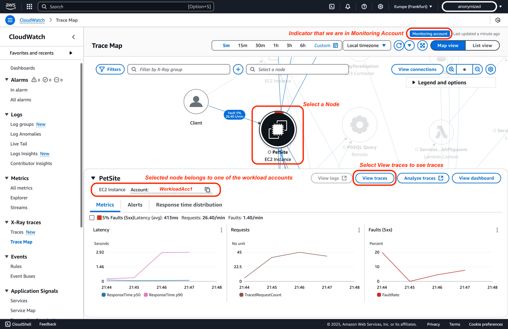

3. 特定のトレースを選択して、個々のセグメントに関する詳細な分析情報を確認します。  
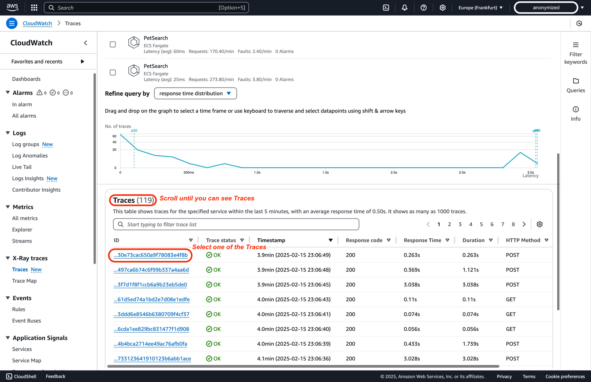

4. エンドツーエンドのトレーススパンを詳しく調べて、トレースされた各パスのコンポーネントについて学習します。  
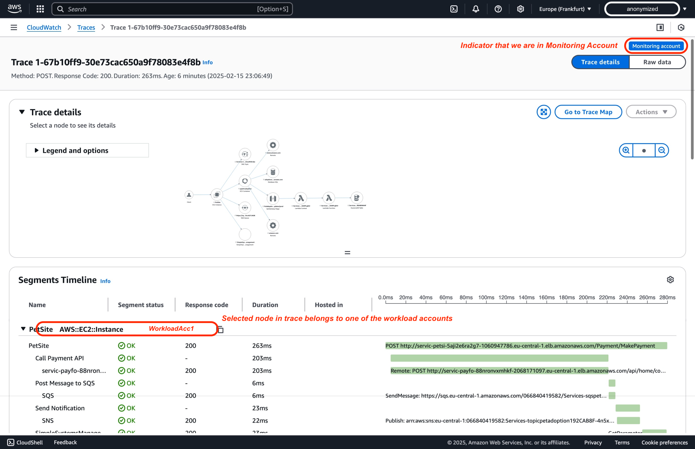


## まとめ

Amazon CloudWatch でクロスアカウントオブザーバビリティを設定すると、複数の AWS アカウントにわたるアプリケーションのパフォーマンスと正常性を一元的に表示できます。これにより、アプリケーションが存在するアカウントに関係なく、監視、トラブルシューティング、分析が簡素化されます。このチュートリアルで説明されている手順に従うことで、モニタリングアカウントを効果的にセットアップし、AWS Organizations または個別のアカウントリンクを使用してソースアカウントをリンクし、設定を検証できます。これで、CloudWatch コンソールを活用して、複数のアカウントにまたがるアプリケーションを監視およびトラブルシューティングできます 1。

クロスアカウントモニタリング機能をさらに強化するには、ダッシュボード、アラーム、ログなどのさまざまな CloudWatch 機能を活用してください。これらの機能により、アプリケーションのパフォーマンスと健全性に関するより深い洞察が得られ、潜在的な問題を事前に特定して対処できるようになります。

## リソース

[^1]: [AWS Blog - Amazon CloudWatch Cross-Account Observability](https://aws.amazon.com/blogs/aws/new-amazon-cloudwatch-cross-account-observability/)

[^2]: [CloudWatch cross-account observability](https://docs.aws.amazon.com/AmazonCloudWatch/latest/monitoring/CloudWatch-Unified-Cross-Account.html)

[^3]: [Permissions needed to create links](https://docs.aws.amazon.com/AmazonCloudWatch/latest/monitoring/CloudWatch-Unified-Cross-Account-Setup.html#CloudWatch-Unified-Cross-Account-Setup-permissions)

[^4]: [What is AWS Organizations?](https://docs.aws.amazon.com/organizations/latest/userguide/orgs_introduction.html)

[^5]: [AWS Cloudformation StackSets and AWS Organizations](https://docs.aws.amazon.com/organizations/latest/userguide/services-that-can-integrate-cloudformation.html)  

[^6]: [Set up a monitoring account](https://docs.aws.amazon.com/AmazonCloudWatch/latest/monitoring/CloudWatch-Unified-Cross-Account-Setup.html#Unified-Cross-Account-Setup-ConfigureMonitoringAccount)

[^7]: [Use an AWS CloudFormation template to set up all accounts in an organization or an organizational unit as source accounts](https://docs.aws.amazon.com/AmazonCloudWatch/latest/monitoring/CloudWatch-Unified-Cross-Account-Setup.html#Unified-Cross-Account-SetupSource-OrgTemplate)

[^8]: [One Observability Workshop](https://catalog.workshops.aws/observability/en-US/intro)

[^9]: [Amazon CloudWatch cross account alarms](https://aws.amazon.com/about-aws/whats-new/2021/08/announcing-amazon-cloudwatch-cross-account-alarms/)
