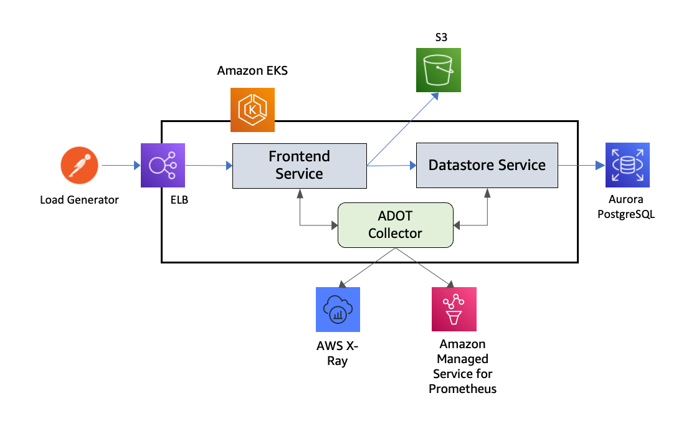

# AWS X-Ray を使用したコンテナトレーシング

オブザーバビリティのベストプラクティスガイドのこのセクションでは、AWS X-Ray を使用したコンテナトレーシングに関連する以下のトピックについて詳しく説明します：

* AWS X-Ray の概要
* AWS Distro for OpenTelemetry 用の Amazon EKS アドオンを使用したトレース収集
* まとめ


### はじめに

[AWS X-Ray](https://docs.aws.amazon.com/ja_jp/xray/latest/devguide/aws-xray.html) は、アプリケーションが処理するリクエストに関するデータを収集し、そのデータを表示、フィルタリング、分析するためのツールを提供するサービスです。これにより、問題点や最適化の機会を特定することができます。アプリケーションへのトレース対象のリクエストについて、リクエストとレスポンスに関する詳細情報だけでなく、アプリケーションが下流の AWS リソース、マイクロサービス、データベース、Web API に対して行う呼び出しについても確認できます。

アプリケーションのインストルメンテーションには、受信および送信リクエストと、アプリケーション内の他のイベントのトレースデータを、各リクエストのメタデータと共に送信することが含まれます。多くのインストルメンテーションのシナリオでは、設定の変更のみで済みます。たとえば、Java アプリケーションが行うすべての受信 HTTP リクエストと AWS サービスへの下流の呼び出しをインストルメント化できます。X-Ray トレースのためのアプリケーションのインストルメンテーションには、複数の SDK、エージェント、ツールを使用できます。詳細については、[アプリケーションのインストルメンテーション](https://docs.aws.amazon.com/ja_jp/xray/latest/devguide/xray-instrumenting-your-app.html)をご覧ください。

AWS Distro for OpenTelemetry 用の Amazon EKS アドオンを使用して Amazon EKS クラスターからトレースを収集することで、コンテナ化されたアプリケーションのトレースについて学びます。


### AWS Distro for OpenTelemetry 用の Amazon EKS アドオンを使用したトレース収集

[AWS X-Ray](https://aws.amazon.com/jp/xray/) はアプリケーショントレース機能を提供し、デプロイされたすべてのマイクロサービスに関する深い洞察を提供します。X-Ray を使用すると、関連するマイクロサービスを通過するすべてのリクエストをトレースできます。これにより、DevOps チームはサービスが他のサービスとどのように相互作用するかを理解し、問題をより迅速に分析およびデバッグするために必要な洞察を得ることができます。

[AWS Distro for OpenTelemetry (ADOT)](https://aws-otel.github.io/docs/introduction) は、OpenTelemetry プロジェクトの安全な AWS サポート対象のディストリビューションです。ユーザーはアプリケーションを一度計装するだけで、ADOT を使用して相関のあるメトリクスとトレースを複数のモニタリングソリューションに送信できます。Amazon EKS では、クラスターの起動後いつでも ADOT をアドオンとして有効にすることができます。ADOT アドオンには最新のセキュリティパッチとバグ修正が含まれており、Amazon EKS での動作が AWS によって検証されています。

ADOT アドオンは、カスタムリソースを使用してアプリケーションとそのコンポーネントを管理する Kubernetes の拡張機能である Kubernetes Operator の実装です。このアドオンは OpenTelemetryCollector という名前のカスタムリソースを監視し、カスタムリソースで指定された設定に基づいて ADOT Collector のライフサイクルを管理します。

ADOT Collector には、Receiver、Processor、Exporter という 3 つの主要なコンポーネントタイプで構成されるパイプラインの概念があります。[Receiver](https://opentelemetry.io/docs/collector/configuration/#receivers) は、データがコレクターに取り込まれる方法です。特定の形式でデータを受け入れ、内部形式に変換し、パイプラインで定義された [Processors](https://opentelemetry.io/docs/collector/configuration/#processors) と [Exporters](https://opentelemetry.io/docs/collector/configuration/#exporters) に渡します。プル型またはプッシュ型にすることができます。Processor は、受信されてからエクスポートされるまでの間にデータのバッチ処理、フィルタリング、変換などのタスクを実行するためのオプションのコンポーネントです。Exporter は、メトリクス、ログ、またはトレースの送信先を決定するために使用されます。コレクターのアーキテクチャでは、Kubernetes YAML マニフェストを介してこのようなパイプラインの複数のインスタンスを設定できます。

次の図は、トレースパイプラインで構成された ADOT Collector を示しており、テレメトリデータを AWS X-Ray に送信します。トレースパイプラインは、[AWS X-Ray Receiver](https://github.com/open-telemetry/opentelemetry-collector-contrib/tree/main/receiver/awsxrayreceiver) と [AWS X-Ray Exporter](https://github.com/open-telemetry/opentelemetry-collector-contrib/tree/main/exporter/awsxrayexporter) のインスタンスで構成され、トレースを AWS X-Ray に送信します。


*図: AWS Distro for OpenTelemetry 用の Amazon EKS アドオンを使用したトレース収集*

ADOT アドオンを EKS クラスターにインストールし、ワークロードからテレメトリデータを収集する詳細を見ていきましょう。以下は、ADOT アドオンをインストールする前に必要な前提条件のリストです。

* Kubernetes バージョン 1.19 以上をサポートする EKS クラスター。[こちらで説明されているアプローチ](https://docs.aws.amazon.com/ja_jp/eks/latest/userguide/create-cluster.html)のいずれかを使用して EKS クラスターを作成できます。
* クラスターにまだインストールされていない場合は、[Certificate Manager](https://cert-manager.io/)。[このドキュメント](https://cert-manager.io/docs/installation/)に従ってデフォルト設定でインストールできます。
* クラスターに ADOT アドオンをインストールするための EKS アドオン専用の Kubernetes RBAC 権限。これは、kubectl などの CLI ツールを使用して[この YAML](https://amazon-eks.s3.amazonaws.com/docs/addons-otel-permissions.yaml)ファイルの設定をクラスターに適用することで実現できます。

次のコマンドを使用して、EKS の異なるバージョンで有効になっているアドオンのリストを確認できます：

`aws eks describe-addon-versions`

JSON 出力には、以下のように ADOT アドオンが他のアドオンとともにリストされるはずです。EKS クラスターが作成されたとき、EKS アドオンはそれにアドオンをインストールしないことに注意してください。

```
{
   "addonName":"adot",
   "type":"observability",
   "addonVersions":[
      {
         "addonVersion":"v0.45.0-eksbuild.1",
         "architecture":[
            "amd64"
         ],
         "compatibilities":[
            {
               "clusterVersion":"1.22",
               "platformVersions":[
                  "*"
               ],
               "defaultVersion":true
            },
            {
               "clusterVersion":"1.21",
               "platformVersions":[
                  "*"
               ],
               "defaultVersion":true
            },
            {
               "clusterVersion":"1.20",
               "platformVersions":[
                  "*"
               ],
               "defaultVersion":true
            },
            {
               "clusterVersion":"1.19",
               "platformVersions":[
                  "*"
               ],
               "defaultVersion":true
            }
         ]
      }
   ]
}
```

次に、以下のコマンドで ADOT アドオンをインストールできます：

`aws eks create-addon --addon-name adot --addon-version v0.45.0-eksbuild.1 --cluster-name $CLUSTER_NAME `

バージョン文字列は、先ほど表示された出力の *addonVersion* フィールドの値と一致する必要があります。このコマンドが正常に実行された場合の出力は以下のようになります：

```
{
    "addon": {
        "addonName": "adot",
        "clusterName": "k8s-production-cluster",
        "status": "ACTIVE",
        "addonVersion": "v0.45.0-eksbuild.1",
        "health": {
            "issues": []
        },
        "addonArn": "arn:aws:eks:us-east-1:123456789000:addon/k8s-production-cluster/adot/f0bff97c-0647-ef6f-eecf-0b2a13f7491b",
        "createdAt": "2022-04-04T10:36:56.966000+05:30",
        "modifiedAt": "2022-04-04T10:38:09.142000+05:30",
        "tags": {}
    }
}
```

次のステップに進む前に、アドオンが ACTIVE ステータスになるまで待ちます。アドオンのステータスは以下のコマンドで確認できます：

`aws eks describe-addon --addon-name adot --cluster-name $CLUSTER_NAME`


#### ADOT Collector のデプロイ

ADOT アドオンは、Kubernetes Operator の実装です。これは Kubernetes の拡張ソフトウェアで、カスタムリソースを使用してアプリケーションとそのコンポーネントを管理します。このアドオンは OpenTelemetryCollector という名前のカスタムリソースを監視し、カスタムリソースで指定された設定に基づいて ADOT Collector のライフサイクルを管理します。次の図は、この仕組みを示しています。


*図: ADOT Collector のデプロイ*

次に、ADOT Collector のデプロイ方法を見ていきましょう。[こちらの YAML 設定ファイル](https://github.com/aws-observability/aws-o11y-recipes/blob/main/sandbox/eks-addon-adot/otel-collector-xray-prometheus-complete.yaml) は、OpenTelemetryCollector カスタムリソースを定義しています。これを EKS クラスターにデプロイすると、ADOT アドオンがトリガーされ、上記の最初の図に示すようなコンポーネントを含むトレースとメトリクスのパイプラインを備えた ADOT Collector がプロビジョニングされます。コレクターは `aws-otel-eks` 名前空間に `${custom-resource-name}-collector` という名前の Kubernetes Deployment としてデプロイされます。同じ名前の ClusterIP サービスも起動されます。このコレクターのパイプラインを構成する個々のコンポーネントを見ていきましょう。

トレースパイプラインの AWS X-Ray Receiver は、[X-Ray セグメント形式](https://docs.aws.amazon.com/ja_jp/xray/latest/devguide/xray-api-segmentdocuments.html) のセグメントまたはスパンを受け入れます。これにより、X-Ray SDK で計装されたマイクロサービスから送信されたセグメントを処理できます。UDP ポート 2000 でトラフィックを待ち受けるように設定され、Cluster IP サービスとして公開されます。この設定では、このレシーバーにトレースデータを送信したいワークロードは、環境変数 `AWS_XRAY_DAEMON_ADDRESS` を `observability-collector.aws-otel-eks:2000` に設定する必要があります。エクスポーターは、[PutTraceSegments](https://docs.aws.amazon.com/ja_jp/xray/latest/api/API_PutTraceSegments.html) API を使用してこれらのセグメントを直接 X-Ray に送信します。

ADOT Collector は、`aws-otel-collector` という名前の Kubernetes サービスアカウントの ID で起動するように設定されています。このアカウントには、[設定](https://github.com/aws-observability/aws-o11y-recipes/blob/main/sandbox/eks-addon-adot/otel-collector-xray-prometheus-complete.yaml) にも示されているように、ClusterRoleBinding と ClusterRole を使用してこれらの権限が付与されます。エクスポーターは X-Ray にデータを送信するための IAM 権限が必要です。これは、EKS がサポートする [サービスアカウント用の IAM ロール](https://docs.aws.amazon.com/ja_jp/eks/latest/userguide/iam-roles-for-service-accounts.html) 機能を使用して、サービスアカウントを IAM ロールに関連付けることで実現されます。IAM ロールには、AWSXRayDaemonWriteAccess などの AWS マネージドポリシーを関連付ける必要があります。[こちらのヘルパースクリプト](https://github.com/aws-observability/aws-o11y-recipes/blob/main/sandbox/eks-addon-adot/adot-irsa.sh) は、CLUSTER_NAME と REGION 変数を設定した後、これらの権限を付与され `aws-otel-collector` サービスアカウントに関連付けられた `EKS-ADOT-ServiceAccount-Role` という名前の IAM ロールを作成するために使用できます。


#### トレース収集のエンドツーエンドテスト

EKS クラスターにデプロイされたワークロードからのトレース収集をテストしてみましょう。次の図は、このテストで使用されたセットアップを示しています。REST API を公開し S3 と対話するフロントエンドサービスと、Aurora PostgreSQL データベースのインスタンスと対話するデータストアサービスで構成されています。これらのサービスは X-Ray SDK で計装されています。ADOT Collector は、前のセクションで説明した YAML マニフェストを使用して OpenTelemetryCollector カスタムリソースをデプロイすることで、Deployment モードで起動されます。Postman クライアントは、フロントエンドサービスをターゲットとする外部トラフィックジェネレーターとして使用されます。



*図：トレース収集のエンドツーエンドテスト*

次の画像は、サービスから取得したセグメントデータを使用して X-Ray が生成したサービスグラフを示しており、各セグメントの平均応答レイテンシーを表示しています。


*図：CloudWatch Service Map コンソール*

トレースパイプライン設定に関連する OpenTelemetryCollector カスタムリソース定義については、[OTLP Receiver と AWS X-Ray Exporter を使用して AWS X-Ray にトレースを送信するトレースパイプライン](https://github.com/aws-observability/aws-otel-community/blob/master/sample-configs/operator/collector-config-xray.yaml) を確認してください。AWS X-Ray と共に ADOT Collector を使用したいお客様は、これらの設定テンプレートを出発点として、プレースホルダー変数を対象環境に基づく値に置き換え、ADOT 用の EKS アドオンを使用して Amazon EKS クラスターにコレクターを迅速にデプロイすることができます。


### EKS Blueprints を使用した AWS X-Ray によるコンテナトレーシングのセットアップ

[EKS Blueprints](https://aws.amazon.com/jp/blogs/news/bootstrapping-clusters-with-eks-blueprints/) は、アカウントやリージョン間で一貫性のある、すぐに使える EKS クラスターを設定およびデプロイするのに役立つ Infrastructure as Code (IaC) モジュールのコレクションです。EKS Blueprints を使用すると、[Amazon EKS アドオン](https://docs.aws.amazon.com/ja_jp/eks/latest/userguide/eks-add-ons.html) や、Prometheus、Karpenter、Nginx、Traefik、AWS Load Balancer Controller、Container Insights、Fluent Bit、Keda、Argo CD などの広く使用されているオープンソースのアドオンを使用して、EKS クラスターを簡単にブートストラップできます。EKS Blueprints は、インフラストラクチャのデプロイを自動化するのに役立つ 2 つの一般的な IaC フレームワーク、[HashiCorp Terraform](https://github.com/aws-ia/terraform-aws-eks-blueprints) と [AWS Cloud Development Kit (AWS CDK)](https://github.com/aws-quickstart/cdk-eks-blueprints) で実装されています。

EKS Blueprints を使用した Amazon EKS クラスターの作成プロセスの一部として、Day One の運用ツールとして AWS X-Ray をセットアップし、コンテナ化されたアプリケーションやマイクロサービスからメトリクスとログを収集、集約、要約して Amazon CloudWatch コンソールに表示することができます。


## まとめ

オブザーバビリティのベストプラクティスガイドのこのセクションでは、AWS Distro for OpenTelemetry の Amazon EKS アドオンを使用したトレース収集により、Amazon EKS 上のアプリケーションのコンテナトレースに AWS X-Ray を使用する方法について学びました。

さらに学習を深めるには、[AWS Distro for OpenTelemetry の Amazon EKS アドオンを使用した Amazon Managed Service for Prometheus と Amazon CloudWatch へのメトリクスとトレースの収集](https://aws.amazon.com/jp/blogs/news/metrics-and-traces-collection-using-amazon-eks-add-ons-for-aws-distro-for-opentelemetry/) をご確認ください。

最後に、Amazon EKS クラスターの作成プロセス中に AWS X-Ray を使用したコンテナトレースをセットアップするための手段として、EKS Blueprints の使用方法について簡単に説明しました。

さらに深く掘り下げるには、AWS [One Observability Workshop](https://catalog.workshops.aws/observability/en-US) の **AWS native** オブザーバビリティカテゴリにある X-Ray トレースモジュールを実践することを強くおすすめします。
