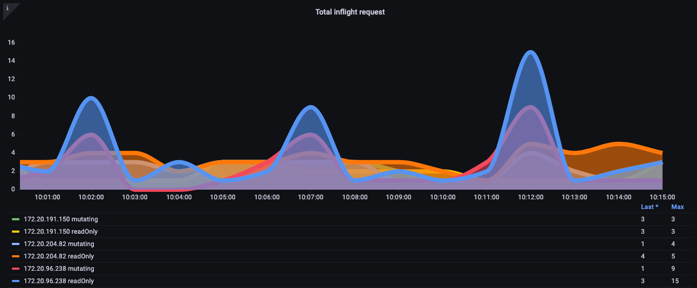
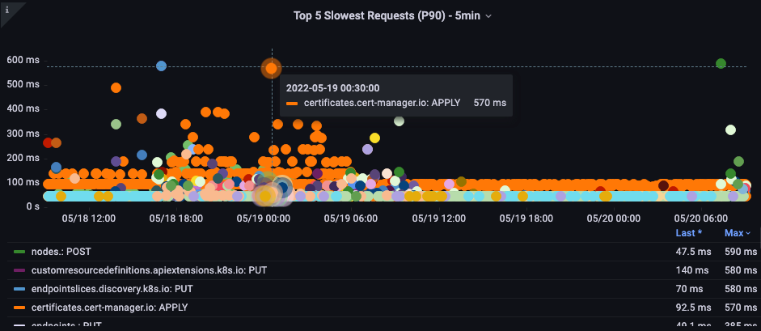

# Amazon EKS API サーバーのモニタリング

オブザーバビリティのベストプラクティスガイドのこのセクションでは、API サーバーのモニタリングに関連する以下のトピックについて詳しく説明します：

* Amazon EKS API サーバーのモニタリングの概要
* API サーバートラブルシューターダッシュボードの設定
* API トラブルシューターダッシュボードを使用した API サーバーの問題の理解
* API サーバーへの無制限のリスト呼び出しについて
* API サーバーへの不適切な動作の停止
* API の優先順位と公平性
* 最も遅い API 呼び出しと API サーバーのレイテンシーの問題の特定

### はじめに

Amazon EKS マネージドコントロールプレーンのモニタリングは、EKS クラスターの健全性に関する問題を事前に特定するための重要な Day One の運用活動です。
Amazon EKS コントロールプレーンのモニタリングは、収集したメトリクスに基づいて事前対策を講じるのに役立ちます。
これらのメトリクスは、API サーバーのトラブルシューティングと、根本的な問題の特定に役立ちます。

このセクションでは、Amazon EKS API サーバーのモニタリングに Amazon Managed Service for Prometheus (AMP) を、メトリクスの可視化に Amazon Managed Grafana (AMG) を使用してデモンストレーションを行います。
Prometheus は、強力なクエリ機能を提供し、さまざまなワークロードを幅広くサポートする人気のオープンソースモニタリングツールです。
Amazon Managed Service for Prometheus は、完全マネージド型の Prometheus 互換サービスで、Amazon EKS、[Amazon Elastic Container Service (Amazon ECS)](https://aws.amazon.com/jp/ecs)、[Amazon Elastic Compute Cloud (Amazon EC2)](https://aws.amazon.com/jp/ec2) などの環境を安全かつ確実にモニタリングすることができます。
[Amazon Managed Grafana](https://aws.amazon.com/jp/grafana/) は、オープンソースの Grafana 向けの完全マネージド型で安全なデータ可視化サービスで、お客様は複数のデータソースからアプリケーションの運用メトリクス、ログ、トレースを即座にクエリ、相関付け、可視化することができます。

まず、Amazon Managed Service for Prometheus と Amazon Managed Grafana を使用してスターターダッシュボードを設定し、Prometheus を使用した [Amazon Elastic Kubernetes Service (Amazon EKS)](https://aws.amazon.com/jp/eks) API サーバーのトラブルシューティングを支援します。
続くセクションでは、EKS API サーバーのトラブルシューティング時の問題の理解、API の優先順位と公平性、不適切な動作の停止について詳しく説明します。
最後に、最も遅い API 呼び出しと API サーバーのレイテンシーの問題を特定する方法を詳しく説明し、Amazon EKS クラスターの状態を健全に保つためのアクションを取れるようにします。

### API サーバーのトラブルシューティング用ダッシュボードのセットアップ

[Amazon Elastic Kubernetes Service (Amazon EKS)](https://aws.amazon.com/jp/eks) の API サーバーのトラブルシューティングを支援するための初期ダッシュボードを、AMP を使用してセットアップします。
これを使用して、本番環境の EKS クラスターのトラブルシューティング時にメトリクスを理解できるようにします。
Amazon EKS クラスターのトラブルシューティング時に、収集されたメトリクスの重要性をより深く理解できるように説明していきます。

まず、[ADOT コレクターをセットアップして、Amazon EKS クラスターから Amazon Manager Service for Prometheus にメトリクスを収集](https://aws.amazon.com/jp/blogs/news/metrics-and-traces-collection-using-amazon-eks-add-ons-for-aws-distro-for-opentelemetry/)します。
このセットアップでは、EKS ADOT アドオンを使用します。これにより、EKS クラスターの起動後いつでも ADOT をアドオンとして有効にすることができます。
ADOT アドオンには、最新のセキュリティパッチとバグ修正が含まれており、Amazon EKS で動作することが AWS によって検証されています。
このセットアップでは、EKS クラスターに ADOT アドオンをインストールし、クラスターからメトリクスを収集する方法を説明します。

次に、最初のステップでセットアップした AMP をデータソースとして使用するために、[Amazon Managed Grafana ワークスペースをセットアップ](https://aws.amazon.com/jp/blogs/news/amazon-managed-grafana-getting-started/)します。
最後に、[API トラブルシューターダッシュボード](https://github.com/RiskyAdventure/Troubleshooting-Dashboards/blob/main/api-troubleshooter.json)をダウンロードし、Amazon Managed Grafana に移動して API トラブルシューター用のダッシュボード JSON をアップロードし、トラブルシューティングのためのメトリクスを可視化します。

### API トラブルシューティングダッシュボードを使用した問題の理解

クラスターにインストールしたい興味深いオープンソースプロジェクトを見つけたとします。
そのオペレーターは、クラスターに DaemonSet をデプロイしますが、不正な形式のリクエストを使用したり、不必要に多くの LIST コールを行ったり、あるいは 1,000 ノードすべてにある DaemonSet が、クラスター上の 50,000 個の Pod のステータスを毎分リクエストしたりする可能性があります！
このようなことは本当によく起こるのでしょうか？はい、実際によく起こります！
このような状況がどのように発生するのか、簡単に見ていきましょう。

#### LIST と WATCH の理解

クラスター内のオブジェクトの状態を理解する必要があるアプリケーションがあります。例えば、機械学習 (ML) アプリケーションでは、*Completed* ステータスになっていない Pod の数を把握することでジョブのステータスを知る必要があります。Kubernetes では、WATCH と呼ばれる適切な方法と、Pod の最新ステータスを確認するためにクラスター上のすべてのオブジェクトをリストアップするという、あまり適切ではない方法があります。

#### 適切な WATCH の使用

Kubernetes でアップデートを行う最もスケーラブルな方法は、WATCH またはプッシュモデルを介してアップデートを受信する単一の長期接続を使用することです。簡単に説明すると、システムの完全な状態を要求し、そのオブジェクトに対する変更を受信したときにのみキャッシュ内のオブジェクトを更新し、定期的に再同期を実行してアップデートの漏れがないことを確認します。

以下の画像では、`apiserver_longrunning_gauge` を使用して、両方の API サーバーにおけるこれらの長期接続の数を把握しています。

*図: `apiserver_longrunning_gauge` メトリクス*

このような効率的なシステムでも、良いものを使いすぎることがあります。たとえば、API サーバーと通信する必要がある 2 つ以上の DaemonSet を使用する非常に小さなノードを多数使用する場合、システムの WATCH 呼び出しの数が不必要に大幅に増加する可能性があります。例として、8 つの xlarge ノードと 1 つの 8xlarge ノードの違いを見てみましょう。ここでは、システムの WATCH 呼び出しが 8 倍に増加しているのが分かります。

*図: 8 つの xlarge ノード間の WATCH 呼び出し*

これらは効率的な呼び出しですが、もし先ほど言及した不適切な呼び出しだったらどうでしょうか？1,000 個のノードそれぞれの上記の DaemonSet の 1 つが、クラスター内の合計 50,000 個の Pod それぞれのアップデートを要求していると想像してみてください。次のセクションでは、この無制限のリスト呼び出しについて詳しく見ていきます。

続ける前に注意点があります。上記の例のような統合は細心の注意を払って行う必要があり、多くの要因を考慮する必要があります。システムの限られた数の CPU を争う多数のスレッドの遅延、Pod の変更率、ノードが安全に処理できるボリュームアタッチメントの最大数など、すべてが関係します。しかし、私たちの焦点は、問題の発生を防ぎ、場合によっては設計に新しい洞察を与えてくれる実行可能なステップにつながるメトリクスに置かれます。

WATCH メトリクスはシンプルですが、WATCH の数を追跡し、それが問題である場合は削減するために使用できます。以下は、この数を減らすために検討できるいくつかのオプションです：

* Helm が履歴を追跡するために作成する ConfigMap の数を制限する
* WATCH を使用しないイミュータブルな ConfigMap とシークレットを使用する
* 適切なノードのサイジングと統合

### API サーバーへの無制限のリストコールについて

これまで話してきた LIST コールについて説明します。リストコールは、オブジェクトの状態を理解する必要がある度に、Kubernetes オブジェクトの完全な履歴を取得します。この場合、キャッシュには何も保存されません。

これはどの程度の影響があるのでしょうか？これは、データをリクエストするエージェントの数、リクエストの頻度、リクエストするデータ量によって異なります。クラスター全体のデータを要求しているのか、それとも単一の名前空間だけなのでしょうか？それは毎分、すべてのノードで発生しているのでしょうか？例として、ノードから送信される各ログに Kubernetes のメタデータを追加するロギングエージェントを考えてみましょう。これは、大規模なクラスターでは膨大な量のデータになる可能性があります。エージェントがリストコールを通じてそのデータを取得する方法は多数ありますので、いくつか見てみましょう。

以下のリクエストは、特定の名前空間からポッドを要求しています。

`/api/v1/namespaces/my-namespace/pods`

次に、クラスター上の 50,000 個のポッドすべてを、一度に 500 個ずつのチャンクで要求します。

`/api/v1/pods?limit=500`

次のコールは最も破壊的です。クラスター全体の 50,000 個のポッドを一度に取得します。

`/api/v1/pods`

これは現場で頻繁に発生し、ログで確認することができます。

### API サーバーの不適切な動作を停止する

クラスターをこのような不適切な動作から保護するにはどうすればよいでしょうか？Kubernetes 1.20 以前では、API サーバーは 1 秒あたりに処理される *インフライト* リクエストの数を制限することで自身を保護していました。etcd は一度に処理できるリクエスト数に限りがあるため、etcd の読み取りと書き込みを適切なレイテンシー範囲内に保つために、1 秒あたりのリクエスト数を制限する必要があります。残念ながら、この記事の執筆時点では、これを動的に行う方法はありません。

以下のチャートでは、読み取りリクエストの内訳を示しています。API サーバーあたりのインフライトリクエストのデフォルトの上限は 400、同時書き込みリクエストのデフォルトの上限は 200 です。デフォルトの EKS クラスターでは、2 つの API サーバーがあり、合計で 800 の読み取りと 400 の書き込みが可能です。ただし、アップグレード直後などの特定の時期には、これらのサーバーに非対称な負荷がかかる可能性があるため、注意が必要です。

*図：読み取りリクエストの内訳を示す Grafana チャート*

上記の方式は完璧ではないことが判明しました。例えば、新しくインストールした不適切な動作をするオペレーターが API サーバーのインフライト書き込みリクエストをすべて使用し、ノードのキープアライブメッセージなどの重要なリクエストを遅延させる可能性があるのを、どのように防ぐことができるでしょうか？

### API の優先順位と公平性

1 秒あたりの読み取り/書き込みリクエストの数を気にするのではなく、キャパシティを 1 つの合計数として扱い、クラスター上の各アプリケーションがその最大合計数の公平な割合を取得するとしたらどうでしょうか？

これを効果的に行うには、API サーバーにリクエストを送信した送信者を特定し、そのリクエストに名前タグのようなものを付ける必要があります。この新しい名前タグを使用して、これらのリクエストがすべて "Chatty" と呼ばれる新しいエージェントから送信されていることを確認できます。これにより、Chatty のすべてのリクエストを、同じ DaemonSet からのリクエストを識別する *フロー* と呼ばれるものにグループ化できます。この概念により、この問題のあるエージェントを制限し、クラスター全体を消費しないようにする機能が得られます。

ただし、すべてのリクエストが同等というわけではありません。クラスターの運用に必要なコントロールプレーントラフィックは、新しいオペレーターよりも優先順位が高くなければなりません。ここで優先順位レベルの考え方が登場します。デフォルトで、重要、高、低優先度のトラフィック用に複数の「バケット」またはキューがあったらどうでしょうか？ Chatty エージェントフローが重要なトラフィックキューで公平なシェアを得ることは望ましくありません。ただし、そのトラフィックを低優先度キューに入れることで、そのフローが他の Chatty エージェントと競合するようにすることができます。その後、各優先順位レベルに、リクエストが過度に遅延しないように、API サーバーが処理できる全体の最大値の適切な数のシェアまたは割合があることを確認する必要があります。

#### 優先順位とフェアネスの動作

これは比較的新しい機能であるため、多くの既存のダッシュボードでは、最大同時読み取りと最大同時書き込みの古いモデルを使用しています。なぜこれが問題になる可能性があるのでしょうか？

kube-system 名前空間のすべてに高優先度の名前タグを付与していたとしても、その重要な名前空間に問題のあるエージェントをインストールしたり、単にその名前空間に多くのアプリケーションをデプロイしすぎたりした場合はどうなるでしょうか？避けようとしていた問題と同じ状況に陥る可能性があります！そのため、このような状況を注意深く監視することが重要です。

このような問題を追跡するために、私が最も重要だと考えるメトリクスをいくつか紹介します。

* 優先度グループのシェアの何パーセントが使用されているか？
* リクエストがキューで待機した最長時間は？
* どのフローが最もシェアを使用しているか？
* システムに予期しない遅延はあるか？

#### 使用率

ここでは、クラスターの異なるデフォルトの優先度グループと、最大値に対する使用率の割合を確認できます。

*図：クラスターの優先度グループ*

#### リクエストがキューに入っていた時間

リクエストが処理される前に、優先度キューで待機していた時間を秒単位で示します。

*図: リクエストが優先度キューに入っていた時間*

#### フローごとの実行リクエスト数の上位

どのフローが最も多くのシェアを占めているでしょうか？

*図: フローごとの実行リクエスト数の上位*

#### リクエスト実行時間

処理に予期しない遅延はありませんか？

*図: フロー制御リクエスト実行時間*

### 最も遅い API コールと API サーバーのレイテンシーの問題を特定する

API レイテンシーの原因について理解できたので、全体像を見てみましょう。
ダッシュボードの設計は、調査が必要な問題の有無を素早く把握することが目的であることを覚えておくことが重要です。
詳細な分析には、PromQL を使用したアドホッククエリ、あるいはさらに良い方法として、ログクエリを使用します。

高レベルのメトリクスとして、どのような指標を確認すべきでしょうか？

* どの API コールが最も時間がかかっているか？
    * そのコールは何をしているのか？（オブジェクトの一覧表示、削除など）
    * どのオブジェクトに対してその操作を実行しようとしているのか？（Pod、Secret、ConfigMap など）
* API サーバー自体にレイテンシーの問題があるか？
    * プライオリティキューの 1 つに遅延があり、リクエストのバックアップが発生しているか？
* etcd サーバーがレイテンシーを経験しているために、API サーバーが遅く見えるだけなのか？

#### 最も遅い API コール

以下のグラフでは、その期間で完了までに最も時間がかかった API コールを確認しています。
この場合、カスタムリソース定義 (CRD) が LIST 関数を呼び出しており、05:40 の時間枠で最も遅延が大きいコールであることがわかります。
このデータを基に、CloudWatch Insights を使用して、その時間枠の監査ログから LIST リクエストを抽出し、どのアプリケーションが原因である可能性があるかを確認できます。

*図: 最も遅い上位 5 つの API コール*

#### API リクエスト時間

この API レイテンシーチャートは、リクエストが 1 分のタイムアウト値に近づいているかどうかを理解するのに役立ちます。以下の時系列ヒストグラムは、折れ線グラフでは隠れてしまう外れ値を確認できるため、好ましい形式です。

*図: API リクエスト時間のヒートマップ*

バケットにカーソルを合わせるだけで、約 25 ミリ秒かかった呼び出しの正確な数を確認できます。
[Image: Image.jpg]*図: 25 ミリ秒を超える呼び出し*

このコンセプトは、リクエストをキャッシュする他のシステムと連携する際に重要です。キャッシュされたリクエストは高速になります。キャッシュされたリクエストのレイテンシーを、より遅いリクエストと混ぜたくありません。ここでは、2 つの異なるレイテンシーバンドを確認できます。キャッシュされたリクエストと、されていないリクエストです。

*図: レイテンシー、キャッシュされたリクエスト*

#### ETCD リクエスト時間

ETCD のレイテンシーは、Kubernetes のパフォーマンスにおいて最も重要な要素の 1 つです。
Amazon EKS では、`request_duration_seconds_bucket` メトリクスを確認することで、API サーバーの視点からこのパフォーマンスを確認できます。

*図: `request_duration_seconds_bucket` メトリクス*

これまでに学んだことを組み合わせて、特定のイベントに相関関係があるかどうかを確認できます。
以下のチャートでは、API サーバーのレイテンシーを確認できますが、このレイテンシーの多くが etcd サーバーから発生していることがわかります。
一目で適切な問題領域にすばやく移動できることが、ダッシュボードの強力な機能です。

*図: Etcd リクエスト*

## まとめ

オブザーバビリティのベストプラクティスガイドのこのセクションでは、Amazon Managed Service for Prometheus と Amazon Managed Grafana を使用した[スターターダッシュボード](https://github.com/RiskyAdventure/Troubleshooting-Dashboards/blob/main/api-troubleshooter.json)を使用して、[Amazon Elastic Kubernetes Service (Amazon EKS)](https://aws.amazon.com/jp/eks) API サーバーのトラブルシューティングを支援しました。

さらに、EKS API サーバーのトラブルシューティング時の問題の理解、API の優先順位と公平性、不適切な動作の停止について詳しく説明しました。

最後に、最も遅い API コールと API サーバーのレイテンシーの問題を特定することについて詳しく説明し、Amazon EKS クラスターの状態を健全に保つためのアクションを取るのに役立つ情報を提供しました。

さらに詳しく学ぶには、AWS [One Observability Workshop](https://catalog.workshops.aws/observability/en-US) の AWS ネイティブオブザーバビリティカテゴリにあるアプリケーションモニタリングモジュールの実践をお勧めします。
