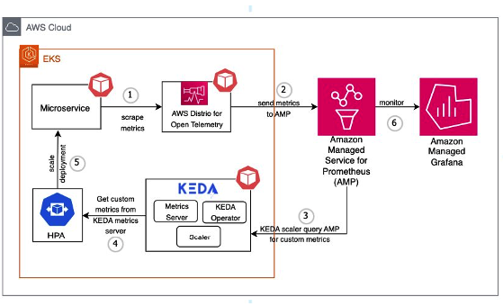

# AMP と EKS で KEDA を使用したアプリケーションのオートスケーリング

# 現状の課題

Amazon EKS アプリケーションでのトラフィック増加への対応は課題となっています。手動でのスケーリングは非効率で、エラーが発生しやすい状況です。

オートスケーリングは、リソース割り当ての優れたソリューションを提供します。KEDA は、様々なメトリクスとイベントに基づいて Kubernetes のオートスケーリングを可能にし、Amazon Managed Service for Prometheus は EKS クラスターの安全なメトリクスモニタリングを提供します。

このソリューションでは、KEDA と Amazon Managed Service for Prometheus を組み合わせ、1 秒あたりのリクエスト数 (RPS) メトリクスに基づくオートスケーリングを実演します。このアプローチにより、ワークロードの需要に合わせた自動スケーリングが実現され、ユーザーは自身の EKS ワークロードに適用できます。

Amazon Managed Grafana を使用してスケーリングパターンのモニタリングと可視化を行うことで、ユーザーはオートスケーリングの動作を把握し、ビジネスイベントと関連付けることができます。

# KEDA による AMP メトリクスを使用したアプリケーションのオートスケーリング

このソリューションは、自動スケーリングパイプラインを作成するための AWS とオープンソースソフトウェアの統合を示しています。
マネージド Kubernetes サービスの Amazon EKS、メトリクス収集のための AWS Distro for Open Telemetry (ADOT)、イベント駆動型オートスケーリングの KEDA、メトリクスストレージの Amazon Managed Service for Prometheus、可視化のための Amazon Managed Grafana を組み合わせています。
アーキテクチャには、EKS への KEDA のデプロイ、メトリクスをスクレイピングするための ADOT の設定、KEDA ScaledObject によるオートスケーリングルールの定義、スケーリングを監視するための Grafana ダッシュボードの使用が含まれています。
オートスケーリングプロセスは、マイクロサービスへのユーザーリクエストから始まり、ADOT がメトリクスを収集し、Prometheus に送信します。
KEDA は定期的にこれらのメトリクスをクエリし、スケーリングの必要性を判断し、Horizontal Pod Autoscaler (HPA) と連携して Pod のレプリカ数を調整します。
このセットアップにより、Kubernetes マイクロサービスのメトリクス駆動型オートスケーリングが可能になり、さまざまな使用率指標に基づいてスケーリングできる柔軟なクラウドネイティブアーキテクチャを提供します。

# AMP メトリクスを使用した KEDA による EKS アプリケーションのクロスアカウントスケーリング
この例では、KEDA EKS が ID 117 で終わる AWS アカウントで実行され、中央の AMP アカウント ID が 814 で終わると仮定します。KEDA EKS アカウントで、以下のようにクロスアカウント IAM ロールを設定します。

また、信頼関係を以下のように更新する必要があります：

EKS クラスターでは、IRSA が使用されているため Pod アイデンティティを使用していないことがわかります。

中央の AMP アカウントでは、以下のように AMP アクセスを設定しています。

信頼関係にもアクセス権が設定されています。

以下のようにワークスペース ID をメモしておきます。

## KEDA の設定
セットアップが完了したら、以下のように KEDA が実行されていることを確認します。セットアップ手順については、以下のブログリンクを参照してください。

設定で上記で定義した中央の AMP ロールを使用していることを確認してください。

KEDA スケーラーの設定で、以下のように中央の AMP アカウントを指定します。

これで Pod が適切にスケールされていることが確認できます。

## ブログ

[https://aws.amazon.com/blogs/mt/autoscaling-kubernetes-workloads-with-keda-using-amazon-managed-service-for-prometheus-metrics/](https://aws.amazon.com/blogs/mt/autoscaling-kubernetes-workloads-with-keda-using-amazon-managed-service-for-prometheus-metrics/)
