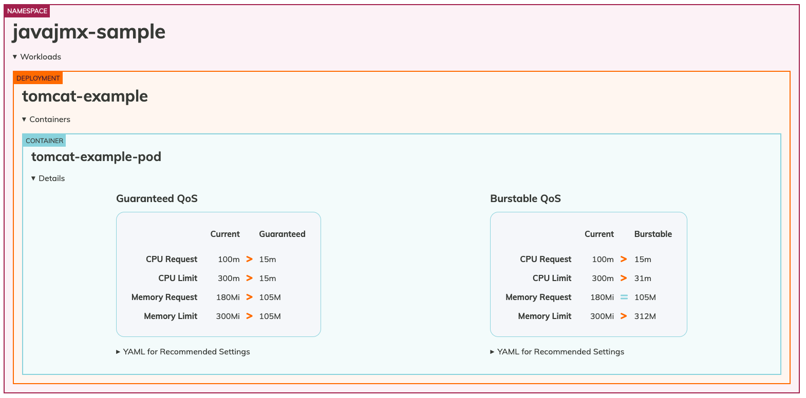

# Kubernetes ワークロードのリソース最適化のベストプラクティス
Kubernetes の採用は、多くの企業がマイクロサービスベースのアーキテクチャに移行するにつれて、加速し続けています。
当初は、アプリケーションをサポートするための新しいクラウドネイティブアーキテクチャの設計と構築に重点が置かれていました。
環境が成長するにつれて、お客様からリソース割り当ての最適化に焦点が移ってきているのが分かります。
リソースの最適化は、セキュリティに次いで運用チームが重要視する 2 番目の課題です。
Kubernetes 環境でのリソース割り当ての最適化とアプリケーションの適切なサイジングについてのガイダンスを説明しましょう。
これには、マネージド型ノードグループ、セルフマネージド型ノードグループ、AWS Fargate でデプロイされた Amazon EKS 上で実行されるアプリケーションが含まれます。


## Kubernetes でアプリケーションをライトサイジングする理由
Kubernetes では、アプリケーションにリソース仕様を設定することでライトサイジングを行います。これらの設定は以下に直接影響を与えます：

* パフォーマンス — 適切なリソース仕様がない場合、Kubernetes アプリケーションは無秩序にリソースを奪い合います。これはアプリケーションのパフォーマンスに悪影響を及ぼす可能性があります。
* コスト最適化 — リソース仕様を過剰に設定してデプロイされたアプリケーションは、コストの増加とインフラストラクチャの低使用率を招きます。
* オートスケーリング — Kubernetes クラスターオートスケーラーと水平 Pod オートスケーリングは、機能するためにリソース仕様を必要とします。

Kubernetes で最も一般的なリソース仕様は、[CPU とメモリのリクエストとリミット](https://kubernetes.io/docs/concepts/configuration/manage-resources-containers/#requests-and-limits)です。


## リクエストとリミット

コンテナ化されたアプリケーションは、Kubernetes 上で Pod としてデプロイされます。CPU とメモリのリクエストとリミットは、Pod 定義のオプション部分です。CPU は [Kubernetes CPUs](https://kubernetes.io/docs/concepts/configuration/manage-resources-containers/#meaning-of-cpu) の単位で指定され、メモリは通常 [メビバイト (Mi)](https://simple.wikipedia.org/wiki/Mebibyte) として指定されるバイト単位で指定されます。

リクエストとリミットは、Kubernetes で異なる機能を果たし、スケジューリングとリソース制御に異なる影響を与えます。


## 推奨事項
アプリケーションの所有者は、CPU とメモリのリソース要求に対して「適切な」値を選択する必要があります。
理想的な方法は、開発環境でアプリケーションの負荷テストを実施し、オブザーバビリティツールを使用してリソース使用量を測定することです。
これは組織の最重要アプリケーションには適していますが、クラスターにデプロイされているすべてのコンテナ化アプリケーションに対して実施することは現実的ではないかもしれません。
ワークロードを最適化し、適切なサイズを設定するのに役立つツールについて説明しましょう：


### Vertical Pod Autoscaler (VPA)
[VPA](https://github.com/kubernetes/autoscaler/tree/master/vertical-pod-autoscaler) は、Autoscaling Special Interest Group (SIG) が所有する Kubernetes のサブプロジェクトです。
観測されたアプリケーションのパフォーマンスに基づいて、Pod のリクエストを自動的に設定するように設計されています。
VPA は、デフォルトで [Kubernetes Metric Server](https://github.com/kubernetes-sigs/metrics-server) を使用してリソース使用量を収集しますが、オプションで Prometheus をデータソースとして使用するように設定することもできます。

VPA には、アプリケーションのパフォーマンスを測定し、サイジングの推奨を行うレコメンデーションエンジンがあります。
VPA レコメンデーションエンジンはスタンドアロンでデプロイでき、VPA は自動スケーリングアクションを実行しません。
各アプリケーションの VerticalPodAutoscaler カスタムリソースを作成することで設定され、VPA はオブジェクトのステータスフィールドをリソースサイジングの推奨値で更新します。

クラスター内のすべてのアプリケーションに対して VerticalPodAutoscaler オブジェクトを作成し、JSON 結果を読み取って解釈することは、スケールが大きくなると困難です。
[Goldilocks](https://github.com/FairwindsOps/goldilocks) は、これを簡単にするオープンソースプロジェクトです。


### Goldilocks
Goldilocks は Fairwinds のオープンソースプロジェクトで、組織が Kubernetes アプリケーションのリソースリクエストを「ちょうど良い」状態にするのを支援するように設計されています。Goldilocks のデフォルト設定はオプトインモデルです。名前空間に goldilocks.fairwinds.com/enabled: true ラベルを追加することで、監視するワークロードを選択できます。


Metrics Server はワーカーノードで実行されている Kubelet からリソースメトリクスを収集し、Vertical Pod Autoscaler が使用するために Metrics API を通じて公開します。Goldilocks コントローラーは goldilocks.fairwinds.com/enabled: true ラベルが付いた名前空間を監視し、それらの名前空間内の各ワークロードに対して VerticalPodAutoscaler オブジェクトを作成します。

リソース推奨を有効にするために、以下のコマンドを実行します：

```
kubectl create ns javajmx-sample
kubectl label ns javajmx-sample goldilocks.fairwinds.com/enabled=true
```

Amazon EKS クラスターに Goldilocks をデプロイするには、以下のコマンドを実行します：

```
helm repo add fairwinds-stable https://charts.fairwinds.com/stable
helm upgrade --install goldilocks fairwinds-stable/goldilocks --namespace goldilocks --create-namespace --set vpa.enabled=true
```

Goldilocks ダッシュボードはポート 8080 でダッシュボードを公開し、リソース推奨を確認することができます。ダッシュボードにアクセスするために、以下のコマンドを実行しましょう：

```
kubectl -n goldilocks port-forward svc/goldilocks-dashboard 8080:80
```
その後、ブラウザで http://localhost:8080 を開きます。


Goldilocks が提供する推奨事項を確認するために、サンプル名前空間を分析してみましょう。デプロイメントの推奨事項を確認することができます。


javajmx-sample ワークロードのリクエストとリミットの推奨事項を確認できます。各 Quality of Service (QoS) の Current 列は、現在設定されている CPU とメモリのリクエストとリミットを示しています。Guaranteed と Burstable 列は、それぞれの QoS に対する推奨 CPU とメモリのリクエストリミットを示しています。

リソースを過剰にプロビジョニングしていることが明確に分かり、Goldilocks は CPU とメモリのリクエストを最適化するための推奨事項を提供しています。Guaranteed QoS の場合、CPU のリクエストとリミットは 100m と 300m に対して 15m と 15m が推奨され、メモリのリクエストとリミットは 180Mi と 300Mi に対して 105M と 105M が推奨されています。
必要な QoS クラスに対応するマニフェストファイルを単純にコピーし、適切なサイズに最適化されたワークロードをデプロイすることができます。


### cAdvisor メトリクスを使用したスロットリングの理解と適切なリソースの設定
制限を設定する際、特定のコンテナ化されたアプリケーションが特定の期間中にどれだけ実行できるかを Linux ノードに指示します。
これは、制御不能なプロセスが不当な量の CPU サイクルを消費することから、ノード上の他のワークロードを保護するために行います。
マザーボード上の物理的な「コア」の数を定義しているわけではありませんが、他のアプリケーションに影響を与えないように、単一のコンテナ内のプロセスやスレッドのグループを一時的に停止するまでの実行時間を設定しています。

`container_cpu_cfs_throttled_seconds_total` という便利な cAdvisor メトリクスがあり、これはスロットリングされた 5 ミリ秒のスライスをすべて合計し、プロセスがクォータをどれだけ超過しているかを示します。
このメトリクスは秒単位なので、値を 10 で割ることで、コンテナに関連付けられた実際の期間である 100 ミリ秒を得ることができます。

100 ミリ秒の時間における上位 3 つの Pod の CPU 使用率を理解するための PromQL クエリ：
```
topk(3, max by (pod, container)(rate(container_cpu_usage_seconds_total{image!="", instance="$instance"}[$__rate_interval]))) / 10
```
vCPU 使用率の値として 400 ミリ秒が観測されています。


PromQL は 1 秒あたりのスロットリングを提供し、1 秒間に 10 の期間があります。
期間あたりのスロットリングを得るには、10 で割ります。
制限設定をどれだけ増やすべきかを知りたい場合は、10 を掛けます（例：400 ミリ秒 * 10 = 4000 m）。

上記のツールはリソース最適化の機会を特定する方法を提供しますが、アプリケーションチームは、特定のアプリケーションが CPU / メモリ集約型かどうかを識別し、スロットリングやオーバープロビジョニングを防ぐためのリソース割り当てに時間を費やす必要があります。
