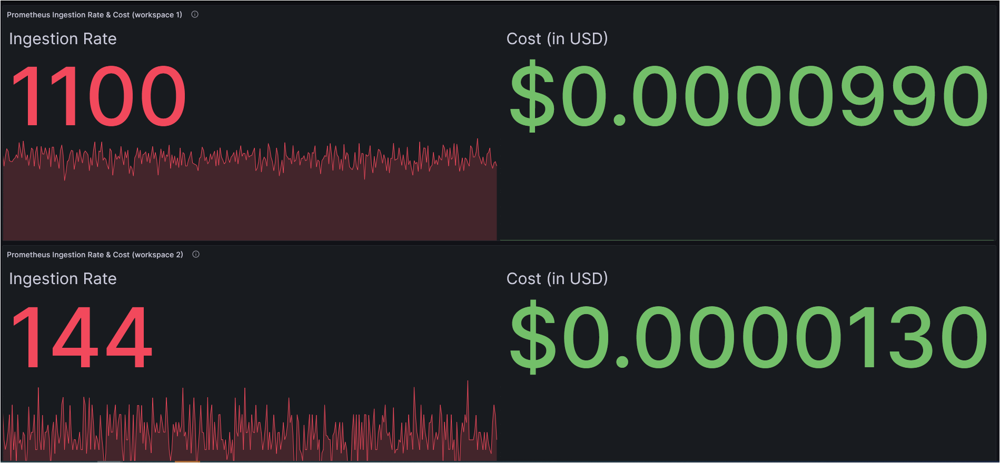

# リアルタイムコスト監視

Amazon Managed Service for Prometheus は、サーバーレスで Prometheus 互換のコンテナメトリクス監視サービスであり、大規模なコンテナ環境を安全に監視することを容易にします。Amazon Managed Service for Prometheus の料金モデルは、取り込まれたメトリクスサンプル、処理されたクエリサンプル、保存されたメトリクスに基づいています。最新の料金詳細は[こちら][pricing]で確認できます。

マネージドサービスとして、Amazon Managed Service for Prometheus は、ワークロードのスケールアップおよびスケールダウンに応じて、運用メトリクスの取り込み、保存、クエリを自動的にスケーリングします。一部のお客様から、追跡方法に関するガイダンスを求められました `metric samples ingestion rate` そしてそれはリアルタイムのコストです。それを実現する方法を見ていきましょう。

### ソリューション
Amazon Managed Service for Prometheus は、Amazon CloudWatch に[使用状況メトリクスを提供します][vendedmetrics]。これらのメトリクスを使用して、Amazon Managed Service for Prometheus ワークスペースの可視性を向上させることができます。提供されるメトリクスは、 `AWS/Usage` および `AWS/Prometheus` CloudWatch の名前空間にあり、これらの[メトリクス][AMPMetrics]は追加料金なしで CloudWatch で利用できます。これらのメトリクスをさらに調査して視覚化するために、CloudWatch ダッシュボードをいつでも作成できます。

今回は、Amazon CloudWatch を Amazon Managed Grafana のデータソースとして使用し、Grafana でダッシュボードを構築してこれらのメトリクスを可視化します。アーキテクチャ図は以下を示しています。

- Amazon Managed Service for Prometheus が Amazon CloudWatch にベンダーメトリクスを発行

- Amazon Managed Grafana のデータソースとしての Amazon CloudWatch

- Amazon Managed Grafana で作成されたダッシュボードにアクセスするユーザー

### Amazon Managed Grafana ダッシュボード

Amazon Managed Grafana で作成されたダッシュボードにより、以下を可視化できます。

1. ワークスペースあたりの Prometheus 取り込みレート  
  

2. ワークスペースごとの Prometheus 取り込みレートとリアルタイムコスト  
   リアルタイムコスト追跡には、次を使用します `math expression` の価格に基づいて `Metrics Ingested Tier` のための `First 2 billion samples` 公式の [AWS 料金ドキュメント][pricing]に記載されています。数学演算は、数値と時系列を入力として受け取り、それらを異なる数値と時系列に変換します。ビジネス要件に合わせてさらにカスタマイズする方法については、この[ドキュメント][mathexpression]を参照してください。  
  

3. ワークスペースあたりの Prometheus アクティブシリーズ  

Grafana のダッシュボードは JSON オブジェクトで表され、ダッシュボードのメタデータを保存します。ダッシュボードのメタデータには、ダッシュボードのプロパティ、パネルからのメタデータ、テンプレート変数、パネルクエリなどが含まれます。

上記のダッシュボードの **JSON テンプレート**にアクセスできます <mark>[こちら](AmazonPrometheusMetrics.json)。</mark>

前述のダッシュボードを使用することで、ワークスペースごとの取り込みレートを特定し、Amazon Managed Service for Prometheus のメトリクス取り込みレートに基づいてワークスペースごとのリアルタイムコストを監視できるようになります。他の Grafana [ダッシュボードパネル][panels]を使用して、要件に合わせたビジュアルを構築できます。

[pricing]: https://aws.amazon.com/prometheus/pricing/
[AMPMetrics]: https://docs.aws.amazon.com/prometheus/latest/userguide/AMP-CW-usage-metrics.html
[vendedmetrics]: https://aws.amazon.com/blogs/mt/introducing-vended-metrics-for-amazon-managed-service-for-prometheus/
[mathexpression]: https://grafana.com/docs/grafana/latest/panels-visualizations/query-transform-data/expression-queries/#math
[panels]: https://docs.aws.amazon.com/grafana/latest/userguide/Grafana-panels.html