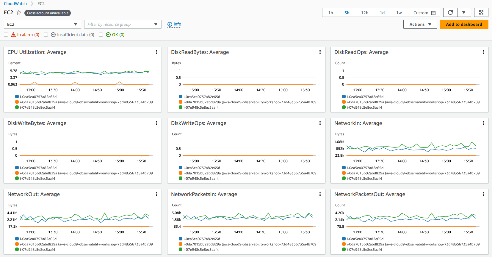

# EC2 のモニタリングとオブザーバビリティ

## はじめに

継続的なモニタリングとオブザーバビリティは、クラウド環境のアジリティを高め、カスタマーエクスペリエンスを向上させ、リスクを軽減します。
Wikipedia によると、[オブザーバビリティ](https://en.wikipedia.org/wiki/Observability) とは、システムの外部出力の知識から、システムの内部状態をどの程度推測できるかを示す指標です。
オブザーバビリティという用語自体は制御理論の分野に由来し、基本的にはシステムが生成する外部シグナルや出力を学習することで、システム内のコンポーネントの内部状態を推測できることを意味します。

モニタリングとオブザーバビリティの違いは、モニタリングがシステムが機能しているかどうかを示すのに対し、オブザーバビリティはシステムが機能していない理由を示すことです。
モニタリングは通常、事後対応的な手段ですが、オブザーバビリティの目標は、主要業績評価指標を事前対応的に改善できるようにすることです。
システムは観察されない限り、制御や最適化することはできません。
メトリクス、ログ、トレースの収集によってワークロードを計測し、適切なモニタリングとオブザーバビリティツールを使用して意味のある洞察と詳細なコンテキストを得ることで、お客様は環境を制御および最適化できます。

AWS は、お客様がモニタリングからオブザーバビリティへと移行し、エンドツーエンドのサービス可視性を実現できるようにします。
この記事では、Amazon Elastic Compute Cloud (Amazon EC2) と、AWS ネイティブおよびオープンソースツールを通じて AWS クラウド環境におけるサービスのモニタリングとオブザーバビリティを改善するためのベストプラクティスに焦点を当てます。

## Amazon EC2

[Amazon Elastic Compute Cloud](https://aws.amazon.com/jp/ec2/) (Amazon EC2) は、Amazon Web Services (AWS) クラウドにおける高度にスケーラブルなコンピューティングプラットフォームです。
Amazon EC2 は、ハードウェアへの初期投資の必要性を排除し、使用した分だけ支払うことで、お客様はより迅速にアプリケーションを開発およびデプロイできます。
EC2 が提供する主な機能には、インスタンスと呼ばれる仮想コンピューティング環境、Amazon マシンイメージと呼ばれるインスタンスの事前設定済みテンプレート、インスタンスタイプとして利用可能な CPU、メモリ、ストレージ、ネットワーク容量などのさまざまなリソース構成があります。

## AWS ネイティブツールを使用したモニタリングとオブザーバビリティ

### Amazon CloudWatch

[Amazon CloudWatch](https://aws.amazon.com/jp/cloudwatch/) は、AWS、ハイブリッド、オンプレミスのアプリケーションとインフラストラクチャリソースのデータと実用的なインサイトを提供する、モニタリングと管理のサービスです。

CloudWatch は、ログ、メトリクス、イベントの形式でモニタリングと運用データを収集します。

また、AWS リソース、アプリケーション、AWS およびオンプレミスサーバーで実行されるサービスの統合されたビューを提供します。

CloudWatch は、リソース使用率、アプリケーションパフォーマンス、運用状態についてシステム全体の可視性を得るのに役立ちます。

### 統合された CloudWatch エージェント

統合された CloudWatch エージェントは、x86-64 および ARM64 アーキテクチャを使用するほとんどのオペレーティングシステムをサポートする MIT ライセンスのオープンソースソフトウェアです。
CloudWatch エージェントは、オペレーティングシステム全体で Amazon EC2 インスタンスとハイブリッド環境のオンプレミスサーバーからシステムレベルのメトリクスを収集し、アプリケーションやサービスからカスタムメトリクスを取得し、Amazon EC2 インスタンスとオンプレミスサーバーからログを収集するのに役立ちます。

### Amazon EC2 インスタンスへの CloudWatch エージェントのインストール

#### コマンドラインでのインストール

CloudWatch エージェントは[コマンドライン](https://docs.aws.amazon.com/ja_jp/AmazonCloudWatch/latest/monitoring/installing-cloudwatch-agent-commandline.html)を通じてインストールできます。
様々なアーキテクチャと様々なオペレーティングシステム用の必要なパッケージは[ダウンロード](https://docs.aws.amazon.com/ja_jp/AmazonCloudWatch/latest/monitoring/download-cloudwatch-agent-commandline.html)できます。
CloudWatch エージェントが Amazon EC2 インスタンスから情報を読み取り、CloudWatch に書き込むための権限を提供する必要な [IAM ロール](https://docs.aws.amazon.com/ja_jp/AmazonCloudWatch/latest/monitoring/create-iam-roles-for-cloudwatch-agent-commandline.html)を作成します。
必要な IAM ロールを作成したら、必要な Amazon EC2 インスタンスで CloudWatch エージェントを[インストールして実行](https://docs.aws.amazon.com/ja_jp/AmazonCloudWatch/latest/monitoring/install-CloudWatch-Agent-commandline-fleet.html)できます。

:::info
    ドキュメント: [コマンドラインを使用した CloudWatch エージェントのインストール](https://docs.aws.amazon.com/ja_jp/AmazonCloudWatch/latest/monitoring/installing-cloudwatch-agent-commandline.html)

    AWS Observability ワークショップ: [CloudWatch エージェントのセットアップとインストール](https://catalog.workshops.aws/observability/en-US/aws-native/ec2-monitoring/install-ec2)
:::

#### AWS Systems Manager を使用したインストール

CloudWatch エージェントは [AWS Systems Manager](https://docs.aws.amazon.com/ja_jp/AmazonCloudWatch/latest/monitoring/installing-cloudwatch-agent-ssm.html) を通じてもインストールできます。
CloudWatch エージェントが Amazon EC2 インスタンスから情報を読み取り、CloudWatch に書き込み、AWS Systems Manager と通信するための権限を提供する必要な IAM ロールを作成します。
CloudWatch エージェントを EC2 インスタンスにインストールする前に、必要な EC2 インスタンスで SSM エージェントを[インストールまたは更新](https://docs.aws.amazon.com/ja_jp/AmazonCloudWatch/latest/monitoring/download-CloudWatch-Agent-on-EC2-Instance-SSM-first.html)します。
CloudWatch エージェントは AWS Systems Manager を通じてダウンロードできます。
収集するメトリクス（カスタムメトリクスを含む）やログを指定するために、JSON 設定ファイルを作成できます。
必要な IAM ロールと設定ファイルを作成したら、必要な Amazon EC2 インスタンスに CloudWatch エージェントをインストールして実行できます。

:::info
    ドキュメント: [Installing the CloudWatch agent using AWS Systems Manager](https://docs.aws.amazon.com/ja_jp/AmazonCloudWatch/latest/monitoring/installing-cloudwatch-agent-ssm.html)

    AWS Observability ワークショップ: [Install CloudWatch agent using AWS Systems Manager Quick Setup](https://catalog.workshops.aws/observability/en-US/aws-native/ec2-monitoring/install-ec2/ssm-quicksetup)

    関連ブログ記事: [Amazon CloudWatch Agent with AWS Systems Manager Integration – Unified Metrics & Log Collection for Linux & Windows](https://aws.amazon.com/jp/blogs/news/new-amazon-cloudwatch-agent-with-aws-systems-manager-integration-unified-metrics-log-collection-for-linux-windows/)

    YouTube 動画: [Collect Metrics and Logs from Amazon EC2 instances with the CloudWatch Agent](https://www.youtube.com/watch?v=vAnIhIwE5hY)
:::

#### ハイブリッド環境のオンプレミスサーバーへの CloudWatch エージェントのインストール

サーバーがオンプレミスとクラウドの両方に存在するハイブリッドな顧客環境では、Amazon CloudWatch で統合されたオブザーバビリティを実現するために同様のアプローチを取ることができます。CloudWatch エージェントは Amazon S3 から直接、または AWS Systems Manager を通じてダウンロードできます。オンプレミスサーバーから Amazon CloudWatch にデータを送信するための IAM ユーザーを作成します。オンプレミスサーバーにエージェントをインストールして起動します。

:::note
    ドキュメント: [Installing the CloudWatch agent on on-premises servers](https://docs.aws.amazon.com/ja_jp/AmazonCloudWatch/latest/monitoring/install-CloudWatch-Agent-on-premise.html)
:::

### Amazon CloudWatch を使用した Amazon EC2 インスタンスのモニタリング

Amazon EC2 インスタンスとアプリケーションの信頼性、可用性、パフォーマンスを維持するための重要な側面は、[継続的なモニタリング](https://catalog.workshops.aws/observability/en-US/aws-native/ec2-monitoring) です。
必要な Amazon EC2 インスタンスに CloudWatch エージェントをインストールすることで、安定した環境を維持するためにインスタンスの健全性とパフォーマンスをモニタリングすることが必要です。
ベースラインとして、CPU 使用率、ネットワーク使用率、ディスクパフォーマンス、ディスクの読み書き、メモリ使用率、ディスクスワップ使用率、ディスク容量使用率、ページファイル使用率、EC2 インスタンスのログ収集などのモニタリングが推奨されます。

#### 基本モニタリングと詳細モニタリング

Amazon CloudWatch は、Amazon EC2 から生データを収集し、読みやすいリアルタイムに近いメトリクスに処理します。
デフォルトでは、Amazon EC2 はインスタンスの基本モニタリングとして、5 分間隔でメトリクスデータを CloudWatch に送信します。
インスタンスのメトリクスデータを 1 分間隔で CloudWatch に送信するには、インスタンスで[詳細モニタリング](https://docs.aws.amazon.com/ja_jp/AWSEC2/latest/UserGuide/using-cloudwatch-new.html)を有効にすることができます。

#### モニタリングのための自動化ツールと手動ツール

AWS は、Amazon EC2 をモニタリングし、問題が発生した際に報告するための自動化ツールと手動ツールの 2 種類のツールを提供しています。
これらのツールの一部は簡単な設定が必要で、一部は手動での操作が必要です。
[自動化モニタリングツール](https://docs.aws.amazon.com/ja_jp/AWSEC2/latest/UserGuide/monitoring_automated_manual.html) には、AWS システムステータスチェック、インスタンスステータスチェック、Amazon CloudWatch アラーム、Amazon EventBridge、Amazon CloudWatch Logs、CloudWatch エージェント、AWS Management Pack for Microsoft System Center Operations Manager が含まれます。
[手動モニタリング](https://docs.aws.amazon.com/ja_jp/AWSEC2/latest/UserGuide/monitoring_automated_manual.html) ツールには、この記事の後のセクションで詳しく説明するダッシュボードが含まれます。

:::note
    ドキュメント: [自動化および手動モニタリング](https://docs.aws.amazon.com/ja_jp/AWSEC2/latest/UserGuide/monitoring_automated_manual.html)
:::

### CloudWatch エージェントを使用した Amazon EC2 インスタンスからのメトリクス

メトリクスは CloudWatch の基本的な概念です。メトリクスは、CloudWatch に公開される時系列のデータポイントのセットを表します。メトリクスは監視する変数として、データポイントはその変数の時間経過による値として考えることができます。例えば、特定の EC2 インスタンスの CPU 使用率は、Amazon EC2 が提供するメトリクスの 1 つです。

#### CloudWatch エージェントを使用したデフォルトメトリクス

Amazon CloudWatch は Amazon EC2 インスタンスからメトリクスを収集し、AWS マネジメントコンソール、AWS CLI、または API を通じて確認できます。利用可能なメトリクスは、基本モニタリングでは 5 分間隔、詳細モニタリング（有効化時）では 1 分間隔でデータポイントが収集されます。

#### CloudWatch エージェントを使用したカスタムメトリクス

お客様は、API または CLI を使用して、1 分間隔の標準解像度または 1 秒間隔までの高解像度で、独自のカスタムメトリクスを CloudWatch に公開することもできます。
統合された CloudWatch エージェントは、[StatsD](https://docs.aws.amazon.com/ja_jp/AmazonCloudWatch/latest/monitoring/CloudWatch-Agent-custom-metrics-statsd.html) と [collectd](https://docs.aws.amazon.com/ja_jp/AmazonCloudWatch/latest/monitoring/CloudWatch-Agent-custom-metrics-collectd.html) を通じてカスタムメトリクスの取得をサポートしています。

アプリケーションやサービスからのカスタムメトリクスは、StatsD プロトコルを使用した CloudWatch エージェントで取得できます。
StatsD は、さまざまなアプリケーションからメトリクスを収集できる一般的なオープンソースソリューションです。
StatsD は、Linux と Windows の両方のサーバーをサポートしており、独自のメトリクスを計測するのに特に便利です。

アプリケーションやサービスからのカスタムメトリクスは、collectd プロトコルを使用した CloudWatch エージェントでも取得できます。
collectd は、Linux サーバーのみをサポートする一般的なオープンソースソリューションで、さまざまなアプリケーションのシステム統計情報を収集できるプラグインを備えています。
CloudWatch エージェントがすでに収集できるシステムメトリクスと、collectd からの追加メトリクスを組み合わせることで、システムとアプリケーションのモニタリング、分析、トラブルシューティングをより効果的に行うことができます。

#### CloudWatch エージェントを使用した追加のカスタムメトリクス

CloudWatch エージェントは、EC2 インスタンスからカスタムメトリクスを収集することをサポートしています。
代表的な例をいくつか紹介します：

- Elastic Network Adapter (ENA) を使用する Linux 上の EC2 インスタンスのネットワークパフォーマンスメトリクス。
- Linux サーバーからの Nvidia GPU メトリクス。
- Linux および Windows サーバー上の個々のプロセスから procstat プラグインを使用したプロセスメトリクス。

### CloudWatch エージェントを使用した Amazon EC2 インスタンスからのログ

Amazon CloudWatch Logs は、既存のシステム、アプリケーション、カスタムログファイルを使用して、ほぼリアルタイムでシステムとアプリケーションの監視とトラブルシューティングを行うことができます。Amazon EC2 インスタンスやオンプレミスサーバーからのログを CloudWatch に収集するには、統合された CloudWatch エージェントをインストールする必要があります。最新の統合された CloudWatch エージェントは、ログと高度なメトリクスの両方を収集でき、さまざまなオペレーティングシステムをサポートしているため、推奨されています。インスタンスがインスタンスメタデータサービスバージョン 2 (IMDSv2) を使用している場合は、統合されたエージェントが必要です。

統合された CloudWatch エージェントによって収集されたログは、処理されて Amazon CloudWatch Logs に保存されます。Windows サーバーや Linux サーバー、Amazon EC2 とオンプレミスサーバーの両方からログを収集できます。CloudWatch エージェントの設定ウィザードを使用して、CloudWatch エージェントのセットアップを定義する設定 JSON ファイルを作成できます。

:::note
    AWS Observability Workshop: [Logs](https://catalog.workshops.aws/observability/en-US/aws-native/logs)
:::

### Amazon EC2 インスタンスイベント

イベントは、AWS 環境の変更を示します。AWS リソースとアプリケーションは、状態が変化したときにイベントを生成できます。CloudWatch Events は、AWS リソースとアプリケーションの変更を説明するシステムイベントをほぼリアルタイムで提供します。例えば、Amazon EC2 は EC2 インスタンスの状態が pending から running に変更されたときにイベントを生成します。また、カスタムのアプリケーションレベルのイベントを生成し、CloudWatch Events に発行することもできます。

お客様は、ステータスチェックと予定されたイベントを確認することで、[Amazon EC2 インスタンスのステータスを監視](https://docs.aws.amazon.com/ja_jp/AWSEC2/latest/UserGuide/monitoring-instances-status-check.html)できます。ステータスチェックは、Amazon EC2 が実行する自動チェックの結果を提供します。これらの自動チェックは、インスタンスに影響を与える特定の問題を検出します。ステータスチェック情報は、Amazon CloudWatch が提供するデータと共に、各インスタンスの詳細な運用可視性を提供します。

#### Amazon EC2 インスタンスイベント用の Amazon EventBridge ルール

Amazon CloudWatch Events は Amazon EventBridge を使用して、リソースの変更や問題などのシステムイベントに自動的に対応することができます。
Amazon EC2 を含む AWS サービスからのイベントは、ほぼリアルタイムで CloudWatch Events に配信され、イベントがルールに一致した場合に適切なアクションを実行するための EventBridge ルールを作成できます。

アクションには、AWS Lambda 関数の呼び出し、Amazon EC2 Run Command の呼び出し、Amazon Kinesis Data Streams へのイベントの中継、AWS Step Functions ステートマシンの有効化、Amazon SNS トピックへの通知、Amazon SQS キューへの通知、内部または外部のインシデント対応アプリケーションや SIEM ツールへの送信などがあります。

:::note
    AWS Observability ワークショップ: [インシデント対応 - EventBridge ルール](https://catalog.workshops.aws/observability/en-US/aws-native/ec2-monitoring/incident-response/create-eventbridge-rule)
:::

#### Amazon EC2 インスタンスの Amazon CloudWatch アラーム

[CloudWatch アラーム](https://docs.aws.amazon.com/ja_jp/AmazonCloudWatch/latest/monitoring/AlarmThatSendsEmail.html) は、指定した期間にわたってメトリクスを監視し、一定期間にわたってメトリクスの値が指定したしきい値に対してどのような状態かに基づいて、1 つ以上のアクションを実行できます。
アラームは、状態が変化した場合にのみアクションを実行します。
アクションには、Amazon Simple Notification Service (Amazon SNS) トピックへの通知の送信や Amazon EC2 Auto Scaling、[EC2 インスタンスの停止、終了、再起動、復旧](https://docs.aws.amazon.com/ja_jp/AmazonCloudWatch/latest/monitoring/UsingAlarmActions.html) などの適切なアクションを含めることができます。

アラームがトリガーされると、アクションとして SNS トピックにメール通知が送信されます。

#### Auto Scaling インスタンスのモニタリング

Amazon EC2 Auto Scaling は、アプリケーションの負荷を処理するために適切な数の Amazon EC2 インスタンスを確保できるようにします。
[Amazon EC2 Auto Scaling メトリクス](https://docs.aws.amazon.com/ja_jp/autoscaling/ec2/userguide/ec2-auto-scaling-cloudwatch-monitoring.html) は Auto Scaling グループに関する情報を収集し、AWS/AutoScaling 名前空間に格納されます。
Auto Scaling インスタンスの CPU やその他の使用状況を表す Amazon EC2 インスタンスメトリクスは、AWS/EC2 名前空間に格納されます。

### CloudWatch でのダッシュボード作成

AWS アカウントのリソースの詳細な情報、リソースのパフォーマンス、ヘルスチェックを把握することは、安定したリソース管理にとって重要です。
[Amazon CloudWatch ダッシュボード](https://docs.aws.amazon.com/ja_jp/AmazonCloudWatch/latest/monitoring/CloudWatch_Dashboards.html) は、CloudWatch コンソールでカスタマイズ可能なホームページです。
異なるリージョンに分散しているリソースであっても、1 つのビューで監視することができます。
利用可能な Amazon EC2 インスタンスの詳細を把握するための方法があります。

#### CloudWatch の自動ダッシュボード

自動ダッシュボードは、すべての AWS パブリックリージョンで利用可能で、CloudWatch の下にある Amazon EC2 インスタンスを含むすべての AWS リソースの健全性とパフォーマンスの集約ビューを提供します。

これにより、お客様はモニタリングをすぐに開始でき、メトリクスとアラームのリソースベースのビューを確認し、パフォーマンスの問題の根本原因を容易に特定できます。

自動ダッシュボードは AWS サービスが推奨する[ベストプラクティス](https://docs.aws.amazon.com/ja_jp/prescriptive-guidance/latest/implementing-logging-monitoring-cloudwatch/cloudwatch-dashboards-visualizations.html)に基づいて事前に構築されており、リソースを認識し、重要なパフォーマンスメトリクスの最新状態を動的に更新します。

#### CloudWatch のカスタムダッシュボード

[カスタムダッシュボード](https://docs.aws.amazon.com/ja_jp/AmazonCloudWatch/latest/monitoring/create_dashboard.html) を使用すると、お客様は必要な数のダッシュボードを作成し、異なるウィジェットを使用してカスタマイズすることができます。
ダッシュボードはリージョン間やアカウント間の表示に対応しており、お気に入りリストに追加することができます。

#### CloudWatch のリソースヘルスダッシュボード

CloudWatch ServiceLens のリソースヘルスは、[Amazon EC2 ホストのヘルスとパフォーマンス](https://aws.amazon.com/blogs/mt/introducing-cloudwatch-resource-health-monitor-ec2-hosts/) を自動的に検出、管理、可視化するために使用できるフルマネージドソリューションです。

お客様は、CPU やメモリなどのパフォーマンスディメンションによってホストのヘルスを可視化し、インスタンスタイプ、インスタンスの状態、セキュリティグループなどのフィルターを使用して、1 つのビューで数百のホストを分析できます。

EC2 ホストのグループを並べて比較し、個々のホストに関する詳細な洞察を提供します。

## オープンソースツールを使用したモニタリングとオブザーバビリティ

### AWS Distro for OpenTelemetry を使用した Amazon EC2 インスタンスのモニタリング

[AWS Distro for OpenTelemetry (ADOT)](https://aws.amazon.com/jp/otel) は、OpenTelemetry プロジェクトの安全で本番環境に対応した AWS がサポートするディストリビューションです。Cloud Native Computing Foundation の一部である OpenTelemetry は、アプリケーションモニタリングのための分散トレースとメトリクスを収集するオープンソースの API、ライブラリ、エージェントを提供します。AWS Distro for OpenTelemetry を使用することで、お客様は一度アプリケーションを計装するだけで、相関のあるメトリクスとトレースを複数の AWS およびパートナーのモニタリングソリューションに送信できます。

AWS Distro for OpenTelemetry (ADOT) は、分散モニタリングフレームワークを提供し、サービスの可視性と保守性を向上させるために重要なアプリケーションのパフォーマンスと健全性をモニタリングするためのデータを簡単に相関付けることができます。

ADOT の主要なコンポーネントは、SDK、自動計装エージェント、コレクター、およびバックエンドサービスにデータを送信するエクスポーターです。

[OpenTelemetry SDK](https://github.com/aws-observability): AWS リソース固有のメタデータの収集を可能にし、X-Ray トレース形式とコンテキストのための OpenTelemetry SDK をサポートします。OpenTelemetry SDK は現在、AWS X-Ray と CloudWatch から取り込まれたトレースとメトリクスデータを相関付けます。

[自動計装エージェント](https://aws-otel.github.io/docs/getting-started/java-sdk/auto-instr): OpenTelemetry Java 自動計装エージェントに AWS SDK と AWS X-Ray トレースデータのサポートが追加されています。

[OpenTelemetry Collector](https://github.com/open-telemetry/opentelemetry-collector): ディストリビューションのコレクターは、アップストリームの OpenTelemetry コレクターを使用して構築されています。AWS X-Ray、Amazon CloudWatch、Amazon Managed Service for Prometheus などの AWS サービスにデータを送信するための AWS 固有のエクスポーターがアップストリームコレクターに追加されています。

#### ADOT Collector と Amazon CloudWatch を使用したメトリクスとトレース

AWS Distro for OpenTelemetry (ADOT) Collector は CloudWatch エージェントと共に Amazon EC2 インスタンスに並行してインストールでき、OpenTelemetry SDK を使用して Amazon EC2 インスタンス上で実行されているワークロードからアプリケーショントレースとメトリクスを収集できます。

Amazon CloudWatch で OpenTelemetry メトリクスをサポートするために、[AWS EMF Exporter for OpenTelemetry Collector](https://github.com/open-telemetry/opentelemetry-collector-contrib/tree/main/exporter/awsemfexporter) は OpenTelemetry 形式のメトリクスを CloudWatch Embedded Metric Format (EMF) に変換します。これにより、OpenTelemetry メトリクスと統合されたアプリケーションが、高カーディナリティのアプリケーションメトリクスを CloudWatch に送信できるようになります。[X-Ray エクスポーター](https://aws-otel.github.io/docs/getting-started/x-ray#configuring-the-aws-x-ray-exporter) は、OTLP 形式で収集されたトレースを [AWS X-ray](https://aws.amazon.com/jp/xray/) にエクスポートすることができます。

Amazon EC2 上の ADOT Collector は、AWS CloudFormation または [AWS Systems Manager Distributor](https://catalog.workshops.aws/observability/en-US/aws-managed-oss/ec2-monitoring/configure-adot-collector) を使用してインストールし、アプリケーションメトリクスを収集できます。

### Prometheus を使用した Amazon EC2 インスタンスのモニタリング

[Prometheus](https://prometheus.io/) は、システムのモニタリングとアラートのためのスタンドアロンのオープンソースプロジェクトで、独立して保守されています。
Prometheus は、メトリクスを時系列データとして収集・保存します。つまり、メトリクス情報は記録された時のタイムスタンプと、ラベルと呼ばれるオプションのキーバリューペアとともに保存されます。

Prometheus は、コマンドラインフラグを介して設定され、すべての設定の詳細は prometheus.yaml ファイルで管理されています。
設定ファイル内の 'scrape_config' セクションは、スクレイピング対象とそのパラメータを指定します。
[Prometheus Service Discovery](https://github.com/prometheus/prometheus/tree/main/discovery) (SD) は、メトリクスをスクレイピングするエンドポイントを見つけるための手法です。
Amazon EC2 サービスディスカバリの設定により、AWS EC2 インスタンスからスクレイピング対象を取得することができ、これは `ec2_sd_config` で設定されます。

#### Prometheus と Amazon CloudWatch を介したメトリクス

EC2 インスタンスの CloudWatch エージェントは、Prometheus をインストールして設定することで、CloudWatch でのモニタリング用のメトリクスをスクレイピングできます。これは、EC2 上のコンテナワークロードを好み、オープンソースの Prometheus モニタリングと互換性のあるカスタムメトリクスを必要とするお客様に役立ちます。CloudWatch エージェントのインストールは、前述のセクションで説明した手順に従って実行できます。Prometheus モニタリング機能を持つ CloudWatch エージェントは、Prometheus メトリクスをスクレイピングするために 2 つの設定が必要です。1 つは、Prometheus ドキュメントの 'scrape_config' に記載されている標準的な Prometheus の設定です。もう 1 つは、[CloudWatch エージェントの設定](https://docs.aws.amazon.com/ja_jp/AmazonCloudWatch/latest/monitoring/CloudWatch-Agent-PrometheusEC2.html)です。

#### Prometheus と ADOT Collector を介したメトリクス

お客様は、オブザーバビリティのニーズに対して、すべてオープンソースのセットアップを選択できます。
そのために、AWS Distro for OpenTelemetry (ADOT) Collector を設定して、Prometheus で計装されたアプリケーションからメトリクスを収集し、Prometheus サーバーに送信することができます。
このフローには、3 つの OpenTelemetry コンポーネントが関与しています。それらは、Prometheus Receiver、Prometheus Remote Write Exporter、Sigv4 Authentication Extension です。
Prometheus Receiver は Prometheus 形式でメトリクスデータを受信します。
Prometheus Exporter は Prometheus 形式でデータをエクスポートします。
Sigv4 Authenticator 拡張機能は、AWS サービスへのリクエストに Sigv4 認証を提供します。

#### Prometheus Node Exporter

[Prometheus Node Exporter](https://github.com/prometheus/node_exporter) は、クラウド環境向けのオープンソースの時系列モニタリングおよびアラートシステムです。
Amazon EC2 インスタンスに Node Exporter をインストールすることで、ノードレベルのメトリクスを時系列データとして収集し、タイムスタンプと共に情報を記録できます。
Node Exporter は Prometheus エクスポーターで、URL http://localhost:9100/metrics を通じてさまざまなホストメトリクスを公開できます。

メトリクスが作成されると、[Amazon Managed Prometheus](https://aws.amazon.com/jp/prometheus/) に送信できます。

### Fluent Bit プラグインを使用した Amazon EC2 インスタンスからのログのストリーミング

[Fluent Bit](https://fluentbit.io/) は、オープンソースのマルチプラットフォームログプロセッサツールです。スケールに応じたデータ収集を処理し、様々な情報ソース、多様なデータフォーマット、データの信頼性、セキュリティ、柔軟なルーティング、複数の送信先に対応する多様なデータの収集と集約を行います。

Fluent Bit は、Amazon EC2 から AWS サービス（ログの保持と分析のための Amazon CloudWatch を含む）へのログのストリーミングに、簡単な拡張ポイントを作成するのに役立ちます。新しくリリースされた [Fluent Bit プラグイン](https://github.com/aws/amazon-cloudwatch-logs-for-fluent-bit#new-higher-performance-core-fluent-bit-plugin) を使用して、ログを Amazon CloudWatch にルーティングできます。

### Amazon Managed Grafana によるダッシュボード作成

[Amazon Managed Grafana](https://aws.amazon.com/jp/grafana/) は、オープンソースの Grafana プロジェクトをベースにした完全マネージド型サービスです。豊富でインタラクティブかつ安全なデータ可視化機能を提供し、複数のデータソースにわたるメトリクス、ログ、トレースの即時的なクエリ、相関分析、分析、監視、アラームを支援します。お客様は、自動的にスケールされ、高可用性で企業レベルのセキュリティを備えたサービスを使用して、インタラクティブなダッシュボードを作成し、組織内の誰とでも共有できます。Amazon Managed Grafana を使用することで、お客様は AWS アカウント、AWS リージョン、データソース全体にわたるダッシュボードへのユーザーおよびチームのアクセスを管理できます。

Amazon Managed Grafana では、Grafana ワークスペースコンソールの AWS データソース設定オプションを使用して、Amazon CloudWatch をデータソースとして追加できます。この機能により、既存の CloudWatch アカウントを検出し、CloudWatch へのアクセスに必要な認証情報の設定を管理することで、CloudWatch をデータソースとして追加する作業が簡素化されます。また、Amazon Managed Grafana は [Prometheus データソース](https://docs.aws.amazon.com/ja_jp/grafana/latest/userguide/prometheus-data-source.html) もサポートしており、自己管理型の Prometheus サーバーと Amazon Managed Service for Prometheus ワークスペースの両方をデータソースとして利用できます。

Amazon Managed Grafana には様々なパネルが用意されており、適切なクエリの構築と表示プロパティのカスタマイズが容易で、お客様が必要とするダッシュボードを作成できます。

## まとめ

モニタリングは、システムが正常に動作しているかどうかを把握するために役立ちます。
オブザーバビリティは、システムが正常に動作していない理由を理解するのに役立ちます。
優れたオブザーバビリティにより、認識する必要があることすら知らなかった疑問に答えることができます。
モニタリングとオブザーバビリティは、システムの出力から推測できる内部状態を測定する道を開きます。

クラウド上のマイクロサービス、サーバーレス、非同期アーキテクチャで実行される最新のアプリケーションは、メトリクス、ログ、トレース、イベントの形で大量のデータを生成します。
Amazon CloudWatch と、AWS Distro for OpenTelemetry、Amazon Managed Prometheus、Amazon Managed Grafana などのオープンソースツールを組み合わせることで、お客様は統合されたプラットフォーム上でこれらのデータを収集、アクセス、関連付けることができます。
これにより、データサイロを解消し、システム全体の可視性を容易に獲得し、問題を迅速に解決することができます。
