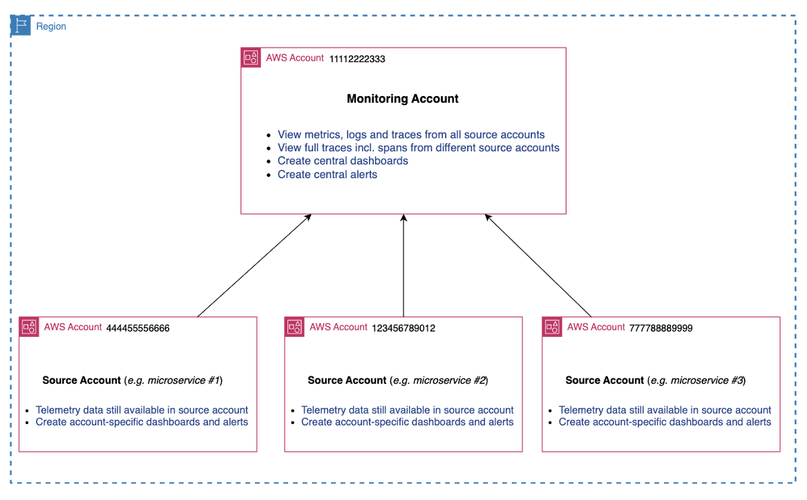

# モニタリングアカウントとソースアカウントのセットアップ

多くの場合、お客様は複数の AWS アカウントからのテレメトリデータを可視化して関連付ける必要があります。これは、サービスが多数のアカウント、場合によっては多数のリージョンにまたがって実行されているためです。

単一のアカウントでのみオブザーバビリティとサービスを実行する予定の場合は、この手順をスキップできます。

最初のステップは、モニタリングアカウントとソースアカウントをセットアップし、共有したいテレメトリを正確に指定することです。これを行うには、クロスアカウント可観測性を活用します。これはリージョンごとに機能することに注意してください。

クロスアカウントオブザーバビリティの設定方法に関する詳細な手順については、[CloudWatch クロスアカウントオブザーバビリティ](../cloudwatch_cross_account_observability.md)ガイドを参照してください。

## モニタリングアカウント

テレメトリデータを一元的に表示するモニタリングアカウントを指定します。

次に、モニタリングアカウントとデータを共有するアカウントを定義します。AWS 組織内のすべてのアカウントを選択するか、個別のソースアカウントを選択できます。また、モニタリングアカウントと共有するテレメトリデータ (ログ、メトリクス、トレース、アプリケーションシグナルなど) を指定します。

その後、[ソースアカウントをリンク](../cloudwatch_cross_account_observability.md#step-2-link-source-accounts-to-the-monitoring-account)してセットアップを完了します。

一般的なモニタリングアカウント構造は次のようになります。

CloudWatch 設定で、[リージョンごとにこれを設定](../cloudwatch_cross_account_observability.md#ステップ-1-モニタリングアカウントをセットアップする)します。

:::info
クロスアカウントオブザーバビリティでは、ログとメトリクスはソースアカウントからコピーされませんが、トレースデータはモニタリングアカウントにコピーされます (最初のモニタリングアカウントへのトレースコピーは追加料金なしで含まれます)。ログ、メトリクス、トレース、その他のテレメトリを一元的に表示するだけです。
:::

## 複数のモニタリングアカウント

各モニタリングアカウントは、最大 100,000 のソースアカウントとリンクできます。

ただし、複数のモニタリングアカウントが必要になる運用状況もあります。独自の要件に基づいて、複数のモニタリングアカウントを持つことができます。このセットアップは次のようになります。

:::info
単一のソースアカウントから複数のモニタリングアカウントとデータを共有する必要がある場合も、各ソースアカウントは最大 5 つのモニタリングアカウントとデータを共有できるため、設定可能です。
:::

## テレメトリー制御

メトリクスとログのフィルターを指定する機能により、共有するテレメトリデータを制御し、さらに細かい粒度を実現できます。

これで、単一のモニタリングアカウント (リージョンごと) で複数のアカウントからの[クロスアカウントデータを視覚化してクエリ](../cloudwatch_cross_account_observability.md#クロスアカウントテレメトリデータのクエリ)できるようになります。

## まとめ

まとめると、次のようになります。
1. モニタリングアカウントを指定して設定する
2. ソースアカウントを設定する
3. 共有するテレメトリを細かく調整する
4. モニタリングアカウントからすべてのソースアカウントデータを可視化してクエリする

## 次のステップ

[統合データストアのセットアップ](./setup-unified-data-store.md)に進みます。
