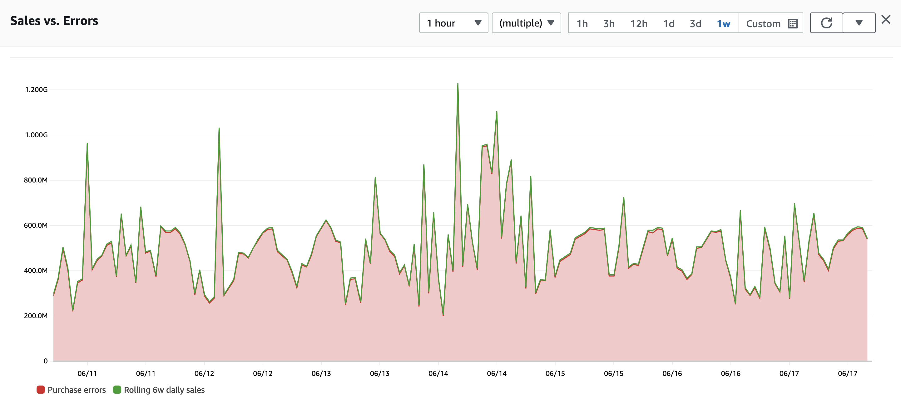

# ベストプラクティスの概要

オブザーバビリティは、成熟したツールの状況を持つ広範なトピックです。ただし、すべてのツールがすべてのソリューションに適しているわけではありません。オブザーバビリティの要件、設定、最終的なデプロイメントをナビゲートするために、オブザーバビリティ戦略の意思決定プロセスに役立つ 5 つの主要なベストプラクティスをまとめました。

## 重要なことを監視する

オブザーバビリティにおいて最も重要な考慮事項は、サーバー、ネットワーク、アプリケーション、または顧客ではありません。*あなた*、あなたのビジネス、プロジェクト、またはユーザーにとって重要なことです。

まず、成功基準が何であるかから始めます。たとえば、e コマースアプリケーションを運用している場合、成功の指標は過去 1 時間に行われた購入数になる可能性があります。非営利団体を運営している場合は、月間目標に対する寄付金額になるかもしれません。決済処理業者はトランザクション処理時間を監視する一方、大学は学生の出席率を測定したいと考えるでしょう。

:::tip
	成功指標は人それぞれ異なります。ここでは e コマースアプリケーションを例として使用していますが、プロジェクトによって測定方法は大きく異なる可能性があります。それでも、アドバイスは同じです。*良い*状態がどのようなものかを把握し、それを測定してください。
:::

アプリケーションに関係なく、まず主要なメトリクスを特定する必要があります。次に、そこから*逆算して[^1]*、アプリケーションまたはインフラストラクチャの観点から何が影響を与えるかを確認します。たとえば、Web サーバーの高い CPU 使用率が顧客満足度を脅かし、ひいては売上に影響を与える場合、CPU 使用率の監視が重要になります。

#### 目標を把握し、測定しましょう！

重要なトップレベル KPI を特定したら、次の作業は、それらを追跡および測定する自動化された方法を用意することです。重要な成功要因は、ワークロードの運用を監視するのと同じシステムでこれを行うことです。e コマースワークロードの例では、次のことを意味する場合があります。

* 販売データを[*時系列*](https://en.wikipedia.org/wiki/Time_series)に公開
* この同じシステムでユーザー登録を追跡
* 顧客が Web ページに滞在する時間を測定し、(再び) このデータを時系列にプッシュ

ほとんどの顧客は、オブザーバビリティの観点から必ずしも適切な場所にあるわけではありませんが、このデータをすでに持っています。売上データは通常、リレーショナルデータベースやビジネスインテリジェンスレポートシステムに、ユーザー登録と共に見つけることができます。また、訪問期間のデータは、ログまたは[Real User Monitoring](../tools/rum)から抽出できます。

メトリクスデータの元の場所や形式に関係なく、[*時系列*](https://en.wikipedia.org/wiki/Time_series)として維持する必要があります。ビジネス、個人、学術、またはその他の目的を問わず、最も重要なすべての主要メトリクスは、他のオブザーバビリティデータ (*シグナル*または*テレメトリ*とも呼ばれます) と関連付けるために、時系列形式である必要があります。

*図 1: 時系列の例*

## コンテキストの伝播とツールの選択

ツールの選択は重要であり、問題の運用と修復の方法に大きな違いをもたらします。しかし、最適でないツールを選択するよりも悪いのは、すべての基本的なシグナルタイプに対応するツールがないことです。たとえば、ワークロードから基本的な[ログ](../signals/logs)を収集しているものの、トランザクショントレースが欠けている場合、ギャップが生じます。その結果、アプリケーション全体のエクスペリエンスの一貫性のないビューになります。オブザーバビリティに対するすべての最新のアプローチは、アプリケーショントレースで「点と点を結ぶ」ことに依存しています。

ヘルスと運用の全体像を把握するには、[ログ](../signals/logs)、[メトリクス](../signals/metrics)、[トレース](../signals/traces)を収集し、相関分析、[異常検出](../signals/anomalies)、[ダッシュボード](../tools/dashboards)、[アラーム](../tools/alarms)などを実行するツールが必要です。

:::info
	一部のオブザーバビリティソリューションには上記のすべてが含まれていない場合がありますが、既存のシステムを補強、拡張、または付加価値を与えることを目的としています。すべてのケースにおいて、ツールの相互運用性と拡張性は、オブザーバビリティプロジェクトを開始する際の重要な考慮事項です。
:::

#### ワークロードはそれぞれ異なりますが、共通のツールを使用することで迅速に結果を得られます

すべてのワークロードで共通のツールセットを使用することには、運用上の摩擦やトレーニングの削減などの追加のメリットがあり、一般的にはツールやベンダーの数を減らすよう努めるべきです。そうすることで、既存のオブザーバビリティソリューションを新しい環境やワークロードに迅速にデプロイでき、問題が発生した際の解決時間を短縮できます。

ツールは、基本的なインフラストラクチャ、アプリケーション、Web サイト、およびその間のすべてを含む、ワークロードのすべての階層を観察できるほど広範囲である必要があります。単一のツールでは不可能な場合、ベストプラクティスは、オープンスタンダードを持ち、オープンソースであり、したがって最も広範なクロスプラットフォーム統合の可能性を持つツールを使用することです。

#### 既存のツールとプロセスとの統合

車輪の再発明をしないでください！「丸い」形状はすでに素晴らしいものであり、データサイロではなく、常に協調的でオープンなシステムを構築する必要があります。

* 既存のアイデンティティプロバイダー (Active Directory、SAML ベースの IdP など) と統合します。
* 既存の IT トラブル追跡システム (JIRA、ServiceNow など) がある場合は、それと統合して、問題が発生したときに迅速に管理します。
* 既存のワークロード管理およびエスカレーションツール (PagerDuty、OpsGenie など) がすでにある場合は、それらを使用してください。
* Ansible、SaltStack、CloudFormation、TerraForm、CDK などの Infrastructure as code ツールはすべて優れたツールです。これらを使用して、オブザーバビリティやその他すべてを管理し、現在すでに使用している同じ Infrastructure as code ツールでオブザーバビリティソリューションを構築します ([初日からオブザーバビリティを含める](#初日からオブザーバビリティを組み込む)を参照)。

#### 自動化と機械学習の使用

コンピュータはパターンを見つけることが得意であり、データがパターンに従って*いない*ことを見つけることも得意です。監視すべきデータポイントが数百、数千、あるいは数百万もある場合、それらすべてに対して健全なしきい値を理解することは不可能です。しかし、多くのオブザーバビリティソリューションには、データのベースライン化という差別化されない重労働を管理する異常検知と機械学習の機能があります。

これを「正常な状態がどのようなものかを知る」と呼びます。ワークロードを徹底的に負荷テストしている場合は、これらの正常なパフォーマンスメトリクスをすでに把握しているかもしれませんが、複雑な分散アプリケーションの場合、すべてのメトリクスのベースラインを作成するのは扱いにくい場合があります。ここで異常検知、自動化、機械学習が非常に役立ちます。

アプリケーションの健全性のベースライン化とアラート設定を代わりに管理するツールを活用することで、目標に集中でき、[重要なものを監視する](#重要なことを監視する)ことができます。

## ワークロードのすべての階層からテレメトリを収集する

アプリケーションは単独で存在するものではなく、ネットワークインフラストラクチャ、クラウドプロバイダー、インターネットサービスプロバイダー、SaaS パートナー、および管理下にあるかどうかにかかわらず、その他のコンポーネントとのやり取りはすべて結果に影響を与える可能性があります。ワークロード全体を包括的に把握することが重要です。

#### 統合に焦点を当てる

計装する領域を 1 つ選ぶ必要がある場合、それは間違いなくコンポーネント間の統合になります。これは、オブザーバビリティの力が最も明白になる場所です。原則として、あるコンポーネントまたはサービスが別のコンポーネントまたはサービスを呼び出すたびに、その呼び出しには少なくとも次のデータポイントを測定する必要があります。

1. リクエストとレスポンスの期間
1. レスポンスのステータス

オブザーバビリティが必要とする一貫性のある全体的なビューを作成するには、収集されるシグナルにリクエストチェーン全体の[単一の一意の識別子](../signals/traces)を含める必要があります。

#### エンドユーザーエクスペリエンスを忘れずに

ワークロードの完全なビューを持つということは、エンドユーザーがどのように体験しているかを含め、すべての階層でワークロードを理解することを意味します。ユーザーエクスペリエンスの低下によって目標が危険にさらされている場合に、それを測定し、定量化し、理解することは、空きディスク容量や CPU 使用率を監視することと同じくらい重要です。それ以上に重要かもしれません。

ワークロードがエンドユーザーと直接やり取りするもの（Web サイトやモバイルアプリとして提供されるアプリケーションなど）である場合、[Real User Monitoring](../tools/rum) は、ユーザーへの配信の「ラストマイル」だけでなく、ユーザーが実際にアプリケーションをどのように体験したかを監視します。最終的に、ユーザーがサービスを実際に使用できない場合、オブザーバビリティジャーニーのすべては意味がありません。

## データは力ですが、細かいことは気にしないでください

アプリケーションのサイズによっては、シグナルを収集するコンポーネントの数が非常に多くなる場合があります。これを行うことは重要であり、有益ですが、努力に対する収益が減少する可能性があります。そのため、ベストプラクティスは、まず[重要なものを監視する](#重要なことを監視する)ことから始め、これを重要な統合と重要なコンポーネントをマッピングする方法として使用し、適切な詳細に焦点を当てることです。

## 初日からオブザーバビリティを組み込む

セキュリティと同様に、オブザーバビリティは開発や運用の後付けであってはなりません。ベストプラクティスは、セキュリティと同様に、計画の早い段階でオブザーバビリティを組み込むことです。これにより、人々が作業するためのモデルが作成され、アプリケーションの不透明な部分が減少します。主要な開発作業が完了した後にトランザクショントレーシングを追加するには、自動計装を使用しても時間がかかります。その努力ははるかに大きなリターンをもたらします！しかし、開発サイクルの後半に行うと、いくらかの手戻りが発生する可能性があります。

後からワークロードにオブザーバビリティを追加するのではなく、作業を*加速*させるために活用しましょう。適切な[ログ](../signals/logs)、[メトリクス](../signals/metrics)、[トレース](../signals/traces)の収集により、アプリケーション開発を高速化し、優れたプラクティスを促進し、今後の迅速な問題解決の基盤を築くことができます。

[^1]: Amazon uses the *working backwards* process extensively as a way to obsession over our customers and their outcomes, and we highly recommend that anyone working on observability solutions work backwards from their own objectives in the same way. You can read more about *working backwards* on [Werner Vogels's blog](https://www.allthingsdistributed.com/2006/11/working_backwards.html).