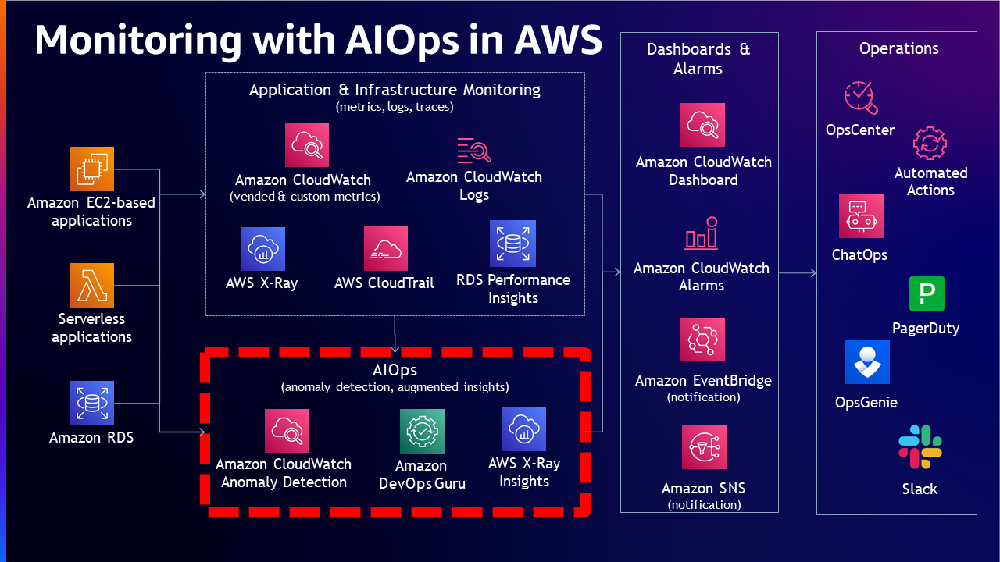

# AWS オブザーバビリティ成熟度モデル

## はじめに

オブザーバビリティの中核は、システムの外部出力を分析することで、システムの内部状態を理解し、洞察を得る能力です。この概念は、あらかじめ定義されたメトリクスやイベントに焦点を当てる従来のモニタリングアプローチから、環境内のさまざまなコンポーネントから生成されるデータの収集、分析、可視化を包括するより包括的なアプローチへと進化しました。システムを観察しなければ、制御や最適化はできません。効果的なオブザーバビリティ戦略を持つことで、チームは迅速に問題を特定し解決し、リソース使用量を最適化し、システム全体の健全性に関する洞察を得ることができます。オブザーバビリティにより、問題を効率的に検出、調査、修復できるようになり、全体的な運用可用性とワークロードの健全性が改善されるはずです。

モニタリングとオブザーバビリティの違いは、モニタリングはシステムが機能しているかどうかを示すのに対し、オブザーバビリティはシステムが機能していない理由を示すことです。モニタリングは通常、対症療法的な対策ですが、オブザーバビリティの目標は、主要業績評価指標 (KPI) を積極的に改善できることです。継続的なモニタリングとオブザーバビリティにより、クラウド環境におけるアジリティが向上し、顧客体験が改善され、リスクが軽減されます。

## オブザーバビリティの成熟度モデル

オブザーバビリティの成熟度モデルは、ワークロードのオブザーバビリティと管理プロセスを最適化しようとする組織にとって不可欠な枠組みとなります。このモデルは、組織が現在の能力を評価し、改善の余地を特定し、最適なオブザーバビリティを実現するための適切なツールとプロセスに戦略的に投資するための包括的なロードマップを提供します。クラウドコンピューティング、マイクロサービス、一時的で分散されたシステムの時代において、オブザーバビリティはデジタルサービスの信頼性とパフォーマンスを確保する上で重要な要素となっています。オブザーバビリティの改善に向けた構造化されたアプローチを提供することで、このモデルは組織がシステムに対する深い理解と制御を得ることを可能にし、より強靭で効率的かつ高性能なビジネスの実現に道筋をつけます。

## オブザーバビリティ成熟度モデルの段階

組織がワークロードを拡大するにつれて、オブザーバビリティの成熟度モデルも成熟することが期待されます。しかし、オブザーバビリティの成熟度への道のりは、必ずしもワークロードの拡大に伴って成長するわけではありません。この目的は、組織が能力を拡大・成長させる際に、必要な成熟度レベルを達成できるよう支援することです。

1. オブザーバビリティ成熟度モデルの最初の段階では、通常、組織の現状の基本的な理解を確立することが含まれます。これには、既存の監視ツールとプロセスの評価、および可視性や機能の欠落の特定が含まれます。この段階で、組織は現在の能力を把握し、エンジニアリングサイクルの初期段階から現実的な改善目標を設定できます。

2. 次の段階では、組織は高度なオブザーバビリティ戦略とサービスを採用することで、より洗練されたアプローチに移行します。これには、プロアクティブなアラート、分散トレーシングの実装が含まれ、これにより組織は可視性の向上、認知負荷の軽減、より効率的なトラブルシューティングの恩恵を受けられるようになります。

3. ビジネスがオブザーバビリティ成熟度モデルの第3段階に進むにつれて、自動修復、人工知能、機械学習テクノロジーなどの追加機能を活用して、異常検知とルート原因分析を自動化できるようになります。これらの高度な機能により、組織は問題を検出するだけでなく、エンドユーザーに影響を与えたり、ビジネス運用を中断する前に修正措置を講じることができます。インシデント管理プラットフォームなどの他の重要なシステムとオブザーバビリティツールを統合することで、組織はインシデント対応プロセスを合理化し、問題解決に要する時間を最小限に抑えることができます。

4. オブザーバビリティ成熟度モデルの最終段階では、監視とオブザーバビリティツールによって生成された大量のデータを活用し、継続的な改善を推進します。これには、高度な分析を使用してワークロードのパフォーマンスのパターンやトレンドを特定し、この情報をエンジニアリングおよび運用プロセスにフィードバックして、リソース割り当て、アーキテクチャ、デプロイ戦略を最適化することが含まれます。

### ステージ 1: 基礎的なモニタリング - テレメトリデータの収集

基本的なモニタリングは、最低限の要件として採用され、サイロ化されています。組織内のシステムやワークロードの全体を監視するために必要なものについて、明確な戦略が定義されていません。ほとんどの場合、アプリケーションの所有者、ネットワークオペレーションセンター (NOC)、CloudOps チーム、DevOps チームなど、異なるチームが監視ニーズに応じて異なるツールを使用しているため、この手法は環境全体のデバッグや最適化という点で価値が低くなります。

通常、このステージのお客様は、ワークロードを監視するためのさまざまなソリューションを持っています。ほとんどの場合、他のチームとのパートナーシップがないか限られているため、同じデータを異なる方法で収集しています。チームは、取得したデータを使って必要なことを最適化する傾向があります。また、他のチームから取得したデータは形式が異なる可能性があるため、チーム間でデータを利用することができません。このレベルでは、重要なワークロードを特定し、オブザーバビリティの統一ソリューションを目指し、メトリクスとログを定義することが重要な側面です。ワークロードの内部状態とワークロードの正常性を理解するために、ワークロードが提供する不可欠な[テレメトリ](https://docs.aws.amazon.com/ja_jp/wellarchitected/latest/operational-excellence-pillar/implement-observability.html)を取得するようにワークロードを設計する必要があります。

成熟度レベルを向上させるための基盤を構築するには、メトリクス、ログ、トレースの収集によるワークロードの計装化、および適切な監視とオブザーバビリティツールを使用した有意義な洞察の獲得が、環境を制御し最適化するのに役立ちます。計装化とは、ワークロードの動作とパフォーマンスを観察するために使用できる環境からの主要データを測定、追跡、キャプチャすることを指します。例としては、エラー、成功または失敗したトランザクションなどのアプリケーションメトリクス、CPU やディスクリソースの使用率などのインフラストラクチャメトリクスがあります。

### ステージ 2: 中級モニタリング - テレメトリ分析とインサイト

このステージでは、お客様は、オンプレミスやクラウドなどさまざまな環境からシグナルを収集することで、組織の状況がより明確になります。メトリクス、ログ、トレースをワークロードから収集するメカニズムを構築しており、これらはオブザーバビリティの基盤構造を形成します。また、可視化、アラート戦略を作成し、明確な基準に基づいて問題の優先順位付けができるようになっています。反応的に推測するのではなく、必要なアクションを呼び出すワークフローがあり、関連するチームは収集された情報と過去の知識に基づいて分析とトラブルシューティングを行えます。このレベルのお客様は、従来型または最新の、高度にスケーラブルで分散型、アジャイル、マイクロサービスアーキテクチャの環境のオブザーバビリティを実現するための実践に取り組んでいます。

モニタリングは大半の場合うまく機能しているように見えますが、組織は問題のデバッグにより多くの時間を費やす傾向があり、その結果、全体的な平均復旧時間 (MTTR) は一貫しておらず、長期的に有意な改善も見られません。また、問題のデバッグに予想以上の認知的時間と労力がかかるため、インシデント対応が長引きます。運用を圧倒するデータ過多の状況にもなりがちです。ほとんどの企業がこのステージに陥っており、次にどこへ進めばよいかわからない状況にあります。組織をさらに次のレベルに移行させるための具体的なアクションは次のとおりです。1) システムのアーキテクチャ設計を定期的に見直し、影響とダウンタイムを減らすためのポリシーと実践を導入し、アラートを減らす。2) アクションが取れる [KPI](https://aws-observability.github.io/observability-best-practices/guides/operational/business/key-performance-indicators/) を定義し、アラート結果に価値のあるコンテキストを追加し、重大度/緊急度で分類し、異なるツールやチームに送信することでアラート疲労を防ぎ、エンジニアが問題をより早く解決できるようにする。

これらのアラートを定期的に分析し、一般的な繰り返しアラートについては自動化された対処を行う。アラート結果を関連チームと共有し、運用とプロセスの改善についてフィードバックを提供する。

さまざまなエンティティを関連付け、システムの異なる部分間の依存関係を理解できるようにするため、徐々に知識グラフを構築する計画を立てる。これにより、お客様はシステムへの変更の影響を視覚化でき、潜在的な問題を予測して軽減できるようになります。

### ステージ 3: 高度なオブザーバビリティ - 相関と異常検出

このステージでは、組織は多くの時間をトラブルシューティングに費やすことなく、問題の根本原因を明確に理解できるようになります。問題が発生した場合、アラートには、ネットワークオペレーションセンター (NOC)、CloudOps チーム、DevOps チームなどの関連チームに十分な状況情報が提供されます。モニタリングチームは、アラートを見れば、メトリクス、ログ、トレースなどのシグナルの相関関係から、すぐに問題の根本原因を特定できます。トレースは、アプリケーションからリクエストに関するデータを収集し、ツールを使ってビュー、フィルタリング、問題の特定と最適化の機会の洞察を得るために使用されます。アプリケーションのトレースされたリクエストは、リクエストとレスポンスに関する詳細情報だけでなく、アプリケーションがダウンストリームの AWS リソース、マイクロサービス、データベース、Web API に対して行う呼び出しに関する情報も提供します。トレースを見れば対応するログイベントを見つけられ、インフラストラクチャとアプリケーションからのメトリクスも見られるので、状況を 360 度見渡すことができます。

適切なチームは、すぐに問題を解決する修正を行うことで、是正措置を講じることができます。このシナリオでは、MTTR は非常に小さく、サービスレベル目標 (SLO) は緑色で、エラー予算の消費率は許容範囲内です。通常、このレベルに到達しているお客様は、モダンで俊敏性の高い、高度にスケーラブルなマイクロサービス環境のオブザーバビリティに関する優れた実践を達成しています。

このようなオブザーバビリティ環境の洗練と成熟度を達成している組織は多くあります。このステージでは、組織は既に複雑なインフラストラクチャをサポートし、高可用性でシステムを運用し、アプリケーションに高い Service Level Availability (SLA) を提供し、信頼できるインフラストラクチャを提供することで事業革新を実現できるようになっています。お客様は、通常のパターンと一致しない異常値や外れ値を監視するための異常検出器を使用し、ほぼリアルタイムのアラート機構を備えています。

しかし、そのような組織のチームは、常に可能性の限界を超えようとします。チームは、繰り返し発生する問題を理解し、過去に収集したデータを使ってモデル化し、将来発生する可能性のある問題を予測するための知識ベースを作成したいと考えています。そこで、お客様は成熟度モデルの次のステージに移行し、未知の洞察を得ることになります。そこに到達するためには、新しいツールと、データの保存と活用のための新しいスキルとテクニックが必要になります。過去に収集したデータを使ってモデルを学習させ、自動的にシグナルを相関させ、根本原因を特定し、解決計画を作成するために、IT 運用のための人工知能 (AIOps) を活用することができます。

### ステージ 4: プロアクティブなオブザーバビリティ - 自動的かつプロアクティブなルートコーズ特定

ここでは、オブザーバビリティデータは問題が発生した「後」だけでなく、問題が発生する「前」にリアルタイムでデータを活用します。高度に訓練されたモデルを使用することで、問題の特定がプロアクティブに行われ、解決がより簡単に実現されます。収集されたシグナルを分析することで、モニタリングシステムは問題の洞察を自動的に提供し、問題を解決するための解決策のオプションを示すことができます。

オブザーバビリティソフトウェアベンダーは、この分野での機能を継続的に拡張しており、Generative AI が普及したことでさらに加速しています。このため、このような成熟度レベルを達成することを目指す組織は、容易に実現できるようになっています。このステージが成熟し形作られると、お客様は、オブザーバビリティサービスが動的なダッシュボードを自動的に作成できる状況になります。ダッシュボードには、手元の問題に関連する情報のみが含まれるため、関係のないデータのクエリと可視化にかかる時間とコストを節約できます。Generative AI (GenAI) と機械学習を実行するコンピューティングリソースが日々民主化されているため、プロアクティブなモニタリング機能が将来的にはより一般的になると予想されます。

データ収集、データ処理、データの洞察と分析のための様々な AWS ネイティブおよびオープンソースソリューションを含む、オブザーバビリティポートフォリオの全体像を示しています。お客様はエンドツーエンドのオブザーバビリティニーズに合わせて適切なソリューションを選択できます。

## AWS Well-Architected と Observability のための Cloud Adoption Framework

組織は [AWS Well-Architected](https://aws.amazon.com/jp/architecture/well-architected/) と [Cloud Adoption Framework](https://docs.aws.amazon.com/ja_jp/whitepapers/latest/aws-caf-operations-perspective/observability.html) を活用して、オブザーバビリティ機能を強化し、クラウド環境を効果的に監視およびトラブルシューティングできます。

AWS Well-Architected と Observability のための Cloud Adoption Framework は、ワークロードの設計、デプロイ、運用のための構造化されたアプローチを提供し、ベストプラクティスに従うことを保証します。
これにより、可用性、システムパフォーマンス、スケーラビリティ、信頼性が向上します。
これらのフレームワークは、組織に標準化された実践と規範的なガイダンスを提供するため、組織全体で知識を共有し、一貫したソリューションを実装しやすくなります。

効果的に活用するには、組織は AWS Well-Architected フレームワークの主要コンポーネントである柱 ([オペレーショナルエクセレンス](https://docs.aws.amazon.com/ja_jp/wellarchitected/latest/framework/operational-excellence.html)、セキュリティ、[信頼性](https://docs.aws.amazon.com/ja_jp/wellarchitected/latest/framework/reliability.html)、[パフォーマンス効率](https://docs.aws.amazon.com/ja_jp/wellarchitected/latest/framework/performance-efficiency.html)、コスト最適化、サステナビリティ) を理解する必要があります。これらの柱は、クラウド環境の設計と運用のための包括的なアプローチを提供します。一方、Cloud Adoption Framework は、ビジネス、人材、ガバナンス、プラットフォームなどの分野に焦点を当てて、クラウド導入のための構造化されたアプローチを提供します。これらのコンポーネントをオブザーバビリティの要件と合わせることで、組織は堅牢でスケーラブルなワークロードを構築できます。

AWS Well-Architected と Observability のための Cloud Adoption Framework の実装には、いくつかのステップが必要です。まず、組織は現状を評価し、改善が必要な領域を特定する必要があります。これは、Observability Maturity Model アセスメントを実施することで行えます。このアセスメントでは、ワークロードがこれらのフレームワークに沿っているかを評価します。レビュー結果に基づいて、組織はオブザーバビリティイニシアチブの優先順位を決め、計画を立てることができます。これには、監視とログの要件の定義、適切な AWS サービスの選択、必要なインフラストラクチャとツールの実装が含まれます。最後に、組織は継続的にオブザーバビリティソリューションを監視し、最適化する必要があります。

また、顧客は [AWS Well-Architected Tool](https://aws.amazon.com/jp/well-architected-tool/) を利用できます。これは、AWS Well-Architected フレームワークのベストプラクティスを使用して、ワークロードを文書化および測定するための AWS のサービスです。このツールは、AWS Well-Architected フレームワークの柱を通じてワークロードを測定するための一貫したプロセスを提供し、意思決定を文書化し、ワークロードの改善に関する推奨事項を提供し、ワークロードをより信頼性が高く、セキュアで、効率的で、コスト効率の良いものにするためのガイダンスを提供します。

## 評価

オブザーバビリティの成熟度モデルの評価を使用して、現在のオブザーバビリティの状態を把握し、改善の余地を特定できます。各段階の評価では、さまざまなチームにわたる既存の監視と管理の実践を評価し、ギャップと改善の余地を特定し、次の段階への全体的な準備状況を判断することが不可欠です。成熟度評価は、ビジネスプロセスの概要、ワークロードの棚卸とツールの発見、現在の課題の特定、組織の優先事項と目標の理解から始まります。

評価では、既存のレイアウトのさらなる開発と最適化の基礎となるターゲットメトリクスと KPI を特定するのに役立ちます。オブザーバビリティの成熟度モデルの評価は、ビジネスが複雑で動的な性質を持つ現代のシステムに対処できるよう準備することが重要です。システム障害やパフォーマンスの問題につながる可能性のある盲点や弱点を特定するのに役立ちます。

さらに、定期的な評価により、ビジネスが俊敏性と適応性を維持できます。進化するテクノロジーと手法に対応できるようになり、システムが常に最高の効率と信頼性を発揮できるようになります。

この評価は、AWS のベストプラクティスに対するオブザーバビリティ戦略の状態を確認し、改善の機会を特定し、時間の経過に伴う進捗状況を追跡するのに役立ちます。以下の質問は、現在のオブザーバビリティの成熟度レベルを評価するのに役立つはずです。費用なしで「AWS Observability Maturity Model Assessment」ツールを使用して評価を実施してもらいたい場合は、AWS アカウントチームにお問い合わせください。

**ログ**

1. どのようにログを収集していますか?
2. どのようにログを使用していますか?
3. どのようにログにアクセスしていますか?
4. セキュリティと規制コンプライアンスのためのログ保持ポリシーは何ですか?
5. 現在、ML/AI 機能を使用していますか?

**メトリクス**

6. どのようなメトリクスを収集していますか?
7. どのようにメトリクスを使用していますか?
8. どのようにメトリクスにアクセスしていますか?

**トレース**

9. どのようにトレースを収集していますか?
10. どのようにトレースを使用していますか?

**ダッシュボードとアラート**

11. どのようにアラームを使用していますか?
12. どのようにダッシュボードを使用していますか?

**組織**

13. 企業のオブザーバビリティ戦略はありますか?
14. どのように SLO を使用していますか?

## オブザーバビリティ戦略の構築

組織がオブザーバビリティの段階を特定したら、現在のプロセスとツールを最適化し、さらに成熟度を高めるための戦略を立てる必要があります。組織は顧客に素晴らしい顧客体験を提供したいと考えているため、顧客の要件から逆算して作業を開始します。次に、ステークホルダーと協力しましょう。彼らはその要件を本当によく理解しています。オブザーバビリティ戦略を目指すにあたり、組織は最初にオブザーバビリティの目標を定義する必要があります。これらの目標は全社的な事業目標と合致しており、戦略を通して組織が達成しようとしていることを明確に説明し、オブザーバビリティ計画の構築と実装のための指針を示す必要があります。

次に、組織はシステムパフォーマンスの洞察を提供するキーメトリクス (KPI) を特定する必要があります。これには、レイテンシやエラー率、リソース使用率、トランザクション量などが含まれる可能性があります。メトリクスの選択は、ビジネスの性質と特定のニーズに大きく依存することに注意が必要です。

キーメトリクスが特定されたら、組織はデータ収集に必要なツールとテクノロジーを決定できます。ツールの選択は、組織の目標との整合性、既存システムとの統合の容易さ、コスト最適化、スケーラビリティの達成、顧客ニーズの満足、および全体的な顧客体験の改善に基づく必要があります。

最後に、組織はオブザーバビリティを重視する文化を育成する必要があります。これには、チームメンバーにオブザーバビリティの重要性を教育し、システムパフォーマンスを積極的に監視するよう促し、継続的な学習と改善の文化を育むことが含まれます。この戦略により、最高の顧客体験を実現するための収集、アクション、改善の継続的なプロセスの循環が生まれます。

要約すると、オブザーバビリティ戦略を構築するには、3つの主要な側面を考慮する必要があります。1) 収集すべき項目、2) 観察が必要なすべてのシステムとワークロード、3) 問題が発生した場合の対処方法と、それらを修復するためのメカニズム。

## 結論

オブザーバビリティの成熟度モデルは、組織がワークロードとインフラストラクチャの動作を理解、分析、対応する能力を評価し、改善する方法を探るためのロードマップとなります。現在の能力を評価し、高度なモニタリング手法を採用し、データ主導の洞察を活用するという構造化されたアプローチに従うことで、企業はより高いレベルのオブザーバビリティを実現し、ワークロードとインフラストラクチャに関してより適切な意思決定を行うことができます。このモデルでは、組織が成熟度の異なるレベルを進むために必要な主要な能力と実践事項を概説しており、最終的には予防的なオブザーバビリティの恩恵を最大限に活用できる状態に至ります。

## 役立つリソース

- [効果的なオブザーバビリティ戦略の構築](https://youtu.be/7PQv9eYCJW8?si=gsn0qPyIMhrxU6sy) - AWS re\:Invent 2023
- [AWS オブザーバビリティのベストプラクティス](https://aws-observability.github.io/observability-best-practices/)
- [オブザーバビリティとは何か、そしてなぜ重要なのか?](https://aws.amazon.com/blogs/mt/what-is-observability-and-why-does-it-matter-part-1/)
- [オブザーバビリティ戦略をどのように策定するか?](https://aws.amazon.com/blogs/mt/how-to-develop-an-observability-strategy/)
- [AWS での深いアプリケーションオブザーバビリティのためのガイダンス](https://aws.amazon.com/jp/solutions/guidance/deep-application-observability-on-aws/)
- [Discovery が AWS オブザーバビリティでオペレーション効率をどのように向上させたか](https://www.youtube.com/watch?v=zm30JNYmxlY) - AWS re\:Invent 2022
- [オブザーバビリティ戦略の策定](https://www.youtube.com/watch?v=Ub3ATriFapQ) - AWS re\:Invent 2022
- [AWS でクラウドネイティブオブザーバビリティを探る](https://www.youtube.com/watch?v=UW7aT25Mbng) - AWS 仮想ワークショップ
- [AWS オブザーバビリティソリューションで可用性を高める](https://www.youtube.com/watch?v=_d_9xCfVBTM) - AWS re\:Invent 2020
- [Amazon でのオブザーバビリティのベストプラクティス](https://www.youtube.com/watch?v=zZPzXEBW4P8) - AWS re\:Invent 2022
- [オブザーバビリティ: 最新のアプリケーションのベストプラクティス](https://www.youtube.com/watch?v=YiegAlC_yyc) - AWS re\:Invent 2022
- [オープンソースによるオブザーバビリティ](https://www.youtube.com/watch?v=2IJPpdp9xU0) - AWS re\:Invent 2022
- [AIOps でオブザーバビリティ戦略を高める](https://www.youtube.com/watch?v=L4b_eDSAwfE)
- [大規模な本番システムのモニタリングを設計する](https://aws.amazon.com/blogs/architecture/lets-architect-monitoring-production-systems-at-scale/)
- [AWS でのフルスタックオブザーバビリティとアプリケーションモニタリング](https://www.youtube.com/watch?v=or7uFFyHIX0) - AWS Summit SF 2022
