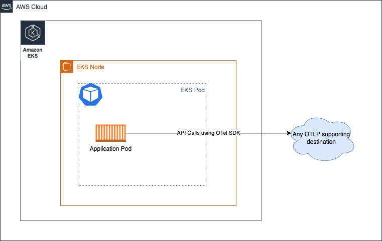
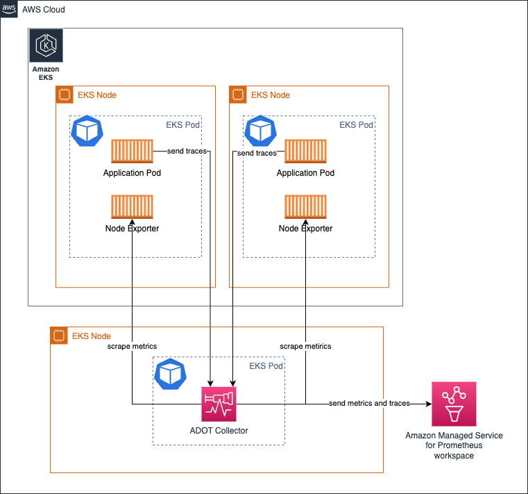

# AWS Distro for OpenTelemetry (ADOT) Collector の運用

[ADOT コレクター](https://aws-otel.github.io/)は、[CNCF](https://www.cncf.io/) によるオープンソースの [OpenTelemetry Collector](https://opentelemetry.io/docs/collector/) のダウンストリームディストリビューションです。

お客様は ADOT Collector を使用して、オンプレミス、AWS、その他のクラウドプロバイダーを含むさまざまな環境からメトリクスやトレースなどのシグナルを収集できます。

ADOT Collector を実際の環境で大規模に運用するには、オペレーターは Collector の健全性を監視し、必要に応じてスケーリングする必要があります。このガイドでは、本番環境で ADOT Collector を運用するために実行できるアクションについて学習します。

## デプロイアーキテクチャ

要件に応じて、検討すべきいくつかのデプロイオプションがあります。

* Collector なし
* Agent
* Gateway


:::tip
    これらの概念の詳細については、[OpenTelemetry ドキュメント](https://opentelemetry.io/docs/collector/deployment/)を確認してください。
:::

### Collector なし
このオプションは、基本的にコレクターを完全に省略します。ご存じないかもしれませんが、OTEL SDK から宛先サービスへ直接 API 呼び出しを行い、シグナルを送信することが可能です。たとえば、ADOT Collector のようなプロセス外エージェントにスパンを送信する代わりに、アプリケーションプロセスから直接 AWS X-Ray の [PutTraceSegments](https://docs.aws.amazon.com/xray/latest/api/API_PutTraceSegments.html) API を呼び出すことを考えてみてください。

このアプローチに関するガイダンスを変更する AWS 固有の側面はないため、より具体的な情報については、アップストリームドキュメントの[セクション](https://opentelemetry.io/docs/collector/deployment/no-collector/)を参照することを強くお勧めします。



### エージェント
このアプローチでは、コレクターを分散方式で実行し、シグナルを宛先に収集します。 `No Collector` オプションでは、懸念事項を分離し、リモート API 呼び出しを行うためにリソースを使用する必要性からアプリケーションを切り離し、代わりにローカルにアクセス可能なエージェントと通信します。

基本的に、Amazon EKS 環境では、**コレクターを Kubernetes サイドカーとして実行する場合**、以下のようになります。


上記のアーキテクチャでは、スクレイプ設定でサービスディスカバリメカニズムを使用する必要はありません。ターゲットからスクレイプを行うためです。 `localhost` コレクターがアプリケーションコンテナと同じ Pod で実行されていることを前提としています。

トレースの収集にも同じアーキテクチャが適用されます。[こちらに示されている](https://aws-otel.github.io/docs/getting-started/x-ray#sample-collector-configuration-putting-it-together)ように OTEL パイプラインを作成するだけです。

##### メリットとデメリット
* この設計を支持する論点の 1 つは、ターゲットが localhost ソースに限定されているため、Collector がその役割を果たすために膨大な量のリソース (CPU、メモリ) を割り当てる必要がないということです。

* このアプローチを使用する場合の欠点は、コレクターポッド設定のバリエーション数が、クラスター上で実行しているアプリケーションの数に正比例することです。
つまり、ポッドに予想されるワークロードに応じて、各ポッドの CPU、メモリ、その他のリソース割り当てを個別に管理する必要があります。これに注意を払わないと、コレクターポッドのリソースを過剰または過小に割り当ててしまい、パフォーマンスが低下したり、ノード内の他のポッドが使用できるはずの CPU サイクルやメモリをロックしてしまう結果になる可能性があります。

必要に応じて、Deployment、Daemonset、Statefulset などの他のモデルでコレクターをデプロイすることもできます。

#### Amazon EKS で Daemonset としてコレクターを実行する

EKS ノード全体にコレクターの負荷（メトリクスのスクレイピングと Amazon Managed Service for Prometheus ワークスペースへの送信）を均等に分散したい場合は、コレクターを [Daemonset](https://kubernetes.io/docs/concepts/workloads/controllers/daemonset/) として実行することを選択できます。


次のものがあることを確認してください `keep` コレクターが自身のホスト/Node からのみターゲットをスクレイピングするようにするアクション。

参考として以下のサンプルを参照してください。このような設定の詳細については、[こちら](https://aws-otel.github.io/docs/getting-started/adot-eks-add-on/config-advanced#daemonset-collector-configuration)を参照してください。

```yaml
scrape_configs:
    - job_name: kubernetes-apiservers
    bearer_token_file: /var/run/secrets/kubernetes.io/serviceaccount/token
    kubernetes_sd_configs:
    - role: endpoints
    relabel_configs:
    - action: keep
        regex: $K8S_NODE_NAME
        source_labels: [__meta_kubernetes_endpoint_node_name]
    scheme: https
    tls_config:
        ca_file: /var/run/secrets/kubernetes.io/serviceaccount/ca.crt
        insecure_skip_verify: true
```

同じアーキテクチャは、トレースの収集にも使用できます。この場合、Collector がエンドポイントに到達して Prometheus メトリクスをスクレイピングする代わりに、トレーススパンがアプリケーション Pod によって Collector に送信されます。

##### メリットとデメリット
**利点**

* スケーリングの懸念が最小限
* 高可用性の設定が課題
* 使用中の Collector のコピーが多すぎる
* ログサポートが容易になる可能性がある

**デメリット**

* リソース使用率の観点から最適ではない
* 不均衡なリソース割り当て


#### Amazon EC2 でコレクターを実行する
EC2 で Collector を実行する際にサイドカーアプローチがないため、EC2 インスタンス上でエージェントとして Collector を実行することになります。以下のような静的スクレイプ設定を設定して、インスタンス内のターゲットを検出し、メトリクスをスクレイプできます。

以下の設定は、ポートでエンドポイントをスクレイピングします `9090` および `8081` localhost 上で実行されます。

[One Observability Workshop の EC2 に焦点を当てたモジュール](https://catalog.workshops.aws/observability/en-US/aws-managed-oss/ec2-monitoring)を通じて、このトピックに関する実践的な詳細を体験できます。

```yaml
global:
  scrape_interval: 15s # By default, scrape targets every 15 seconds.

scrape_configs:
- job_name: 'prometheus'
  static_configs:
  - targets: ['localhost:9090', 'localhost:8081']
```

#### Amazon EKS で Deployment としてコレクターを実行する

コレクターを Deployment として実行することは、コレクターに高可用性を提供したい場合に特に便利です。ターゲットの数、スクレイピング可能なメトリクスなどに応じて、コレクターのリソースを調整し、コレクターがリソース不足に陥ってシグナル収集に問題が発生しないようにする必要があります。

[このトピックの詳細については、こちらのガイドを参照してください。](/observability-best-practices/ja/guides/containers/oss/eks/best-practices-metrics-collection)

次のアーキテクチャは、ワークロードノードの外部にある別のノードにコレクターをデプロイして、メトリクスとトレースを収集する方法を示しています。



メトリクス収集の高可用性を設定するには、[設定方法の詳細な手順を提供するドキュメントをお読みください](https://docs.aws.amazon.com/prometheus/latest/userguide/Send-high-availability-prom-community.html)

#### メトリクス収集のために Amazon ECS 上でコレクターを中央タスクとして実行する

[ECS Observer 拡張機能](https://github.com/open-telemetry/opentelemetry-collector-contrib/tree/main/extension/observer/ecsobserver)を使用して、ECS クラスター内の異なるタスク間、またはクラスター間で Prometheus メトリクスを収集できます。


拡張機能のサンプルコレクター設定。

```yaml
extensions:
  ecs_observer:
    refresh_interval: 60s # format is https://golang.org/pkg/time/#ParseDuration
    cluster_name: 'Cluster-1' # cluster name need manual config
    cluster_region: 'us-west-2' # region can be configured directly or use AWS_REGION env var
    result_file: '/etc/ecs_sd_targets.yaml' # the directory for file must already exists
    services:
      - name_pattern: '^retail-.*$'
    docker_labels:
      - port_label: 'ECS_PROMETHEUS_EXPORTER_PORT'
    task_definitions:
      - job_name: 'task_def_1'
        metrics_path: '/metrics'
        metrics_ports:
          - 9113
          - 9090
        arn_pattern: '.*:task-definition/nginx:[0-9]+'
```


##### メリットとデメリット
* このモデルの利点は、管理する必要のあるコレクターと設定が少なくなることです。
* クラスターが非常に大きく、スクレイピングする対象が数千ある場合は、コレクター間で負荷が分散されるようにアーキテクチャを慎重に設計する必要があります。HA のために同じコレクターのほぼクローンを実行することに加えて、運用上の問題を回避するために慎重に行う必要があります。

### Gateway


## Collector の健全性の管理
OTEL Collector は、その健全性とパフォーマンスを監視するためのいくつかのシグナルを公開しています。次のような是正措置を講じるために、Collector の健全性を綿密に監視することが不可欠です。

* コレクターの水平スケーリング
* コレクターが期待どおりに機能するための追加リソースのプロビジョニング


### Collector からヘルスメトリクスを収集する

OTEL Collector は、Prometheus Exposition Format でメトリクスを公開するように設定できます。 `telemetry` セクションに `service` パイプライン。コレクターは独自のログを stdout に公開することもできます。

テレメトリ設定の詳細については、[こちらの OpenTelemetry ドキュメント](https://opentelemetry.io/docs/collector/configuration/#service)を参照してください。

コレクターのサンプルテレメトリ設定です。

```yaml
service:
  telemetry:
    logs:
      level: debug
    metrics:
      level: detailed
      address: 0.0.0.0:8888
```
設定が完了すると、コレクターは以下のようなメトリクスのエクスポートを開始します。 `http://localhost:8888/metrics`.

```bash
# HELP otelcol_exporter_enqueue_failed_spans Number of spans failed to be added to the sending queue.
# TYPE otelcol_exporter_enqueue_failed_spans counter
otelcol_exporter_enqueue_failed_spans{exporter="awsxray",service_instance_id="523a2182-539d-47f6-ba3c-13867b60092a",service_name="aws-otel-collector",service_version="v0.25.0"} 0

# HELP otelcol_process_runtime_total_sys_memory_bytes Total bytes of memory obtained from the OS (see 'go doc runtime.MemStats.Sys')
# TYPE otelcol_process_runtime_total_sys_memory_bytes gauge
otelcol_process_runtime_total_sys_memory_bytes{service_instance_id="523a2182-539d-47f6-ba3c-13867b60092a",service_name="aws-otel-collector",service_version="v0.25.0"} 2.4462344e+07

# HELP otelcol_process_memory_rss Total physical memory (resident set size)
# TYPE otelcol_process_memory_rss gauge
otelcol_process_memory_rss{service_instance_id="523a2182-539d-47f6-ba3c-13867b60092a",service_name="aws-otel-collector",service_version="v0.25.0"} 6.5675264e+07

# HELP otelcol_exporter_enqueue_failed_metric_points Number of metric points failed to be added to the sending queue.
# TYPE otelcol_exporter_enqueue_failed_metric_points counter
otelcol_exporter_enqueue_failed_metric_points{exporter="awsxray",service_instance_id="d234b769-dc8a-4b20-8b2b-9c4f342466fe",service_name="aws-otel-collector",service_version="v0.25.0"} 0
otelcol_exporter_enqueue_failed_metric_points{exporter="logging",service_instance_id="d234b769-dc8a-4b20-8b2b-9c4f342466fe",service_name="aws-otel-collector",service_version="v0.25.0"} 0
```

上記のサンプル出力では、コレクターが次のメトリクスを公開していることがわかります `otelcol_exporter_enqueue_failed_spans` 送信キューへの追加に失敗したスパンの数を示しています。このメトリクスは、コレクターが設定された宛先にトレースデータを送信する際に問題が発生しているかどうかを把握するために監視すべきものです。この場合、次のことがわかります。 `exporter` 値を持つラベル `awsxray` 使用中のトレース送信先を示します。

もう一つのメトリクス `otelcol_process_runtime_total_sys_memory_bytes` コレクターが使用しているメモリ量を把握するための指標です。このメモリが次の値に近づきすぎた場合 `otelcol_process_memory_rss` メトリクスは、Collector がプロセスに割り当てられたメモリを使い果たしそうになっていることを示しており、問題を回避するために Collector により多くのメモリを割り当てるなどのアクションを実行する時期が来ている可能性があります。

同様に、次のような別のカウンターメトリクスがあることがわかります `otelcol_exporter_enqueue_failed_metric_points` リモート送信先への送信に失敗したメトリクスの数を示します

#### Collector ヘルスチェック
コレクターが公開するライブネスプローブがあり、コレクターが稼働しているかどうかを確認できます。このエンドポイントを使用して、コレクターの可用性を定期的にチェックすることをお勧めします。

The [`healthcheck`](https://github.com/open-telemetry/opentelemetry-collector-contrib/tree/main/extension/healthcheckextension) 拡張機能を使用して、コレクターがエンドポイントを公開できるようにすることができます。以下のサンプル設定を参照してください。

```yaml
extensions:
  health_check:
    endpoint: 0.0.0.0:13133
```

完全な設定オプションについては、[こちらの GitHub リポジトリを参照してください。](https://github.com/open-telemetry/opentelemetry-collector-contrib/tree/main/extension/healthcheckextension)

```bash
❯ curl -v http://localhost:13133
*   Trying 127.0.0.1:13133...
* Connected to localhost (127.0.0.1) port 13133 (#0)
> GET / HTTP/1.1
> Host: localhost:13133
> User-Agent: curl/7.79.1
> Accept: */*
>
* Mark bundle as not supporting multiuse
< HTTP/1.1 200 OK
< Date: Fri, 24 Feb 2023 19:09:22 GMT
< Content-Length: 0
<
* Connection #0 to host localhost left intact
```

#### 壊滅的な障害を防ぐための制限の設定
どの環境でもリソース (CPU、Memory) は有限であるため、予期しない状況による障害を回避するために、コレクターコンポーネントに制限を設定する必要があります。

ADOT Collector を運用して Prometheus メトリクスを収集する場合、これは特に重要です。
次のシナリオを考えてみましょう - あなたは DevOps チームに所属しており、Amazon EKS クラスター内で ADOT Collector をデプロイおよび運用する責任を負っています。アプリケーションチームは、1 日のいつでも自由にアプリケーション Pod をデプロイでき、Pod から公開されるメトリクスが Amazon Managed Service for Prometheus ワークスペースに収集されることを期待しています。

これで、このパイプラインが問題なく動作することを保証する責任があなたにあります。この問題を解決するには、高レベルで 2 つの方法があります。

* この要件をサポートするために、コレクターを無限にスケーリングする (必要に応じてクラスターに Node を追加する)
* メトリクス収集に制限を設定し、上限のしきい値をアプリケーションチームに通知する

両方のアプローチにはそれぞれ長所と短所があります。コストやそれに伴うオーバーヘッドを考慮せず、絶えず成長するビジネスニーズのサポートに完全にコミットする場合は、オプション 1 を選択すべきだと主張することもできます。絶えず成長するビジネスニーズを無限にサポートすることは魅力的に聞こえるかもしれませんが `cloud is for infinite scalability` 運用の観点から見ると、これは多くの運用オーバーヘッドをもたらす可能性があり、無限の時間とリソースを投入して継続的な中断のない運用を確保しない限り、さらに壊滅的な状況につながる可能性があります。ほとんどの場合、これは現実的ではありません。

より実用的で倹約的なアプローチは、オプション 2 を選択することです。この場合、任意の時点で上限を設定し（必要に応じて段階的に増やす可能性もあります）、運用上の境界を明確にします。

ADOT Collector で Prometheus レシーバーを使用してこれを実行する方法の例を次に示します。

Prometheus の [scrape_config](https://prometheus.io/docs/prometheus/latest/configuration/configuration/#relabel_config) では、特定のスクレイプジョブに対していくつかの制限を設定できます。次のような制限を設定できます。

* スクレイプの合計ボディサイズ
* 受け入れるラベル数の制限（この制限を超えるとスクレイプは破棄され、Collector ログで確認できます）
* スクレイプするターゲット数の制限
* その他

利用可能なすべてのオプションは、[Prometheus ドキュメント](https://prometheus.io/docs/prometheus/latest/configuration/configuration/#relabel_config)で確認できます。

##### メモリ使用量の制限
Collector パイプラインは [`memorylimiterprocessor`](https://github.com/open-telemetry/opentelemetry-collector/tree/main/processor/memorylimiterprocessor) を使用して、プロセッサコンポーネントが使用するメモリ量を制限します。Collector に対して、大量のメモリと CPU を必要とする複雑な操作を実行させたいというお客様の要望をよく見かけます。

[のようなプロセッサーを使用する場合`redactionprocessor,`](https://github.com/open-telemetry/opentelemetry-collector-contrib/tree/main/processor/redactionprocessor)[`filterprocessor,`](https://github.com/open-telemetry/opentelemetry-collector-contrib/tree/main/processor/filterprocessor)[`spanprocessor,`](https://github.com/open-telemetry/opentelemetry-collector-contrib/tree/main/processor/spanprocessor) は魅力的で非常に便利ですが、一般的にプロセッサはデータ変換タスクを処理するため、タスクを完了するためにデータをメモリ内に保持する必要があることも覚えておく必要があります。これにより、特定のプロセッサが Collector 全体を破壊したり、Collector が独自のヘルスメトリクスを公開するのに十分なメモリを持たなくなったりする可能性があります。

You can avoid this by limiting the amount of memory the Collector can use by making use of the  [`memorylimiterprocessor.`](https://github.com/open-telemetry/opentelemetry-collector/tree/main/processor/memorylimiterprocessor)。これに関する推奨事項は、Collector がヘルスメトリクスを公開したり、その他のタスクを実行したりするために使用できるバッファメモリを提供することです。これにより、プロセッサが割り当てられたメモリをすべて使用しないようにします。

たとえば、EKS Pod のメモリ制限が `10Gi`を設定してから、 `memorylimitprocessor` 未満 `10Gi`、たとえば `9Gi` そのため、バッファは `1Gi` ヘルスメトリクスの公開、レシーバーおよびエクスポータータスクなどの他の操作を実行するために使用できます。

#### バックプレッシャー管理

以下に示すようなアーキテクチャパターン (Gateway パターン) を使用して、コンプライアンス要件を維持するためにシグナルデータから機密データをフィルタリングするなどの運用タスク (ただしこれに限定されません) を一元化できます。


ただし、このような_処理_タスクが多すぎると Gateway Collector に過負荷がかかり、問題が発生する可能性があります。推奨されるアプローチは、プロセス/メモリ集約型のタスクを個々のコレクターとゲートウェイの間で分散し、ワークロードを共有することです。

たとえば、[`resourceprocessor`](https://github.com/open-telemetry/opentelemetry-collector-contrib/tree/main/processor/resourceprocessor) を使用してリソース属性を処理し、[`transformprocessor`](https://github.com/open-telemetry/opentelemetry-collector-contrib/tree/main/processor/transformprocessor) を使用して、シグナル収集が発生するとすぐに、個々の Collector 内からシグナルデータを変換します。

その後、[`filterprocessor`](https://github.com/open-telemetry/opentelemetry-collector-contrib/tree/main/processor/filterprocessor)を使用してシグナルデータの特定の部分をフィルタリングし、[`redactionprocessor`](https://github.com/open-telemetry/opentelemetry-collector-contrib/tree/main/processor/redactionprocessor) を使用して、クレジットカード番号などの機密情報を編集します。

高レベルのアーキテクチャ図は次のようになります。


すでにお気づきかもしれませんが、Gateway Collector はすぐに単一障害点になる可能性があります。明らかな選択肢の 1 つは、複数の Gateway Collector を起動し、以下に示すように [AWS Application Load Balancer (ALB)](https://aws.amazon.com/elasticloadbalancing/application-load-balancer/) のようなロードバランサーを介してリクエストをプロキシすることです。


##### Prometheus メトリクス収集における順序が乱れたサンプルの処理

以下のアーキテクチャにおける次のシナリオを考えてみましょう。


1. Amazon EKS クラスタ内の **ADOT Collector-1** からのメトリクスが Gateway クラスタに送信され、**Gateway ADOT Collector-1** に転送されると仮定します
1. しばらくすると、同じ **ADOT Collector-1** からのメトリクス（同じターゲットを収集しているため、同じメトリクスサンプルが処理されます）が **Gateway ADOT Collector-2** に送信されます
1. ここで、**Gateway ADOT Collector-2** が先に Amazon Managed Service for Prometheus ワークスペースにメトリクスをディスパッチし、その後に同じメトリクスシリーズの古いサンプルを含む **Gateway ADOT Collector-1** が続く場合、次のような結果を受け取ります `out of order sample` Amazon Managed Service for Prometheus からのエラー。

以下のエラー例を参照してください。

```bash
Error message:
 2023-03-02T21:18:54.447Z        error   exporterhelper/queued_retry.go:394      Exporting failed. The error is not retryable. Dropping data.    {"kind": "exporter", "data_type": "metrics", "name": "prometheusremotewrite", "error": "Permanent error: Permanent error: remote write returned HTTP status 400 Bad Request; err = %!w(<nil>): user=820326043460_ws-5f42c3b6-3268-4737-b215-1371b55a9ef2: err: out of order sample. timestamp=2023-03-02T21:17:59.782Z, series={__name__=\"otelcol_exporter_send_failed_metric_points\", exporter=\"logging\", http_scheme=\"http\", instance=\"10.195.158.91:28888\", ", "dropped_items": 6474}
go.opentelemetry.io/collector/exporter/exporterhelper.(*retrySender).send
        go.opentelemetry.io/collector@v0.66.0/exporter/exporterhelper/queued_retry.go:394
go.opentelemetry.io/collector/exporter/exporterhelper.(*metricsSenderWithObservability).send
        go.opentelemetry.io/collector@v0.66.0/exporter/exporterhelper/metrics.go:135
go.opentelemetry.io/collector/exporter/exporterhelper.(*queuedRetrySender).start.func1
        go.opentelemetry.io/collector@v0.66.0/exporter/exporterhelper/queued_retry.go:205
go.opentelemetry.io/collector/exporter/exporterhelper/internal.(*boundedMemoryQueue).StartConsumers.func1
        go.opentelemetry.io/collector@v0.66.0/exporter/exporterhelper/internal/bounded_memory_queue.go:61
```

###### 順序が正しくないサンプルエラーの解決

この特定のセットアップにおけるサンプルの順序エラーは、いくつかの方法で解決できます。

* スティッキーロードバランサーを使用して、IP アドレスに基づいて特定のソースからのリクエストを同じターゲットに転送します。

詳細については、[こちらのリンク](https://aws.amazon.com/premiumsupport/knowledge-center/elb-route-requests-with-source-ip-alb/)を参照してください。

* 別のオプションとして、Gateway Collectors に外部ラベルを追加してメトリクスシリーズを区別することができます。これにより、Amazon Managed Service for Prometheus はこれらのメトリクスを個別のメトリクスシリーズとして認識し、同一のものとは見なさなくなります。

:::warning
        このソリューションを使用すると、セットアップ内の Gateway Collector の数に比例してメトリクスシリーズが増加します。これは、[`Active time series limits`](https://docs.aws.amazon.com/prometheus/latest/userguide/AMP_quotas.html)
:::

* **ADOT Collector を Daemonset としてデプロイする場合**、次のことを確認してください `relabel_configs` 各 ADOT Collector Pod が実行されている同じノードからのサンプルのみを保持します。詳細については、以下のリンクを参照してください。
    - [Amazon Managed Prometheus の高度な Collector 設定](https://aws-otel.github.io/docs/getting-started/adot-eks-add-on/config-advanced) - *Click to View* セクションを展開し、以下のようなエントリを探します。
        ```yaml
            relabel_configs:
            - action: keep
              regex: $K8S_NODE_NAME
        ```
    - [ADOT アドオンの高度な設定](https://aws-otel.github.io/docs/getting-started/adot-eks-add-on/add-on-configuration) - EKS 用 ADOT アドオンの高度な設定を使用して ADOT Collector をデプロイする方法を学びます。
    - [ADOT Collector のデプロイ戦略](https://aws-otel.github.io/docs/getting-started/adot-eks-add-on/installation#deploy-the-adot-collector) - ADOT Collector を大規模にデプロイするためのさまざまな代替手段と、各アプローチの利点について詳しく学びます。


#### Open Agent Management Protocol (OpAMP)

OpAMP は、HTTP および WebSockets を介した通信をサポートするクライアント/サーバープロトコルです。OpAMP は OTel Collector に実装されているため、OTel Collector 自体のように OpAMP をサポートする他のエージェントを管理するためのコントロールプレーンの一部として、OTel Collector をサーバーとして使用できます。ここでの「管理」部分には、Collector の設定を更新したり、ヘルスを監視したり、Collector をアップグレードしたりする機能が含まれます。

このプロトコルの詳細は、[OpenTelemetry の公式ウェブサイトに詳しく記載されています。](https://opentelemetry.io/docs/collector/management/)

### 水平スケーリング
ワークロードによっては、ADOT Collector を水平方向にスケーリングする必要が生じる場合があります。水平方向にスケーリングする必要性は、ユースケース、Collector の設定、およびテレメトリのスループットに完全に依存します。

プラットフォーム固有の水平スケーリング技術は、ステートフル、ステートレス、およびスクレイパー Collector コンポーネントを考慮しながら、他のアプリケーションと同様に Collector に適用できます。

ほとんどのコレクターコンポーネントは `stateless`つまり、メモリに状態を保持せず、保持する場合でもスケーリングの目的には関係ありません。ステートレス Collector の追加レプリカは、アプリケーションロードバランサーの背後でスケーリングできます。

`Stateful` コレクターコンポーネントは、そのコンポーネントの動作に不可欠な情報をメモリに保持するコレクターコンポーネントです。

ADOT Collector のステートフルコンポーネントの例には、以下が含まれますがこれらに限定されません。

* [Tail Sampling Processor](https://github.com/open-telemetry/opentelemetry-collector-contrib/tree/main/processor/tailsamplingprocessor) - 正確なサンプリング決定を行うために、トレースのすべてのスパンが必要です。高度なサンプリングスケーリング技術は [ADOT 開発者ポータルに文書化されています](https://aws-otel.github.io/docs/getting-started/advanced-sampling)。
* [AWS EMF Exporter](https://github.com/open-telemetry/opentelemetry-collector-contrib/tree/main/exporter/awsemfexporter) - 一部のメトリクスタイプに対して累積からデルタへの変換を実行します。この変換では、以前のメトリクス値をメモリに保存する必要があります。
* [Cummulative to Delta Processor](https://github.com/open-telemetry/opentelemetry-collector-contrib/tree/main/processor/cumulativetodeltaprocessor#cumulative-to-delta-processor) - 累積からデルタへの変換では、以前のメトリクス値をメモリに保存する必要があります。

コレクターコンポーネントは `scrapers` テレメトリデータを受動的に受信するのではなく、能動的に取得します。現在、[Prometheus receiver](https://github.com/open-telemetry/opentelemetry-collector-contrib/tree/main/receiver/prometheusreceiver) は ADOT Collector における唯一のスクレイパータイプのコンポーネントです。Prometheus receiver を含むコレクター設定を水平方向にスケーリングするには、コレクターごとにスクレイピングジョブを分割して、2 つのコレクターが同じエンドポイントをスクレイピングしないようにする必要があります。これを行わないと、Prometheus の順序が正しくないサンプルエラーが発生する可能性があります。

コレクターのスケーリングのプロセスと手法については、[OpenTelemetry の公式ウェブサイトで詳細に文書化されています](https://opentelemetry.io/docs/collector/scaling/)。 


