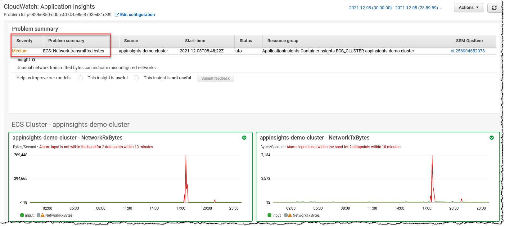

## 1.0 KPI（「ゴールデンシグナル」）の理解
組織は、ビジネスやオペレーションの健全性やリスクに関する洞察を提供する重要業績評価指標（KPI）、別名「ゴールデンシグナル」を活用しています。
組織の各部門は、それぞれの成果を測定するための独自の KPI を持っています。
例えば、e コマースアプリケーションのプロダクトチームは、カート注文の処理成功率を KPI として追跡します。
オンコール運用チームは、インシデントの平均検出時間（MTTD）を KPI として測定します。
財務チームにとっては、予算内のリソースコストが重要な KPI となります。

Service Level Indicator (SLI)、Service Level Objective (SLO)、Service Level Agreement (SLA) は、サービス信頼性管理の重要な要素です。
このガイドでは、Amazon CloudWatch とその機能を使用して SLI、SLO、SLA を計算し監視するためのベストプラクティスを、明確で簡潔な例とともに説明します。

- **SLI (Service Level Indicator)：** サービスのパフォーマンスを定量的に測定する指標です。
- **SLO (Service Level Objective)：** SLI の目標値で、望ましいパフォーマンスレベルを表します。
- **SLA (Service Level Agreement)：** サービスプロバイダーとユーザー間で期待されるサービスレベルを規定する契約です。

一般的な SLI の例：

- 可用性：サービスが稼働している時間の割合
- レイテンシー：リクエストの処理に要する時間
- エラー率：失敗したリクエストの割合


## 2.0 顧客とステークホルダーの要件を把握する（以下のテンプレートを使用）

1. 最上位の質問から始めます：「対象のワークロード（決済ポータル、eコマース注文、ユーザー登録、データレポート、サポートポータルなど）におけるビジネス価値または解決すべきビジネス課題は何か」
2. ビジネス価値を以下のカテゴリに分類します：ユーザーエクスペリエンス（UX）、ビジネスエクスペリエンス（BX）、運用エクスペリエンス（OpsX）、セキュリティエクスペリエンス（SecX）、開発者エクスペリエンス（DevX）
3. 各カテゴリの主要なシグナル、いわゆる「ゴールデンシグナル」を導き出します。UX と BX に関する主要なシグナルは、通常ビジネスメトリクスを構成します

| ID | 略称 | 顧客 | ビジネスニーズ | 測定項目 | 情報ソース | 理想的な状態 | アラート | ダッシュボード | レポート |
| --- | --- | --- | --- | --- | --- | --- | --- | --- | --- |
|M1 | 例 | 外部エンドユーザー | ユーザーエクスペリエンス | レスポンスタイム（ページレイテンシー） | ログ/トレース | 99.9% が 5 秒未満 | いいえ | はい | いいえ |
|M2 | 例 | ビジネス | 可用性 | 成功した RPS（1 秒あたりのリクエスト数） | ヘルスチェック | 5 分間のウィンドウで 85% 以上 | はい | はい | はい |
|M3 | 例 | セキュリティ | コンプライアンス | 重大な非準拠リソース | 設定データ | 15 日以内で 10 未満 | いいえ | はい | はい |
|M4 | 例 | 開発者 | アジリティ | デプロイ時間 | デプロイログ | 常に 10 分未満 | はい | いいえ | はい |
|M5 | 例 | オペレーター | キャパシティ | キューの深さ | アプリケーションログ/メトリクス | 常に 10 未満 | はい | はい | はい |


### 2.1 ゴールデンシグナル

|カテゴリ	|シグナル	|注記	|参考資料	|
|---	|---	|---	|---	|
|UX	|パフォーマンス (レイテンシー)	|テンプレートの M1 を参照	|ホワイトペーパー: [Availability and Beyond (レイテンシーの測定)](https://docs.aws.amazon.com/ja_jp/whitepapers/latest/availability-and-beyond-improving-resilience/measuring-availability.html)	|
|BX	|可用性	|テンプレートの M2 を参照	|ホワイトペーパー: [Avaiability and Beyond (可用性の測定)](https://docs.aws.amazon.com/ja_jp/whitepapers/latest/availability-and-beyond-improving-resilience/measuring-availability.html)	|
|BX	|事業継続計画 (BCP)	|定義された RTO/RPO に対する Amazon Resilience Hub (ARH) のレジリエンススコア	|ドキュメント: [ARH ユーザーガイド (レジリエンススコアの理解)](https://docs.aws.amazon.com/ja_jp/resilience-hub/latest/userguide/resil-score.html)	|
|SecX	|コンプライアンス (非準拠)	|テンプレートの M3 を参照	|ドキュメント: [AWS Control Tower ユーザーガイド (コンソールでのコンプライアンスステータス)](https://docs.aws.amazon.com/ja_jp/controltower/latest/userguide/compliance-statuses.html)	|
|DevX	|アジリティ	|テンプレートの M4 を参照	|ドキュメント: [AWS での DevOps モニタリングダッシュボード (DevOps メトリクスリスト)](https://docs.aws.amazon.com/ja_jp/solutions/latest/devops-monitoring-dashboard-on-aws/devops-metrics-list.html)	|
|OpsX	|キャパシティ (クォータ)	|テンプレートの M5 を参照	|ドキュメント: [Amazon CloudWatch ユーザーガイド (サービスクォータの可視化とアラームの設定)](https://docs.aws.amazon.com/ja_jp/AmazonCloudWatch/latest/monitoring/CloudWatch-Quotas-Visualize-Alarms.html)	|
|OpsX	|予算の異常	|	|ドキュメント:<br/> 1. [AWS Billing and Cost Management (AWS Cost Anomaly Detection)](https://docs.aws.amazon.com/ja_jp/cost-management/latest/userguide/getting-started-ad.html) <br/> 2. [AWS Budgets](https://aws.amazon.com/jp/aws-cost-management/aws-budgets/)	|


## 3.0 トップレベルガイダンス 'TLG'


### 3.1 TLG 一般

1. ビジネス、アーキテクチャ、セキュリティチームと協力して、ビジネス、コンプライアンス、ガバナンス要件を改善し、ビジネスニーズを正確に反映していることを確認します。
これには、[復旧時間目標と復旧ポイント目標 (RTO、RPO) の設定](https://aws.amazon.com/blogs/mt/establishing-rpo-and-rto-targets-for-cloud-applications/) が含まれます。
[可用性の測定](https://docs.aws.amazon.com/ja_jp/whitepapers/latest/availability-and-beyond-improving-resilience/measuring-availability.html) やレイテンシー (例: 稼働時間は 5 分間のウィンドウで小さな割合の障害を許容する可能性がある) などの要件を測定する方法を策定します。

2. さまざまなビジネス機能の成果に沿った目的に合わせたスキーマを持つ効果的な[タグ付け戦略](https://docs.aws.amazon.com/ja_jp/whitepapers/latest/tagging-best-practices/defining-and-publishing-a-tagging-schema.html)を構築します。
これは特に[オペレーショナルオブザーバビリティ](https://docs.aws.amazon.com/ja_jp/whitepapers/latest/tagging-best-practices/operational-observability.html)と[インシデント管理](https://docs.aws.amazon.com/ja_jp/whitepapers/latest/tagging-best-practices/incident-management.html)をカバーする必要があります。

3. 可能な場合は、機械学習アルゴリズムを使用してベースラインを確立する [CloudWatch 異常検出](https://docs.aws.amazon.com/ja_jp/AmazonCloudWatch/latest/monitoring/CloudWatch_Anomaly_Detection.html) を使用して、アラームの動的しきい値を活用します (特にベースライン KPI がないメトリクスの場合)。
CloudWatch メトリクス (または Prometheus メトリクスなどの他のソース) を公開する AWS の利用可能なサービスを使用してアラームを設定する場合は、アラームノイズを減らすために[複合アラーム](https://docs.aws.amazon.com/ja_jp/AmazonCloudWatch/latest/monitoring/Create_Composite_Alarm.html)の作成を検討してください。
例: デプロイメント中に両方が重要なしきい値を下回った場合にアラームを発する、可用性を示すビジネスメトリクス (成功したリクエストによって追跡) とレイテンシーで構成される複合アラームは、デプロイメントのバグを示す決定的な指標となる可能性があります。

4. (注: AWS ビジネスサポート以上が必要) AWS は、Personal Health Dashboard でリソースに関連する関心のあるイベントを公開しています。
[AWS Health Aware (AHA)](https://aws.amazon.com/jp/blogs/news/aws-health-aware-customize-aws-health-alerts-for-organizational-and-personal-aws-accounts/) フレームワーク (AWS Health を使用) を活用して、中央アカウント (管理アカウントなど) から AWS Organization 全体で集約された予防的およびリアルタイムのアラートを取り込みます。
これらのアラートは、Slack などの優先的なコミュニケーションプラットフォームに送信でき、ServiceNow や Jira などの ITSM ツールと統合されます。


5. Amazon CloudWatch [Application Insights](https://docs.aws.amazon.com/ja_jp/AmazonCloudWatch/latest/monitoring/cloudwatch-application-insights.html) を活用して、リソースの最適なモニターを設定し、アプリケーションの問題の兆候を継続的にデータ分析します。
また、監視対象のアプリケーションの潜在的な問題を示す自動化されたダッシュボードを提供し、アプリケーション/インフラストラクチャの問題を迅速に分離/トラブルシューティングできます。
[Container Insights](https://docs.aws.amazon.com/ja_jp/AmazonCloudWatch/latest/monitoring/ContainerInsights.html) を活用してコンテナからメトリクスとログを集約し、CloudWatch Application Insights とシームレスに統合できます。


6. [AWS Resilience Hub](https://aws.amazon.com/jp/resilience-hub/) を活用して、定義された RTO と RPO に対してアプリケーションを分析します。
[AWS Fault Injection Simulator](https://aws.amazon.com/jp/fis/) などのツールを使用した制御された実験を使用して、可用性、レイテンシー、事業継続性の要件が満たされているかを検証します。
追加の Well-Architected レビューとサービス固有の詳細な分析を実施して、ワークロードが AWS のベストプラクティスに従ってビジネス要件を満たすように設計されていることを確認します。

7. 詳細については、[AWS オブザーバビリティのベストプラクティス](https://aws-observability.github.io/observability-best-practices/)ガイダンス、AWS Cloud Adoption Framework: [運用の観点](https://docs.aws.amazon.com/ja_jp/whitepapers/latest/aws-caf-operations-perspective/observability.html)ホワイトペーパー、および AWS Well-Architected Framework オペレーショナルエクセレンスの柱ホワイトペーパーの「[ワークロードの健全性の理解](https://docs.aws.amazon.com/ja_jp/wellarchitected/latest/operational-excellence-pillar/understanding-workload-health.html)」に関するコンテンツの他のセクションを参照してください。


### 3.2 ドメインごとの TLG (ビジネスメトリクス、つまり UX、BX に重点を置く)

CloudWatch (CW) などのサービスを使用した適切な例を以下に示します (参考: [CloudWatch メトリクスのドキュメント](https://docs.aws.amazon.com/ja_jp/AmazonCloudWatch/latest/monitoring/aws-services-cloudwatch-metrics.html) を公開している AWS サービス)。


#### 3.2.1 Canary (合成トランザクション) と Real-User Monitoring (RUM)

* TLG: クライアント/カスタマーエクスペリエンスを理解する最も簡単で効果的な方法の 1 つは、Canary (合成トランザクション) を使用してカスタマートラフィックをシミュレートし、定期的にサービスを監視してメトリクスを記録することです。

|AWS サービス	|機能	|測定項目	|メトリクス	|例	|備考	|
|---	|---	|---	|---	|---	|---	|
|CW	|Synthetics	|可用性	|**SuccessPercent**	|(例: SuccessPercent > 90 または 1 分間の CW 異常検出)<br/>**[平日の午前 7 時から 8 時の間に実行される Canary の SuccessPercent を m1 とした場合の Metric Math (CloudWatchSynthetics):** <br/>`IF(((DAY(m1)<6) AND (HOUR(m1)>7 AND HOUR(m1)<8)),m1)]`	|	|
|	|	|	|	|	|	|
|CW	|Synthetics	|可用性	|VisualMonitoringSuccessPercent	|(例: UI スクリーンショット比較の場合、5 分間の VisualMonitoringSuccessPercent > 90)<br/>**[平日の午前 7 時から 8 時の間に実行される Canary の SuccessPercent を m1 とした場合の Metric Math (CloudWatchSynthetics):** <br/>`IF(((DAY(m1)<6) AND (HOUR(m1)>7 AND HOUR(m1)<8)),m1)`	|カスタマーが Canary と事前に決められた UI スクリーンショットが一致することを期待する場合	|
|	|	|	|	|	|	|
|CW	|RUM	|レスポンスタイム	|Apdex スコア	|(例: Apdex スコア: <br/> NavigationFrustratedCount < 期待値 'N')	|	|
|	|	|	|	|	|	|


#### 3.2.2 API フロントエンド


|AWS サービス	|機能	|測定項目	|メトリクス	|例	|注記	|
|---	|---	|---	|---	|---	|---	|
|CloudFront	|	|可用性	|総エラー率	|(例: [総エラー率] < 10 または 1 分間の CW 異常検出)	|エラー率による可用性の測定	|
|	|	|	|	|	|	|
|CloudFront	|(追加メトリクスの有効化が必要)	|パフォーマンス	|キャッシュヒット率	|(例: キャッシュヒット率 < 10 または 1 分間の CW 異常検出)	|	|
|	|	|	|	|	|	|
|Route53	|ヘルスチェック	|(クロスリージョン) 可用性	|HealthCheckPercentageHealthy	|(例: [HealthCheckPercentageHealthy の最小値] > 90 または 1 分間の CW 異常検出)	|	|
|	|	|	|	|	|	|
|Route53	|ヘルスチェック	|レイテンシー	|TimeToFirstByte	|(例: [p99 TimeToFirstByte] < 100 ms または 1 分間の CW 異常検出)	|	|
|	|	|	|	|	|	|
|API Gateway	|	|可用性	|Count	|(例: [(4XXError + 5XXError) / Count) * 100] < 10 または 1 分間の CW 異常検出)	|「放棄された」リクエストの測定による可用性	|
|	|	|	|	|	|	|
|API Gateway	|	|レイテンシー	|Latency (または IntegrationLatency、つまりバックエンドのレイテンシー)	|(例: p99 Latency < 1 秒 または 1 分間の CW 異常検出)	|p99 は p90 のような低いパーセンタイルよりも許容度が高くなります。(p50 は平均と同じ)	|
|	|	|	|	|	|	|
|API Gateway	|	|パフォーマンス	|CacheHitCount (および Misses)	|(例: [CacheMissCount / (CacheHitCount + CacheMissCount) * 100] < 10 または 1 分間の CW 異常検出)	|キャッシュ (ミス) によるパフォーマンスの測定	|
|	|	|	|	|	|	|
|Application Load Balancer (ALB)	|	|可用性	|RejectedConnectionCount	|(例: [RejectedConnectionCount/(RejectedConnectionCount + RequestCount) * 100] < 10 または 1 分間の CW 異常検出)	|最大接続数超過による拒否リクエストの測定による可用性	|
|	|	|	|	|	|	|
|Application Load Balancer (ALB)	|	|レイテンシー	|TargetResponseTime	|(例: p99 TargetResponseTime < 1 秒 または 1 分間の CW 異常検出)	|p99 は p90 のような低いパーセンタイルよりも許容度が高くなります。(p50 は平均と同じ)	|
|	|	|	|	|	|	|


#### 3.2.3 サーバーレス

|AWS サービス	|機能	|測定項目	|メトリクス	|例	|注記	|
|---	|---	|---	|---	|---	|---	|
|S3	|リクエストメトリクス	|可用性	|AllRequests	|(例: [(4XXErrors + 5XXErrors) / AllRequests) * 100] < 10 または CW 異常検知 1 分間隔)	|「放棄された」リクエストの指標としての可用性	|
|	|	|	|	|	|	|
|S3	|リクエストメトリクス	|(全体的な) レイテンシー	|TotalRequestLatency	|(例: [p99 TotalRequestLatency] < 100 ms または CW 異常検知 1 分間隔)	|	|
|	|	|	|	|	|	|
|DynamoDB (DDB)	|	|可用性	|ThrottledRequests	|(例: [ThrottledRequests] < 100 または CW 異常検知 1 分間隔)	|「スロットル」されたリクエストの指標としての可用性	|
|	|	|	|	|	|	|
|DynamoDB (DDB)	|	|レイテンシー	|SuccessfulRequestLatency	|(例: [p99 SuccessfulRequestLatency] < 100 ms または CW 異常検知 1 分間隔)	|	|
|	|	|	|	|	|	|
|Step Functions	|	|可用性	|ExecutionsFailed	|(例: ExecutionsFailed = 0)<br/>**[例: メトリクス数式で m1 は ExecutionsFailed (Step function 実行) UTC 時間: `IF(((DAY(m1)<6 OR ** ** DAY(m1)==7) AND (HOUR(m1)>21 AND HOUR(m1)<7)),m1)]`	|平日の午後 9 時から午前 7 時の間に Step Functions の完了を要求する日次業務フローを想定	|
|	|	|	|	|	|	|


#### 3.2.4 コンピューティングとコンテナ

|AWS サービス	|機能	|測定項目	|メトリクス	|例	|注記	|
|---	|---	|---	|---	|---	|---	|
|EKS	|Prometheus メトリクス	|可用性	|APIServer リクエスト成功率	|(例: [APIServer リクエスト成功率](https://raw.githubusercontent.com/aws-samples/amazon-cloudwatch-container-insights/latest/k8s-deployment-manifest-templates/deployment-mode/service/cwagent-prometheus/sample_cloudwatch_dashboards/kubernetes_api_server/cw_dashboard_kubernetes_api_server.json) のような Prometheus メトリクス)	|詳細については、[EKS コントロールプレーンメトリクスのモニタリングのベストプラクティス](https://aws.github.io/aws-eks-best-practices/reliability/docs/controlplane/#monitor-control-plane-metrics) と [EKS オブザーバビリティ](https://docs.aws.amazon.com/ja_jp/eks/latest/userguide/eks-observe.html) を参照してください。	|
|	|	|	|	|	|	|
|EKS	|Prometheus メトリクス	|パフォーマンス	|apiserver_request_duration_seconds, etcd_request_duration_seconds	|apiserver_request_duration_seconds, etcd_request_duration_seconds	|	|
|	|	|	|	|	|	|
|ECS	|	|可用性	|サービスの RUNNING タスク数	|サービスの RUNNING タスク数	|ECS CloudWatch メトリクスの[ドキュメント](https://docs.aws.amazon.com/ja_jp/AmazonECS/latest/developerguide/cloudwatch-metrics.html)を参照してください	|
|	|	|	|	|	|	|
|ECS	|	|パフォーマンス	|TargetResponseTime	|(例: [p99 TargetResponseTime] < 100 ms または 1 分間の CW 異常検出)	|ECS CloudWatch メトリクスの[ドキュメント](https://docs.aws.amazon.com/ja_jp/AmazonECS/latest/developerguide/cloudwatch-metrics.html)を参照してください	|
|	|	|	|	|	|	|
|EC2 (.NET Core)	|CW エージェントパフォーマンスカウンター	|可用性	|(例: [ASP.NET アプリケーションエラー合計/秒](https://docs.aws.amazon.com/ja_jp/AmazonCloudWatch/latest/monitoring/appinsights-metrics-ec2.html) < 'N')	|(例: [ASP.NET アプリケーションエラー合計/秒](https://docs.aws.amazon.com/ja_jp/AmazonCloudWatch/latest/monitoring/appinsights-metrics-ec2.html) < 'N')	|EC2 CW Application Insights の[ドキュメント](https://docs.aws.amazon.com/ja_jp/AmazonCloudWatch/latest/monitoring/appinsights-metrics-ec2.html)を参照してください	|
|	|	|	|	|	|	|


#### 3.2.5 データベース (RDS)

|AWS サービス	|機能	|測定項目	|メトリクス	|例	|注記	|
|---	|---	|---	|---	|---	|---	|
|RDS Aurora	|Performance Insights (PI)	|可用性	|平均アクティブセッション	|(例: 1 分間の CloudWatch 異常検出を使用した平均アクティブセッション)	|RDS Aurora CloudWatch PI の[ドキュメント](https://docs.aws.amazon.com/ja_jp/AmazonRDS/latest/AuroraUserGuide/USER_PerfInsights.Overview.ActiveSessions.html)を参照	|
|	|	|	|	|	|	|
|RDS Aurora	|	|災害対策 (DR)	|AuroraGlobalDBRPOLag	|(例: 1 分間の AuroraGlobalDBRPOLag < 30000 ms)	|RDS Aurora CloudWatch の[ドキュメント](https://docs.aws.amazon.com/ja_jp/AmazonRDS/latest/AuroraUserGuide/Aurora.AuroraMonitoring.Metrics.html)を参照	|
|	|	|	|	|	|	|
|RDS Aurora	|	|パフォーマンス	|コミットレイテンシー、バッファキャッシュヒット率、DDL レイテンシー、DML レイテンシー	|(例: 1 分間の CloudWatch 異常検出を使用したコミットレイテンシー)	|RDS Aurora CloudWatch PI の[ドキュメント](https://docs.aws.amazon.com/ja_jp/AmazonRDS/latest/AuroraUserGuide/USER_PerfInsights.Overview.ActiveSessions.html)を参照	|
|	|	|	|	|	|	|
|RDS (MSSQL)	|PI	|パフォーマンス	|SQL コンパイル数	|(例: <br/>SQL コンパイル数が 5 分間で 'M' を超える)	|RDS CloudWatch PI の[ドキュメント](https://docs.aws.amazon.com/ja_jp/AmazonRDS/latest/UserGuide/USER_PerfInsights_Counters.html)を参照	|
|	|	|	|	|	|	|


## 4.0 SLI、SLO、SLA の計算に Amazon CloudWatch と Metric Math を使用する


### 4.1 Amazon CloudWatch と Metric Math

Amazon CloudWatch は、AWS リソースのモニタリングとオブザーバビリティのサービスを提供します。Metric Math を使用すると、CloudWatch のメトリクスデータを使用して計算を実行できるため、Service Level Indicator、Service Level Objective、Service Level Agreement を計算するための理想的なツールとなります。


#### 4.1.1 詳細モニタリングの有効化

AWS リソースの詳細モニタリングを有効にすると、1 分間隔でのデータ粒度が得られ、より正確な SLI の計算が可能になります。


#### 4.1.2 名前空間とディメンションを使用したメトリクスの整理

名前空間とディメンションを使用して、メトリクスを分類およびフィルタリングし、分析を容易にします。
例えば、名前空間を使用して特定のサービスに関連するメトリクスをグループ化し、ディメンションを使用してそのサービスの各インスタンスを区別します。


### 4.2 Metric Math を使用した SLI の計算


#### 4.2.1 可用性

可用性を計算するには、成功したリクエストの数を総リクエスト数で割ります。

```
availability = 100 * (successful_requests / total_requests)
```

**例：**

API Gateway で以下のメトリクスがあるとします：
- `4XXError`: 4xx クライアントエラーの数
- `5XXError`: 5xx サーバーエラーの数
- `Count`: 総リクエスト数

Metric Math を使用して可用性を計算します：

```
availability = 100 * ((Count - 4XXError - 5XXError) / Count)
```


#### 4.2.2 レイテンシー

平均レイテンシーを計算するには、CloudWatch が提供する `SampleCount` と `Sum` 統計を使用します。

```
average_latency = Sum / SampleCount
```

**例：**

Lambda 関数に以下のメトリクスがあるとします：
- `Duration`: 関数の実行にかかった時間

Metric Math を使用して平均レイテンシーを計算します：

```
average_latency = Duration.Sum / Duration.SampleCount
```


#### 4.2.3 エラー率

エラー率を計算するには、失敗したリクエストの数を総リクエスト数で割ります：

```
error_rate = 100 * (failed_requests / total_requests)
```

**例：**

先ほどの API Gateway の例を使用すると：

```
error_rate = 100 * ((4XXError + 5XXError) / Count)
```


### 4.4 SLO の定義とモニタリング


#### 4.4.1 現実的な目標の設定

ユーザーの期待値と過去のパフォーマンスデータに基づいて SLO の目標を定義します。
サービスの信頼性とリソース使用率のバランスを確保するために、達成可能な目標を設定します。


#### 4.4.2 CloudWatch を使用した SLO のモニタリング

CloudWatch アラームを作成して SLI をモニタリングし、SLO のターゲットに近づいたり超過したりした場合に通知を受け取ることができます。
これにより、問題に事前に対処し、サービスの信頼性を維持することができます。


#### 4.4.3 SLO のレビューと調整

サービスの進化に合わせて SLO が適切であり続けるよう、定期的にレビューを行います。
必要に応じて目標値を調整し、変更内容をステークホルダーに伝えます。


### 4.5 SLA の定義と測定


#### 4.5.1 現実的な目標の設定

過去のパフォーマンスデータとユーザーの期待に基づいて SLA 目標を定義します。
サービスの信頼性とリソースの使用率のバランスを確保するために、達成可能な目標を設定します。


#### 4.5.2 モニタリングとアラート

CloudWatch アラームを設定して SLI を監視し、SLA のターゲットに近づいたり超過したりした場合に通知を受け取るようにします。
これにより、問題に事前に対処し、サービスの信頼性を維持することができます。


#### 4.5.3 SLA の定期的なレビュー

サービスの進化に合わせて SLA が適切であり続けるよう、定期的にレビューを行います。
必要に応じて目標値を調整し、変更内容をステークホルダーに伝えます。


### 4.6 一定期間における SLA または SLO のパフォーマンス測定

カレンダー月などの一定期間における SLA または SLO のパフォーマンスを測定するには、カスタム時間範囲を持つ CloudWatch メトリクスデータを使用します。

**例：**

API Gateway で可用性の SLO 目標を 99.9% に設定しているとします。4 月の可用性を測定するには、以下の Metric Math 式を使用します：

```
availability = 100 * ((Count - 4XXError - 5XXError) / Count)
```

次に、CloudWatch メトリクスデータのクエリをカスタム時間範囲で設定します：

- **開始時刻：** `2023-04-01T00:00:00Z`
- **終了時刻：** `2023-04-30T23:59:59Z`
- **期間：** `2592000` (30 日間を秒で表示)

最後に、`AVG` 統計を使用して月間の平均可用性を計算します。平均可用性が SLO 目標以上であれば、目標を達成したことになります。


## 5.0 まとめ

重要業績評価指標 (KPI)、別名「ゴールデンシグナル」は、ビジネスとステークホルダーの要件に合わせる必要があります。
Amazon CloudWatch と Metric Math を使用して SLI、SLO、SLA を計算することは、サービスの信頼性を管理する上で重要です。
AWS リソースのパフォーマンスを効果的に監視・維持するために、このガイドで説明したベストプラクティスに従ってください。
詳細モニタリングを有効にし、名前空間とディメンションでメトリクスを整理し、SLI の計算に Metric Math を使用し、現実的な SLO と SLA のターゲットを設定し、CloudWatch アラームで監視とアラートのシステムを確立することを忘れないでください。
これらのベストプラクティスを適用することで、最適なサービスの信頼性、リソースの有効活用、顧客満足度の向上を確保できます。
