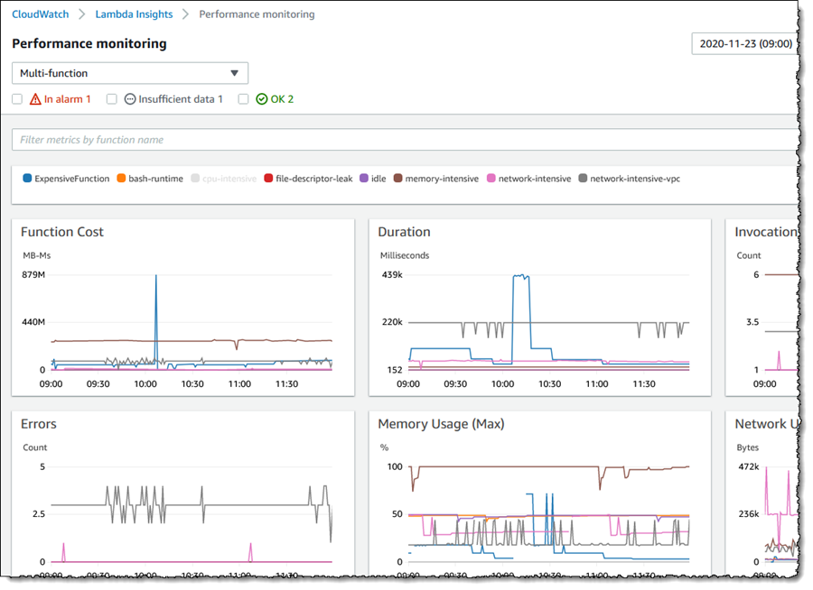
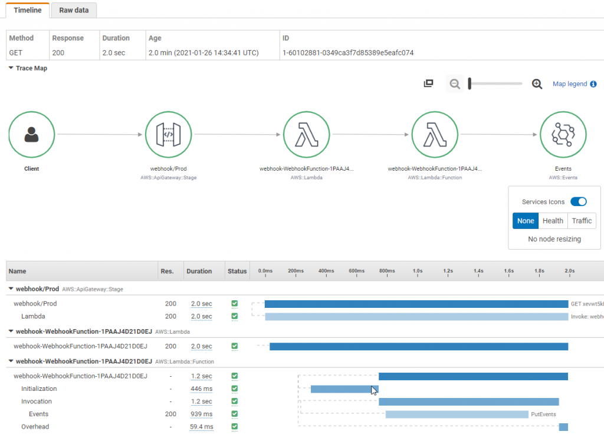

# AWS Lambda ベースのサーバーレスオブザーバビリティ

分散システムとサーバーレスコンピューティングの世界では、オブザーバビリティの実現がアプリケーションの信頼性とパフォーマンスを確保する鍵となります。
これは従来のモニタリング以上のものを含んでいます。
Amazon CloudWatch や AWS X-Ray などの AWS オブザーバビリティツールを活用することで、サーバーレスアプリケーションの洞察を得て、問題のトラブルシューティングを行い、アプリケーションのパフォーマンスを最適化できます。
このガイドでは、Lambda ベースのサーバーレスアプリケーションのオブザーバビリティを実装するための重要な概念、ツール、ベストプラクティスについて学びます。

インフラストラクチャやアプリケーションのオブザーバビリティを実装する前の最初のステップは、主要な目標を決定することです。
それは、ユーザーエクスペリエンスの向上、開発者の生産性の向上、Service Level Objective (SLO) の達成、ビジネス収益の増加、またはアプリケーションの種類に応じた他の特定の目標かもしれません。
したがって、これらの主要な目標を明確に定義し、それらをどのように測定するかを確立します。
そこから逆算してオブザーバビリティ戦略を設計します。
詳細については、「[重要なものをモニタリングする](/observability-best-practices/ja/guides/#monitor-what-matters)」を参照してください。


## オブザーバビリティの柱

オブザーバビリティには主に 3 つの柱があります：

* ログ：アプリケーションやシステム内で発生した個別のイベント（障害、エラー、状態変化など）の時刻付き記録
* メトリクス：様々な時間間隔で測定された数値データ（時系列データ）。SLI（リクエスト率、エラー率、所要時間、CPU 使用率など）
* トレース：複数のアプリケーションやシステム（通常はマイクロサービス）にまたがる単一ユーザーの行動を表現したもの

AWS は、AWS Lambda アプリケーションの実用的な洞察を得るために、ログ記録、メトリクスのモニタリング、トレーシングを容易にするネイティブおよびオープンソースのツールを提供しています。


## **ログ**

オブザーバビリティのベストプラクティスガイドのこのセクションでは、以下のトピックについて詳しく説明します：

* 非構造化ログと構造化ログ
* CloudWatch Logs Insights
* ログの相関 ID
* Lambda Powertools を使用したコードサンプル
* CloudWatch ダッシュボードを使用したログの可視化
* CloudWatch Logs の保持期間

ログは、アプリケーション内で発生した個別のイベントです。
これには、失敗、エラー、実行パス、またはその他のイベントが含まれる場合があります。
ログは、非構造化、半構造化、または構造化された形式で記録できます。


### **非構造化ログと構造化ログ**

開発者がアプリケーション内で `print` や `console.log` ステートメントを使用して単純なログメッセージを始めることがよくあります。
これらは、特に多くのログメッセージを異なるロググループにわたって生成する可能性のある AWS Lambda ベースのアプリケーションでは、大規模にプログラムで解析し分析するのが困難です。
その結果、CloudWatch でこれらのログを統合することは難しく、分析が困難になります。
ログ内の関連情報を見つけるには、テキストマッチや正規表現を使用する必要があります。
以下は非構造化ログの例です：

```
[2023-07-19T19:59:07Z]  INFO  Request started
[2023-07-19T19:59:07Z]  INFO  AccessDenied: Could not access resource
[2023-07-19T19:59:08Z]  INFO  Request finished
```

ご覧のように、ログメッセージには一貫した構造がないため、有用な洞察を得るのが難しくなっています。
また、コンテキスト情報を追加するのも困難です。

一方、構造化ログは、一貫したフォーマット（多くの場合 JSON）で情報をログに記録する方法です。
これにより、ログをテキストではなくデータとして扱うことができ、クエリとフィルタリングが簡単になります。
開発者はログをプログラムで効率的に保存、取得、分析することができます。
また、デバッグも容易になります。
構造化ログは、ログレベルを通じて異なる環境でのログの詳細度を簡単に変更する方法を提供します。
**ログレベルに注意を払ってください。**
過度にログを取ることはコストを増加させ、アプリケーションのスループットを低下させます。
ログを記録する前に、個人を特定できる情報が編集されていることを確認してください。
以下は構造化ログの例です：

```
{
   "correlationId": "9ac54d82-75e0-4f0d-ae3c-e84ca400b3bd",
   "requestId": "58d9c96e-ae9f-43db-a353-c48e7a70bfa8",
   "level": "INFO",
   "message": "AccessDenied",
   "function-name": "demo-observability-function",
   "cold-start": true
}
```

アプリケーションからトランザクション、異なるコンポーネント間の相関識別子、ビジネス結果に関する運用情報を出力するために、**`構造化され、CloudWatch logs に集中化されたログを優先してください`**。


### **CloudWatch Logs Insights**
CloudWatch Logs Insights を使用すると、JSON 形式のログのフィールドを自動的に検出できます。さらに、JSON ログを拡張して、アプリケーション固有のカスタムメタデータをログに記録することができます。これにより、ログの検索、フィルタリング、集計が可能になります。


### **相関 ID のロギング**

例えば、API Gateway から入ってくる HTTP リクエストの場合、相関 ID は `requestContext.requestId` パスに設定されます。これは Lambda Powertools を使用して、下流の Lambda 関数で簡単に抽出してログに記録できます。分散システムでは、多くの場合、複数のサービスやコンポーネントが連携してリクエストを処理します。そのため、相関 ID をログに記録し、下流のシステムに渡すことが、エンドツーエンドのトレースとデバッグに不可欠となります。相関 ID は、リクエストの最初の段階で割り当てられる一意の識別子です。リクエストが異なるサービスを通過する際、相関 ID がログに含まれることで、リクエストの全経路をトレースすることができます。AWS Lambda のログに相関 ID を手動で挿入するか、[AWS Lambda Powertools](https://docs.powertools.aws.dev/lambda/python/latest/core/logger/#setting-a-correlation-id) のようなツールを使用して、API Gateway から相関 ID を簡単に取得し、アプリケーションログと共に記録することができます。例えば、HTTP リクエストの相関 ID は、API Gateway で開始され、Lambda 関数などのバックエンドサービスに渡されるリクエスト ID とすることができます。


### **Lambda Powertools を使用したコードサンプル**

ベストプラクティスとして、リクエストのライフサイクルの早い段階で、できるだけ早く相関 ID を生成します。理想的には、API Gateway やアプリケーションロードバランサーなど、サーバーレスアプリケーションのエントリーポイントで生成します。UUID やリクエスト ID、または分散システム全体でリクエストを追跡するために使用できるその他のユニークな属性を使用してください。カスタムヘッダー、ボディ、またはメタデータの一部として、各リクエストと共に相関 ID を渡します。ダウンストリームサービスのすべてのログエントリーとトレースに相関 ID が含まれていることを確認してください。

Lambda 関数のログの一部として相関 ID を手動でキャプチャして含めるか、[AWS Lambda Powertools](https://docs.powertools.aws.dev/lambda/python/latest/core/logger/#setting-a-correlation-id) のようなツールを使用することができます。Lambda Powertools を使用すると、サポートされている上流サービスの事前定義されたリクエスト[パスマッピング](https://github.com/aws-powertools/powertools-lambda-python/blob/08a0a7b68d2844d36c33ab8156640f4ea9632d0c/aws_lambda_powertools/logging/correlation_paths.py)から相関 ID を簡単に取得し、アプリケーションログと共に自動的に追加することができます。また、障害が発生した場合に簡単にデバッグし、根本原因を特定して元のリクエストに結び付けられるように、すべてのエラーメッセージに相関 ID が追加されていることを確認してください。

以下のサーバーレスアーキテクチャにおける、相関 ID を含む構造化ログの例と、CloudWatch での表示方法を示すコードサンプルを見てみましょう：


```
// Logger の初期化
Logger log = LogManager.getLogger();

// Lambda Powertools の @Logger アノテーションを使用します。オプションのパラメータ correlationIdPath を使用して、API Gateway ヘッダーから相関 ID を抽出し、構造化された形式で Lambda 関数のログに correlation_id を挿入します。
@Logging(correlationIdPath = "/headers/path-to-correlation-id")
public APIGatewayProxyResponseEvent handleRequest(final APIGatewayProxyRequestEvent input, final Context context) {
  ...
  // 以下のログステートメントには、追加の correlation_id も含まれます
  log.info("Success")
  ...
}
```

この例では、Java ベースの Lambda 関数が Lambda Powertools ライブラリを使用して、API Gateway リクエストから来る `correlation_id` をログに記録しています。

コードサンプルの CloudWatch ログの例：

```
{
   "level": "INFO",
   "message": "Success",
   "function-name": "demo-observability-function",
   "cold-start": true,
   "lambda_request_id": "52fdfc07-2182-154f-163f-5f0f9a621d72",
   "correlation_id": "<correlation_id_value>"
}_
```


### **CloudWatch ダッシュボードを使用したログの可視化**

構造化された JSON 形式でデータをログに記録すると、[CloudWatch Logs Insights](https://docs.aws.amazon.com/ja_jp/AmazonCloudWatch/latest/logs/AnalyzingLogData.html) は自動的に JSON 出力の値を検出し、メッセージをフィールドとして解析します。
CloudWatch Logs Insights は、複数のログストリームを検索およびフィルタリングするための目的に特化した [SQL ライクなクエリ言語](https://serverlessland.com/snippets?type=CloudWatch+Logs+Insights) を提供します。
グロブや正規表現パターンマッチングを使用して、複数のロググループにわたるクエリを実行できます。
さらに、カスタムクエリを作成して保存し、毎回再作成することなく再実行することもできます。


CloudWatch Logs Insights では、1 つ以上の集計関数を使用してクエリから折れ線グラフ、棒グラフ、積み上げ面グラフなどの可視化を生成できます。
これらの可視化を CloudWatch ダッシュボードに簡単に追加できます。
以下のサンプルダッシュボードは、Lambda 関数の実行時間のパーセンタイルレポートを示しています。
このようなダッシュボードは、アプリケーションのパフォーマンス向上のためにどこに注力すべきかを素早く把握するのに役立ちます。
平均レイテンシーは良いメトリクスですが、**`平均レイテンシーではなく p99 の最適化を目指すべきです。`**


CloudWatch 以外の場所に (プラットフォーム、関数、拡張機能の) ログを送信するには、Lambda 拡張機能と共に [Lambda Telemetry API](https://docs.aws.amazon.com/ja_jp/lambda/latest/dg/telemetry-api.html) を使用できます。
多くの [パートナーソリューション](https://docs.aws.amazon.com/ja_jp/lambda/latest/dg/extensions-api-partners.html) が、Lambda Telemetry API を使用し、システムとの統合を容易にする Lambda レイヤーを提供しています。

CloudWatch Logs Insights を最大限に活用するには、構造化ログの形式でログに取り込むべきデータについて考え、それによってアプリケーションの健全性をより適切に監視できるようにすることが重要です。


### **CloudWatch Logs の保持期間**

デフォルトでは、Lambda 関数の標準出力に書き込まれたすべてのメッセージが Amazon CloudWatch のログストリームに保存されます。Lambda 関数の実行ロールには、CloudWatch ログストリームを作成し、ストリームにログイベントを書き込む権限が必要です。CloudWatch は取り込まれたデータ量と使用されたストレージ量に基づいて課金されるため、注意が必要です。したがって、ログの量を減らすことでコストを最小限に抑えることができます。**`デフォルトでは CloudWatch ログは無期限に保持され、有効期限が切れることはありません。ログストレージのコストを削減するために、ログ保持ポリシーを設定することをお勧めします`**。そして、すべてのロググループにそれを適用してください。環境ごとに異なる保持ポリシーを設定することもできます。ログの保持期間は AWS コンソールで手動で設定できますが、一貫性とベストプラクティスを確保するために、Infrastructure as Code (IaC) デプロイメントの一部として設定する必要があります。以下は、Lambda 関数のログ保持期間を設定する方法を示す CloudFormation テンプレートのサンプルです：

```
Resources:
  Function:
    Type: AWS::Serverless::Function
    Properties:
      CodeUri: .
      Runtime: python3.8
      Handler: main.handler
      Tracing: Active

  # Lambda 関数を参照する明示的なロググループ
  LogGroup:
    Type: AWS::Logs::LogGroup
    Properties:
      LogGroupName: !Sub "/aws/lambda/${Function}"
      # 明示的な保持期間
      RetentionInDays: 7
```

この例では、Lambda 関数と対応するロググループを作成しています。**`RetentionInDays`** プロパティは **7 日に設定**されており、このロググループ内のログは 7 日間保持された後、自動的に削除されます。これにより、ログストレージのコストを管理するのに役立ちます。


## **メトリクス**

オブザーバビリティのベストプラクティスガイドのこのセクションでは、以下のトピックについて詳しく説明します：

* すぐに使えるメトリクスの監視とアラート設定
* カスタムメトリクスの発行
* 埋め込みメトリクスを使用してログからメトリクスを自動生成
* CloudWatch Lambda Insights を使用してシステムレベルのメトリクスを監視
* CloudWatch アラームの作成


### **標準メトリクスの監視とアラート設定**

メトリクスは、様々な時間間隔で測定される数値データ（時系列データ）およびサービスレベルインジケータ（リクエスト率、エラー率、処理時間、CPU など）です。AWS サービスは、アプリケーションの運用状態を監視するために、多くの標準メトリクスを提供しています。アプリケーションに適用可能な主要メトリクスを確立し、それらを使用してアプリケーションのパフォーマンスを監視します。主要メトリクスの例としては、関数エラー、キューの深さ、ステートマシンの実行失敗、API レスポンス時間などがあります。

標準メトリクスの課題の 1 つは、CloudWatch ダッシュボードでそれらをどのように分析するかを知ることです。例えば、同時実行数を見る場合、最大値、平均値、またはパーセンタイルのどれを見るべきでしょうか？適切な統計情報は各メトリクスによって異なります。

ベストプラクティスとして、Lambda 関数の `ConcurrentExecutions` メトリクスでは、`Count` 統計を見て、アカウントおよびリージョンの制限、または適用可能な場合は Lambda の予約済み同時実行数の制限に近づいているかどうかを確認します。
`Duration` メトリクスは、関数がイベントを処理するのにかかる時間を示すため、`Average` または `Max` 統計を見ます。API のレイテンシーを測定する場合は、API Gateway の `Latency` メトリクスの `Percentile` 統計を見ます。P50、P90、P99 は平均値よりもレイテンシーを監視するためのはるかに優れた方法です。

監視すべきメトリクスがわかったら、アプリケーションのコンポーネントが不健全な場合に通知するように、これらの主要メトリクスにアラートを設定します。例えば：

* AWS Lambda の場合、Duration、Errors、Throttling、ConcurrentExecutions にアラートを設定します。ストリームベースの呼び出しの場合は、IteratorAge にアラートを設定します。非同期呼び出しの場合は、DeadLetterErrors にアラートを設定します。
* Amazon API Gateway の場合、IntegrationLatency、Latency、5XXError、4XXError にアラートを設定します。
* Amazon SQS の場合、ApproximateAgeOfOldestMessage、ApproximateNumberOfMessageVisible にアラートを設定します。
* AWS Step Functions の場合、ExecutionThrottled、ExecutionsFailed、ExecutionsTimedOut にアラートを設定します。


### **カスタムメトリクスの公開**

アプリケーションの望ましいビジネスおよび顧客成果に基づいて、主要業績評価指標（KPI）を特定します。KPI を評価して、アプリケーションの成功と運用の健全性を判断します。主要なメトリクスはアプリケーションの種類によって異なる場合がありますが、例としてサイト訪問数、注文数、購入されたフライト数、ページ読み込み時間、ユニークビジター数などがあります。

AWS CloudWatch にカスタムメトリクスを公開する一つの方法は、CloudWatch メトリクス SDK の `putMetricData` API を呼び出すことです。しかし、`putMetricData` API 呼び出しは同期的です。これにより Lambda 関数の実行時間が長くなり、アプリケーション内の他の API 呼び出しをブロックする可能性があり、パフォーマンスのボトルネックにつながる可能性があります。また、Lambda 関数の実行時間が長くなると、コストが高くなります。さらに、CloudWatch に送信されるカスタムメトリクスの数と、行われる API 呼び出し（つまり PutMetricData API 呼び出し）の数の両方に対して課金されます。

**`カスタムメトリクスを公開するより効率的でコスト効果の高い方法は`** [CloudWatch 埋め込みメトリクスフォーマット](https://docs.aws.amazon.com/ja_jp/AmazonCloudWatch/latest/monitoring/CloudWatch_Embedded_Metric_Format.html)（EMF）を使用することです。CloudWatch 埋め込みメトリクスフォーマットを使用すると、CloudWatch ログに書き込まれるログとして **`非同期に`** カスタムメトリクスを生成でき、アプリケーションのパフォーマンスが向上し、コストも低くなります。EMF を使用すると、詳細なログイベントデータと一緒にカスタムメトリクスを埋め込むことができ、CloudWatch は自動的にこれらのカスタムメトリクスを抽出して、標準のメトリクスと同様に可視化やアラームの設定ができます。埋め込みメトリクスフォーマットでログを送信することで、[CloudWatch Logs Insights](https://docs.aws.amazon.com/ja_jp/AmazonCloudWatch/latest/logs/AnalyzingLogData.html) を使用してクエリを実行でき、メトリクスのコストではなくクエリのコストのみを支払います。

これを実現するには、[EMF 仕様](https://docs.aws.amazon.com/ja_jp/AmazonCloudWatch/latest/monitoring/CloudWatch_Embedded_Metric_Format_Specification.html) を使用してログを生成し、`PutLogEvents` API を使用して CloudWatch に送信します。このプロセスを簡素化するために、**EMF フォーマットでメトリクスを作成するためのサポートを提供する 2 つのクライアントライブラリがあります**。

* 低レベルクライアントライブラリ（[aws-embedded-metrics](https://docs.aws.amazon.com/ja_jp/AmazonCloudWatch/latest/monitoring/CloudWatch_Embedded_Metric_Format_Libraries.html)）
* Lambda Powertools [Metrics](https://docs.powertools.aws.dev/lambda/java/core/metrics/)


### **[CloudWatch Lambda Insights](https://docs.aws.amazon.com/ja_jp/AmazonCloudWatch/latest/monitoring/Lambda-Insights.html) を使用してシステムレベルのメトリクスを監視する**

CloudWatch Lambda Insights は、CPU 時間、メモリ使用量、ディスク使用率、ネットワークパフォーマンスなどのシステムレベルのメトリクスを提供します。
Lambda Insights はまた、**`コールドスタート`** や Lambda ワーカーのシャットダウンなどの診断情報を収集、集約、要約します。
Lambda Insights は、Lambda レイヤーとしてパッケージ化された CloudWatch Lambda 拡張機能を活用しています。
有効にすると、システムレベルのメトリクスを収集し、その Lambda 関数の呼び出しごとに 1 つのパフォーマンスログイベントを埋め込みメトリクス形式で CloudWatch Logs に出力します。

:::note
    CloudWatch Lambda Insights はデフォルトでは有効になっておらず、Lambda 関数ごとに有効にする必要があります。
:::

AWS コンソールまたは Infrastructure as Code (IaC) を通じて有効にすることができます。
以下は、AWS サーバーレスアプリケーションモデル (SAM) を使用して有効にする例です。
Lambda 関数に `LambdaInsightsExtension` 拡張レイヤーを追加し、また管理された IAM ポリシー `CloudWatchLambdaInsightsExecutionRolePolicy` を追加します。
これにより、Lambda 関数にログストリームを作成し、`PutLogEvents` API を呼び出してログを書き込む権限が与えられます。

```
// 関数リソースに LambdaInsightsExtension レイヤーを追加
Resources:
  MyFunction:
    Type: AWS::Serverless::Function
    Properties:
      Layers:
        - !Sub "arn:aws:lambda:${AWS::Region}:580247275435:layer:LambdaInsightsExtension:14"
        
// Lambda 関数が CloudWatch にログを書き込めるように IAM ポリシーを追加
Resources:
  MyFunction:
    Type: AWS::Serverless::Function
    Properties:
      Policies:
        - `CloudWatchLambdaInsightsExecutionRolePolicy`
```

その後、CloudWatch コンソールを使用して、Lambda Insights の下でこれらのシステムレベルのパフォーマンスメトリクスを表示できます。




### **CloudWatch アラームの作成**

CloudWatch アラームを作成し、メトリクスが閾値を超えた際に必要なアクションを取ることは、オブザーバビリティの重要な部分です。Amazon [CloudWatch アラーム](https://docs.aws.amazon.com/ja_jp/AmazonCloudWatch/latest/monitoring/AlarmThatSendsEmail.html) は、アプリケーションやインフラストラクチャのメトリクスが静的または動的に設定された閾値を超えた場合に、通知や自動修復アクションを実行するために使用されます。

メトリクスのアラームを設定するには、一連のアクションをトリガーする閾値を選択します。固定の閾値は静的閾値として知られています。例えば、Lambda 関数の `Throttles` メトリクスに対して、5 分間の 10% 以上の時間でスロットリングが発生した場合にアラームを発生させるように設定できます。これは、Lambda 関数がそのアカウントとリージョンの最大同時実行数に達した可能性があることを示唆しています。

サーバーレスアプリケーションでは、SNS (Simple Notification Service) を使用してアラートを送信するのが一般的です。これにより、ユーザーはメール、SMS、その他のチャネルを通じてアラートを受け取ることができます。さらに、SNS トピックに Lambda 関数をサブスクライブすることで、アラームを発生させた問題を自動的に修復することができます。

例えば、Lambda 関数 A が SQS キューをポーリングし、ダウンストリームサービスを呼び出しているとします。ダウンストリームサービスがダウンして応答しない場合、Lambda 関数 A は SQS からのポーリングを続け、失敗しながらダウンストリームサービスの呼び出しを試み続けます。これらのエラーを監視し、CloudWatch アラームを生成して SNS で適切なチームに通知することもできますが、別の Lambda 関数 B (SNS サブスクリプション経由) を呼び出して、Lambda 関数 A のイベントソースマッピングを無効にし、ダウンストリームサービスが復旧するまで SQS キューからのポーリングを停止することもできます。

個々のメトリクスにアラームを設定することは良いですが、アプリケーションの運用状態とパフォーマンスをより良く理解するために、複数のメトリクスを監視する必要がある場合があります。このようなシナリオでは、[Metric Math](https://docs.aws.amazon.com/ja_jp/AmazonCloudWatch/latest/monitoring/using-metric-math.html) 式を使用して複数のメトリクスに基づくアラームを設定する必要があります。

例えば、AWS Lambda のエラーを監視したいが、少数のエラーではアラームをトリガーしたくない場合、パーセンテージ形式のエラー率式を作成できます。つまり、ErrorRate = errors / invocation * 100 という式を作成し、設定された評価期間内に ErrorRate が 20% を超えた場合にアラートを送信するアラームを作成します。


## **トレーシング**

オブザーバビリティのベストプラクティスガイドのこのセクションでは、以下のトピックについて詳しく説明します：

* 分散トレーシングと AWS X-Ray の紹介
* 適切なサンプリングルールの適用
* X-Ray SDK を使用して他のサービスとの相互作用をトレースする
* X-Ray SDK を使用した統合サービスのトレーシングのコードサンプル


### 分散トレーシングと AWS X-Ray の概要

ほとんどのサーバーレスアプリケーションは、複数のマイクロサービスで構成され、それぞれが複数の AWS サービスを使用しています。サーバーレスアーキテクチャの性質上、分散トレーシングが不可欠です。効果的なパフォーマンス監視とエラー追跡のためには、ソース呼び出し元からすべてのダウンストリームサービスまで、アプリケーションフロー全体でトランザクションをトレースすることが重要です。個々のサービスのログを使用してこれを実現することは可能ですが、AWS X-Ray のようなトレーシングツールを使用する方が迅速かつ効率的です。詳細については、[AWS X-Ray を使用したアプリケーションの計測](https://docs.aws.amazon.com/ja_jp/xray/latest/devguide/xray-instrumenting-your-app.html) をご覧ください。

AWS X-Ray を使用すると、関連するマイクロサービスを通じてリクエストをトレースできます。X-Ray サービスマップを使用すると、さまざまな統合ポイントを理解し、アプリケーションのパフォーマンス低下を特定できます。数回のクリックで、アプリケーションのどのコンポーネントがエラー、スロットリング、またはレイテンシーの問題を引き起こしているかを迅速に特定できます。サービスグラフの下で、個々のトレースを確認して、各マイクロサービスにかかる正確な時間を特定することもできます。



**`ベストプラクティスとして、ダウンストリーム呼び出しや監視が必要な特定の機能に対してカスタムサブセグメントをコードに作成します`**。例えば、外部の HTTP API 呼び出しや SQL データベースクエリを監視するためのサブセグメントを作成できます。

例えば、ダウンストリームサービスを呼び出す関数にカスタムサブセグメントを作成するには、`captureAsyncFunc` 関数（node.js の場合）を使用します。

```
var AWSXRay = require('aws-xray-sdk');

app.use(AWSXRay.express.openSegment('MyApp'));

app.get('/', function (req, res) {
  var host = 'api.example.com';

  // サブセグメントの開始
  AWSXRay.captureAsyncFunc('send', function(subsegment) {
    sendRequest(host, function() {
      console.log('rendering!');
      res.render('index');

      // サブセグメントの終了
      subsegment.close();
    });
  });
});
```

この例では、アプリケーションは `sendRequest` 関数の呼び出しに対して `send` という名前のカスタムサブセグメントを作成します。`captureAsyncFunc` は、非同期呼び出しが完了したときにコールバック関数内で閉じる必要があるサブセグメントを渡します。


### **適切なサンプリングルールを適用する**

AWS X-Ray SDK は、デフォルトではすべてのリクエストをトレースしません。高コストを発生させることなく、リクエストの代表的なサンプルを提供するために、控えめなサンプリングルールを適用しています。ただし、特定の要件に基づいて、デフォルトのサンプリングルールを[カスタマイズ](https://docs.aws.amazon.com/ja_jp/xray/latest/devguide/xray-console-sampling.html)したり、サンプリングを完全に無効にしてすべてのリクエストのトレースを開始したりすることができます。

AWS X-Ray は監査やコンプライアンスツールとして使用することを意図していないことに注意することが重要です。**`アプリケーションのタイプごとに異なるサンプリングレートを設定する`**ことを検討すべきです。例えば、バックグラウンドポーリングやヘルスチェックなどの大量の読み取り専用呼び出しは、潜在的な問題を特定するのに十分なデータを提供しながら、より低いレートでサンプリングすることができます。また、**`環境ごとに異なるサンプリングレートを設定する`**ことも考えられます。例えば、開発環境ではエラーやパフォーマンスの問題を簡単にトラブルシューティングするために、すべてのリクエストをトレースしたいかもしれませんが、本番環境ではトレース数を少なくすることができます。**`広範囲なトレースはコストの増加につながる可能性があることも念頭に置く必要があります`**。サンプリングルールの詳細については、[_X-Ray コンソールでのサンプリングルールの設定_](https://docs.aws.amazon.com/ja_jp/xray/latest/devguide/xray-console-sampling.html)を参照してください。


### **X-Ray SDK を使用して他の AWS サービスとの相互作用をトレースする**

X-Ray トレースは、AWS Lambda や Amazon API Gateway などのサービスでは、数回のクリックや Infrastructure as Code (IaC) ツールの数行のコードで簡単に有効化できます。しかし、他のサービスではコードを計装するために追加の手順が必要です。[X-Ray と統合された AWS サービスの完全なリスト](https://docs.aws.amazon.com/ja_jp/xray/latest/devguide/xray-services.html)はこちらでご確認いただけます。

DynamoDB のような X-Ray と統合されていないサービスへの呼び出しを計装するには、AWS X-Ray SDK で AWS SDK 呼び出しをラップしてトレースをキャプチャできます。例えば、Node.js を使用する場合、以下のコード例に従って全ての AWS SDK 呼び出しをキャプチャできます：


### **X-Ray SDK を使用して統合されたサービスをトレースするためのコードサンプル**

```
//... 変更前 (旧コード)
const AWS = require('aws-sdk');

//... 変更後 (新コード)
const AWSXRay = require('aws-xray-sdk-core');
const AWS = AWSXRay.captureAWS(require('aws-sdk'));
...
```

:::note
    個別のクライアントを計測するには、AWS SDK クライアントを `AWSXRay.captureAWSClient` の呼び出しでラップします。`captureAWS` と `captureAWSClient` を一緒に使用しないでください。これにより重複したトレースが発生します。
:::


## **追加リソース**

[CloudWatch Logs Insights](https://docs.aws.amazon.com/ja_jp/AmazonCloudWatch/latest/logs/AnalyzingLogData.html)

[CloudWatch Lambda Insights](https://docs.aws.amazon.com/ja_jp/AmazonCloudWatch/latest/monitoring/Lambda-Insights.html)

[Embedded Metrics Library](https://github.com/awslabs/aws-embedded-metrics-java)


## まとめ

AWS Lambda ベースのサーバーレスアプリケーションに関するこのオブザーバビリティのベストプラクティスガイドでは、Amazon CloudWatch や AWS X-Ray などのネイティブ AWS サービスを使用したロギング、メトリクス、トレーシングなどの重要な側面を強調しました。アプリケーションにオブザーバビリティのベストプラクティスを簡単に追加するために、AWS Lambda Powertools ライブラリの使用を推奨しました。これらのベストプラクティスを採用することで、サーバーレスアプリケーションに関する貴重な洞察を得ることができ、エラーの迅速な検出とパフォーマンスの最適化が可能になります。

さらに深く掘り下げるために、AWS [One Observability Workshop](https://catalog.workshops.aws/observability/en-US) の AWS ネイティブオブザーバビリティモジュールを実践することを強くお勧めします。
