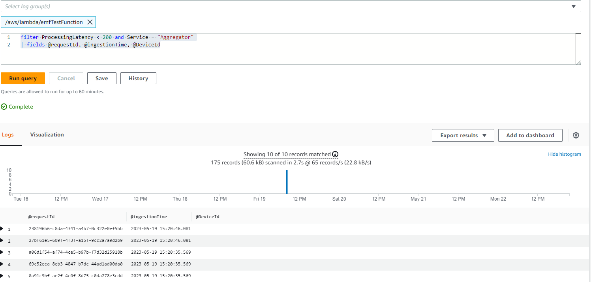

# CloudWatch 埋め込みメトリクスフォーマット


## はじめに

CloudWatch Embedded Metric Format (EMF) を使用すると、お客様は複雑な高カーディナリティのアプリケーションデータをログの形式で Amazon CloudWatch に取り込み、アクションにつながるメトリクスを生成できます。
Embedded Metric Format を使用することで、お客様は環境に関する洞察を得るために複雑なアーキテクチャやサードパーティのツールに頼る必要がありません。
この機能はすべての環境で使用できますが、特に AWS Lambda 関数や Amazon Elastic Container Service (Amazon ECS)、Amazon Elastic Kubernetes Service (Amazon EKS)、EC2 上の Kubernetes などの一時的なリソースを持つワークロードで特に有用です。
Embedded Metric Format を使用すると、お客様は別個のコードを実装したり維持したりすることなく、カスタムメトリクスを簡単に作成でき、同時にログデータに対する強力な分析機能を得ることができます。


## Embedded Metric Format (EMF) ログの仕組み

Amazon EC2、オンプレミスサーバー、Amazon Elastic Container Service (Amazon ECS)、Amazon Elastic Kubernetes Service (Amazon EKS)、または EC2 上の Kubernetes などのコンピューティング環境は、CloudWatch エージェントを通じて Embedded Metric Format (EMF) ログを生成し、Amazon CloudWatch に送信できます。

AWS Lambda を使用すると、カスタムコードを必要とせず、ブロッキングネットワーク呼び出しを行わず、サードパーティのソフトウェアに依存することなく、簡単にカスタムメトリクスを生成し、Embedded Metric Format (EMF) ログを Amazon CloudWatch に取り込むことができます。

お客様は、[EMF 仕様](https://docs.aws.amazon.com/ja_jp/AmazonCloudWatch/latest/monitoring/CloudWatch_Embedded_Metric_Format_Specification.html)に準拠した構造化ログを公開する際に、特別なヘッダー宣言を提供する必要なく、詳細なログイベントデータと共にカスタムメトリクスを非同期で埋め込むことができます。CloudWatch は自動的にカスタムメトリクスを抽出するため、お客様はリアルタイムのインシデント検出のためにメトリクスを可視化し、アラームを設定できます。抽出されたメトリクスに関連する詳細なログイベントと高カーディナリティのコンテキストは、CloudWatch Logs Insights を使用してクエリを実行し、運用イベントの根本原因に関する深い洞察を提供できます。

[Fluent Bit](https://docs.fluentbit.io/manual/pipeline/outputs/cloudwatch) 用の Amazon CloudWatch 出力プラグインを使用すると、お客様は [Embedded Metric Format](https://github.com/aws/aws-for-fluent-bit) (EMF) のサポートを含む Amazon CloudWatch サービスにメトリクスとログデータを取り込むことができます。


## Embedded Metric Format (EMF) ログを使用するタイミング

従来、モニタリングは 3 つのカテゴリに分類されていました。第一のカテゴリは、アプリケーションの古典的なヘルスチェックです。第二のカテゴリは「メトリクス」で、顧客はカウンター、タイマー、ゲージなどのモデルを使用してアプリケーションを計測します。第三のカテゴリは「ログ」で、アプリケーションの全体的なオブザーバビリティに不可欠です。ログは、アプリケーションの動作に関する継続的な情報を顧客に提供します。現在、顧客は Embedded Metric Format (EMF) ログを通じて、データの粒度や豊かさを犠牲にすることなく、アプリケーションの観測方法を大幅に改善する方法を手に入れました。これにより、アプリケーションのすべての計測を統合・簡素化しながら、信じられないほどの分析能力を獲得できます。

[Embedded Metric Format (EMF) ログ](https://aws.amazon.com/blogs/mt/enhancing-workload-observability-using-amazon-cloudwatch-embedded-metric-format/) は、メトリクスのディメンションを増やすことなく、EMF ログの一部として高カーディナリティのアプリケーションデータを生成する環境に最適です。これにより、顧客は CloudWatch Logs Insights や CloudWatch Metrics Insights を通じて EMF ログをクエリすることで、すべての属性をメトリクスのディメンションとして設定する必要なく、アプリケーションデータを自由に分析できます。

[数百万の通信機器や IoT デバイスからテレメトリデータを集約](https://aws.amazon.com/blogs/mt/how-bt-uses-amazon-cloudwatch-to-monitor-millions-of-devices/) する顧客は、デバイスのパフォーマンスに関する洞察と、デバイスが報告するユニークなテレメトリをすばやく深く掘り下げる能力を必要としています。また、質の高いサービスを提供するために、膨大なデータを掘り起こすことなく、問題をより簡単かつ迅速にトラブルシューティングする必要があります。Embedded Metric Format (EMF) ログを使用することで、顧客はメトリクスとログを単一のエンティティに結合して大規模なオブザーバビリティを実現し、コスト効率と優れたパフォーマンスでトラブルシューティングを改善できます。


## 埋め込みメトリクスフォーマット (EMF) ログの生成

埋め込みメトリクスフォーマットログを生成するには、以下の方法を使用できます。

1. オープンソースのクライアントライブラリを使用して、エージェント（[CloudWatch](https://docs.aws.amazon.com/ja_jp/AmazonCloudWatch/latest/monitoring/CloudWatch_Embedded_Metric_Format_Generation_CloudWatch_Agent.html) や Fluent-Bit、Firelens など）を通じて EMF ログを生成し送信する。

   - EMF ログを作成するために使用できるオープンソースのクライアントライブラリが、以下の言語で利用可能です：
     - [Node.Js](https://github.com/awslabs/aws-embedded-metrics-node)
     - [Python](https://github.com/awslabs/aws-embedded-metrics-python)
     - [Java](https://github.com/awslabs/aws-embedded-metrics-java)
     - [C#](https://github.com/awslabs/aws-embedded-metrics-dotnet)
   - AWS Distro for OpenTelemetry (ADOT) を使用して EMF ログを生成できます。ADOT は、Cloud Native Computing Foundation (CNCF) の一部である OpenTelemetry プロジェクトの、安全で本番環境に対応した AWS サポートの配布版です。OpenTelemetry は、アプリケーションモニタリングのための分散トレース、ログ、メトリクスを収集する API、ライブラリ、エージェントを提供し、ベンダー固有のフォーマット間の境界や制限を取り除くオープンソースイニシアチブです。これには、OpenTelemetry 準拠のデータソースと、[CloudWatch EMF](https://aws-otel.github.io/docs/getting-started/cloudwatch-metrics#cloudwatch-emf-exporter-awsemf) ログで使用するための [ADOT Collector](https://github.com/open-telemetry/opentelemetry-collector-contrib/tree/main/exporter/awsemfexporter) の 2 つのコンポーネントが必要です。

2. [定義された JSON 形式の仕様](https://docs.aws.amazon.com/ja_jp/AmazonCloudWatch/latest/monitoring/CloudWatch_Embedded_Metric_Format_Specification.html) に準拠して手動で構築されたログを、[CloudWatch エージェント](https://docs.aws.amazon.com/ja_jp/AmazonCloudWatch/latest/monitoring/CloudWatch_Embedded_Metric_Format_Generation_CloudWatch_Agent.html) または [PutLogEvents API](https://docs.aws.amazon.com/ja_jp/AmazonCloudWatch/latest/monitoring/CloudWatch_Embedded_Metric_Format_Generation_PutLogEvents.html) を通じて CloudWatch に送信できます。


## CloudWatch コンソールで Embedded Metric Format ログを表示する

Embedded Metric Format (EMF) ログを生成してメトリクスを抽出した後、お客様は [CloudWatch コンソールでそれらを表示](https://docs.aws.amazon.com/ja_jp/AmazonCloudWatch/latest/monitoring/CloudWatch_Embedded_Metric_Format_View.html) できます。埋め込みメトリクスには、ログ生成時に指定されたディメンションがあります。クライアントライブラリを使用して生成された埋め込みメトリクスには、デフォルトのディメンションとして ServiceType、ServiceName、LogGroup があります。

- **ServiceName**: サービス名は上書きされますが、名前を推測できないサービス（例：EC2 で実行される Java プロセス）の場合、明示的に設定されていなければデフォルト値として Unknown が使用されます。
- **ServiceType**: サービスタイプは上書きされますが、タイプを推測できないサービス（例：EC2 で実行される Java プロセス）の場合、明示的に設定されていなければデフォルト値として Unknown が使用されます。
- **LogGroupName**: エージェントベースのプラットフォームでは、お客様はオプションでメトリクスを配信する先のロググループを設定できます。この値は、埋め込みメトリクスのペイロードでライブラリからエージェントに渡されます。LogGroup が提供されない場合、デフォルト値はサービス名から派生します：-metrics
- **LogStreamName**: エージェントベースのプラットフォームでは、お客様はオプションでメトリクスを配信する先のログストリームを設定できます。この値は、埋め込みメトリクスのペイロードでライブラリからエージェントに渡されます。LogStreamName が提供されない場合、デフォルト値はエージェントによって派生します（通常はホスト名になります）。
- **NameSpace**: CloudWatch の名前空間を上書きします。設定されていない場合、デフォルト値として aws-embedded-metrics が使用されます。

CloudWatch コンソールログでの EMF ログのサンプルは以下のようになります。

```json
2023-05-19T15:20:39.391Z 238196b6-c8da-4341-a4b7-0c322e0ef5bb INFO
{
    "LogGroup": "emfTestFunction",
    "ServiceName": "emfTestFunction",
    "ServiceType": "AWS::Lambda::Function",
    "Service": "Aggregator",
    "AccountId": "XXXXXXXXXXXX",
    "RequestId": "422b1569-16f6-4a03-b8f0-fe3fd9b100f8",
    "DeviceId": "61270781-c6ac-46f1-baf7-22c808af8162",
    "Payload": {
        "sampleTime": 123456789,
        "temperature": 273,
        "pressure": 101.3
    },
    "executionEnvironment": "AWS_Lambda_nodejs18.x",
    "memorySize": "256",
    "functionVersion": "$LATEST",
    "logStreamId": "2023/05/19/[$LATEST]f3377848231140c185570caa9f97abc8",
    "_aws": {
        "Timestamp": 1684509639390,
        "CloudWatchMetrics": [
            {
                "Dimensions": [
                    [
                        "LogGroup",
                        "ServiceName",
                        "ServiceType",
                        "Service"
                    ]
                ],
                "Metrics": [
                    {
                        "Name": "ProcessingLatency",
                        "Unit": "Milliseconds"
                    }
                ],
                "Namespace": "aws-embedded-metrics"
            }
        ]
    },
    "ProcessingLatency": 100
}
```

同じ EMF ログに対して、抽出されたメトリクスは以下のようになり、**CloudWatch Metrics** で照会できます。


お客様は **CloudWatch Logs Insights** を使用して、抽出されたメトリクスに関連する詳細なログイベントを照会し、運用イベントの根本原因について深い洞察を得ることができます。EMF ログからメトリクスを抽出することの利点の 1 つは、お客様が一意のメトリクス（メトリクス名プラス一意のディメンションセット）とメトリクス値でログをフィルタリングし、集計されたメトリクス値に寄与したイベントのコンテキストを取得できることです。

上記で説明した同じ EMF ログに対して、ProcessingLatency をメトリクスとし、Service をディメンションとして影響を受けたリクエスト ID またはデバイス ID を取得する例クエリを、CloudWatch Logs Insights のサンプルクエリとして以下に示します。

```json
filter ProcessingLatency < 200 and Service = "Aggregator"
| fields @requestId, @ingestionTime, @DeviceId
```




## EMF ログで作成されたメトリクスに対するアラーム

[EMF で生成されたメトリクスに対するアラーム](https://docs.aws.amazon.com/ja_jp/AmazonCloudWatch/latest/monitoring/CloudWatch_Embedded_Metric_Format_Alarms.html) の作成は、他のメトリクスに対するアラームの作成と同じパターンに従います。
ここで注意すべき重要な点は、EMF メトリクスの生成がログの公開フローに依存していることです。
これは、CloudWatch Logs が EMF ログを処理してメトリクスに変換するためです。
したがって、アラームが評価される期間内にメトリクスのデータポイントが作成されるように、タイムリーにログを公開することが重要です。

上記で説明した EMF ログと同じものについて、ProcessingLatency メトリクスをデータポイントとして使用し、しきい値を設定したアラームの例を以下に示します。


## EMF ログの最新機能

お客様は [PutLogEvents API](https://docs.aws.amazon.com/ja_jp/AmazonCloudWatch/latest/monitoring/CloudWatch_Embedded_Metric_Format_Generation_PutLogEvents.html) を使用して EMF ログを CloudWatch Logs に送信できます。以前は必要だった HTTP ヘッダー `x-amzn-logs-format: json/emf` を含めてメトリクスを抽出するよう CloudWatch Logs に指示することは、もはや必要ありません。

Amazon CloudWatch は、Embedded Metric Format (EMF) を使用した構造化ログから、最大 1 秒の粒度で[高解像度メトリクス抽出](https://aws.amazon.com/jp/about-aws/whats-new/2023/02/amazon-cloudwatch-high-resolution-metric-extraction-structured-logs/)をサポートしています。お客様は EMF 仕様ログ内でオプションの [StorageResolution](https://docs.aws.amazon.com/ja_jp/AmazonCloudWatch/latest/monitoring/cloudwatch_concepts.html) パラメータを、1 または 60（デフォルト）の値で提供し、メトリクスの希望する解像度（秒単位）を指定できます。お客様は EMF を通じて標準解像度（60 秒）と高解像度（1 秒）の両方のメトリクスを公開でき、アプリケーションの健全性とパフォーマンスをきめ細かく可視化できます。

Amazon CloudWatch は、Embedded Metric Format (EMF) のエラーに対して[強化された可視性](https://aws.amazon.com/jp/about-aws/whats-new/2023/01/amazon-cloudwatch-enhanced-error-visibility-embedded-metric-format-emf/)を 2 つのエラーメトリクス（[EMFValidationErrors と EMFParsingErrors](https://docs.aws.amazon.com/ja_jp/AmazonCloudWatch/latest/logs/CloudWatch-Logs-Monitoring-CloudWatch-Metrics.html)）で提供します。この強化された可視性により、お客様は EMF を活用する際のエラーを迅速に特定して修正でき、計装プロセスが簡素化されます。

現代のアプリケーション管理の複雑さが増す中、お客様はカスタムメトリクスの定義と分析においてより柔軟性を必要としています。そのため、メトリクスディメンションの最大数が 10 から 30 に増加しました。お客様は [EMF ログを使用して最大 30 のディメンションを持つカスタムメトリクス](https://aws.amazon.com/jp/about-aws/whats-new/2022/08/amazon-cloudwatch-metrics-increases-throughput/)を作成できます。


## 追加の参考資料:

- One Observability Workshop の [AWS Lambda 関数での Embedded Metric Format](https://catalog.workshops.aws/observability/en-US/aws-native/metrics/emf/clientlibrary) サンプル (NodeJS ライブラリを使用)
- Serverless Observability Workshop の [Embedded Metrics Format (EMF) を使用した非同期メトリクス](https://serverless-observability.workshop.aws/en/030_cloudwatch/async_metrics_emf.html)
- [PutLogEvents API を使用した Java コードサンプル](https://catalog.workshops.aws/observability/en-US/aws-native/metrics/emf/putlogevents) (EMF ログを CloudWatch Logs に送信)
- ブログ記事: [Amazon CloudWatch の埋め込みカスタムメトリクスによるコスト削減と顧客重視](https://aws.amazon.com/blogs/mt/lowering-costs-and-focusing-on-our-customers-with-amazon-cloudwatch-embedded-custom-metrics/)
