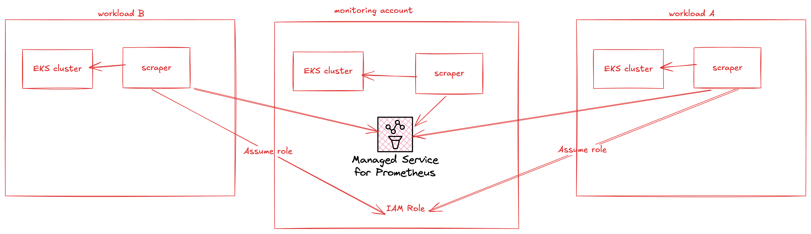

# Amazon Managed Prometheus クロスアカウントスクレイピング

Amazon Managed Service for Prometheus は、フルマネージド型のエージェントレススクレイパー、またはコレクターを提供し、Prometheus 互換のメトリクスを自動的に検出してプルします。エージェントやスクレイパーを管理、インストール、パッチ適用、または保守する必要はありません。Amazon Managed Service for Prometheus コレクターは、Amazon EKS クラスターに対して信頼性が高く、安定した、高可用性で、自動的にスケールするメトリクスの収集を提供します。Amazon Managed Service for Prometheus マネージドコレクターは、EC2 と Fargate を含む Amazon EKS クラスターで動作します。

Amazon Managed Service for Prometheus コレクターは、スクレイパーの作成時に指定されたサブネットごとに Elastic Network Interface (ENI) を作成します。コレクターはこれらの ENI を通じてメトリクスをスクレイピングし、remote_write を使用して VPC エンドポイント経由で Amazon Managed Service for Prometheus ワークスペースにデータをプッシュします。スクレイピングされたデータは、パブリックインターネット上を通過することはありません。

メトリクスを収集する Amazon EKS クラスターが、Amazon Managed Service for Prometheus ワークスペース (ターゲットアカウント) とは異なるアカウント (ソースアカウント) にある場合のクロスアカウント設定でスクレイパーを作成するには、以下の手順を使用します。

## 高レベルアーキテクチャ


*図 1: AMP マネージドコレクタークロスアカウントスクレイピング、コレクターインフラストラクチャは AWS によって完全に管理されます*

このアーキテクチャでは、EKS ワークロードが存在するアカウントにスクレイパーを作成します。スクレイパーは、ターゲットアカウントの AMP ワークスペースにデータをプッシュするために、ターゲットアカウントのロールを引き受けることができます。

1. ソースアカウントで、STS::AssumeRole 権限を持つロール arn:aws:iam::account_id_source:role/Source を作成し、以下の信頼ポリシーを追加します。

```
{
    "Version": "2012-10-17",
    "Statement": [
        {
            "Sid": "",
            "Effect": "Allow",
            "Principal": {
                "Service": "scraper.aps.amazonaws.com"
            },
            "Action": "sts:AssumeRole",
            "Condition": {
                "ArnEquals": {
                    "aws:SourceArn": "$SCRAPER_ARN"
                },
                "StringEquals": {
                    "AWS:SourceAccount": "$ACCOUNT_ID"
                }
            }
        }
    ]
}
```

ロールを引き受けるためのアクセス許可ポリシーも必要です。

```
{
    "Version": "2012-10-17",
    "Statement": [
        {
            "Sid": "VisualEditor0",
            "Effect": "Allow",
            "Action": "sts:AssumeRole",
            "Resource": "$TARGET_ACCOUNT_ROLE_ARN"
        }
    ]
}
```

:::warning

スクレイパーを実際に作成する前に、IAM コンストラクトを作成する必要があります。したがって、この時点では $SCRAPER_ARN は単なるプレースホルダーフィールドです。スクレイパーを作成した後、戻ってこれを更新します。$TARGET_ACCOUNT_ROLE_ARN もステップ 2 が完了するまで存在しません。

:::

2. ソース (Amazon EKS クラスター) とターゲット (Amazon Managed Service for Prometheus ワークスペース) のすべての組み合わせにおいて、ターゲットアカウントに arn:aws:iam::account_id_target:role/Target のロールを作成し、AmazonPrometheusRemoteWriteAccess のマネージド許可ポリシーを持つ以下の信頼ポリシーを追加する必要があります。

```
{
  "Effect": "Allow",
  "Principal": {
     "AWS": "arn:aws:iam::account_id_source:role/Source"
  },
  "Action": "sts:AssumeRole",
  "Condition": {
     "StringEquals": {
        "sts:ExternalId": "$SCRAPER_ARN"
      }
  }
}
```

:::warning

$SCRAPER_ARN はまだプレースホルダーです。スクレイパーを作成した後に値を更新します。

:::

3. ソースアカウント (EKS クラスターが存在する場所) でスクレイパーを作成します。 `--role-configuration` オプション。

```
aws amp create-scraper \
  --source eksConfiguration="{clusterArn='arn:aws:eks:us-west-2:$SOURCE_ACCOUNT_ID:cluster/$CLUSTER_NAME',subnetIds=[$EKS_SUBNET_IDS]}" \
  --scrape-configuration configurationBlob=<base64-encoded-blob> \
  --destination ampConfiguration="{workspaceArn='arn:aws:aps:us-west-2:$TARGET_ACCOUNT_ID:workspace/$TARGET_AMP_WORKSPACE_ID'}"\
  --role-configuration '{"sourceRoleArn":"arn:aws:iam::$SOURCE_ACCOUNT_ID:role/Source", "targetRoleArn":"arn:aws:iam::$TARGET_ACCOUNT_ID:role/Target"}'
```
:::warning

$VARIABLES には、お客様固有の値を入力してください。

:::

4. スクレイパーの作成を検証し (これには約 20 分かかる場合があります)、スクレイパー ARN をメモします。

```
aws amp list-scrapers
{
    "scrapers": [
        {
            "scraperId": "scraper-id",
            "arn": "arn:aws:aps:us-west-2:account_id_source:scraper/scraper-id",
            "roleArn": "arn:aws:iam::account_id_source:role/aws-service-role/scraper.aps.amazonaws.com/AWSServiceRoleForAmazonPrometheusScraperInternal_cc319052-41a3-4",
            "status": {
                "statusCode": "ACTIVE"
            },
            "createdAt": "2024-10-29T16:37:58.789000+00:00",
            "lastModifiedAt": "2024-10-29T16:55:17.085000+00:00",
            "tags": {},
            "source": {
                "eksConfiguration": {
                    "clusterArn": "arn:aws:eks:us-west-2:account_id_source:cluster/xarw",
                    "securityGroupIds": [
                        "sg-security-group-id",
                        "sg-security-group-id"
                    ],
                    "subnetIds": [
                        "subnet-subnet_id"
                    ]
                }
            },
            "destination": {
                "ampConfiguration": {
                    "workspaceArn": "arn:aws:aps:us-west-2:account_id_target:workspace/ws-workspace-id"
                }
            }
        }
```

5. 戻って、ステップ 4 のコマンドから取得したスクレイパー ARN 値を使用して、ステップ 1 と 2 で作成した信頼ポリシーを更新します。
