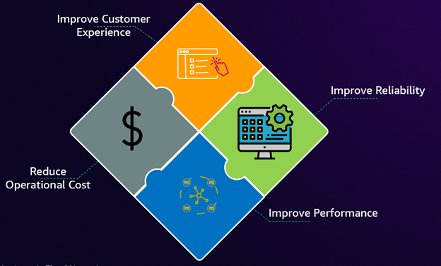
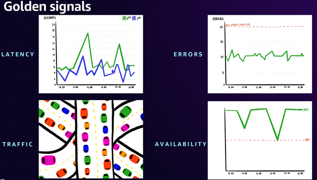

# リーダーとエグゼクティブ

今日のデジタルファーストの経済において、ビジネスパフォーマンスと技術運用の境界は消失しています。IT リーダーは複数の面で高まるプレッシャーに直面しています。収益源に直接影響を与えるデジタルサービス、信頼性に対する前例のない顧客の期待、技術的な回復力に依存する競争優位性、そしてより高い運用の透明性を要求する規制要件です。この収束により、IT リーダーは効果的なオブザーバビリティ戦略を通じて、運用の卓越性と具体的なビジネス価値の創出の両方を実証する必要があります。

---

これらの課題を踏まえ、組織はオブザーバビリティを技術的なオーバーヘッドとして捉えるのではなく、定量化可能なリターンを伴う戦略的投資として扱うことへとシフトする必要があります。IT リーダーは、オブザーバビリティへの取り組みが、顧客満足度スコアから運用コストに至るまで、ビジネスメトリクスにどのように直接影響を与えるかを示す必要があります。ROI 重視のアプローチにより、オブザーバビリティツールとプラクティスに費やされるすべての費用が、インシデント対応時間、システムの信頼性、チームの生産性において測定可能な改善をもたらし、最終的に収益源を保護し強化することが保証されます。

古くからの管理原則がここで特に当てはまります。「測定できなければ、管理できない」ということです。これが、業界のリーダーたちがオブザーバビリティを第一級の機能要件として重視している理由です。リーダーとして、根本原因分析 (RCA) を加速し、平均復旧時間 (MTTR) を短縮することが目標であれば、オブザーバビリティ戦略は組織の中核的なビジネス目標と優先事項と密接に結びついている必要があります。これにより、生成されたインサイトが組織の主要業績評価指標 (KPI) の改善を直接サポートすることが保証されます。そして、市場で最新かつ最高の AI オブザーバビリティツールに投資することではなく、組織の目標に合致するシグナルを「測定」できるようにすることがすべてなのです。

## 効果的なオブザーバビリティ戦略の構築

オブザーバビリティを具体的なビジネス成果にどのように変換しますか？その答えは、次の重要な領域に焦点を当てることにあります。カスタマーエクスペリエンス、アプリケーションのパフォーマンスと信頼性、および運用効率とコスト最適化です。オブザーバビリティを具体的なビジネス成果に変換するために、まず最も重要な側面であるカスタマーエクスペリエンスに焦点を当てることから始めましょう。

#### カスタマーエクスペリエンスの測定

まず、カスタマーエクスペリエンスを測定するには、従来のシステムメトリクスを超える必要があります。主要な測定フレームワークとして、サービスレベル目標 (SLO) の実装を推奨します。SLO は、単なるシステムメトリクスではなく、重要なエンドユーザージャーニーに基づいて、サービス可用性に関する合意されたターゲットを提供します。この顧客中心のアプローチにより、オブザーバビリティ戦略が最も重要なこと、つまりエンドユーザーエクスペリエンスと直接整合することが保証されます。これは、すべての技術的決定における指針となるべきものです。それでは、顧客に対して行う保証と、サービスの健全性を示す追跡可能な測定値を表す用語に慣れていきましょう。

- SLI (Service Level Indicator) は、提供されるサービスレベルのある側面を注意深く定義した定量的な測定値です。
- SLO (Service Level Objective) は、一定期間にわたって SLI によって測定されるサービスレベルの目標値または値の範囲です。
- SLA (Service Level Agreement) は、提供することを約束するサービスレベルを概説する顧客との合意です。SLA には、追加サポートや価格割引など、要件が満たされない場合の対応方針も詳細に記載されます。

Amazon CloudWatch [Application Signals](https://docs.aws.amazon.com/AmazonCloudWatch/latest/monitoring/CloudWatch-Application-Monitoring-Sections.html) の導入により、AWS でネイティブに SLO を作成および監視できるようになりました。Application Signals は、CloudWatch における包括的なアプリケーションパフォーマンス監視ソリューションを提供し、SLO を APM エクスペリエンスに接続できるようにします。CloudWatch で利用可能な任意のメトリクスを使用して SLO を開始できます。これにより、現在 CloudWatch で利用可能なメトリクスを使用して簡単に開始できます。詳細については、ブログ[効果的な SLO でアプリケーションの信頼性を向上させる](https://aws.amazon.com/blogs/mt/improve-application-reliability-with-effective-slos)を参照してください。顧客満足度は最も重要ですが、それはアプリケーションのパフォーマンスと信頼性に直接結びついています。これらの重要な側面を監視および改善する方法を見ていきましょう。 

#### アプリケーションのパフォーマンスと信頼性の向上
アプリケーションの信頼性は、効果的なオブザーバビリティの次の柱を形成します。これは、重要なアプリケーションの「ゴールデンシグナル」である可用性、レイテンシー、エラー、トラフィックを監視することで実現されます。これらのメトリクスは、アプリケーションの健全性とパフォーマンスの包括的なビューを提供します。SLO と組み合わせることで、運用コストを最適化しながら高い信頼性を維持するための強力なフレームワークを構築できます。

[Amazon Route 53 ヘルスチェック](https://docs.aws.amazon.com/Route53/latest/DeveloperGuide/dns-failover.html)と [CloudWatch Synthetics](https://docs.aws.amazon.com/AmazonCloudWatch/latest/monitoring/CloudWatch_Synthetics_Canaries.html) を使用すると、アプリケーションとワークロードのパフォーマンスとランタイムの側面を監視および分析できます。また、AWS CloudWatch Synthetics を使用して、オンプレミスアプリケーションの可用性と正常性を監視することもできます。

[Network Flow Monitor](https://docs.aws.amazon.com/AmazonCloudWatch/latest/monitoring/CloudWatch-NetworkFlowMonitor.html)、[Internet Monitor](https://docs.aws.amazon.com/AmazonCloudWatch/latest/monitoring/CloudWatch-InternetMonitor.html)、[Network Synthetic Monitor](https://docs.aws.amazon.com/AmazonCloudWatch/latest/monitoring/what-is-network-monitor.html) によって提供される [Amazon CloudWatch ネットワークおよびインターネットモニタリング](https://docs.aws.amazon.com/AmazonCloudWatch/latest/monitoring/CloudWatch-Network-Monitoring-Sections.html)機能の総合力により、データを可視化し、インサイトを取得し、AWS でホストされているアプリケーションのネットワークおよびインターネットのパフォーマンスと可用性に関する運用の可視性を得ることができます。

[Amazon CloudWatch Container Insights](https://docs.aws.amazon.com/AmazonCloudWatch/latest/monitoring/ContainerInsights.html) を使用すると、コンテナ化されたアプリケーションとマイクロサービスからメトリクスとログを収集、集約、要約できます。Container Insights は、Amazon Elastic Container Service (Amazon ECS)、Amazon Elastic Kubernetes Service (Amazon EKS)、および Amazon EC2 上の Kubernetes プラットフォームで利用できます。

[Amazon CloudWatch Database Insights](https://docs.aws.amazon.com/AmazonCloudWatch/latest/monitoring/Database-Insights.html) を使用すると、Amazon Aurora MySQL、Amazon Aurora PostgreSQL、Amazon RDS for SQL Server、RDS for MySQL、RDS for PostgreSQL、RDS for Oracle、および RDS for MariaDB データベースを大規模に監視およびトラブルシューティングできます。

[Amazon CloudWatch クロスアカウントオブザーバビリティ](https://docs.aws.amazon.com/AmazonCloudWatch/latest/monitoring/CloudWatch-Unified-Cross-Account.html)を使用すると、リージョン内の複数のアカウントにまたがるアプリケーションを監視およびトラブルシューティングできます。アカウントの境界なしに、リンクされたアカウントのいずれかで、メトリクス、ログ、トレース、Application Signals サービスとサービスレベル目標 (SLO)、Application Insights アプリケーション、およびインターネットモニターを検索、可視化、分析できます。

[Amazon Managed Grafana](https://docs.aws.amazon.com/grafana/latest/userguide/what-is-Amazon-Managed-Service-Grafana.html) を使用すると、運用データを大規模に可視化および分析できます。AWS データソースとのシームレスな統合を提供し、統合ダッシュボードを通じてチーム間のコラボレーションを可能にすることで、アプリケーションとインフラストラクチャからのメトリクス、ログ、トレースを含む複数のソースからのオブザーバビリティデータを、カスタマイズ可能な可視化に統合できます。これにより、運用上の問題を迅速に特定して解決できます。

堅牢なカスタマーエクスペリエンスとアプリケーションパフォーマンスの監視が整ったので、次は戦略に関連するコストの最適化に注意を向けることができます。

#### コストの最適化
コスト最適化は、効果的なオブザーバビリティから自然に生まれます。多くの組織は、すべてを監視するという罠に陥ります。これは「見逃すことへの恐れ」(FOMO) 症候群であり、洞察よりもノイズを多く生成する複雑でリソース集約的なシステムにつながります。重要なのは、ビジネスサービスの成功とユーザーエクスペリエンスの向上に直接関連する KPI を特定することです。成功の鍵は、戦略的なデータ収集と、最も重要なこととして、オブザーバビリティの取り組み全体を通じてビジネス関係者を関与させることにあります。オブザーバビリティ戦略は、根本原因分析 (RCA) を明らかに加速し、平均復旧時間 (MTTR) を短縮し、最終的には運用コストを削減する必要があります。これらすべてを、ビジネスに真に影響を与えるこれらのコアメトリクスに焦点を当てながら実現します。

[AWS Cost Explorer](https://aws.amazon.com/aws-cost-management/aws-cost-explorer/) は、使いやすいインターフェイスを備えており、AWS のコストと使用量を経時的に可視化、理解、管理できます。Cost Explorer は、[AWS Cost and Usage Reports](https://docs.aws.amazon.com/cur/latest/userguide/what-is-cur.html) および詳細な請求レポートの生成に使用されるものと同じデータセットを使用します。[Amazon CloudWatch 請求アラーム](https://docs.aws.amazon.com/AmazonCloudWatch/latest/monitoring/monitor_estimated_charges_with_cloudwatch.html)を作成することで、AWS の推定料金を監視できます。AWS アカウントの推定料金の監視を有効にすると、推定料金が計算され、メトリクスデータとして 1 日に数回 CloudWatch に送信されます。アラームは、アカウントの請求額が指定したしきい値を超えたときにトリガーされます。

効果的なオブザーバビリティ戦略の主要なコンポーネントの概要を説明したので、次にその実装から期待できる具体的なメリットとビジネスへの影響を見ていきましょう。

### 定量化可能な成果とビジネスへの影響

適切に実装されたオブザーバビリティ戦略は、組織全体に定量化可能な財務的リターンと定性的なメリットの両方をもたらします。期待できる成果のいくつかを見ていきましょう。

#### コスト削減
戦略的なオブザーバビリティは、直接的なコスト削減と収益保護という 2 つのチャネルを通じて財務上のメリットをもたらします。MTTR の短縮と予防措置によって測定される運用改善は、インシデントコストと解決時間の短縮を通じて計算される即座のコスト削減を生み出します。これらの削減は、労働時間の削減によって定量化されるチーム効率の向上によって増幅されます。顧客維持率のわずかな改善でさえ、顧客生涯価値の観点から見ると、大幅な収益保護につながる可能性があります。

#### 運用効率
リソースの最適化により、インフラストラクチャ支出が 40% 以上削減されることがよくあります。日常的なタスクの自動化により手作業が不要になり、節約額は削減された手作業時間に人件費を掛けて計算されます。これらの効率化は時間の経過とともに複合的に作用し、持続的なコスト削減効果をもたらします。

#### 文化的変革とオペレーショナルエクセレンス
オブザーバビリティの真の力は、文化と運用の両方を同時に変革する能力にあります。自動化されたアラート相関とコンテキストに基づくトラブルシューティングが即座に効率性の向上をもたらす一方で、より深い影響は、チームの働き方とコラボレーションの方法における根本的な変化から生まれます。セルフサービス機能は独立した問題解決を可能にし、包括的な可視性はプロアクティブなリスク管理を実現します。これにより、顧客満足度の向上、開発者エクスペリエンスの改善、セキュリティ体制の強化が相互に強化し合う好循環が生まれます。

定量化可能な成果を理解することは、組織におけるオブザーバビリティの将来への基盤を築きます。この戦略が運用をどのように変革し、長期的な成功を推進できるかを見て、締めくくりましょう。

### 今後の道筋
効果的なオブザーバビリティへの道のりは、単にツールを実装したりデータを収集したりすることだけではありません。組織がどのように運営し、意思決定を行い、価値を提供するかを変革することです。意味のあるメトリクスに焦点を当て、技術的能力をビジネス成果と整合させ、自動化とセルフサービス機能を通じてチームに権限を与えることで、組織はオブザーバビリティを戦略的優位性に変えることができます。ますますデジタル化が進む世界において前進する中で、この分野を習得した組織は、顧客の期待に応え、イノベーションを推進し、持続可能な成長を達成するためのより良い準備ができていることに気づくでしょう。未来は、データを収集するだけでなく、ビジネスの成功を推進する実用的なインサイトに変換できる組織のものです。
