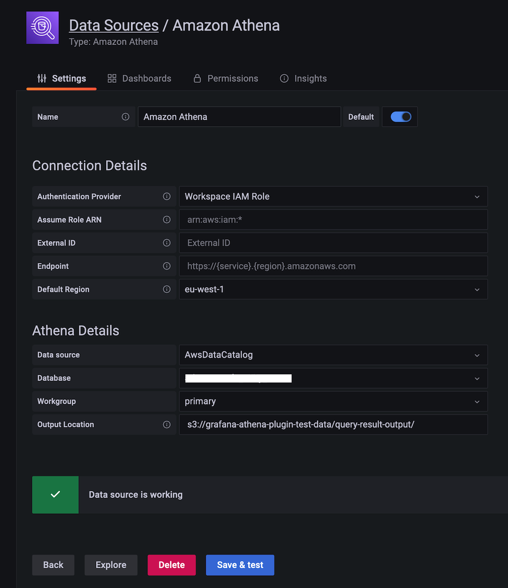

# Amazon Managed Grafana で Athena を使用する

このレシピでは、[Amazon Athena][athena] (Amazon S3 内のデータを標準 SQL を使って分析できるサーバーレスのインタラクティブクエリサービス) を [Amazon Managed Grafana][amg] で使用する方法を示します。この統合は、オープンソースの [Athena data source for Grafana][athena-ds] プラグインによって可能になっており、自分で構築した Grafana インスタンスでも、Amazon Managed Grafana でも事前にインストールされています。

note
    このガイドの完了には約 20 分かかります。


## 前提条件

* [AWS CLI][aws-cli] がインストールされ、環境で [設定][aws-cli-conf] されている。
* アカウントから Amazon Athena にアクセスできる。

## インフラストラクチャ

まず、必要なインフラストラクチャを設定しましょう。

### Amazon Athena のセットアップ

Athena の使用方法を 2 つのシナリオで確認します。1 つ目は地理データと Geomap プラグインを使ったシナリオ、2 つ目は VPC フローログに関するセキュリティ関連のシナリオです。

まず、Athena がセットアップされ、データセットが読み込まれていることを確認しましょう。

warning
    これらのクエリを実行するには、Amazon Athena コンソールを使用する必要があります。Grafana は一般的にデータソースへの読み取り専用アクセスしかできないため、データの作成や更新には使用できません。


#### 地理データの読み込み

最初のユースケースでは、[Registry of Open Data on AWS][awsod] からのデータセットを使用します。
具体的には、地理データを活用したユースケースとして [OpenStreetMap][osm] (OSM) を使用します。
これを実現するには、まず OSM データを Athena に取り込む必要があります。

そこで最初に、Athena で新しいデータベースを作成します。[Athena コンソール][athena-console] に移動し、次の 3 つの SQL クエリを使用して OSM データをデータベースにインポートします。

クエリ 1:

```sql
CREATE EXTERNAL TABLE planet (
  id BIGINT,
  type STRING,
  tags MAP<STRING,STRING>,
  lat DECIMAL(9,7),
  lon DECIMAL(10,7),
  nds ARRAY<STRUCT<ref: BIGINT>>,
  members ARRAY<STRUCT<type: STRING, ref: BIGINT, role: STRING>>,
  changeset BIGINT,
  timestamp TIMESTAMP,
  uid BIGINT,
  user STRING,
  version BIGINT
)
STORED AS ORCFILE
LOCATION 's3://osm-pds/planet/';
```

クエリ 2:

```sql
CREATE EXTERNAL TABLE planet_history (
    id BIGINT,
    type STRING,
    tags MAP<STRING,STRING>,
    lat DECIMAL(9,7),
    lon DECIMAL(10,7),
    nds ARRAY<STRUCT<ref: BIGINT>>,
    members ARRAY<STRUCT<type: STRING, ref: BIGINT, role: STRING>>,
    changeset BIGINT,
    timestamp TIMESTAMP,
    uid BIGINT,
    user STRING,
    version BIGINT,
    visible BOOLEAN
)
STORED AS ORCFILE
LOCATION 's3://osm-pds/planet-history/';
```

クエリ 3:

```sql
CREATE EXTERNAL TABLE changesets (
    id BIGINT,
    tags MAP<STRING,STRING>,
    created_at TIMESTAMP,
    open BOOLEAN,
    closed_at TIMESTAMP,
    comments_count BIGINT,
    min_lat DECIMAL(9,7),
    max_lat DECIMAL(9,7),
    min_lon DECIMAL(10,7),
    max_lon DECIMAL(10,7),
    num_changes BIGINT,
    uid BIGINT,
    user STRING
)
STORED AS ORCFILE
LOCATION 's3://osm-pds/changesets/';
```
</string,string></struct<type:></struct<ref:></string,string></struct<type:></struct<ref:></string,string>

#### VPC フローログデータの読み込み

2 番目のユースケースは、セキュリティを目的とした [VPC フローログ][vpcflowlogs] を使用したネットワークトラフィックの分析です。

まず、EC2 に VPC フローログの生成を指示する必要があります。まだ行っていない場合は、ネットワークインターフェイス、サブネット、または VPC レベルで [VPC フローログを作成][createvpcfl] してください。

note
    クエリのパフォーマンスを向上させ、ストレージの占有領域を最小限に抑えるため、ネストされたデータをサポートする列形式のストレージ形式 [Parquet][parquet] を使用して VPC フローログを保存します。


設定では、ネットワークインターフェイス、サブネット、VPC のいずれのオプションを選んでも構いません。下図のように、Parquet 形式で S3 バケットに公開できれば問題ありません。


次に、[Athena コンソール][athena-console] から、OSM データをインポートした同じデータベースか、新しいデータベースに VPC フローログデータ用のテーブルを作成します。

以下の SQL クエリを使用し、`VPC_FLOW_LOGS_LOCATION_IN_S3` を自身のバケット/フォルダに置き換えてください。

```sql
CREATE EXTERNAL TABLE vpclogs (
  `version` int, 
  `account_id` string, 
  `interface_id` string, 
  `srcaddr` string, 
  `dstaddr` string, 
  `srcport` int, 
  `dstport` int, 
  `protocol` bigint, 
  `packets` bigint, 
  `bytes` bigint, 
  `start` bigint, 
  `end` bigint, 
  `action` string, 
  `log_status` string, 
  `vpc_id` string, 
  `subnet_id` string, 
  `instance_id` string, 
  `tcp_flags` int, 
  `type` string, 
  `pkt_srcaddr` string, 
  `pkt_dstaddr` string, 
  `region` string, 
  `az_id` string, 
  `sublocation_type` string, 
  `sublocation_id` string, 
  `pkt_src_aws_service` string, 
  `pkt_dst_aws_service` string, 
  `flow_direction` string, 
  `traffic_path` int
)
STORED AS PARQUET
LOCATION 'VPC_FLOW_LOGS_LOCATION_IN_S3'
```

例えば、S3 バケット `allmyflowlogs` を使用している場合、`VPC_FLOW_LOGS_LOCATION_IN_S3` は次のようになります。

```
s3://allmyflowlogs/AWSLogs/12345678901/vpcflowlogs/eu-west-1/2021/
```

これでデータセットが Athena で利用可能になったので、次は Grafana に進みましょう。

### Grafanaのセットアップ

Grafanaインスタンスが必要なので、[Amazon Managed Grafanaワークスペース][amg-workspace]を新規に設定するか、既存のものを使用してください。たとえば、[Getting Started][amg-getting-started]ガイドを使用して設定できます。

warning
    AWS データソースの構成を使用するには、まず Amazon Managed Grafana コンソールに移動して、ワークスペースに Athena リソースを読み取るために必要な IAM ポリシーを付与するサービス管理の IAM ロールを有効にする必要があります。
    さらに、以下の点に注意してください。

	1. 使用予定の Athena ワークグループには、キー `GrafanaDataSource` と値 `true` のタグを付ける必要があり、そうしないとサービス管理の許可が適用されません。
	2. サービス管理の IAM ポリシーでは、`grafana-athena-query-results-` で始まるクエリ結果バケットへのアクセスのみが許可されます。他のバケットにアクセスする場合は、手動で許可を追加する必要があります。
	3. クエリ対象のデータソースに対する `s3:Get*` と `s3:List*` の許可を手動で追加する必要があります。


Athena データソースを設定するには、左側のツールバーから下部の AWS アイコンを選択し、「Athena」を選択します。
プラグインが Athena データソースを検出するデフォルトリージョンを選択し、次にアカウントを選択して、最後に「Add data source」を選択します。

または、以下の手順に従って Athena データソースを手動で追加および構成することもできます。

1. 左側のツールバーの「Configurations」アイコンをクリックし、「Add data source」をクリックします。
2. 「Athena」を検索します。
3. [オプション] 認証プロバイダを構成します (推奨: ワークスペース IAM ロール)。
4. 対象の Athena データソース、データベース、ワークグループを選択します。
5. ワークグループに出力場所が設定されていない場合は、クエリ結果の S3 バケットとフォルダを指定します。サービス管理ポリシーの恩恵を受けるには、バケット名が `grafana-athena-query-results-` で始まる必要があることに注意してください。
6. 「Save & test」をクリックします。

次のような画面が表示されるはずです。



## 使用方法

次に、Grafana から Athena データセットを使用する方法を見ていきましょう。

### 地理データを使用する

Athena の [OpenStreetMap][osm] (OSM) データを使用すると、「特定の施設はどこにあるか」などの質問に答えることができます。実際に見てみましょう。

例えば、ラスベガス地域の飲食店を一覧表示する SQL クエリは次のようになります。

```sql
SELECT 
tags['amenity'] AS amenity,
tags['name'] AS name,
tags['website'] AS website,
lat, lon
FROM planet
WHERE type = 'node'
  AND tags['amenity'] IN ('bar', 'pub', 'fast_food', 'restaurant')
  AND lon BETWEEN -115.5 AND -114.5
  AND lat BETWEEN 36.1 AND 36.3
LIMIT 500;
```

info
    上記のクエリでは、ラスベガス地域を緯度 `36.1` から `36.3`、経度 `-115.5` から `-114.5` の範囲と定義しています。
    この範囲を変数化し、Geomap プラグインを他の地域に適用できるようにすることができます。


上記のクエリを使用して OSM データを可視化するには、[osm-sample-dashboard.json](./amg-athena-plugin/osm-sample-dashboard.json) で提供されている次のようなサンプルダッシュボードをインポートできます。


note
    上のスクリーンショットでは、Geomap 可視化 (左側のパネル) を使用してデータポイントをプロットしています。


### VPC フローログデータを使用する

VPC フローログデータを分析し、SSH と RDP トラフィックを検出するには、以下の SQL クエリを使用します。

SSH/RDP トラフィックの表形式の概要を取得する:

```sql
SELECT
srcaddr, dstaddr, account_id, action, protocol, bytes, log_status
FROM vpclogs
WHERE
srcport in (22, 3389)
OR
dstport IN (22, 3389)
ORDER BY start ASC;
```

受け入れられたバイトと拒否されたバイトの時系列ビューを取得する:

```sql
SELECT
from_unixtime(start), sum(bytes), action
FROM vpclogs
WHERE
srcport in (22,3389)
OR
dstport IN (22, 3389)
GROUP BY start, action
ORDER BY start ASC;
```

tip
    Athena でクエリするデータ量を制限したい場合は、`$__timeFilter` マクロを使用することを検討してください。


VPC フローログデータを可視化するには、[vpcfl-sample-dashboard.json](./amg-athena-plugin/vpcfl-sample-dashboard.json) から利用可能な例のダッシュボードをインポートできます。
このダッシュボードは次のようになります:


ここから、Amazon Managed Grafana で独自のダッシュボードを作成するために、以下のガイドを使用できます:

* [ユーザーガイド: ダッシュボード](https://docs.aws.amazon.com/ja_jp/grafana/latest/userguide/dashboard-overview.html)
* [ダッシュボード作成のベストプラクティス](https://grafana.com/docs/grafana/latest/best-practices/best-practices-for-creating-dashboards/)

以上で、Grafana から Athena を使用する方法を学びました。おめでとうございます!

## クリーンアップ

使用していた Athena データベースから OSM データを削除し、次に Amazon Managed Grafana ワークスペースをコンソールから削除します。
