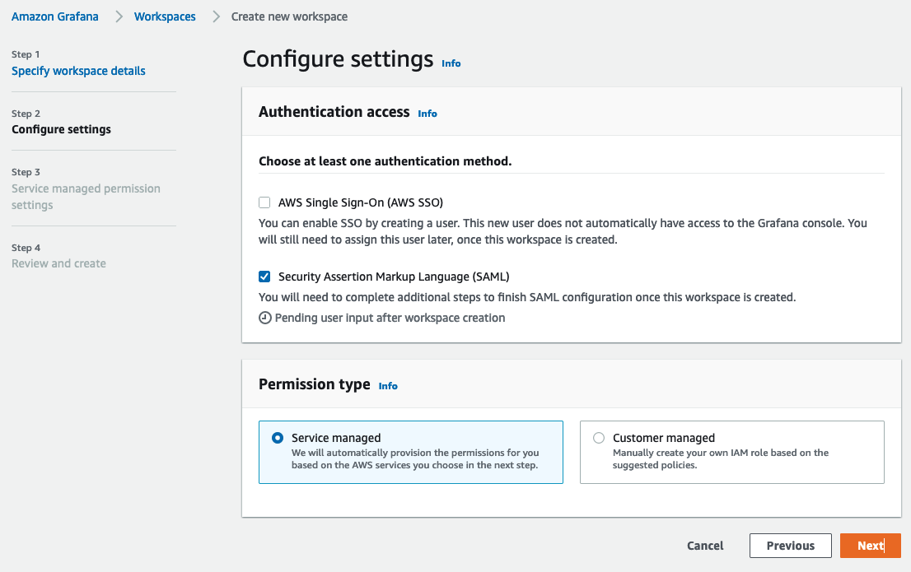
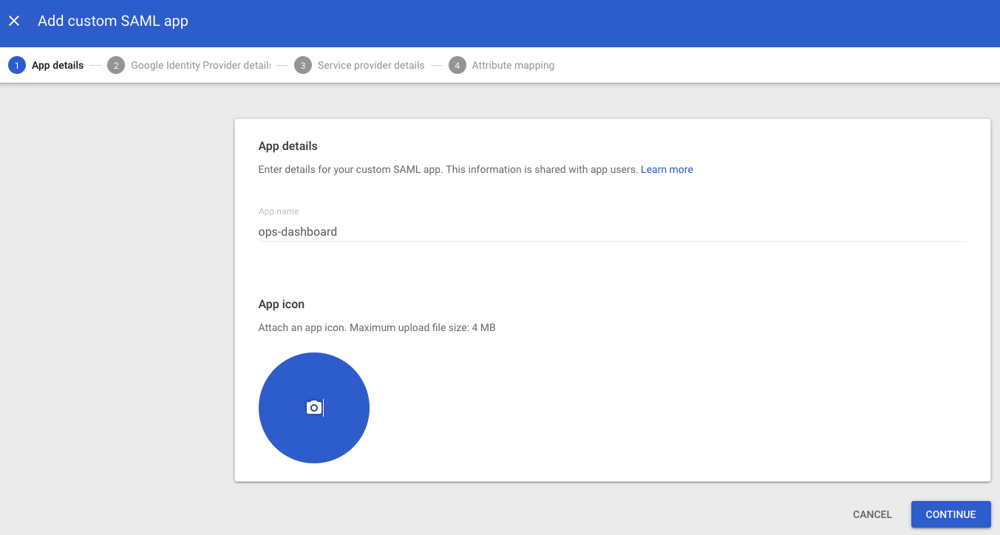
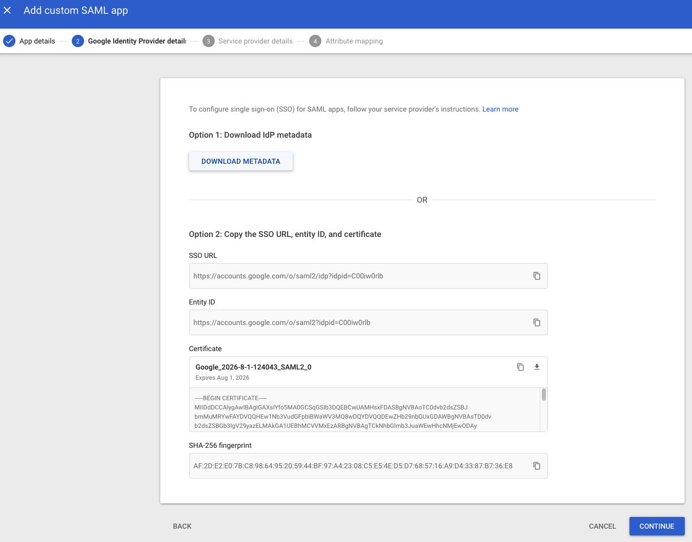
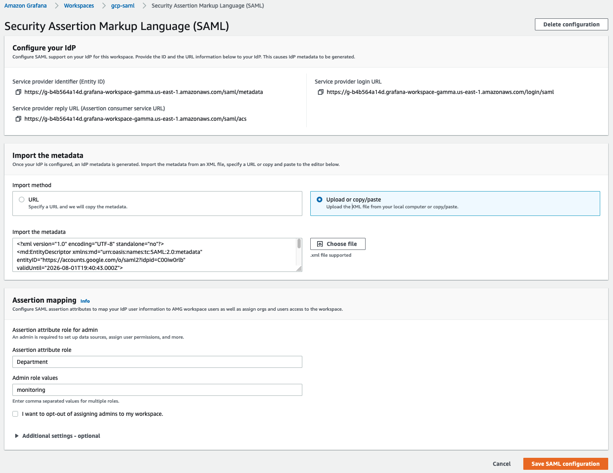

# Google Workspaces 認証を SAML で Amazon Managed Grafana に設定する

このガイドでは、SAML v2.0 プロトコルを使用して Google Workspaces を Amazon Managed Grafana のアイデンティティプロバイダー (IdP) として設定する方法を説明します。

このガイドに従うには、[Amazon Managed Grafana ワークスペース][amg-ws]を作成するだけでなく、有料の [Google Workspaces][google-workspaces] アカウントを作成する必要があります。

### Amazon Managed Grafana ワークスペースを作成する

Amazon Managed Grafana コンソールにログインし、**Create workspace** をクリックします。次の画面で、以下のように workspace 名を入力します。次に **Next** をクリックします。

**Configure settings** ページで、ユーザーが SAML ベースの ID プロバイダーでログインできるように、**Security Assertion Markup Language (SAML)** オプションを選択します。

データソースを選択し、**Next** をクリックします。

**Review and create** 画面で **Create workspace** ボタンをクリックします。

これにより、以下のように新しい Amazon Managed Grafana ワークスペースが作成されます。

### Google Workspaces の設定

スーパー管理者権限で Google Workspaces にログインし、**Apps** セクションの **Web and mobile apps** に移動します。そこで **Add App** をクリックし、**Add custom SAML app** を選択します。
次に、以下のように表示されるアプリに名前を付けます。**CONTINUE** をクリックします。

次の画面で、**DOWNLOAD METADATA** ボタンをクリックして SAML メタデータファイルをダウンロードします。**CONTINUE** をクリックします。

次の画面で、ACS URL、Entity ID、Start URL フィールドが表示されます。
これらのフィールドの値は、Amazon Managed Grafana コンソールから取得できます。

**Name ID format** フィールドのドロップダウンから **EMAIL** を選択し、**Name ID** フィールドで **Basic Information > Primary email** を選択します。

**CONTINUE** をクリックします。

**Attribute mapping** 画面で、以下のスクリーンショットのように **Google Directory attributes** と **App attributes** の間のマッピングを行います。

Google 認証を通してログインするユーザーに **Amazon Managed Grafana** の **Admin** 権限を与えるには、**Department** フィールドの値を ***monitoring*** に設定します。任意のフィールドと値を選択できます。Google Workspaces 側で選択した内容に応じて、Amazon Managed Grafana の SAML 設定でマッピングを行う必要があります。

### Amazon Managed Grafana に SAML メタデータをアップロードする

次に、Amazon Managed Grafana コンソールで **Upload or copy/paste** オプションをクリックし、先ほど Google Workspaces からダウンロードした SAML メタデータファイルをアップロードするために **Choose file** ボタンを選択します。

**Assertion mapping** セクションで、**Assertion attribute role** フィールドに **Department** と入力し、**Admin role values** フィールドに **monitoring** と入力します。
これにより、**Department** が **monitoring** のユーザーが Grafana にログインすると、ダッシュボードやデータソースの作成などの管理者権限を持つことができます。

**Additional settings - optional** セクションの値を以下のスクリーンショットのように設定します。**Save SAML configuration** をクリックします。

これで、Amazon Managed Grafana は Google Workspaces を使用してユーザー認証を行うよう設定されました。

ユーザーがログインすると、次のように Google のログインページにリダイレクトされます。

資格情報を入力すると、以下のスクリーンショットのように Grafana にログインできます。

ご覧のとおり、ユーザーは Google Workspaces 認証を使用して Grafana に正常にログインできました。

[google-workspaces]: https://workspace.google.com/
[amg-ws]: https://docs.aws.amazon.com/ja_jp/grafana/latest/userguide/getting-started-with-AMG.html
