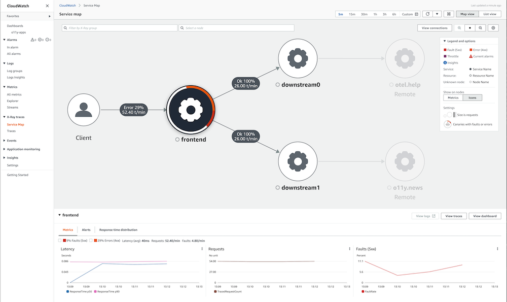

# AWS Fargate 上の EKS で AWS Distro for OpenTelemetry を使用する

このレシピでは、サンプルの Go アプリケーションにインストルメンテーションを行い、[AWS Distro for OpenTelemetry (ADOT)](https://aws.amazon.com/jp/otel) を使用して [AWS X-Ray](https://aws.amazon.com/jp/xray/) にトレースを取り込み、[Amazon Managed Grafana](https://aws.amazon.com/jp/grafana/) でトレースを可視化する方法を示します。

[Amazon Elastic Kubernetes Service (EKS)](https://aws.amazon.com/jp/eks/) の [AWS Fargate](https://aws.amazon.com/jp/fargate/) クラスターを設定し、[Amazon Elastic Container Registry (ECR)](https://aws.amazon.com/jp/ecr/) リポジトリを使用して、完全なシナリオを実演します。

note
    このガイドを完了するのに約 1 時間かかります。


## インフラストラクチャ
次のセクションでは、このレシピのインフラストラクチャを設定します。

### アーキテクチャ

ADOT パイプラインにより、[ADOT Collector](https://github.com/aws-observability/aws-otel-collector) を使用して、インストルメント化されたアプリからトレースを収集し、X-Ray に取り込むことができます。


### 前提条件

* AWS CLI が[インストール](https://docs.aws.amazon.com/ja_jp/cli/latest/userguide/cli-chap-install.html)され、環境内で[設定](https://docs.aws.amazon.com/ja_jp/cli/latest/userguide/cli-chap-configure.html)されている必要があります。
* 環境内に [eksctl](https://docs.aws.amazon.com/ja_jp/eks/latest/userguide/eksctl.html) コマンドをインストールする必要があります。
* 環境内に [kubectl](https://docs.aws.amazon.com/ja_jp/eks/latest/userguide/install-kubectl.html) をインストールする必要があります。
* 環境内に [Docker](https://docs.docker.com/get-docker/) がインストールされている必要があります。
* ローカル環境に [aws-observability/aws-o11y-recipes](https://github.com/aws-observability/aws-o11y-recipes/) リポジトリがクローンされている必要があります。

### EKS on Fargate クラスターを作成する

デモアプリケーションは Kubernetes アプリで、EKS on Fargate クラスターで実行します。
まず、提供された [cluster_config.yaml](./fargate-eks-xray-go-adot-amg/cluster-config.yaml) を使用して EKS クラスターを作成します。

次のコマンドを使用してクラスターを作成します。

```
eksctl create cluster -f cluster-config.yaml
```

### ECR リポジトリを作成する

アプリケーションを EKS にデプロイするには、コンテナリポジトリが必要です。
プライベートの ECR レジストリを使用しますが、コンテナイメージを共有したい場合は ECR Public を使うこともできます。

まず、次のように環境変数を設定します (リージョンは適宜置き換えてください)。

```
export REGION="eu-west-1"
export ACCOUNTID=`aws sts get-caller-identity --query Account --output text`
```

次のコマンドを使って、アカウントに新しい ECR リポジトリを作成できます。

```
aws ecr create-repository \
    --repository-name ho11y \
    --image-scanning-configuration scanOnPush=true \
    --region $REGION
```

### ADOT コレクターのセットアップ

[adot-collector-fargate.yaml](./fargate-eks-xray-go-adot-amg/adot-collector-fargate.yaml) をダウンロードし、次のステップで説明されているパラメーターでこの YAML ドキュメントを編集します。

```
kubectl apply -f adot-collector-fargate.yaml
```

### Managed Grafana のセットアップ

[Amazon Managed Grafana - Getting Started](https://aws.amazon.com/jp/blogs/news/amazon-managed-grafana-getting-started/) ガイドを使用して新しいワークスペースを設定し、[X-Ray をデータソースとして追加](https://docs.aws.amazon.com/ja_jp/grafana/latest/userguide/x-ray-data-source.html)してください。

## シグナル生成器

[レシピリポジトリ](https://github.com/aws-observability/observability-best-practices/tree/main/sandbox/ho11y)の Sandbox から利用可能な合成シグナル生成器 `ho11y` を使用します。
まだローカル環境にリポジトリをクローンしていない場合は、今すぐクローンしてください。

```
git clone https://github.com/aws-observability/aws-o11y-recipes.git
```

### コンテナイメージのビルド
`ACCOUNTID` と `REGION` の環境変数が設定されていることを確認してください。
例:

```
export REGION="eu-west-1"
export ACCOUNTID=`aws sts get-caller-identity --query Account --output text`
```

`ho11y` コンテナイメージをビルドするには、まず `./sandbox/ho11y/` ディレクトリに移動し、コンテナイメージをビルドします。

note
    次のビルドステップでは、Docker デーモンまたは同等の OCI イメージビルドツールが実行されていることを前提としています。


```
docker build . -t "$ACCOUNTID.dkr.ecr.$REGION.amazonaws.com/ho11y:latest"
```

### コンテナイメージをプッシュする
次に、前に作成した ECR リポジトリにコンテナイメージをプッシュできます。
そのために、まず デフォルトの ECR レジストリにログインします。

```
aws ecr get-login-password --region $REGION | \
    docker login --username AWS --password-stdin \
    "$ACCOUNTID.dkr.ecr.$REGION.amazonaws.com"
```

最後に、上で作成した ECR リポジトリにコンテナイメージをプッシュします。

```
docker push "$ACCOUNTID.dkr.ecr.$REGION.amazonaws.com/ho11y:latest"
```

### シグナル生成器をデプロイする

[x-ray-sample-app.yaml](./fargate-eks-xray-go-adot-amg/x-ray-sample-app.yaml) を編集し、ECR イメージパスを含めます。
つまり、ファイル内の `ACCOUNTID` と `REGION` を自身の値に置き換えます (全体で 3 か所)。

``` 
    # change the following to your container image:
    image: "ACCOUNTID.dkr.ecr.REGION.amazonaws.com/ho11y:latest"
```

これで、次のコマンドを使用してサンプルアプリをクラスターにデプロイできます。

```
kubectl -n example-app apply -f x-ray-sample-app.yaml
```

## エンドツーエンド

インフラストラクチャとアプリケーションが準備できたので、EKS で実行されている `ho11y` から X-Ray にトレースを送信し、AMG で可視化してセットアップをテストします。

### パイプラインの検証

ADOT コレクターが `ho11y` からトレースを取り込んでいるかを確認するために、サービスの 1 つをローカルで利用可能にし、呼び出します。

まず、トラフィックを次のようにフォワードします。

```
kubectl -n example-app port-forward svc/frontend 8765:80
```

上のコマンドで、`frontend` マイクロサービス (2 つの他の `ho11y` インスタンスと通信するように設定された `ho11y` インスタンス) がローカル環境で利用可能になり、次のように呼び出すことができます (トレースの作成がトリガーされます)。

```
$ curl localhost:8765/
{"traceId":"1-6193a9be-53693f29a0119ee4d661ba0d"}
```

tip
    呼び出しを自動化したい場合は、`curl` 呼び出しを `while true` ループでラップすることができます。

セットアップを確認するには、[CloudWatch の X-Ray ビュー](https://console.aws.amazon.com/cloudwatch/home#xray:service-map/) にアクセスし、次のような画面が表示されることを確認してください。



シグナル生成器のセットアップとアクティブ化、OpenTelemetry パイプラインのセットアップが完了したので、次は Grafana でトレースを消費する方法を見ていきましょう。

### Grafana ダッシュボード

次のようなダッシュボードの例を [x-ray-sample-dashboard.json](./fargate-eks-xray-go-adot-amg/x-ray-sample-dashboard.json) からインポートできます。


さらに、下部の `downstreams` パネルの任意のトレースをクリックすると、そのトレースに潜り込んで "Explore" タブで次のように表示できます。


ここから、Amazon Managed Grafana で独自のダッシュボードを作成するために、次のガイドを参照できます。

* [ユーザーガイド: ダッシュボード](https://docs.aws.amazon.com/ja_jp/grafana/latest/userguide/dashboard-overview.html)
* [ダッシュボード作成のベストプラクティス](https://grafana.com/docs/grafana/latest/best-practices/best-practices-for-creating-dashboards/)

以上で、Fargate の EKS で ADOT を使ってトレースを取り込む方法を学びました。おめでとうございます。

## クリーンアップ

まず、Kubernetes リソースを削除し、EKS クラスターを破棄します。

```
kubectl delete all --all && \
eksctl delete cluster --name xray-eks-fargate
```
最後に、AWS コンソールから Amazon Managed Grafana ワークスペースを削除します。
