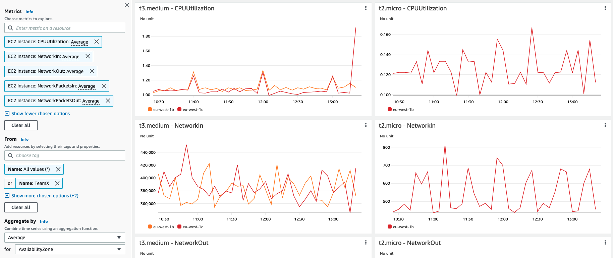

# リソースタグでフィルタリングされたメトリクスを集約および可視化するための Amazon CloudWatch Metrics explorer の使用

このレシピでは、Metrics explorer を使用してリソースタグとリソースプロパティでメトリクスをフィルタリング、集計、視覚化する方法を説明します - [メトリクスエクスプローラーを使用してタグとプロパティでリソースを監視する][metrics-explorer]。

Metrics explorer を使用して視覚化を作成する方法はいくつかあります。このウォークスルーでは、単純に AWS Console を活用します。

:::note
    このガイドは完了まで約 5 分かかります。
:::
## 前提条件

* AWS アカウントへのアクセス
* AWS Console 経由での Amazon CloudWatch Metrics explorer へのアクセス
* 関連リソースに設定されたリソースタグ 

## Metrics Explorer タグベースのクエリと可視化

*  CloudWatch コンソールを開きます

*  以下 <b>メトリクス</b>をクリックします。 <b>Explorer</b> メニュー 

<!--  -->

* 次のいずれかから選択できます <b>汎用テンプレート</b> または <b>サービスベースのテンプレート</b> リスト。この例では、 <b>タイプ別の EC2 インスタンス</b> template 

<!--  -->

*  探索したいメトリクスを選択します。古いメトリクスを削除し、表示したい他のメトリクスを追加します

<!--  -->

*  以下 <b>送信元</b>、検索するリソースタグまたはリソースプロパティを選択します。以下の例では、さまざまな EC2 インスタンスの CPU およびネットワーク関連のメトリクスの数を表示しています。 <b>名前: TeamX</b> タグ

<!--

// width="386" height="176" -->

* 時系列を集計関数を使用して組み合わせることができます。 <b>集約単位</b>; 以下の例では <b>TeamX</b> メトリクスは次の単位で集計されます <b>アベイラビリティーゾーン</b>

<!--  -->

あるいは、集約することもできます <b>TeamX</b> および <b>TeamY</b> によって <b>チーム</b> タグを選択するか、ニーズに合った他の設定を選択します

<!--  -->

## 動的な可視化
結果として得られる視覚化は、次を使用して簡単にカスタマイズできます <b>送信元</b>, <b>集約単位</b> および <b>分割基準</b> オプション。メトリクスエクスプローラーの可視化は動的であるため、新しくタグ付けされたリソースは自動的にエクスプローラーウィジェットに表示されます。

## リファレンス

Metrics explorer の詳細については、次の記事を参照してください。
https://docs.aws.amazon.com/AmazonCloudWatch/latest/monitoring/CloudWatch-Metrics-Explorer.html

[metrics-explorer]: https://docs.aws.amazon.com/AmazonCloudWatch/latest/monitoring/CloudWatch-Metrics-Explorer.html
