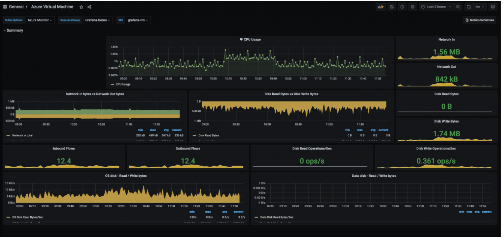
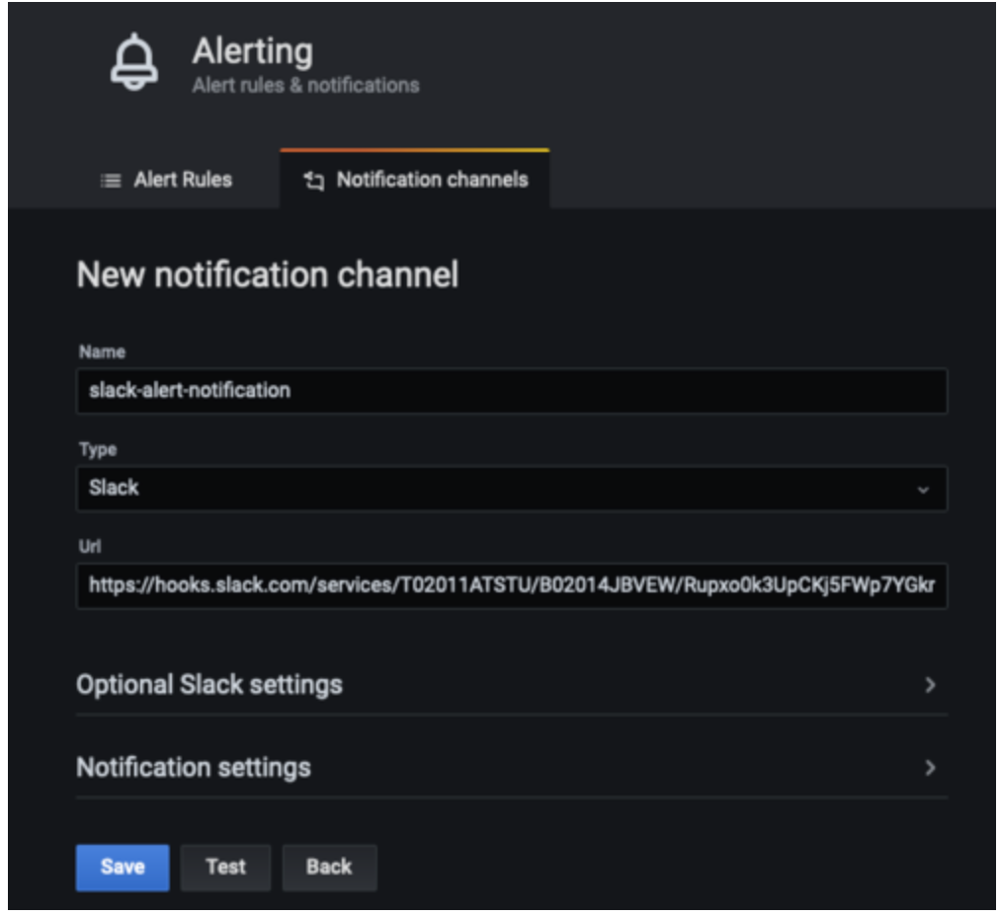

# Azure Cloud 環境のメトリクスを Amazon Managed Service for Grafana で可視化し、監視する

このレシピでは、Azure Cloud 環境のメトリクスを [Amazon Managed Service for Grafana](https://aws.amazon.com/jp/grafana/) (AMG) で可視化し、AMG から [Amazon Simple Notification Service](https://docs.aws.amazon.com/ja_jp/sns/latest/dg/welcome.html) と Slack にアラート通知を送信する方法を説明します。

実装の一環として、AMG ワークスペースを作成し、Azure Monitor プラグインを AMG のデータソースとして設定し、Grafana ダッシュボードを設定します。Amazon SNS 用と Slack 用の 2 つの通知チャネルを作成します。また、AMG ダッシュボードでアラートを設定し、通知チャネルにアラートを送信するよう設定します。

note
    このガイドの完了には約 30 分かかります。


## インフラストラクチャ
次のセクションでは、このレシピのインフラストラクチャを設定します。

### 前提条件

* AWS CLI が[インストール](https://docs.aws.amazon.com/ja_jp/cli/latest/userguide/cli-chap-install.html)され、[設定](https://docs.aws.amazon.com/ja_jp/cli/latest/userguide/cli-chap-configure.html)されている。
* [AWS-SSO](https://docs.aws.amazon.com/ja_jp/singlesignon/latest/userguide/step1.html) を有効にする必要がある。

### アーキテクチャ

まず、Azure Monitor からメトリクスを可視化するために AMG ワークスペースを作成します。[Getting Started with Amazon Managed Service for Grafana](https://aws.amazon.com/jp/blogs/news/amazon-managed-grafana-getting-started/) ブログ記事の手順に従ってください。ワークスペースを作成したら、個々のユーザーまたはユーザーグループに Grafana ワークスペースへのアクセス権を割り当てることができます。デフォルトでは、ユーザーのユーザータイプは viewer になります。ユーザーの役割に基づいてユーザータイプを変更してください。

note
    ワークスペースに少なくとも 1 人の Admin 役割のユーザーを割り当てる必要があります。


図 1 では、ユーザー名は grafana-admin です。ユーザータイプは Admin です。Data sources タブで、必要なデータソースを選択します。構成を確認してから、Create workspace を選択します。


### データソースとカスタムダッシュボードを設定する

次に、データソースの下で、Azure Monitor プラグインを設定し、Azure 環境からメトリクスを照会して可視化を開始します。データソースを選択してデータソースを追加してください。


データソースの追加で、Azure Monitor を検索し、Azure 環境のアプリ登録コンソールからパラメータを設定します。


Azure Monitor プラグインを設定するには、ディレクトリ (テナント) ID とアプリケーション (クライアント) ID が必要です。手順については、[Azure AD アプリケーションとサービスプリンシパルの作成に関する記事](https://docs.microsoft.com/en-us/azure/active-directory/develop/howto-create-service-principal-portal)を参照してください。この記事では、アプリの登録方法と、Grafana にデータを照会するためのアクセス権の付与方法が説明されています。


データソースが設定されたら、カスタムダッシュボードをインポートして Azure メトリクスを分析します。左ペインで + アイコンを選択し、Import を選択します。

Import via grafana.com で、ダッシュボード ID 10532 を入力します。


これにより、Azure 仮想マシンダッシュボードがインポートされ、Azure Monitor メトリクスの分析を開始できます。私の環境では、Azure 上で仮想マシンが実行されています。



### AMG での通知チャネルの設定

このセクションでは、2 つの通知チャネルを設定し、アラートを送信します。

次のコマンドを使用して、grafana-notification という名前の SNS トピックを作成し、メールアドレスを購読します。

```
aws sns create-topic --name grafana-notification
aws sns subscribe --topic-arn arn:aws:sns:<region>:<account-id>:grafana-notification --protocol email --notification-endpoint <email-id>

```

左側のペインで、ベルアイコンを選択して新しい通知チャネルを追加します。
次に、grafana-notification 通知チャネルを設定します。[Edit notification channel] で、[Type] には [AWS SNS] を選択します。[Topic] には、作成した SNS トピックの ARN を使用します。[Auth Provider] には、ワークスペースの IAM ロールを選択します。


### Slack 通知チャネル
Slack 通知チャネルを設定するには、Slack ワークスペースを新規作成するか、既存のものを使用します。[Incoming Webhooks を使用したメッセージの送信](https://api.slack.com/messaging/webhooks) で説明されているように、Incoming Webhooks を有効にします。

ワークスペースを設定したら、Grafana ダッシュボードで使用される webhook URL を取得できるはずです。



### AMG でアラートを設定する

メトリクスが閾値を超えた場合、Grafana でアラートを設定できます。AMG では、ダッシュボードでアラートの評価頻度と通知の送信方法を設定できます。この例では、Azure 仮想マシンの CPU 使用率のアラートを設定します。使用率が閾値を超えた場合、AMG に両方のチャネルへの通知を設定します。

ダッシュボードで、CPU 使用率をドロップダウンから選択し、「編集」を選択します。グラフパネルの「アラート」タブで、アラートルールの評価頻度と、アラートの状態が変化して通知を開始する条件を設定します。

次の設定では、CPU 使用率が 50% を超えるとアラートが作成されます。grafana-alert-notification と slack-alert-notification チャネルに通知が送信されます。


これで、Azure 仮想マシンにサインインし、stress などのツールを使用してストレステストを開始できます。CPU 使用率が閾値を超えると、両方のチャネルで通知を受け取ります。

次に、Slack チャネルに送信されるアラートをシミュレートするため、適切な閾値で CPU 使用率のアラートを設定します。

## 結論

このレシピでは、AMG ワークスペースのデプロイ、通知チャネルの設定、Azure Cloud からのメトリクス収集、AMG ダッシュボードでのアラート設定の方法を示しました。AMG はフルマネージド型のサーバーレスソリューションなので、ビジネスを変革するアプリケーションに時間を費やし、Grafana の管理の重荷は AWS に任せることができます。
