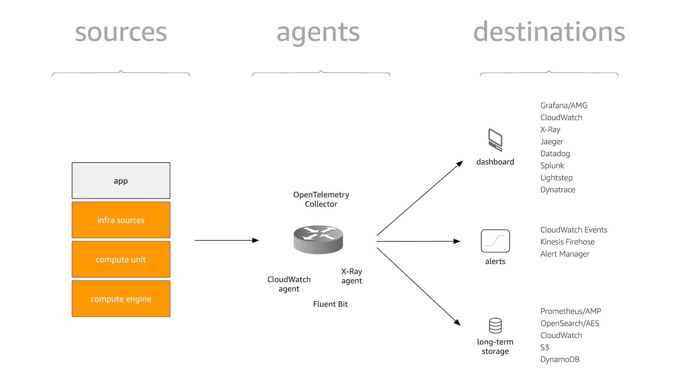

# テレメトリー

テレメトリーは、アプリケーションやインフラストラクチャなど、さまざまなソースからシグナルを収集し、使用される場所に転送することに関するものです。

:::info
    各種テレメトリーのベストプラクティスの詳細については、[データタイプ](../signals/logs) セクションを参照してください。
:::

上図で紹介した概念についてさらに詳しく見ていきましょう。

## ソース

ソースとは、シグナルが発生する場所のことです。ソースには 2 つのタイプがあります。

1. アプリケーションのソースコードなど、インストルメンテーションを通じて制御できるもの。
1. マネージドサービスなど、(直接的な) 制御下にないその他のもの。
   このタイプのソースは通常、AWS によって提供され、API を通じてシグナルを公開します。

## エージェント

シグナルをソースから送信先に転送するには、エージェントと呼ばれる仲介役が必要です。
これらのエージェントは、ソースからシグナルを受信または取得し、通常は設定を通じてシグナルの送信先を決定します。
また、オプションでフィルタリングや集約もサポートしています。

:::note
    「エージェント？ ルーティング？ 配送？ 取り込み？」
    ソースから送信先へのシグナル転送プロセスを表現するために、ルーティング、配送、集約、取り込みなど、多くの用語が使用されています。
    これらの用語は若干異なる意味を持つ場合がありますが、ここでは互換的に使用します。
    正式には、これらの中間転送コンポーネントをエージェントと呼びます。
:::

## 送信先

シグナルが最終的に消費される場所です。後で使用するためにシグナルを保存する場合でも、ダッシュボードに表示する場合でも、特定の条件が真の場合にアラートを設定する場合でも、シグナルを相関させる場合でも、エンドユーザーとしてのあなたに提供されるこれらのコンポーネントはすべて送信先となります。
