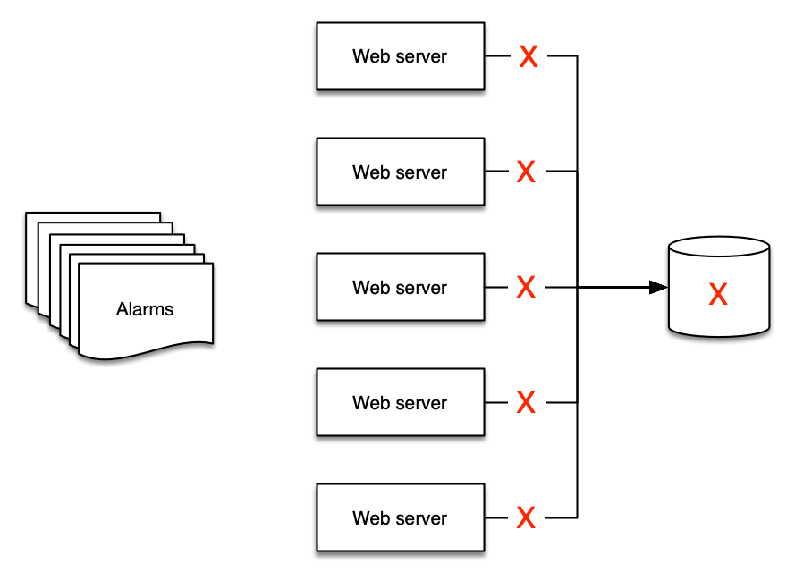

# アラーム

アラームとは、プローブ、モニター、または特定のしきい値を超えるか下回る値の変化の状態を指します。
単純な例としては、ディスクが一杯になったり、ウェブサイトがダウンしたりした時にメールを送信するアラームがあります。
より高度なアラームは完全にプログラム化されており、自動スケーリングや完全なサーバークラスターの作成など、複雑な相互作用を駆動するために使用されます。

しかし、ユースケースに関係なく、アラームはメトリクスの現在の*状態*を示します。
この状態は、対象のシステムに応じて `OK`、`WARNING`、`ALERT`、または `NO DATA` になります。

アラームは一定期間この状態を反映し、時系列データの上に構築されます。
そのため、アラームは時系列データ*から*派生したものです。
以下のグラフは 2 つのアラームを示しています。1 つは警告しきい値を持ち、もう 1 つはこの時系列データの平均値を示しています。
このトラフィック量のグラフが示すように、警告しきい値のアラームは、定義された値を下回ったときにブリーチ状態になるはずです。

:::info
アラームの目的は、アクション（人間によるものまたはプログラムによるもの）をトリガーすること、または情報提供（しきい値を超えたこと）のいずれかです。
アラームはメトリクスのパフォーマンスに関する洞察を提供します。
:::

## アクションにつながる事象にアラートを設定する

アラーム疲れとは、人々があまりにも多くのアラートを受け取るため、それらを無視するようになる状態を指します。これは、適切に監視されているシステムの兆候ではありません！むしろ、これはアンチパターンです。

:::info
アクションにつながる事象に対してアラームを作成し、常に[目標](../guides/#monitor-what-matters)から逆算して考えるべきです。
:::

例えば、迅速な応答時間が要求される Web サイトを運営している場合、応答時間が特定のしきい値を超えた時にアラートを送信するよう設定します。また、パフォーマンスの低下が高い CPU 使用率と関連していることが分かっている場合、問題が発生する前に *事前に* このデータポイントにアラートを設定します。しかし、環境内の *すべての* CPU 使用率に対してアラートを設定する必要はありません。それが *成果を危険にさらさない* 場合は特にそうです。

:::info
アラームがあなたに警告を発する必要がない、または自動化されたプロセスをトリガーする必要がない場合、それをアラートとして設定する必要はありません。不要なアラームからは通知を削除すべきです。
:::

## 「すべて OK アラーム」に注意

同様に、よくあるパターンとして「すべて OK アラーム」があります。これは、オペレーターが常に警告を受け取ることに慣れすぎて、突然警告が来なくなったときにだけ気づくという状況です！これは非常に危険な運用モードであり、[オペレーショナルエクセレンス](../faq/#what-is-operational-excellence) に反するパターンです。

:::warning
「すべて OK アラーム」は通常、人間による解釈が必要です！これにより、自己修復アプリケーションのようなパターンが不可能になります。[^1]
:::

## アラームの集約によるアラーム疲れの解消

オブザーバビリティは技術的な問題ではなく、*人間*の問題です。そのため、アラーム戦略はアラームを増やすのではなく、減らすことに焦点を当てるべきです。テレメトリ収集を実装すると、環境からのアラートが増えるのは自然なことです。ただし、[アクション可能な事項のみにアラートを設定する](../signals/alarms/#alert-on-things-that-are-actionable)よう注意してください。アラートの原因となった状況に対してアクションを取れない場合、それを報告する必要はありません。

これは例を挙げると分かりやすいでしょう。バックエンドに単一のデータベースを使用する 5 台の Web サーバーがあるとします。データベースがダウンした場合、Web サーバーはどうなるでしょうか？多くの人の場合、*少なくとも 6 つ*のアラートを受け取ることになります。Web サーバーに対して*5 つ*、データベースに対して*1 つ*です！

しかし、実際に意味のあるアラートは 2 つだけです：

1. Web サイトがダウンしている
2. データベースが原因である

:::info
アラートを集約して要約することで、人々が理解しやすくなり、ランブックや自動化の作成も容易になります。
:::

## 既存の ITSM とサポートプロセスを活用する

モニタリングとオブザーバビリティのプラットフォームに関わらず、それらは現在のツールチェーンと統合する必要があります。

:::info
アラートからこれらのツールへのプログラムによる統合を使用してトラブルチケットや課題を作成し、人的労力を削減しプロセスを効率化します。
:::

これにより、[DORA メトリクス](https://en.wikipedia.org/wiki/DevOps) などの重要な運用データを導き出すことができます。

[^1]: このパターンの詳細については、https://aws.amazon.com/jp/blogs/news/building-self-healing-infrastructure-as-code-with-dynatrace-aws-lambda-and-aws-service-catalog/ を参照してください。
