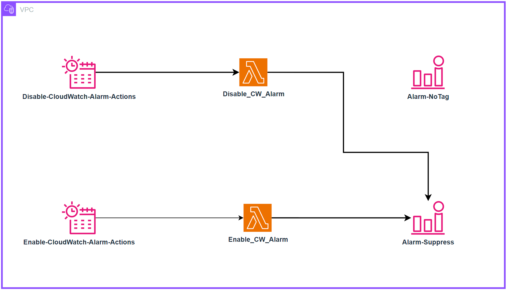

# アラーム

アラームとは、プローブ、モニター、または値の変化が特定のしきい値を超えたり下回ったりした状態を指します。簡単な例としては、ディスクがいっぱいになったときや Web サイトがダウンしたときにメールを送信するアラームがあります。より高度なアラームは完全にプログラマティックであり、オートスケーリングやサーバークラスター全体の作成などの複雑なインタラクションを駆動するために使用されます。

ユースケースに関係なく、アラームはメトリクスの現在の*状態*を示します。この状態は次のようになります。 `OK`, `WARNING`, `ALERT`、または `NO DATA`、対象となるシステムによって異なります。

アラームは一定期間この状態を反映し、時系列データの上に構築されます。そのため、時系列*から*派生したものです。以下のグラフは 2 つのアラームを示しています。1 つは警告しきい値を持つアラーム、もう 1 つはこの時系列全体の平均値を示すアラームです。このグラフに示されるトラフィック量から、警告しきい値のアラームは定義された値を下回ったときに違反状態になるはずです。


:::info
	アラームの目的は、アクション (人間またはプログラムによる) をトリガーすること、または情報提供 (しきい値が超過したこと) のいずれかです。アラームは、メトリクスのパフォーマンスに関する洞察を提供します。
:::
## アクション可能な事項についてアラートを設定する

アラーム疲労とは、あまりにも多くのアラートを受け取るため、人々がそれらを無視するようになってしまう状態を指します。これは適切に監視されたシステムの兆候ではありません。むしろ、これはアンチパターンです。

:::info
	アクション可能な項目に対してアラームを作成し、常に[目標](../guides/#重要なことを監視する)から逆算して作業する必要があります。
:::

たとえば、高速な応答時間を必要とする Web サイトを運用している場合、応答時間が特定のしきい値を超えたときに配信されるアラートを作成します。また、パフォーマンスの低下が高い CPU 使用率に関連していることが判明している場合は、問題になる*前に*このデータポイントに対して*プロアクティブに*アラートを設定します。ただし、*成果を危険にさらす*ことがない場合は、環境内の*すべての場所*のすべての CPU 使用率に対してアラートを設定する必要はない可能性があります。

:::info
	アラームがアラートを送信する必要がない場合、または自動化されたプロセスをトリガーする必要がない場合は、アラートを送信する必要はありません。不要なアラームから通知を削除する必要があります。
:::

## 「すべて正常アラーム」に注意

同様に、「すべて正常」アラームという一般的なパターンがあります。これは、オペレーターが常にアラートを受け取ることに慣れすぎて、突然静かになったときにのみ気づくというものです。これは非常に危険な運用モードであり、オペレーショナルエクセレンスに反するパターンです。

:::warning
	「すべて正常アラーム」は通常、人間による解釈が必要です。これにより、自己修復アプリケーションのようなパターンが不可能になります。[^1]
:::
## 集約によるアラーム疲労の軽減

オブザーバビリティは技術的な問題ではなく、*人間*の問題です。そのため、アラーム戦略はアラームを増やすのではなく、減らすことに焦点を当てるべきです。テレメトリ収集を実装すると、環境からのアラートが増えるのは自然なことです。ただし、[アクション可能なものに対してのみアラートを発行する](../signals/alarms/#アクション可能な事項についてアラートを設定する)ように注意してください。アラートを引き起こした状態がアクション可能でない場合、それを報告する必要はありません。

これは例で示すのが最適です。単一のデータベースをバックエンドとして使用する 5 つの Web サーバーがある場合、データベースがダウンすると Web サーバーはどうなるでしょうか? 多くの人にとっての答えは、*少なくとも 6 つ*のアラートを受け取るということです。Web サーバーに対して *5 つ*、データベースに対して *1 つ*です。


しかし、配信する意味があるアラートは 2 つだけです。

1. Web サイトがダウンしている
1. データベースが原因である


:::info
	アラートを集約することで、人々が理解しやすくなり、その後ランブックや自動化を作成しやすくなります。
:::
## 既存の ITSM およびサポートプロセスを使用する

モニタリングおよびオブザーバビリティプラットフォームに関係なく、現在のツールチェーンに統合する必要があります。

:::info
	アラートからこれらのツールへのプログラマティックな統合を使用してトラブルチケットと問題を作成し、人的作業を削減し、プロセスを合理化します。
:::
これにより、[DORA メトリクス](https://en.wikipedia.org/wiki/DevOps)などの重要な運用データを導出できます。

## Cron スケジュールでアラームアクションを有効化する

アラームは AWS リソースに不可欠な監視機能を提供し、チームがメトリクスを追跡し、しきい値を超えたときに通知を受け取ることを可能にします。この監視は運用上の認識を維持するために重要ですが、スケジュールされたリソースのシャットダウンを伴うコスト最適化戦略を組織が実装する際に、共通の課題が発生します。この特定のシナリオでは、本番リソースは営業時間外(午後 6 時から午前 6 時、月曜日から金曜日および週末)に自動的にシャットダウンするように設定されています。しかし、CloudWatch Alarms はこれらの計画されたダウンタイム期間中も監視を継続し、通知をトリガーするため、リソースが意図的にオフラインになっているときに不要なアラートが発生します。EventBridge Schedules と Lambda 関数を活用したソリューションを実装することで、リソースのスケジューリングに合わせてタグに基づいてアラームをプログラム的に有効化および無効化し、営業時間中は効果的な監視を確保しながら、計画されたダウンタイム中の誤検知アラートを排除できます。

### アーキテクチャ


### デプロイ

リポジトリをクローンします。
```
git clone https://github.com/aws-observability/observability-best-practices.git
```

CloudFormation テンプレートを見つけます。
```
cd observability-best-practices/sandbox/cw-alarm-scheduler
```

CloudFormation テンプレートは、そのディレクトリ内の 'cf.yaml' です。

CloudFormation コンソールに移動し、そのテンプレートからスタックを作成します。

1. スタックの詳細を指定します。
    1. スタック名を指定します。
        1. スタック名: $STACK-NAME
    2. パラメータ:
        1. DisableAlarmsCronSchedule: (アラームを無効にするタイミングを定義する cron 式を入力)
            1. デフォルト cron(00 18 ? * 1-5 *)
        2. EnableAlarmsCronSchedule: (アラームを有効にするタイミングを定義する cron 式を入力)
            1. デフォルト cron(00 06 ? * 1-5 *)
        3. LambdaArchitecture: Lambda 関数のアーキテクチャを選択 (x86_64 または arm64)
            1. デフォルト arm64
        4. ScheduleTimezone: ドロップダウンリストからタイムゾーンを選択
            1. デフォルト America/New_York
        5. SuppressTagKey: CloudWatch Alarms をフィルタリングするタグのキー (例: 'suppress' または 'snooze')
            1. デフォルト "suppress"
        6. SuppressTagValue: CloudWatch Alarms をフィルタリングするタグの値 (例: 'true')
            1. デフォルト "true"
    3. Next

これにより、CloudFormation パラメータで選択したキー値でタグ付けされたアラームが、選択した Cron スケジュールに従うようになります。

例:

SuppressTagKey に「suppress」を選択し、SuppressTagValue に「true」を選択すると、「suppress」:「true」のタグを持つすべてのアラームが、DisableAlarmsCronSchedule と EnableAlarmsCronSchedule で設定したスケジュールに従います。

:::info
動作:
アラームが無効になっている場合:
* アラートや通知は生成されません
* メトリクスの収集は中断されることなく継続されます

アラームが再度有効化されると、次のようになります。
* 通常のアラート機能は、その直後に再開されます
:::

[^1]: See https://aws.amazon.com/blogs/apn/building-self-healing-infrastructure-as-code-with-dynatrace-aws-lambda-and-aws-service-catalog/ for more about this pattern.
