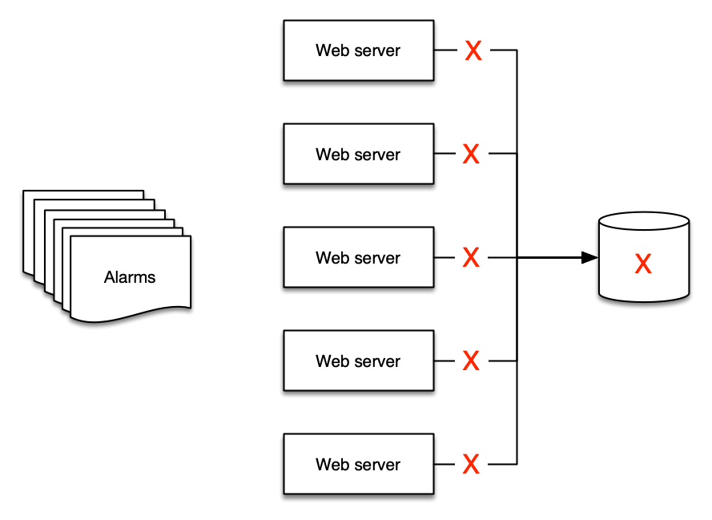

# アラーム

アラームとは、プローブやモニターの状態、または特定のしきい値を超えたり下回ったりした値の変化を指します。簡単な例としては、ディスクが満杯になったときやウェブサイトがダウンしたときにメールを送信するアラームが挙げられます。より高度なアラームは完全にプログラム的であり、オートスケーリングやサーバークラスター全体の作成などの複雑なインタラクションを駆動するために使用されます。

ただし、ユースケースに関わらず、アラームはメトリクスの現在の*状態*を示します。この状態は `OK`, `WARNING`, `ALERT`、または `NO DATA`、対象のシステムによって異なります。

アラームは一定期間この状態を反映し、時系列データの上に構築されています。そのため、アラームは時系列データ*から*導出されます。以下のグラフは 2 つのアラームを示しています。1 つは警告しきい値を持つアラームで、もう 1 つはこの時系列全体の平均値を示すアラームです。このグラフに示されるトラフィック量から、警告しきい値のアラームは定義された値を下回った際にブリーチ状態になるはずです。


:::info
	アラームの目的は、アクション（人間またはプログラムによる）をトリガーすること、または情報提供（しきい値が超過したこと）のいずれかです。アラームはメトリクスのパフォーマンスに関するインサイトを提供します。
:::
## アクション可能な事項に対してアラートを設定する

アラーム疲労とは、あまりにも多くのアラートを受け取るため、それらを無視するようになってしまう状態のことです。これは適切に監視されたシステムの指標ではありません！むしろ、これはアンチパターンです。

:::info
	[目標](../guides/index.md#重要なことを監視する)から逆算して、対処可能な事項に対してアラームを作成してください。
:::

たとえば、高速な応答時間が求められる Web サイトを運営している場合、応答時間が特定のしきい値を超えたときに通知されるアラートを作成します。また、パフォーマンスの低下が高い CPU 使用率と関連していることが判明している場合は、問題になる前に*事前に*このデータポイントに対してアラートを設定します。ただし、環境内の*すべての場所*での CPU 使用率が*成果を危険にさらさない*のであれば、すべての CPU 使用率に対してアラートを設定する必要はないかもしれません。

:::info
	アラームがアラートを通知する必要がない場合、または自動化されたプロセスをトリガーする必要がない場合は、アラートを通知する必要はありません。不要なアラームから通知を削除する必要があります。
:::

## 「すべて正常アラーム」に注意してください

同様に、よくあるパターンとして「すべて正常」アラームがあります。これは、オペレーターが常時アラートを受け取ることに慣れすぎてしまい、突然アラートが止まったときにしか気づかないという状況です。これは非常に危険な運用モードであり、運用上の卓越性に反するパターンです。

:::warning
	「すべて正常アラーム」は通常、人間が解釈する必要があります！これにより、自己修復アプリケーションのようなパターンが不可能になります。[^1]
:::
## 集約によるアラート疲労への対処

オブザーバビリティは*人間*の問題であり、テクノロジーの問題ではありません。そのため、アラーム戦略はアラームを増やすのではなく、減らすことに焦点を当てるべきです。テレメトリ収集を実装すると、環境からのアラートが増えるのは自然なことです。ただし、[対処可能なことにのみアラートを設定する](#アクション可能な事項に対してアラートを設定する)よう注意してください。アラートを引き起こした状態が対処可能でない場合、それを報告する必要はありません。

これは例を挙げると最もよく理解できます。バックエンドに単一のデータベースを使用する 5 台の Web サーバーがある場合、データベースがダウンしたときに Web サーバーはどうなるでしょうか？多くの人にとっての答えは、*少なくとも 6 件*のアラートが発生するということです。Web サーバーに対して *5 件*、データベースに対して *1 件*です！



ただし、配信する意味があるアラートは 2 つだけです。

1. ウェブサイトがダウンしており、
1. データベースが原因である


:::info
	アラートを集約に絞り込むことで、人々が理解しやすくなり、ランブックや自動化を作成しやすくなります。
:::
## 既存の ITSM とサポートプロセスを活用する

モニタリングおよびオブザーバビリティプラットフォームに関わらず、現在のツールチェーンに統合される必要があります。

:::info
	アラートからこれらのツールへのプログラムによる統合を使用してトラブルチケットや Issue を作成し、人的作業を削減してプロセスを効率化します。
:::
これにより、[DORA メトリクス](https://en.wikipedia.org/wiki/DevOps)などの重要な運用データを導出できます。

## Cron スケジュールでアラームアクションを有効にする

アラームは AWS リソースに不可欠なモニタリング機能を提供し、チームがメトリクスを追跡してしきい値を超えた際に通知を受け取ることを可能にします。このモニタリングは運用上の状況把握を維持するために重要ですが、組織がスケジュールされたリソースのシャットダウンを含むコスト最適化戦略を実装する際に、共通の課題が生じます。この特定のシナリオでは、本番リソースが業務時間外（月曜日から金曜日および週末の午後 6 時から午前 6 時）に自動的にシャットダウンするよう設定されています。しかし、CloudWatch アラームはこれらの計画されたダウンタイム期間中もモニタリングと通知のトリガーを継続し、リソースが意図的にオフラインになっている際に不要なアラートが発生します。EventBridge Schedules と Lambda 関数を活用したソリューションを実装することで、リソーススケジューリングに合わせてタグに基づいてアラームをプログラム的に有効化および無効化し、業務時間中の効果的なモニタリングを確保しながら、計画されたダウンタイム中の誤ったアラートを排除することができます。

### アーキテクチャ


### デプロイ

リポジトリをクローンします。
```
git clone https://github.com/aws-observability/observability-best-practices.git
```

CloudFormation テンプレートを見つけます。
```
cd observability-best-practices/sandbox/cw-alarm-scheduler
```

CloudFormation テンプレートは、そのディレクトリ内の 'cf.yaml' です。

CloudFormation コンソールに移動し、そのテンプレートからスタックを作成します。

1. スタックの詳細を指定します。
    1. スタック名を入力します。
        1. スタック名: $STACK-NAME
    2. パラメータ:
        1. DisableAlarmsCronSchedule: (アラームを無効にするタイミングを定義する cron 式を入力)
            1. デフォルト cron(00 18 ? * 1-5 *)
        2. EnableAlarmsCronSchedule: (アラームを有効にするタイミングを定義する cron 式を入力)
            1. デフォルト cron(00 06 ? * 1-5 *)
        3. LambdaArchitecture: Lambda 関数のアーキテクチャを選択 (x86_64 または arm64)
            1. デフォルト arm64
        4. ScheduleTimezone: ドロップダウンリストからタイムゾーンを選択
            1. デフォルト America/New_York
        5. SuppressTagKey: CloudWatch アラームをフィルタリングするタグのキー (例: 'suppress' または 'snooze')
            1. デフォルト "suppress"
        6. SuppressTagValue: CloudWatch アラームをフィルタリングするタグの値 (例: 'true')
            1. デフォルト "true"
    3. 次へ

これにより、CloudFormation パラメータで選択したキー値でタグ付けされたアラームが、選択した Cron スケジュールに従うようになります。

例：

SuppressTagKey に 'suppress'、SuppressTagValue に 'true' を選択した場合、'suppress':'true' というタグを持つすべてのアラームは、DisableAlarmsCronSchedule および EnableAlarmsCronSchedule で設定したスケジュールに従います。

:::info
動作：
アラームが無効になっている場合：
* アラートや通知は生成されません
* メトリクスの収集は中断なく継続されます

アラームが再度有効化されると、
* 通常のアラート機能がその後すぐに再開されます
:::

[^1]: See https://aws.amazon.com/blogs/apn/building-self-healing-infrastructure-as-code-with-dynatrace-aws-lambda-and-aws-service-catalog/ for more about this pattern.
