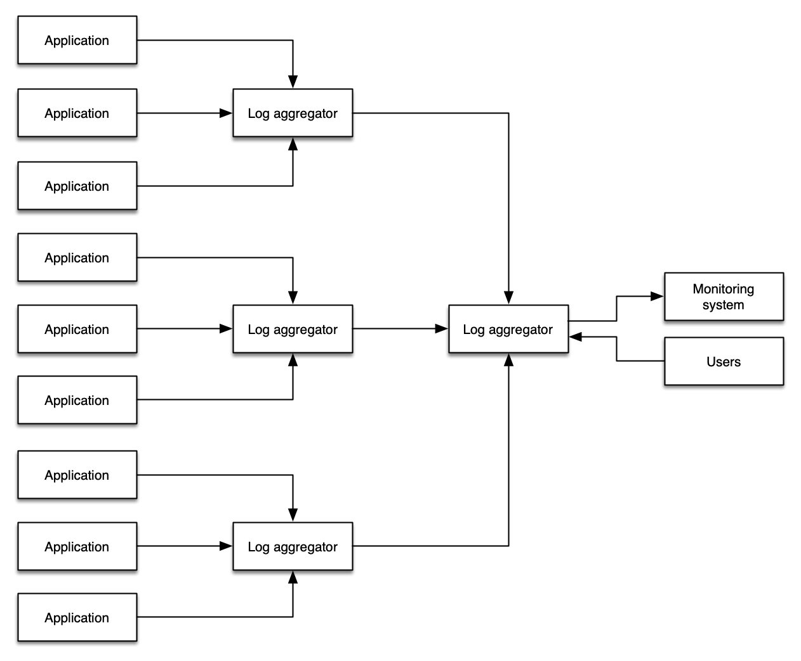

# ログ

ログとは、アプリケーションまたはアプライアンスによって送信される一連のメッセージであり、イベントに関する詳細、またはそのアプリケーションの状態に関する詳細が 1 行以上で表されます。通常、ログはファイルに出力されますが、分析や集約を行うコレクターに送信される場合もあります。ログデータの生成、取り込み、管理というタスクを、1 日あたり数メガバイトから 1 時間あたり数テラバイトまで、あらゆる規模で対応することを目的とした、多機能なログアグリゲーター、フレームワーク、製品が数多く存在します。

ログは一度に 1 つのアプリケーションによって出力され、通常はその*1 つのアプリケーション*のスコープに関連します。ただし、開発者は必要に応じてログを複雑かつ細かく設定することができます。ここでは、ログは[トレース](./traces.md)とは根本的に異なるシグナルであると考えます。トレースは複数のアプリケーションまたはサービスからのイベントで構成され、レスポンスのレイテンシー、サービスの障害、リクエストパラメータなど、サービス間の接続に関するコンテキストを含みます。

ログ内のデータは、一定期間にわたって集計することもできます。たとえば、統計的なデータ（前の 1 分間に処理されたリクエスト数など）である場合があります。構造化されたもの、自由形式のもの、詳細なもの、あらゆる言語で記述されたものが含まれます。

ログの主なユースケースは、説明することです。

* イベント（そのステータスや期間、その他の重要な統計情報を含む）
* そのイベントに関連するエラーや警告（例：スタックトレース、タイムアウト）
* アプリケーションの起動、スタートアップおよびシャットダウンメッセージ

:::note
	ログは*不変*であることを意図しており、多くのログ管理システムには、ログデータを変更しようとする試みを防止および検出するためのメカニズムが含まれています。 
:::
ロギングに関する要件に関わらず、以下は私たちが特定したベストプラクティスです。 

## 構造化ログは成功の鍵

多くのシステムは、半構造化形式でログを出力します。たとえば、Apache Web サーバーは次のようなログを書き込む場合があり、各行は単一の Web リクエストに対応しています。

	192.168.2.20 - - [28/Jul/2006:10:27:10 -0300] "GET /cgi-bin/try/ HTTP/1.0" 200 3395
	127.0.0.1 - - [28/Jul/2006:10:22:04 -0300] "GET / HTTP/1.0" 200 2216

Java のスタックトレースは、複数行にわたる単一のイベントであり、構造化が不十分な場合があります。

	Exception in thread "main" java.lang.NullPointerException
        at com.example.myproject.Book.getTitle(Book.java:16)
        at com.example.myproject.Author.getBookTitles(Author.java:25)
        at com.example.myproject.Bootstrap.main(Bootstrap.java:14)

Python のエラーログイベントは次のようになります。
```
	Traceback (most recent call last):
	  File "e.py", line 7, in <module>
	    raise TypeError("Again !?!")
	TypeError: Again !?!
```
これら 3 つの例のうち、最初のものだけが人間*と*ログ集約システムの両方によって簡単に解析できます。構造化ログを使用することで、ログデータを迅速かつ効果的に処理することが容易になり、人間とマシンの両方が探しているものをすぐに見つけるために必要なデータを提供できます。

最も一般的に理解されているログ形式は JSON であり、イベントの各コンポーネントはキーと値のペアとして表現されます。JSON では、上記の Python の例は次のように書き直すことができます。
```
	{
		"level", "ERROR"
		"file": "e.py",
		"line": 7,
		"error": "TypeError(\"Again !?!\")"
	}
```
構造化ログを使用することで、データをあるログシステムから別のシステムへ移行しやすくなり、開発が簡素化され、運用上の診断が（エラーを減らしながら）より迅速になります。また、JSON を使用することで、実際のデータとともにログメッセージのスキーマが埋め込まれるため、高度なログ分析システムがメッセージを自動的にインデックス化できるようになります。

## ログレベルを適切に使用する

ログには 2 種類あります。*レベル* を持つログと、一連のイベントであるログです。レベルを持つログは、ログ戦略を成功させるための重要なコンポーネントです。ログレベルはフレームワークによって若干異なりますが、一般的に次の構造に従います。

| レベル | 説明 |
| ----- | ----------- |
| `DEBUG` | アプリケーションのデバッグに最も役立つきめ細かい情報イベント。通常、開発者にとって価値があり、非常に詳細です。 |
| `INFO` | アプリケーションの進行状況を粗い粒度で示す情報メッセージ。 |
| `WARN` | アプリケーションへのリスクを示す、潜在的に有害な状況。アプリケーション内でアラームをトリガーする可能性があります。 |
| `ERROR` | アプリケーションが引き続き実行できる可能性のあるエラーイベント。注意を要するアラームをトリガーする可能性が高いです。 |
| `FATAL` | アプリケーションを中断させると考えられる、非常に重大なエラーイベント。 |

:::info
	明示的なレベルが設定されていないログは、暗黙的に次のように見なされる場合があります。 `INFO`ただし、この動作はアプリケーションによって異なる場合があります。
:::
その他の一般的なログレベルは次のとおりです。 `CRITICAL` および `NONE`、ニーズ、プログラミング言語、およびフレームワークに応じて。 `ALL` および `NONE` すべてのアプリケーションスタックで見られるわけではありませんが、一般的でもあります。

ログレベルは、環境の健全性についてモニタリングおよびオブザーバビリティソリューションに通知するために重要であり、ログデータは論理的な値を使用してこのデータを簡単に表現できる必要があります。 

:::tip
	ログデータを過剰に記録すると `WARN` 監視システムが限られた価値しかないデータで埋め尽くされ、大量のメッセージの中で重要なデータを見失う可能性があります。  
:::


:::info
	標準化されたログレベル戦略を使用することで、自動化が容易になり、開発者が問題の根本原因に迅速に到達できるようになります。
:::

:::warning
	ログレベルに対する標準的なアプローチがなければ、[ログのフィルタリング](#ソースに近い場所でログをフィルタリングする)は大きな課題となります。
:::
## ソースに近い場所でログをフィルタリングする

可能な限り、ログのボリュームをソースにできるだけ近い場所で削減してください。このベストプラクティスに従う理由は多数あります。

* ログの取り込みには、常に時間、コスト、およびリソースが必要です。
* 下流システムから機密データ（例：個人識別情報）をフィルタリングすることで、データ漏洩によるリスクへの露出を軽減できます。
* 下流システムは、データソースと同じ運用上の懸念事項を持っていない場合があります。例えば、 `INFO` アプリケーションからのログは、監視およびアラートシステムにとって関心の対象外である場合があります。このシステムは以下を監視します。 `CRITCAL` または `FATAL` メッセージ。
* ログシステムおよびネットワークに、過度な負荷やトラフィックをかけないようにする必要があります。

:::info
	コストを抑え、データ露出のリスクを低減し、各コンポーネントを[重要な事項](../guides/index.md#重要なことを監視する)に集中させるために、ソースの近くでログをフィルタリングしてください。
:::

:::tip
	アーキテクチャによっては、インフラストラクチャ as コード (IaC) を使用して、アプリケーション*と*環境への変更を一度の操作でデプロイしたい場合があります。このアプローチにより、ログフィルターパターンをアプリケーションと一緒にデプロイでき、同じ厳密さと扱いを適用できます。
:::
## 二重取り込みアンチパターンを回避する

管理者がよく採用するパターンとして、すべてのログデータを単一のシステムにコピーし、1 か所からすべてのログをクエリすることを目的とするものがあります。このアプローチにはいくつかの手動ワークフロー上の利点がありますが、このパターンは追加のコスト、複雑さ、障害ポイント、および運用上のオーバーヘッドをもたらします。



:::info
	可能な限り、[ログレベル](#ログレベルを適切に使用する)と[ログフィルタリング](#ソースに近い場所でログをフィルタリングする)を組み合わせて使用し、環境からのログデータの全面的な伝播を避けてください。
:::

:::info
	一部の組織やワークロードでは、規制要件を満たすため、安全な場所にログを保存するため、否認防止を実現するため、またはその他の目的を達成するために、[ログシッピング](https://en.wikipedia.org/wiki/Log_shipping)が必要です。これはログデータを再取り込みする一般的なユースケースです。これらのログアーカイブに入る不要なデータの量を削減するために、[ログレベル](#ログレベルを適切に使用する)の適切な適用と[ログフィルタリング](#ソースに近い場所でログをフィルタリングする)を引き続き適切に行うことが重要です。
:::
## ログからメトリクスデータを収集する

ログには、収集されるのを待っている[メトリクス](./metrics.md)が含まれています！ISV ソリューションや自分で作成していないアプリケーションでも、ログに価値あるデータを出力しており、そこからワークロード全体の健全性に関する有意義なインサイトを抽出できます。一般的な例としては、以下のものがあります。

* データベースからのスロークエリ時間
* Web サーバーからのアップタイム
* トランザクション処理時間
* カウント数 `ERROR` または `WARNING` 時系列のイベント
* アップグレード可能なパッケージの生のカウント

:::tip
	このデータは、静的なログファイルに閉じ込められていると有用性が低くなります。ベストプラクティスは、主要なメトリクスデータを特定し、他のシグナルと相関付けられるメトリクスシステムに公開することです。
:::
## `stdout` へのログ出力

可能な場合、アプリケーションはファイルやソケットなどの固定された場所ではなく `stdout` にログを出力すべきです。これにより、ログエージェントがお客様独自のオブザーバビリティソリューションに適したルールに基づいて、ログイベントを収集およびルーティングできるようになります。すべてのアプリケーションで可能というわけではありませんが、これはコンテナ化されたワークロードのベストプラクティスです。

:::note
	アプリケーションはログの実装においてシンプルかつ汎用的であり、ログソリューションと疎結合を保つべきですが、ログデータの送信には依然として[ログコレクター](../tools/logs/index.md)が必要であり、データを送信するために使用されます。 `stdout` ファイルに出力します。重要な概念は、アプリケーションやビジネスロジックがロギングインフラストラクチャに依存しないようにすることです。つまり、関心の分離を実現するよう努める必要があります。
:::

:::info
	アプリケーションをログ管理から切り離すことで、コードを変更することなくソリューションを適応・進化させることができ、環境に加えられた変更による潜在的な影響範囲を最小限に抑えることができます。
:::