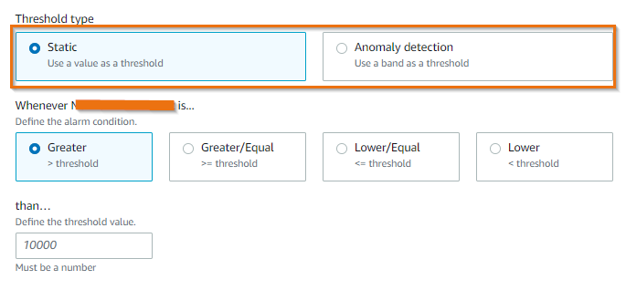

# アラーム

Amazon CloudWatch アラームを使用すると、CloudWatch メトリクスとログに関するしきい値を定義し、CloudWatch で設定されたルールに基づいて通知を受け取ることができます。

**CloudWatch メトリクスに関するアラーム:**

CloudWatch アラームを使用すると、CloudWatch メトリクスにしきい値を定義し、メトリクスが範囲外になったときに通知を受け取ることができます。各メトリクスは複数のアラームをトリガーでき、各アラームには多くのアクションを関連付けることができます。CloudWatch メトリクスに基づいてメトリクスアラームを設定するには、2 つの異なる方法があります。

1. **静的しきい値**: 静的しきい値は、メトリクスが違反してはならない厳密な制限を表します。通常の運用中の動作を理解するために、上限や下限などの静的しきい値の範囲を定義する必要があります。メトリクス値が静的しきい値を下回るか上回る場合、CloudWatch がアラームを生成するように設定できます。

2. **異常検出**: 異常検出は一般的に、データの大部分から大きく逸脱し、正常な動作の明確に定義された概念に適合しない、まれなアイテム、イベント、または観測値として識別されます。CloudWatch 異常検出は、過去のメトリクスデータを分析し、期待値のモデルを作成します。期待値は、メトリクスの典型的な時間単位、日単位、週単位のパターンを考慮します。必要に応じて各メトリクスに異常検出を適用でき、CloudWatch は機械学習アルゴリズムを適用して、有効化された各メトリクスの上限と下限を定義し、メトリクスが期待値から外れた場合にのみアラームを生成します。 

:::tip
	静的しきい値は、ワークロードで特定されたパフォーマンスのブレークポイントや、インフラストラクチャコンポーネントの絶対的な制限など、確実に理解しているメトリクスに最適です。
:::
:::info
	特定のメトリクスの経時的なパフォーマンスを把握できない場合、または負荷テストや異常なトラフィック下でメトリクス値が以前に観測されていない場合は、アラームで異常検出モデルを使用してください。
:::

CloudWatch で静的およびアノマリーベースのアラームをセットアップする方法については、以下の手順に従ってください。

[静的しきい値アラーム](https://catalog.us-east-1.prod.workshops.aws/workshops/31676d37-bbe9-4992-9cd1-ceae13c5116c/en-US/alarms/mericalarm)

[CloudWatch 異常検出ベースのアラーム](https://catalog.us-east-1.prod.workshops.aws/workshops/31676d37-bbe9-4992-9cd1-ceae13c5116c/en-US/alarms/adalarm)

:::info
	アラーム疲労を軽減する、またはアラーム生成数によるノイズを削減するには、アラームを設定する 2 つの高度な方法があります。

1. **コンポジットアラーム**: コンポジットアラームには、作成された他のアラームのアラーム状態を考慮するルール式が含まれます。コンポジットアラームは次の状態になります `ALARM` ルールのすべての条件が満たされた場合にのみ状態が変わります。複合アラームのルール式で指定されたアラームには、メトリクスアラームと他の複合アラームを含めることができます。複合アラームは、[集約によるアラーム疲労の軽減](../signals/alarms/#集約によるアラーム疲労の軽減)に役立ちます。

2. **メトリクス計算ベースのアラーム**: メトリクス計算式を使用して、より意味のある KPI を構築し、それらに対してアラームを設定できます。複数のメトリクスを組み合わせて、統合された使用率メトリクスを作成し、それらに対してアラームを設定できます。
:::

以下の手順では、複合アラームとメトリクス演算ベースのアラームの設定方法について説明します。

[複合アラーム](https://catalog.us-east-1.prod.workshops.aws/workshops/31676d37-bbe9-4992-9cd1-ceae13c5116c/en-US/alarms/compositealarm)

[Metric Math アラーム](https://aws.amazon.com/blogs/mt/create-a-metric-math-alarm-using-amazon-cloudwatch/)

**CloudWatch Logs のアラーム**

CloudWatch Logs が使用する CloudWatch メトリクスフィルターに基づいてアラームを作成できます。メトリクスフィルターは、ログデータを数値の CloudWatch メトリクスに変換し、グラフ化したりアラームを設定したりできます。メトリクスを設定したら、CloudWatch Logs から生成された CloudWatch メトリクスに対して、静的またはアノマリーベースのアラームのいずれかを使用できます。

CloudWatch Logs で[メトリクスフィルターを設定する方法](https://aws.amazon.com/blogs/mt/quantify-custom-application-metrics-with-amazon-cloudwatch-logs-and-metric-filters/)の例を参照してください。

